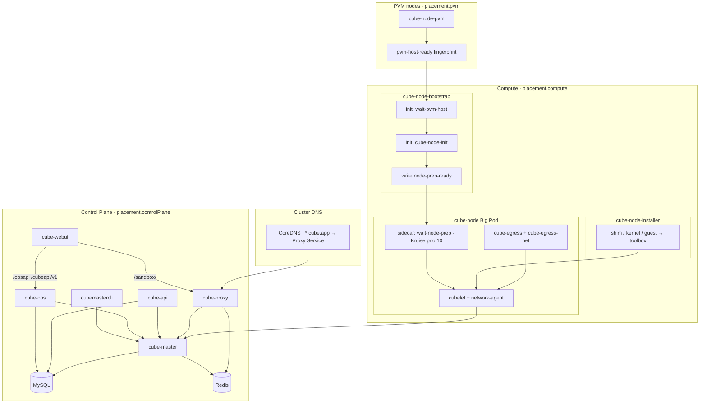
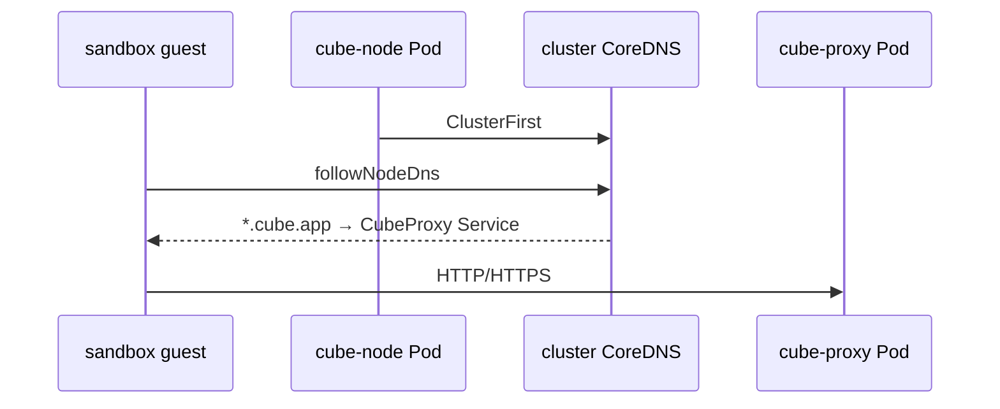
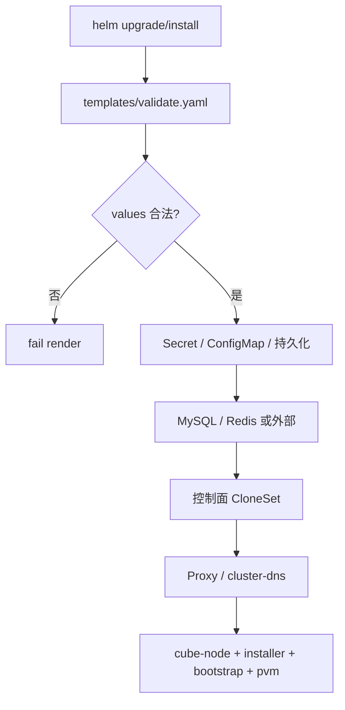
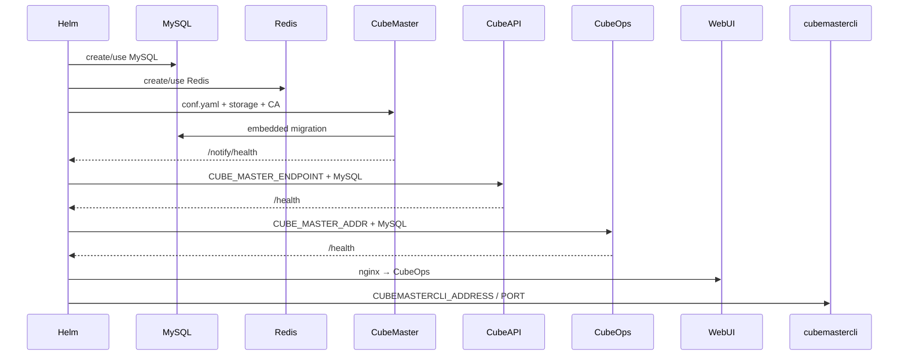
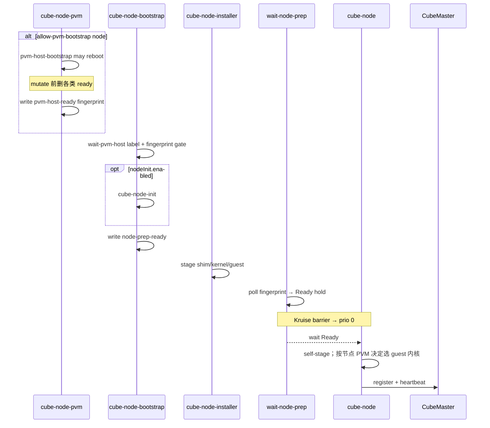
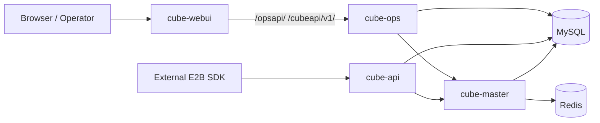
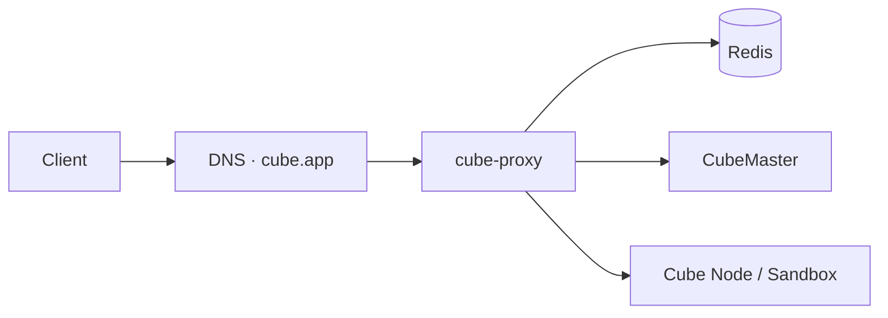
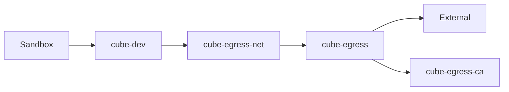
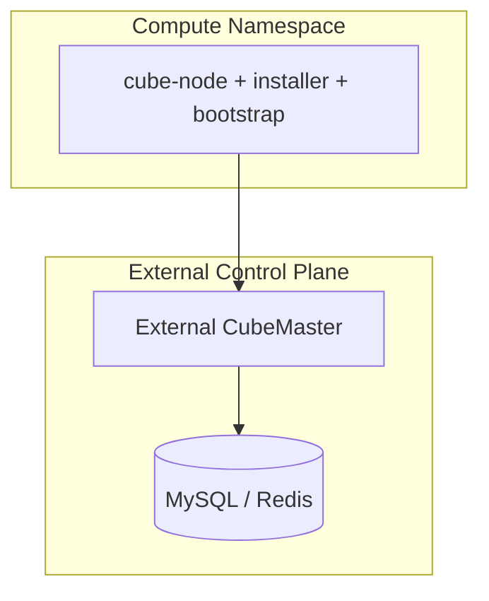

# CubeSandbox Chart 架构

本文描述 `deploy/kubernetes/chart` **当前**交付形态：组件分层、计算面 DaemonSet 的分工、安装与启动顺序、以及 DNS / Proxy / Egress 等运行期链路。升级操作见 [`UPGRADE.md`](UPGRADE.md)；排障见 [`FAQ.md`](FAQ.md)。

## 1. 总体分层

| 层级 | 组件 | Kubernetes 形态 | 主要职责 |
| --- | --- | --- | --- |
| 控制面 | CubeMaster | OpenKruise CloneSet + Service + Secret + PVC/hostPath | 节点注册、模板/rootfs artifact、内置 DB migration、调度/元数据 |
| 控制面 API | CubeAPI | CloneSet + Service | 对外 E2B 兼容 HTTP API；读写 MySQL；访问 CubeMaster |
| 运维后端 | CubeOps | CloneSet + Service | JWT 运维 API + WebUI SDK；监听 `0.0.0.0:3010`；读写 MySQL；访问 CubeMaster |
| 管理入口 | WebUI | CloneSet + Service + ConfigMap | 静态控制台；`/opsapi/`、`/cubeapi/v1/` 反代到 CubeOps（依赖 `cubeOps.enabled`） |
| 运维入口 | cubemastercli | CloneSet | `kubectl exec` 用 CLI；注入本 Release 的 CubeMaster endpoint |
| 依赖存储 | MySQL / Redis | 内置 StatefulSet 或第三方 | 业务数据 / Proxy 与 lifecycle 状态 |
| 计算面 · 运行时 | `cube-node`（Big Pod） | OpenKruise Advanced DaemonSet（InPlaceIfPossible） | `wait-node-prep` + cubelet / network-agent + 可选 egress；**无 initContainers** |
| 计算面 · 产物 | `cube-node-installer` | Advanced DaemonSet（Standard） | 将 shim / kernel / guest 安装到宿主机 toolbox |
| 计算面 · 节点引导 | `cube-node-bootstrap` | Advanced DaemonSet（Standard） | `wait-pvm-host`、`cube-node-init`、写 `node-prep-ready` |
| 计算面 · PVM 宿主机 | `cube-node-pvm` | 原生 `apps/v1` DaemonSet（仅 `placement.pvm`） | PVM host kernel 安装（可 reboot）；管理 L0 污点并写指纹 |
| 数据面入口 | CubeProxy + 集群 DNS | CloneSet；可选改写 CoreDNS | HTTP/HTTPS sandbox 入口；`*.domain` 泛解析 |
| 生命周期 | cube-lifecycle-manager | CloneSet + ClusterIP | sandbox pause/resume；经 Redis 发现 Proxy 副本 |

默认完整部署：



## 2. 资源与镜像职责

### 2.1 控制面

| 资源 | 模板 | 说明 |
| --- | --- | --- |
| `cube-master` | `templates/master.yaml` | `images.master`；挂载 Chart 渲染的 `conf.yaml`；内置 schema migration |
| `cube-master-config` | `templates/master-config-secret.yaml` | `files/cube-master/conf.yaml` 渲染结果 |
| `cube-master-storage` | `master.yaml` / `master-pvc.yaml` | 默认 PVC；可选 existingClaim / hostPath / emptyDir |
| `cube-api` | `templates/api.yaml` | `images.api`（外部 E2B） |
| `cube-ops` | `templates/ops.yaml` | `images.ops`；ClusterIP；bind `0.0.0.0:3010` |
| `cubemastercli` | `templates/cubemastercli.yaml` | `images.cubemastercli` |
| `cube-webui` | `templates/webui.yaml` | `images.webui` + nginx ConfigMap（上游 CubeOps） |
| `cube-secret` | `templates/secret.yaml` | MySQL / Redis / Proxy 等密码 |

### 2.2 MySQL / Redis

| 模式 | 行为 |
| --- | --- |
| 内置 MySQL | `mysql.host=""` → StatefulSet + Headless Service；可配 `mysql.persistence.hostPath` |
| 第三方 MySQL | `mysql.host` 非空 → 不装内置 MySQL |
| 内置 Redis | `redis.host=""` 且控制面或 Proxy 需要时安装 |
| 第三方 Redis | `redis.host` 非空 → 不装内置 Redis |

### 2.3 计算面：四个 DaemonSet

`cube-node` / `cube-node-installer` / `cube-node-bootstrap` 用 `placement.compute`（**不含** `allow-pvm-bootstrap`）。`cube-node-pvm` 用 `placement.pvm`（含 `allow-pvm-bootstrap`），因此非 PVM 节点不会拉取 `cube-pvm-host-bootstrap` 大镜像。

三条计算面（Big Pod / installer / bootstrap）为 OpenKruise Advanced DaemonSet：Big Pod 使用 `InPlaceIfPossible`，bootstrap/installer 使用 `Standard`。**PVM 为原生 `apps/v1` DaemonSet**（不依赖 kruise-manager 创建 Pod）。无状态控制面（master/api/ops/webui/proxy/lifecycle/cubemastercli）为 CloneSet；MySQL/Redis 继续使用原生 StatefulSet。

#### Big Pod：`cube-node`

- `hostNetwork: false`（Pod 网络）；**始终** Advanced DaemonSet + `InPlaceIfPossible`（OpenKruise 硬依赖）。
- **零 initContainers**；容器集合为升级冻结面（增删容器 / 改 volumeMount / 改 env 会 recreate，破坏 PodIP/netns）。
- **NodeID** = `spec.nodeName`；**Endpoint** = `status.podIP`。
- toolbox **整树** hostPath：`/usr/local/services/cubetoolbox`。

| 容器 | 镜像 | 职责 |
| --- | --- | --- |
| `wait-node-prep` | `images.waitNodePrep` | Kruise 优先级 10 sidecar：只读 hostPath `node-prep-ready` 自描述指纹并持续复核，不接收可变 Chart 策略 env |
| `network-agent` | `images.networkAgent` | self-stage 后启动；优先级 0 |
| `cubelet` | `images.cubelet` | self-stage 后启动；优先级 0 |
| `cube-slot-1`…`cube-slot-6` | `images.pause` | 冻结占位槽；挂载/特权与 cubelet 相同；日后只 InPlace 换镜像/资源 |
| `cube-egress` / `cube-egress-net` | 对应镜像 | 可选；透明出站 / TPROXY |

占位槽服务名写在 Pod annotations：`cube.tencent.com/slot-N`（values：`cubeNode.placeholderSlots.services`）。空字符串表示未分配；日后可原地改 annotation（容器 env `CUBE_SLOT_SERVICE` 经 fieldRef 刷新）。单槽换镜像/调资源用 `cubeNode.placeholderSlots.overrides."<N>"`（未设字段继承 `images.pause` / `placeholderSlots.resources`）。**容器名 / volumeMount / securityContext / imagePullPolicy 不可改**（会 recreate）。

#### Installer：`cube-node-installer`

- 容器：`cube-shim-install` / `cube-kernel-install` / `cube-guest-install`。
- 把镜像里的 shim / kernel / guest **整目录换到** 宿主机 toolbox；换目录期间版本矩阵会短暂标「未完成」，成功后恢复正常。
- 可独立 RollingUpdate；日常升产物 **只 bump Installer 镜像**。

#### Bootstrap：`cube-node-bootstrap`

- init：`wait-pvm-host` → `cube-node-init`；主容器写 `node-prep-ready`。
- `wait-pvm-host`：看节点有没有 `allow-pvm-bootstrap`——有则等 PVM 宿主机就绪并记「本节点用 PVM guest」；没有则记「本节点用 bm guest」。
- 哨兵目录：`/var/lib/cube-node-bootstrap`（与 Big Pod 的 `wait-node-prep` / PVM DS 共享）。
- `hostPID: true`（`nsenter --target 1`）；低频变更；升 node-init **只 bump Bootstrap / nodeInit 镜像**。

#### PVM：`cube-node-pvm`

- 原生 `apps/v1` DaemonSet（非 ADS）；仅当 `bootstrap.pvmHostKernel.enabled=true` 时创建；仅调度到 `placement.pvm`。
- `startupGate` 默认开启：目标节点指纹未就绪时，Helm pre-install/pre-upgrade Hook 写入 `cube.tencent.com/pvm-not-ready=true:NoSchedule`，再逐节点探针 CNI；指纹已匹配则不写该污点。
- 安装/升级前另有 cubevs CIDR Hook（weight `-110`）：`cubeNode.network.cidr`（默认 `172.16.0.0/18`）与集群 Service CIDR / ClusterIP 重叠则 fail-fast，避免 `cube-dev` 黑洞 ClusterDNS。
- init：`pvm-host-bootstrap`；mutate 严格按 ensure taint → 删除本 namespace/本 release/本节点依赖 Pod → invalidate → Lease → mutate/reboot。
- 成功路径按 write ready → verify live fingerprint → clear taint；主容器每 30 秒 reconcile 分裂态。
- 只有 PVM DaemonSet 容忍临时门闩。CNI、kube-proxy、**kruise-daemon** 须以 `Exists` 或显式 key 容忍门闩（preflight 硬查 daemon）；`kruise-controller-manager` 硬门禁为 Ready，Exists 为门闩下重建的可选项。PVM 保持 Pod 网络。
- 升 PVM 镜像 **只 bump `images.pvmHostBootstrap`**，不 recreate Big Pod。

为何拆成四个：Big Pod 保持 InPlace 友好；产物安装与可 reboot 的 PVM 引导分离；非 PVM compute 节点不拉 PVM 大镜像。

### 2.3.1 节点上你会看到的标记（重启后）

| 标记 | 含义（给运维看） |
| --- | --- |
| `pvm-host-ready` | 宿主机 PVM 内核已按预期装好；内容带指纹，换核后必须对上当前 `uname` 才算就绪 |
| `effective-pvm` | 本节点 guest 该用 PVM（`1`）还是 bm（`0`）；有 `allow-pvm-bootstrap` 且 host 就绪 → `1`，否则 → `0` |
| `node-prep-ready` | bootstrap 预检通过，Big Pod 可以启动 |
| `/run/wait-node-prep.ready` | 本轮 Pod 内临时标记，重启即没 |
| toolbox 下「组件已就绪」标记 | 该组件 stage 成功，产物可被版本矩阵采集 |
| toolbox 下「组件正在替换」标记 | 正在换目录；矩阵会标未完成，避免报残缺版本；成功后清除，失败会留下直到下次成功 |

Guest 选核最终结果：先看 `effective-pvm`；没有则尽量保持节点上一次已在用的内核；再没有才用 Chart 首次安装默认（`cubeNode.pvmGuestKernel.enabled`）。

验收：PVM 换核期间依赖 Pod 在清闩前保持 Pending；故意残留错误指纹不得清闩；普通掉电且内核未变时可快速恢复。`scripts/test-big-pod-inplace-guard.sh` 保证 PVM/boot args/prepGeneration 变更不会改变 Big Pod Pod template。

### 2.4 数据面入口

| 资源 | 模板 | 职责 |
| --- | --- | --- |
| `cube-proxy` | `templates/proxy.yaml` | sandbox HTTP/HTTPS；`placement.controlPlane`；Pod 网络 |
| `cube-lifecycle-manager` | `templates/lifecycle-manager.yaml` | pause/resume；Proxy 经 Redis 发现副本 |
| `cube-proxy-certs` | `proxy.yaml` | TLS：selfSigned / inline / existingSecret / certManager |
| Service / Ingress | `proxy-service.yaml` / `proxy-ingress.yaml` | ClusterIP；Ingress SSL passthrough，TLS 在 Proxy 终结 |
| cluster DNS | `templates/cluster-dns.yaml` | 启用时把 `*.cubeProxy.domain` rewrite 到 Proxy Service |

CubeProxy 经 Redis 中的 owner 元数据转发到目标 compute 节点 sandbox；Chart 不修改 Proxy Lua 后端解析语义。

## 3. DNS

Chart **不**部署自有 CoreDNS。Proxy 启用且 `configureClusterDNS=true`（默认）时：

- Helm hook 将 `domain` / `*.domain` rewrite 到 `<release>-proxy.<ns>.svc.cluster.local`。
- `cubeNode.dns.sandbox.followNodeDns=true`：guest 跟随节点/集群 DNS。



- 域名：`cubeProxy.domain`（默认 `cube.app`）。
- 平台禁止改 `kube-system/coredns` 时设 `cubeProxy.configureClusterDNS=false`。
- 外部客户端仍需自配公网/Private DNS 或 LB。

## 4. 安装与启动

### 4.1 Helm 渲染



主要校验：

- 启用控制面 / 计算面 / Proxy 时须配置对应 `placement.*.nodeSelector`。
- `configureClusterDNS=true` 须配置 `cubeProxy.domain`。
- compute-only 须配置 `externalControlPlane.masterEndpoint`。
- `pvmHostKernel.enabled=true` 时 `placement.pvm` 须含 `allow-pvm-bootstrap`，且 **不得** 写在 `placement.compute`。
- 已移除 `security.hostNetwork`；cube-node 固定 Pod 网络。

调度：控制面用 `placement.controlPlane`；`cube-node` / installer / bootstrap 用 `placement.compute`；`cube-node-pvm` 用 `placement.pvm`。Chart 管理的容器经 `global.timezone` 注入 `TZ`（默认 `Asia/Shanghai`）。

### 4.2 控制面启动



无独立 `cube-db-migrate` Job；`cubemastercli` 不混入 master/node 镜像。

### 4.3 计算节点启动



探针约定：

- cubelet：startup 等 9999；readiness 默认 exec（9999 + network-agent `/readyz` + sock）；liveness 查 9999。
- `cube-egress`：`127.0.0.1:9090/admin/v1/health`。
- `cube-egress-net`：`cube-dev`、ip rule、table 100、mangle `TRANSPROXY`。

镜像升级（保存量沙箱、保 Big Pod UID/IP）见 [`UPGRADE.md`](UPGRADE.md)。

### 4.4 注册与验收关注点

- CubeMaster `/notify/health`、CubeOps `/health`、CubeAPI `/health`（若启用）。
- CubeAPI（或经 CubeOps SDK）能查到 healthy node。
- `cube-node` / installer / bootstrap ready 数等于命中 `placement.compute` 的节点数；`cube-node-pvm` ready 数等于命中 `placement.pvm` 的节点数。
- egress 启用时 sidecar Ready。

## 5. 运行期数据流

### 5.1 WebUI / CubeOps / CubeAPI / Master



### 5.2 Sandbox 入口



无 Ingress Controller 时可关 `cubeProxy.ingress.enabled`，自行把外部流量接到 Service。生产应提供正式证书，并把 sandbox 域名指向 Ingress。

### 5.3 出站 egress



Master / API / Node 共享 `cube-egress-ca`，保证模板构建与运行期信任一致。

### 5.4 模板构建

`controlPlane.templateBuilder.enabled=true` 时，Master Pod 增加 `template-builder` sidecar（默认 `docker:27-dind`），产物写入 Master storage。

## 6. compute-only / 外部控制面



```yaml
controlPlane:
  enabled: false
externalControlPlane:
  enabled: true
  masterEndpoint: <external-master>:8089
  apiEndpoint: http://<external-api>:3000  # optional, for helm test
```

不安装内置 Master / API / MySQL / Redis / WebUI；默认不装 Proxy（避免与外部数据面不一致）。配置了 `apiEndpoint` 时 helm test 会校验外部 API 与节点注册。

## 7. 关键 values 开关

| values 路径 | 默认 | 影响 |
| --- | --- | --- |
| `global.timezone` | `Asia/Shanghai` | 注入 Chart 管理容器的 `TZ` |
| `storageClass.create` / `name` / `provisioner` | `create=false` | 是否由 chart 创建 StorageClass;默认不创建（PVC 省略 `storageClassName` → 集群 default SC；TKE 用 `values-tke.yaml` pin CBS） |
| `persistence.storageClassName` | `""` | 便捷键:组件级为空时,三 PVC 共用此 SC name;`""` → 集群 default SC |
| `*.persistence.storageClassName` (master/mysql/redis) | `""` | 组件级覆盖;非空优先于顶层 `persistence.storageClassName` |
| `controlPlane.enabled` | `true` | 内置控制面 |
| `externalControlPlane.enabled` | `false` | 外部 CubeMaster |
| `placement.controlPlane.nodeSelector` | `cube-control=true` | 控制面调度 |
| `placement.compute.nodeSelector` | `cube-node=true` | 计算面（不含 allow-pvm） |
| `placement.pvm.nodeSelector` | 另含 `allow-pvm-bootstrap=true` | 仅 PVM 宿主机 DaemonSet |
| `cubeProxy.domain` | `cube.app` | sandbox 域名 |
| `cubeProxy.configureClusterDNS` | `true` | 是否写入集群 CoreDNS |
| `cubeNode.dns.sandbox.followNodeDns` | `true` | guest 跟随节点 DNS |
| `cubeNode.pvmGuestKernel.enabled` | `true` | 首次安装默认是否倾向 PVM guest；**不能**单独用来关掉已在跑 PVM 的节点（应去掉 `allow-pvm-bootstrap`） |
| `bootstrap.pvmHostKernel.enabled` | `true` | host kernel bootstrap（可能重启节点） |
| `bootstrap.pvmHostKernel.startupGate.enabled` | `true` | PVM 未就绪时使用 Node NoSchedule 污点硬门闩 |
| `bootstrap.pvmHostKernel.bootArgs` | `nopti pti=off` | 当前 `kvm_pvm` 不支持 host KPTI |
| `bootstrap.nodeInit.*` | 多项 | 预检、XFS、KVM、CIDR |
| `mysql.host` / `redis.host` | `""` | 非空则用第三方 |
| `cubeProxy.enabled` / `ingress.enabled` | `true` | Proxy / Ingress |
| `lifecycleManager.enabled` | `true` | Proxy 启用时必开 |
| `cubeEgress.enabled` | `true` | Big Pod egress sidecar |
| `cubeOps.enabled` | `true` | CubeOps（JWT 运维 API；WebUI `/opsapi` / SDK 上游） |
| `webui.enabled` | `true` | WebUI（要求 `cubeOps.enabled=true`） |
| `controlPlane.templateBuilder.enabled` | `false` | 模板构建 sidecar |

## 8. Helm test

| Test Pod | 覆盖 |
| --- | --- |
| `<release>-health-test` | Master / Ops / API / 节点注册 / WebUI / Proxy / 工作负载 Ready / Egress 存在性 |
| `<release>-mysql-test` / `redis-test` | 内置依赖连通性 |
| `<release>-dns-test` | `cube.app` / wildcard → Proxy Service |
| `<release>-node-image-test` | 镜像内 runtime 工具与 asset |
| `<release>-node-runtime-test` | `/dev/kvm`、cubelet / network-agent socket |

```bash
helm test <release> -n <namespace> --timeout 20m --logs
```

## 9. 所有权与卸载边界

Chart 管理并随 release 卸载：控制面与计算面工作负载、内置 MySQL/Redis、Proxy、CA/TLS/config Secret、Helm test RBAC、diagnostics ConfigMap 等。

Chart **不**管理：节点 label/taint、第三方 DB、外部 DNS/LB、hostPath 数据、host kernel / GRUB / udev / fstab / XFS 等节点级持久修改。卸载后按平台 runbook 清理宿主机残留（见 chart `scripts/cleanup-node-host.sh`）。
