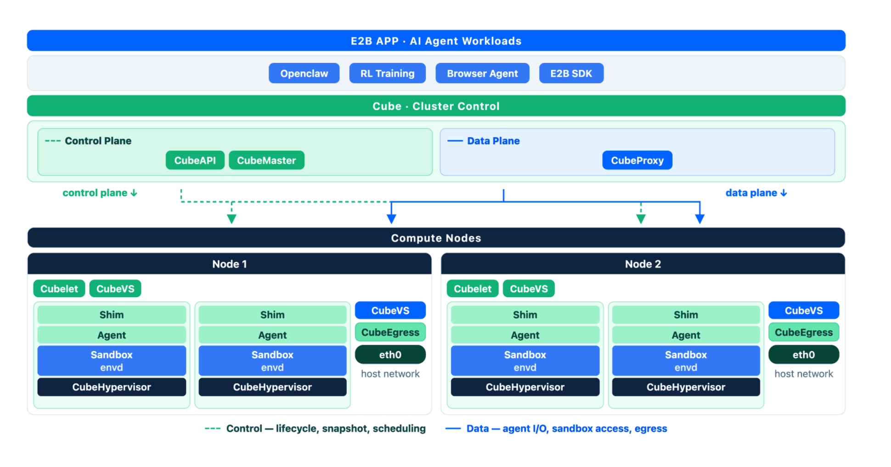
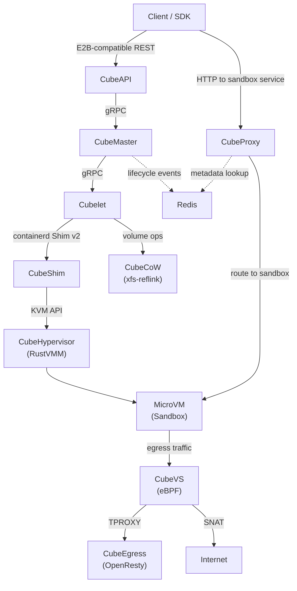
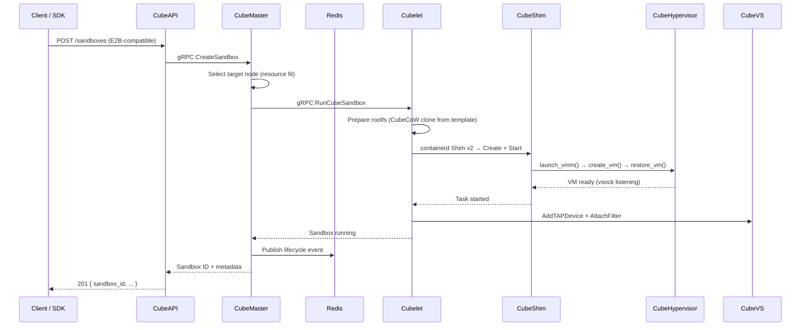

# Architecture Overview

Cube Sandbox is a **purpose-built AI Agent infrastructure** that boots hardware-isolated MicroVMs in tens of milliseconds. This page describes the overall system architecture, the core components, and how they interact.

## Design Principles

| Principle | How it manifests |
|-----------|-----------------|
| **Agent-first** | Beyond the classic "LLM calls tool → sandbox executes → returns" loop, the lifecycle semantics, SDK shape, auto-pause/resume, and lightning-fast clone/rollback are designed to host long-running agents and stateful services (e.g. a persistent dev environment, a web service, or a database) directly inside sandboxes. |
| **Hardware Isolation** | Each sandbox runs its own Linux kernel inside a KVM MicroVM. No shared-kernel escape surface. |
| **Millisecond-class Boot** | Pre-snapshotted templates plus a RustVMM restore path yield sub-100ms cold starts. |
| **Zero-Trust Egress** | All outbound traffic traverses CubeEgress (an L7 MITM proxy) — domains must be explicitly allowed. |
| **Stateless Control Plane** | CubeAPI and CubeMaster hold no local state; all coordination goes through Redis, so horizontal scale-out is trivial. |
| **Efficient Storage** | CubeCoW leverages the kernel `FICLONE` ioctl for O(1) snapshots and clones with zero data copying. |

## High-Level Architecture





## Control Plane vs Data Plane

| Layer | Components | Responsibilities |
|-------|-----------|-----------------|
| **Control Plane** | CubeAPI, CubeMaster, WebUI, Redis | API gateway, scheduling, state coordination, operator dashboard |
| **Data Plane** | Cubelet, CubeShim, CubeHypervisor, CubeCoW, CubeVS, CubeEgress, CubeProxy | VM lifecycle, storage, networking, security enforcement, request routing |

The control plane is **stateless** — Redis is the single source of truth for sandbox metadata and lifecycle events, so any CubeAPI or CubeMaster instance can serve any request.

The data plane is **node-local** — each compute node runs Cubelet, CubeShim, CubeHypervisor, CubeVS, and CubeEgress to manage the sandboxes resident on that host.

## Core Components

### CubeAPI

E2B-compatible REST API gateway written in **Rust** (Axum). Translates E2B SDK calls into internal gRPC, handles authentication callbacks, and forwards to CubeMaster. Switching from E2B Cloud to Cube Sandbox is as simple as replacing environment variables such as the API URL.

### CubeMaster

Cluster-level orchestration scheduler written in **Go**. Receives sandbox create/destroy/pause/resume requests, selects target nodes based on resource availability, dispatches work to Cubelet, and publishes lifecycle events to Redis.

### CubeProxy

Reverse proxy and request routing component built on **OpenResty** (nginx + Lua). It supports two routing modes that share the same Redis-backed sandbox metadata:

- **Host-based**: parses `<port>-<sandbox_id>.<domain>` from the `Host` header.
- **Path-based**: parses `/sandbox/<sandbox_id>/<port>/...` from the URL path (useful when wildcard DNS and TLS are inconvenient — see the [HTTPS & Domain guide](../guide/https-and-domain.md)).

It is paired with the standalone **cube-lifecycle-manager** service (written in **Go**) that watches lifecycle events, transparently pauses idle sandboxes, and resumes paused ones on incoming requests. cube-lifecycle-manager discovers every live CubeProxy replica in real time through a Redis-backed registration table, so CubeProxy can scale to multiple replicas without any static wiring.

### Cubelet

Node-local scheduling agent written in **Go**. Manages the full lifecycle (create → run → pause → resume → snapshot → destroy) of all sandbox instances on a single node. Integrates with containerd for image pull and with CubeCoW for volume management.

### CubeShim

Implements the **containerd Shim v2** interface in **Rust**, bridging the container runtime abstraction and the actual MicroVM. Handles sandbox resource preparation (rootfs, memory file, kernel), VM boot/restore, vsock communication, and in-place snapshot for auto-pause.

### CubeHypervisor

The lightweight VMM (Virtual Machine Monitor) built on **RustVMM** + **KVM**. Manages the MicroVM lifecycle: vCPU setup, memory regions, virtio devices (block, net/vsock, fs), boot, pause, snapshot, and restore. Seccomp-hardened with a minimal syscall surface.

### CubeVS (Network Virtualisation)

eBPF-based kernel-space network data plane. Three BPF programs attached at strategic points provide:

- **Per-sandbox SNAT/DNAT** without iptables rule explosion.
- **Stateful connection tracking** with protocol-aware timeouts (TCP 11-state machine, UDP, ICMP).
- **LPM-trie network policy** enforcement at line rate.
- **ARP proxy** for point-to-point TAP links.

See [Network Architecture](./network.md) for the deep dive.

### CubeCoW (Storage Engine)

A **Rust** library providing thin-provisioned volume management with O(1) snapshot and clone via the kernel `FICLONE` ioctl on XFS (reflink). Key properties:

- Snapshot is metadata-only (shared extents, no byte-copy).
- Flat snapshot model — deleting one snapshot never touches another.
- **Incremental dirty-page tracking**: snapshots only persist anonymous (dirty) memory pages that have changed since the last snapshot — unchanged pages remain shared via reflink, minimizing both write amplification and snapshot size.
- Cubelet calls CubeCoW for all rootfs and memory volume operations (create, clone, snapshot, delete).

### CubeEgress (Security Proxy)

Per-host transparent **L7 egress proxy** (OpenResty + Lua) that intercepts every outbound HTTP/HTTPS request via TPROXY:

- **Domain filtering** — allow/deny by SNI, host, method, scheme, or path.
- **Credential injection** — append `Authorization` headers so secrets never enter the sandbox.
- **Access auditing** — every decision logged to per-host JSONL audit logs.

The sandbox trusts a CubeEgress-issued root CA (baked into the template), enabling transparent TLS inspection.

### WebUI

Browser-based management console (`:12088`). Provides sandbox, template, node, and version-matrix management without CLI access. See the [WebUI guide](../guide/webui.md).

## Request Lifecycle

A typical `Sandbox.create()` call flows through the system as follows:



## Storage Layer

```
Template (read-only base)
  └── FICLONE ──→ Sandbox rootfs volume (CoW)
                      ├── FICLONE ──→ Snapshot A
                      └── FICLONE ──→ Clone 1, Clone 2, ...
```

- **Template creation**: OCI image → Buildkit → rootfs + cold-boot → memory snapshot → registered as a template.
- **Sandbox boot**: Cubelet clones the template's rootfs and memory volumes via CubeCoW (O(1), no data copy), then CubeShim restores the VM from the memory snapshot.
- **Incremental snapshot**: Only anonymous (dirty) pages are written; base pages are shared with the previous snapshot via reflink.

## Network Layer

Each sandbox gets a dedicated TAP device. CubeVS's three eBPF programs handle all data-plane forwarding in kernel space:

| Program | Attach Point | Direction | Role |
|---------|-------------|-----------|------|
| `from_cube` | TC ingress on TAP | Sandbox → Host | SNAT, policy, ARP proxy |
| `from_world` | TC ingress on host NIC | External → Host | Reverse NAT, port mapping |
| `from_envoy` | TC egress on cube-dev | Proxy → Sandbox | DNAT, transparent proxy support |

No iptables rules, no Linux Bridge, no OVS — pure eBPF at each boundary.

## Security Layer

Security is enforced at multiple levels:

1. **Hardware isolation** — KVM MicroVM with a dedicated kernel per sandbox.
2. **Network isolation** — CubeVS denies private/link-local ranges by default, with per-sandbox allow/deny policies.
3. **Egress control** — CubeEgress L7 proxy with domain allowlists.
4. **Credential vault** — secrets injected via header rewriting; never exposed to the sandbox or model context.
5. **Seccomp** — CubeHypervisor runs with a minimal syscall whitelist.
6. **Authentication** — CubeAPI supports pluggable auth callbacks.

## Supporting Infrastructure

| Component | Role |
|-----------|------|
| **Redis** | Shared state for sandbox metadata, lifecycle event stream, the CubeProxy routing table, and distributed locks for auto-pause/resume coordination. |
| **containerd** | Image pull, storage, and CRI integration on each node. CubeShim registers as a Shim v2 runtime. |
| **Buildkit** | Template build engine — converts OCI images into Cube Sandbox-ready rootfs + snapshot bundles. |

## Next Steps

- [Network Architecture](./network.md) — deep dive into CubeVS, traffic flows, session tracking, and the policy engine.
- [Sandbox Lifecycle](../guide/lifecycle.md) — state model, auto-pause, and auto-resume.
- [Snapshot, Rollback & Clone](../guide/snapshot-rollback-clone.md) — CubeCoW-powered advanced APIs.
- [Security Proxy](../guide/security-proxy.md) — CubeEgress domain filtering and credential injection.
- [Performance Benchmark](../guide/performance-benchmark.md) — cold-start, snapshot, and density numbers.
- [Templates Overview](../guide/templates.md) — the three-step template lifecycle.
