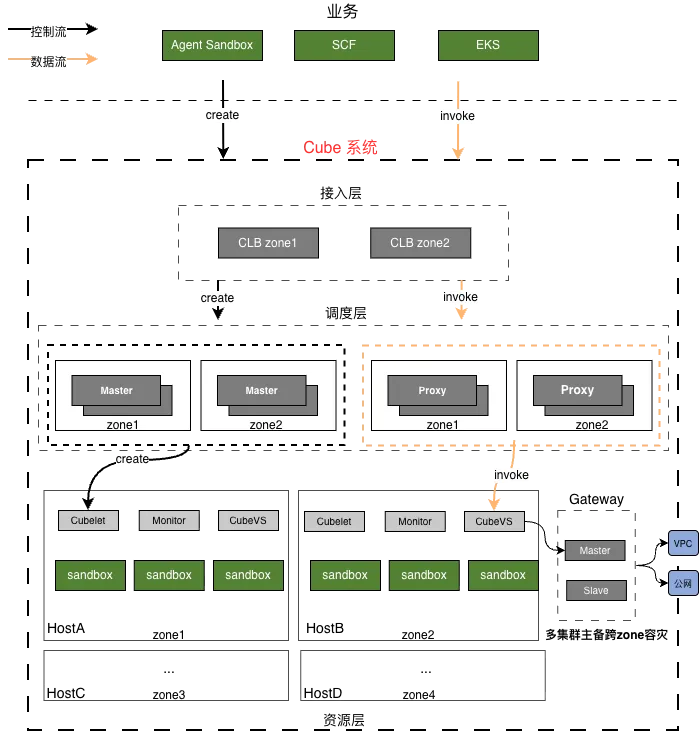
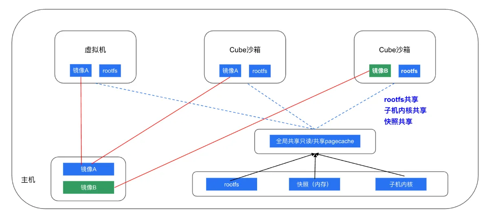
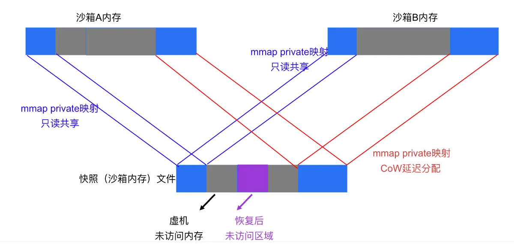
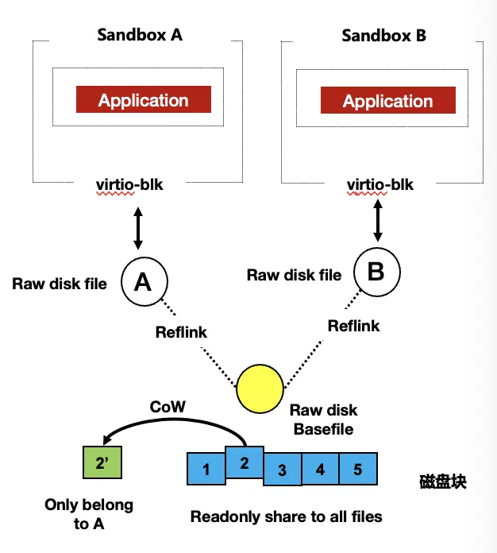
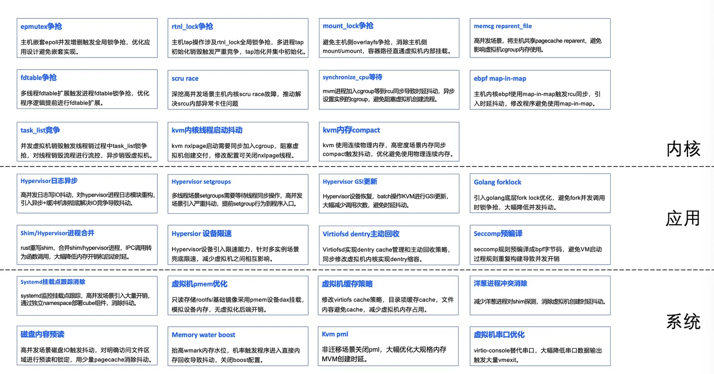
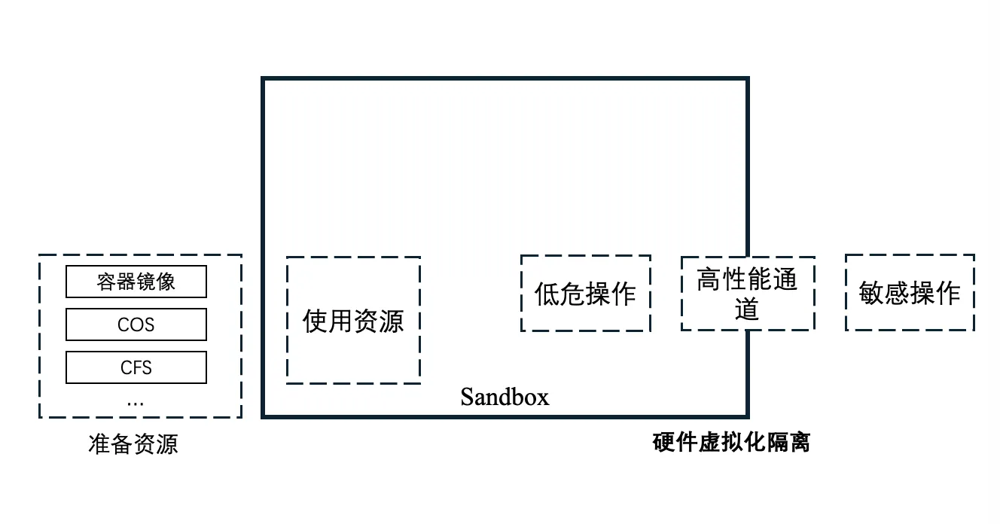
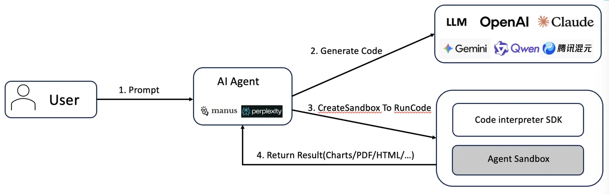
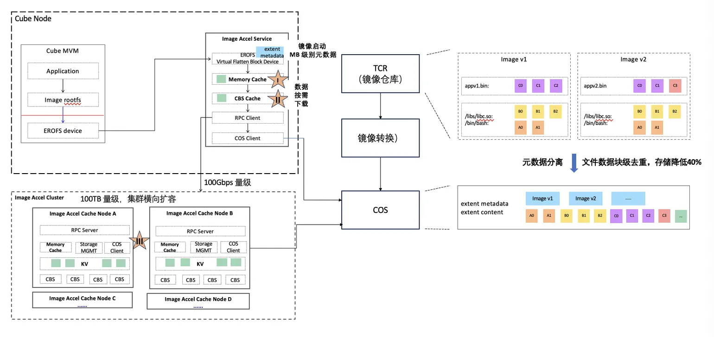
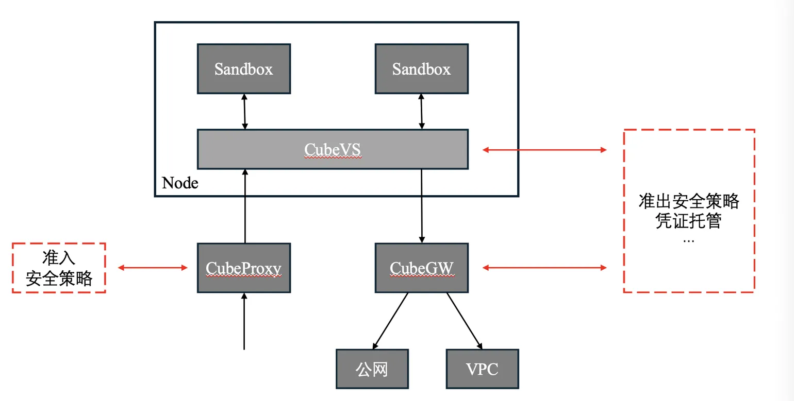
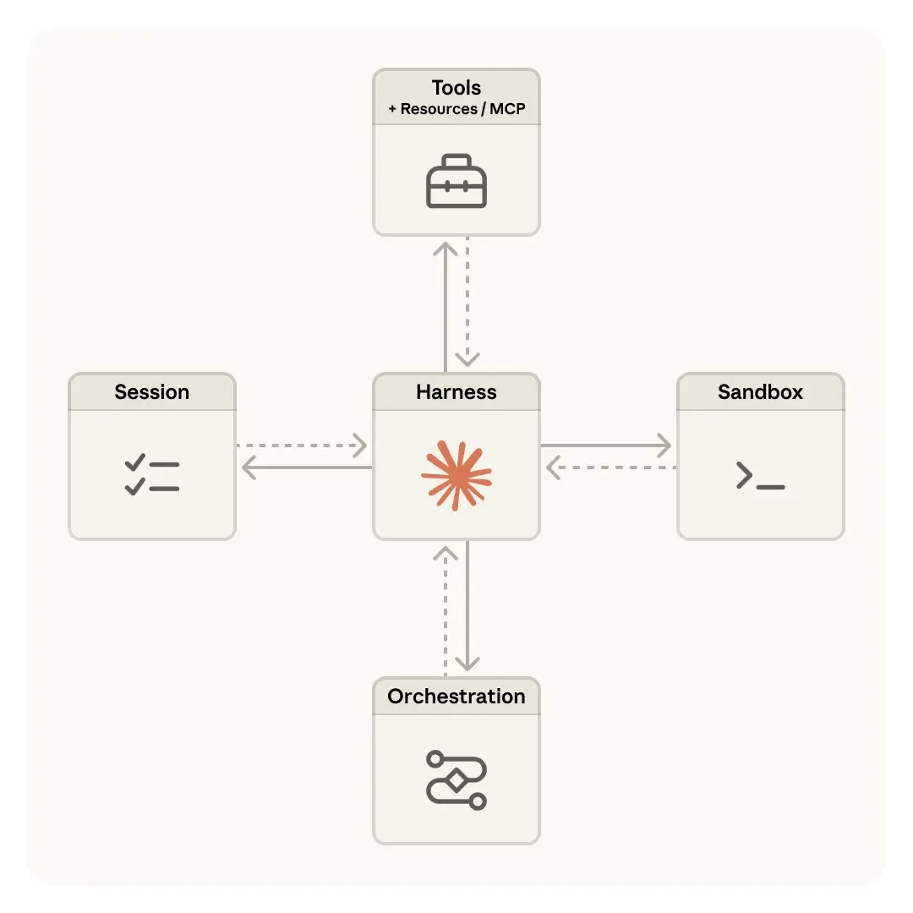

# From Serverless to Agent: Design Reflections on the Cube System

## 1. Background

In 2019, UC Berkeley published "Cloud Programming Simplified: A Berkeley View on Serverless Computing," bringing Serverless into the spotlight. Serverless introduced a few core challenges:

1. **Fine-grained resources**. Unlike a traditional VM, which abstracts a whole machine's worth of resources, Serverless abstracts at the application — or even the function — level.
2. **Sub-second cold start**. Serverless promises pay-per-use, on-demand provisioning. Resources need to be allocated on demand, fast.
3. **Massive concurrency**. "Allocate on demand, destroy after use" means each request maps to a real resource creation behind the scenes — concurrency is easily 1000× higher than traditional VMs.

Traditional IaaS is designed for VM workloads. Whether in resource granularity, cold-start speed, or concurrency, it falls far short of what Serverless needs. Tencent Cloud's early approach was to maintain a pre-warmed pool on top of regular VMs — trading cost for experience — but this came with its own problems: high cost (a 0.1C 128M request actually consumed a 1C 1G VM; large amounts of pre-warmed capacity sat idle) and a degraded experience (when the pool was exhausted, requests fell back to raw VM startup latency).

Building a system that natively addresses these Serverless challenges was the very motivation for Cube.

## 2. Core Design

### 2.1 Distributed scheduling + node-local bin-packing

Scheduling is split into two layers: a centralized distributed scheduler and a per-node bin-packer. Both can scale linearly. Unlike systems with a single centralized scheduler, Cube's distributed scheduling rests on two assumptions:

1. Each resource node is large (a beefy bare-metal box or VM). Combined with Cube's lightweight, high-density design (over 1K sandboxes per node), each node has enough headroom to absorb minor scheduling drift.
2. Serverless workloads tend to be short-lived; the set of sandboxes on any single node is constantly in flux.

If node-local bin-packing genuinely cannot fit a request, the scheduler is asked to reschedule as a fallback.

### 2.2 Resource pooling + node-local closure

Bin-packing is a node-local, closed-loop operation. Every resource a sandbox needs is pre-prepared and pooled; producing a sandbox is just a matter of pulling pieces out of those pools and assembling them. This both speeds up sandbox startup and reduces concurrent-creation contention within a node, lifting per-node concurrent-creation throughput.

### 2.3 Frontend / backend decoupling

The system inside a sandbox is fully stateless; all state lives on the virtualization backend. This enormously simplifies the design of bulk sandbox cloning.

### 2.4 Snapshot restore + lazy load

Every Cube sandbox is created by restoring from a template, and the stateless interior makes that easy. During creation, sandbox restoration and backend configuration refresh can run concurrently — the end-to-end delivery of a serviceable sandbox completes in hundreds of milliseconds. Restoring from a snapshot follows a very short logical path, reducing resource and logic contention during concurrent creation; it is a key reason for Cube's high per-node concurrency.

Snapshot-based startup also implies lazy EPT page-table population: sandbox memory pages that the snapshot didn't touch are mapped on demand via EPT. **Defer everything that can be deferred until it's actually needed** — this is a recurring theme in Cube's design.

For high-IO direct-passthrough scenarios, the industry usually pre-pins all sandbox memory and sets up DMA mappings up front so the hardware can read freely. That hurts startup latency badly, and the hit grows with sandbox memory size. Cube developed a virtio-based PVDMA technique that establishes DMA mappings only when the hardware actually needs to touch the memory — keeping passthrough sandbox startup at the hundred-millisecond level with no meaningful IO impact.

### 2.5 Resource sharing + on-demand allocation

**A core design goal of Cube: every read-only piece of state lives only once on a node.** By bridging across the sandbox boundary, all storage that appears "inside" a sandbox is in fact provided by the outside — rootfs, kernel, container images, etc. **For most non-performance-critical scenarios, we even share a single page cache for read-only storage across the whole node.**

Sandboxes cloned from the same memory snapshot share that snapshot via mmap, naturally sharing all unmodified pages — kernel text, for example, doesn't change once boot completes, so a whole node's worth of sandboxes can share a single copy of the kernel text. That alone saves 30+ MB per sandbox.

Sandboxes cloned from the same disk snapshot share the underlying file via reflink; real disk blocks are allocated only on actual write.

From a single-sandbox vantage point, each of these optimizations is small. But Cube is in the business of building a high-density system: at the node level, this saves more than 10% of memory, and in real workloads more than 90% of storage.

### 2.6 Full-stack lock optimization

Lots of small optimizations, taken together, are what give Cube its single-node concurrency ceiling and its tail-latency stability under load.

### 2.7 Native security

The interior of a sandbox is the untrusted domain — fully handed over to the user. All interactions with sensitive systems and all resource preparation happen outside the sandbox; the inside and outside are isolated by hardware virtualization. Cube developed a high-performance inside-outside communication channel based on `ivshmem`.

The networking around a sandbox is constrained by design: every inbound request must traverse CubeProxy and only those matching a forwarding rule are routed in; every outbound request must traverse CubeGW; every byte of network IO traverses the node's CubeVS. There is always a chokepoint on either path — which is exactly what later auditing and network-policy extensions need.

### 2.8 Reusing VM resources

Cube uses KVM for isolation, but nested virtualization is too costly to be practical, which is why most lightweight virtualization in the industry runs only on bare metal. That severely limits the resources Cube can run on. To work around this, Cube improved on the community's PVM proposal: PVM provides a complete Linux-kernel virtualization solution based on PV techniques, **does not require hardware virtualization**, doesn't need L0 to assist L1 the way nested virtualization does, and offers a shorter EPT-violation virtualization path.

### 2.9 Summary

The design above gave us a virtualization system with high density, high elasticity, and high concurrency:

- **High density**: a single 96 vCPU box produces 2K+ sandboxes at 0.1 vCPU / 128 MB.
- **High elasticity**: with the image ready, we can produce a serviceable sandbox from zero in 60 ms.
- **High concurrency**: a single 96 vCPU box handles sustained bursts of 100 concurrent creation requests with P99 < 200 ms.

## 3. From Serverless to Agent

Since last year, AI applications have steadily moved from "conversational" toward "executional." As the code sandbox that runs LLM-generated code, the demands on elasticity and concurrency remain extreme — and security isolation has become a baseline requirement for Agent sandboxes. Everything Cube honed in service of Serverless workloads — concurrency, elasticity, hardened isolation — finds plenty of new homes in Agent scenarios.

### 3.1 Low-latency code execution

Agent code-execution scenarios need fast sandbox startup and high concurrency from the substrate. YuanBao of Tencent using AGS (a product built on Cube) for code execution have reported significant experience improvements after migrating.

### 3.2 High-concurrency Agentic RL

Coding-RL workloads need to spin up large numbers of sandboxes simultaneously to verify rollouts — placing extreme demands on bulk concurrency.

Paired with a high-throughput distributed storage layer, Cube's concurrency advantage becomes very visible in Agentic RL: one major external LLM customer running Cube's commercial counterpart can launch hundreds of thousands of instances within a single minute — industry-leading, and a significant lift to RL training efficiency.

### 3.3 Block-level dedup + on-demand image acceleration

Shared distributed storage solves the "huge image set" problem of Agentic RL nicely, but it brings two new ones:

1. Most image content is identical, wasting tons of storage.
2. High-concurrency, short-lived sandbox creation on a single node hammers backend storage with IO.

Cube built an image-acceleration system that addresses both:

1. Block-level deduplication, which is far more efficient than traditional layer-level dedup.
2. A three-tier block cache with on-demand loading, easing throughput pressure on the backend.
3. Most images live in low-cost COS storage, slashing cost.

### 3.4 Snapshot-based branch cloning

Snapshotting is one of Cube's most important capabilities, and it gains new uses in Agent scenarios — for instance, snapshotting a running sandbox and 1:N cloning it for branch-exploration tasks, or saving a particular task state as the starting point for follow-up tasks.

### 3.5 Security and defense for Agents

Once the user of a sandbox stops being a human-written program and becomes an Agent, security and defense become first-class concerns. Agent behavior is probabilistic and not predictable in advance — unlike human-written programs, which can be checked extensively before they ever run, Agents can only be controlled mid-flight or after the fact. That puts higher demands on infra.

#### 3.5.1 Security extensions

Cube's native sandbox- and network-security capabilities can both be extended further:

- The interior of a sandbox is a hardware-isolated OS environment, so any Agent action's blast radius is confined to that sandbox. Kernel-level sensitive-event collection inside the sandbox, paired with the high-performance inside/outside channel, enables auditing of high-risk Agent actions today and admission control of those actions tomorrow.
- The inbound path through CubeProxy is a natural extension point for admission policy. The outbound paths through CubeVS and CubeGW are natural extension points for egress policy and sensitive-data injection.

#### 3.5.2 Defense: event-level transparent snapshot & rollback (open-sourcing soon)

Unpredictable Agent actions can do real damage — for individuals, irrecoverably deleting documents; for enterprises, wiping database content. Even the strictest mid-flight policy can't catch everything. **Event-level snapshot and rollback becomes a critical design when Agents are the user.**

For the sandbox, that means we need event-level environment snapshots — covering both writable disk and memory.

To meet the demand for high-frequency, user-imperceptible snapshotting, Cube built a CoW storage layer: the index of the block storage is separated from the actual data blocks, so a snapshot is just a copy of the index; real data blocks are CoW-allocated only when an actual write happens. The result: hundred-millisecond, large-scale environment snapshots — a solid foundation for event-level sandbox rollback.

This capability shouldn't stop at the sandbox. It should extend across the whole Agent Infra, giving the entire stack a native event-level snapshot-and-rollback ability — strong enough to defend against the unpredictable behavior of Agents.

## 4. Outlook

Once the logic running on the system shifts from human-written programs to Agents, a lot changes. The most fundamental shift: the substrate is no longer a logic machine constrained precisely by humans; it is a probabilistic runtime, and the way we interact with it shifts from a fixed protocol to natural language. The Agent's own capability changes as LLM capability evolves, with a constant push and pull. This is a different world, and it is changing fast.

The infrastructure carrying this rapidly evolving application form, however, hasn't changed nearly as much. Anthropic's Managed Agent (released on April 9) might be a meaningful starting point: instead of one VM/container hosting an entire Agent, it decouples the Agent into **brain** (decision and execution loop), **hands** (execution environment, tools), and **session** (immutable, replayable persisted data) — with each independent Agent request running in its own dedicated sandbox.

The capabilities Cube is building — event-level snapshot & rollback, branch exploration, strong security control — could make a good vehicle for the "brain." The capabilities Cube has matured over the years — extreme cold start, massive concurrency, very high density — could be an excellent fit for the "hands." **We will fully open-source Cube to the industry, in the hope that what we have spent years building can contribute, in some measure, to the development of Agent Infra at large.**
