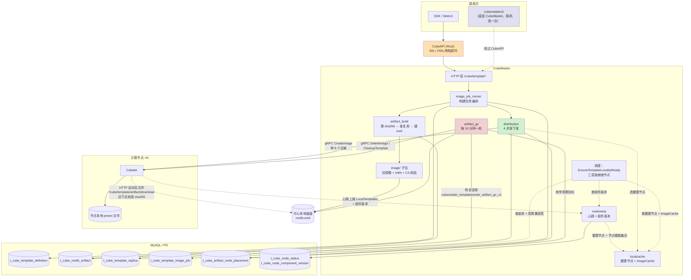
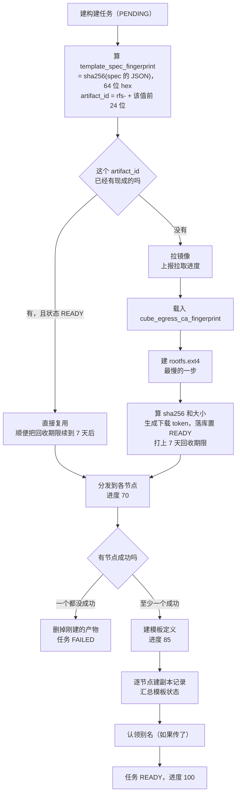
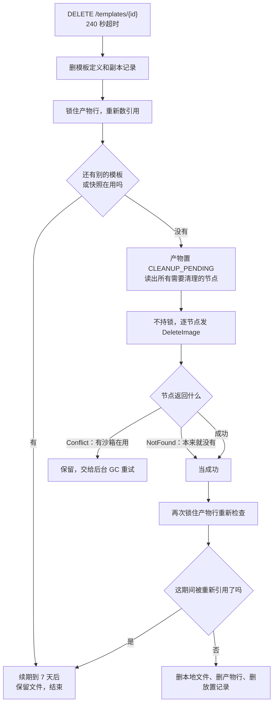
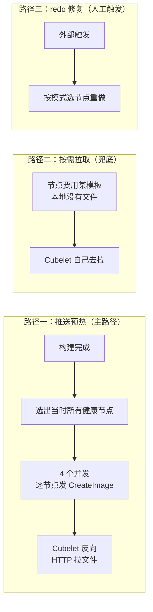
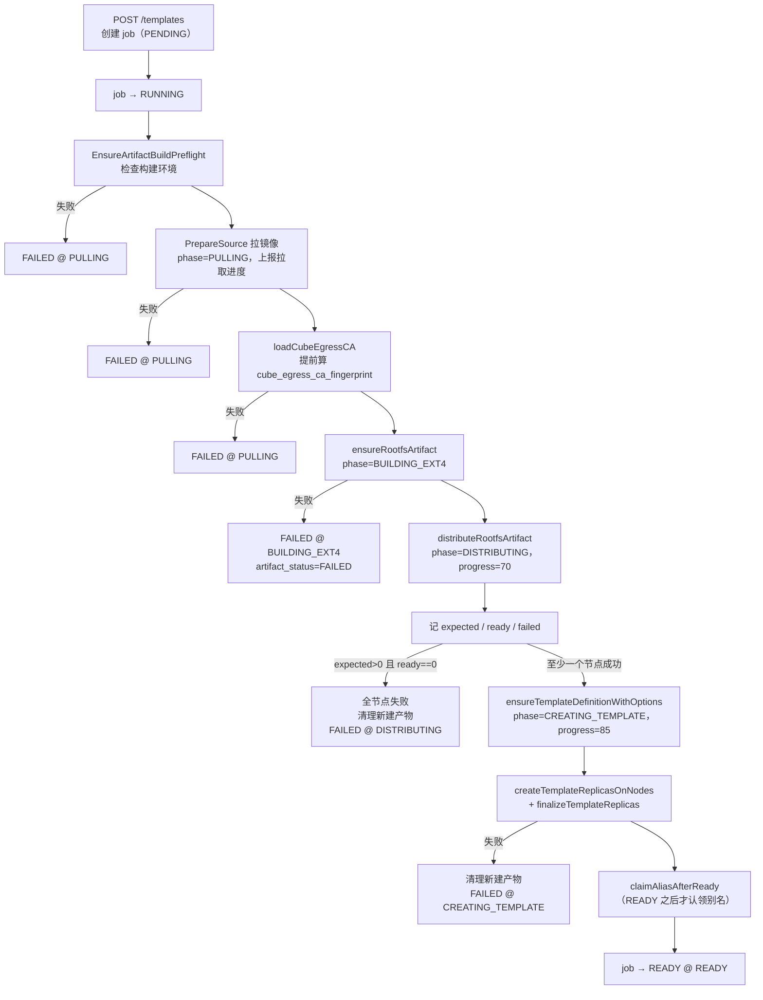
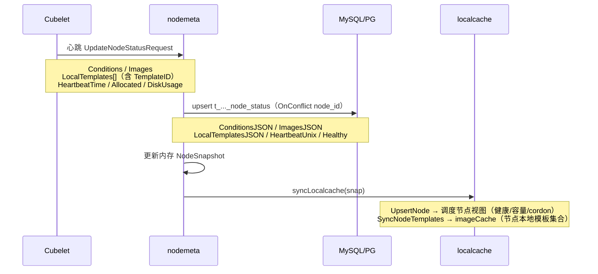

# CubeMaster 模板子系统现状说明

这份文档描述 CubeMaster **当前**是怎么处理模板的。前半部分讲整体流程、分发机制、回收时间线和关键参数，不看代码也能读懂；后半部分是逐个模块的实现细节，都标了文件行号方便对照。

纯现状记录，不含改造方案——改造需求与影响面见 [`templatecenter-proposal.md`](./templatecenter-proposal.md)，实现细节见 [`templatecenter-design.md`](./templatecenter-design.md)，友商对比见 [`e2b-template-architecture.md`](./e2b-template-architecture.md)。

## 目录

**流程与概览**（不需要读代码）

- [概览](#概览)（含端到端全景图）
- [模板的一生](#模板的一生)
- [分发机制](#分发机制)
- [回收时间线](#回收时间线)
- [关键参数汇总](#关键参数汇总)
- [四套状态](#四套状态)

**实现细节**

1. [概念与术语](#1-概念与术语)
2. [数据模型](#2-数据模型)
3. [对外 API](#3-对外-api)
4. [内部 API](#4-内部-api)
5. [模板创建全流程](#5-模板创建全流程)
6. [产物去重：template_spec_fingerprint 与 artifact_id](#6-产物去重template_spec_fingerprint-与-artifact_id)
7. [并发控制](#7-并发控制)
8. [节点下发](#8-节点下发)
9. [副本与组件兼容性](#9-副本与组件兼容性)
10. [调度侧的就绪判定](#10-调度侧的就绪判定)
11. [缓存体系](#11-缓存体系)
12. [产物生命周期与 GC](#12-产物生命周期与-gc)
13. [依赖关系](#13-依赖关系)
14. [配置项](#14-配置项)
15. [可观测性](#15-可观测性)
16. [已知限制](#16-已知限制)
17. [代码索引](#17-代码索引)

---

## 概览

模板就是"预先做好的沙箱文件系统"。CubeMaster 在**中心节点**上把镜像做成一个完整的 `rootfs.ext4` 文件，然后**主动推送**到集群里所有能跑这个规格的计算节点；用户拿模板创建沙箱时，调度器只挑那些"已经有这份文件、而且节点组件版本还对得上"的节点。

三个关键特征：

**中心构建，一次成型。** 只在 CubeMaster 这一台上构建，产物是一个完整文件，不是分层增量。改动模板定义里任何一个字段都会整份重建。

**推送为主，拉取兜底。** 构建完就推给所有节点；漏掉的节点等真要用的时候自己去拉。

**同一份定义只建一次。** 对模板定义算一个 sha256（落库字段 `template_spec_fingerprint`），值相同就直接复用已有文件，不重复构建。

### 端到端全景

一张图把所有参与方、数据流向、依赖的表和 gRPC 都串起来。实线是请求方向，虚线是数据/状态回流。



读这张图的三个要点：

**文件传输方向是反的。** `DIST → CLT` 那条实线只是 gRPC 通知（"有个产物，地址、token、sha256、大小在这"），真正的字节传输是 `CLT ⇢ DISK` 那条虚线——Cubelet 主动 HTTP 拉。

**cubemastercli 绕过 CubeAPI。** 它直接连 CubeMaster 的 `/cube/template*`，而且是从配置的 server 列表里随机选一台，不走 Service 或负载均衡。

**调度不碰产物。** 右下角 `SCHED` 只查表和缓存，判断"哪些节点上有可用的模板"，不会去补推产物。

---

## 模板的一生

### 建：从请求到可用

用户 `POST /templates`，CubeMaster **不会同步等构建完**——它建一条构建任务记录就立即返回，真正的构建在后台跑，客户端靠轮询 `/templates/{id}/builds/{buildID}/status` 看进度。



几个值得知道的点：

**命中复用会很快。** `template_spec_fingerprint` 相同就跳过拉镜像和建 ext4，直接进分发，秒级完成。

**建 ext4 是最慢的一步**，取决于镜像大小和可写层大小，几分钟到几十分钟都可能。这一步之前会先把 `cube_egress_ca_fingerprint` 算出来（读 CA 的 PEM 算 sha256，PEM 字节本身用完就丢），目的是让"CA 缺失或损坏"这类错误在拉镜像阶段就暴露，而不是 ext4 建到一半才炸。

**部分节点失败不算失败。** 只要有一个节点成功模板就会建出来，状态如实反映：

| 情况 | 模板状态 |
|---|---|
| 所有节点都成功 | `READY` |
| 部分成功部分失败 | `PARTIALLY_READY`，带第一个失败的错误信息 |
| 全部失败 | `FAILED`（并且会把刚建的产物删掉） |

看到 `PARTIALLY_READY` 就说明这个模板只在部分节点上可用，调度到其他节点会走按需拉取，慢。

**别名最后才认领**，而且认领失败不会让模板失败，只返回一条 warning。别名是"先从旧主人释放、再认领"的原子操作，所以同一个别名能从旧模板转移到新模板——这就是 rebuild 之后别名还能指向新版本的原理。

### 用：创建沙箱时怎么找节点

调度器要回答的问题是：这个模板在哪些节点上能用？"能用"有两个条件——节点上有文件，而且节点当前的组件版本跟模板构建时绑定的版本对得上。

查询走三层，从快到慢：

| 层 | 查什么 | 命中后还做什么 |
|---|---|---|
| 一 | 内存里的节点-模板索引（心跳同步来的） | 查一次数据库确认副本是 Ready，再现算一次版本兼容性 |
| 二 | 进程内的模板位置缓存 | 同上，并回填第一层 |
| 三 | 直接查数据库副本表 | 筛出可用的，回填前两层 |

注意即使第一层内存索引命中，**也一定会查一次数据库**并现算兼容性。这个设计让内存索引里的脏数据不会造成错误调度，最多是多一次数据库往返然后把脏条目摘掉。

三层都找不到可用节点时分两种情况：有副本但都因为版本过期不可用，返回"需要 redo"并带上具体节点列表；完全没有副本，返回"没有就绪副本"（错误码 130400）。

### 删：从删除请求到文件真正消失

删模板不是立即删文件，因为**多个模板可能共享同一个产物文件**（`template_spec_fingerprint` 相同就复用）。所以要先数引用。



引用计数数三处：副本表、进行中的构建任务、模板定义表的产物引用字段。**三处都不区分模板和快照**，所以一个产物只要还被任何模板或快照引用就不会被删。

中间那步"逐节点发 `DeleteImage`"刻意不持锁，因为跨节点 RPC 慢，持锁会把其他操作全堵住。代价是这期间产物可能被重新引用，所以第三步要再检查一次。

节点返回 `Conflict` 表示有运行中的沙箱还在用这个产物，这是保护不是失败——产物会被保留，交给后台 GC 每 10 分钟重试一次。

---

## 分发机制

模板文件到计算节点上，一共三条路径。



### 路径一：推送预热

构建完成后按实例规格选出**当时**所有健康节点，4 个并发逐个发 `CreateImage` gRPC。

注意方向：CubeMaster 只是通知 Cubelet "有个新产物，地址在这、token 在这、sha256 是这个、大小是这么多"，**实际文件传输是 Cubelet 主动去 HTTP 拉**。Cubelet 边下边算 sha256，不匹配直接报错；落盘先写临时文件再 rename，保证不会出现半个文件。

下载地址里的主机名会被 Cubelet 用本地配置覆盖，所以数据库里存的构建机 IP 只是拼 URL 的原料，实际访问哪台由 Cubelet 的配置决定。

每个节点的结果都会写一条副本记录，成功还会额外写一条"放置记录"（这个节点曾经收到过这个产物），后者供 GC 枚举清理目标用。

### 路径二：按需拉取兜底

节点真要用某个模板但本地没文件时，Cubelet 自己去拉。这条路径覆盖三种情况：推送之后才加入集群的节点、推送时失败的节点、本地文件被清理过的节点。

代价是首次创建沙箱要等整份 ext4 下载完，慢。

判断"本地有没有"只看文件存在且大于 1KB，**不比对 sha256**。所以文件一旦存在就被认为有效，这带来一个问题，见第 16.1 和 16.2 节。

### 路径三：redo 修复

外部触发，四种模式：全部节点、指定节点、只做失败的、失败节点与指定节点求交集。

### 没有的第四条：自动收敛

**没有任何后台任务去比对"数据库说该有的"和"节点实际有的"然后自动补齐。** 所以：

- 新扩容的节点不会自动获得存量模板
- 分发失败的节点不会自动重试
- 也没有区分"网络抖动可以重试"和"磁盘满了重试也没用"的终态语义，失败就一直停在 FAILED

全都靠路径二兜底或者路径三人工修。

---

## 回收时间线

产物文件不是引用归零就立刻消失，有一套 TTL 加后台重试的机制。

```
产物创建 ─────────────────────────► 打上回收期限 = 当前时间 + 7 天
    │
    ├─ 被新模板复用 ───────────────► 期限重置为 当前时间 + 7 天
    │                                （如果状态是 CLEANUP_PENDING 会翻回 READY 重新可用）
    │
    ├─ 最后一个引用被删 ───────────► 立即尝试清理
    │      ├─ 节点清理全成功 ──────► 立即删文件、删记录，结束
    │      └─ 有节点返回 Conflict ─► 停在 CLEANUP_PENDING，等后台 GC
    │
    └─ 构建中途被打断 ─────────────► ORPHANED，等后台 GC

后台 GC：每 10 分钟一轮
    ├─ 抢一个数据库会话锁（保证多副本下只有一个实例在扫）
    ├─ 挑候选：状态是 CLEANUP_PENDING 或 ORPHANED，或者回收期限已过
    ├─ 单轮最多处理 100 个
    └─ 5 个并发去清理
```

几个时间点：

| 事件 | 时间 |
|---|---|
| 产物默认存活期 | 7 天（每次被复用就重新计时） |
| GC 轮次间隔 | 10 分钟 |
| GC 单轮候选上限 | 100 个 |
| GC 清理并发 | 5 |
| GC 挑候选的超时 | 30 秒 |

所以最坏情况：一个产物的最后一个引用被删了，但节点上还有沙箱在用，那么每 10 分钟 GC 会重试一次，直到那个沙箱销毁为止。一个没人用也没走删除流程的产物，最多 7 天后被回收。

GC 的会话锁有个细节值得一提：它只锁"挑候选"这一步，不锁后面慢速的跨节点清理。这样某个节点卡住不会把整个 GC 堵死。锁状态不确定时（SQL 出错，不知道锁还在不在）会直接把数据库连接丢掉，让数据库自己释放锁，避免脏连接回到连接池。

---

## 关键参数汇总

| 参数 | 值 | 出处 |
|---|---|---|
| **构建与分发** | | |
| 分发并发数 | 4 | `defaultDistributionWorkers` |
| 副本创建并发数 | 4 | `store.go:467` |
| 构建进度档位 | 分发 70 / 建定义 85 / 完成 100 | `image_job_runner.go` |
| 模板默认版本号 | `v2` | `DefaultTemplateVersion` |
| **回收** | | |
| 产物存活期 | 7 天 | `defaultTemplateArtifactTTL` |
| GC 轮次间隔 | 10 分钟 | `artifactGCInterval` |
| GC 单轮上限 | 100 | `artifactGCMaxPerPass` |
| GC 并发 | 5 | `artifactGCWorkerLimit` |
| GC 挑候选超时 | 30 秒 | `artifactGCSelectionTimeout` |
| GC 释放锁超时 | 5 秒 | `artifactGCLockReleaseTimeout` |
| **节点与心跳** | | |
| 元数据同步间隔 | 30 秒（默认） | `Common.SyncMetaDataInterval` |
| 节点判死超时 | 同步间隔 + 10 秒 = 40 秒 | `nodehealth.MetadataTimeout` |
| nodemeta 全量重载间隔 | 30 秒（跟同步间隔一致） | `service.go:1021` |
| localcache 全量重载间隔 | 30 秒 | `node_cache.go:83` |
| **缓存** | | |
| 三份进程内缓存 TTL | 360 分钟（6 小时） | `cache.go:21-22` |
| 周期性兜底刷新 | **无**，只有启动时预热一次 | — |
| **接口超时** | | |
| CubeAPI 默认 | 30 秒 | `DEFAULT_ROUTE_TIMEOUT` |
| CubeAPI 长操作（删模板、建快照、rollback） | 240 秒 | `SNAPSHOT_LONG_ROUTE_TIMEOUT` |
| **判断阈值** | | |
| 本地文件有效性 | 存在 + 大于 1024 字节（**不校验 sha256**） | `FileExistAndValid` |

---

## 四套状态

系统里有四套独立的状态机，容易混，这里对齐一下。

**模板状态**（`t_cube_template_definition.status`）—— 描述这个模板整体可不可用：

`PENDING` → `CREATING` → `READY` / `PARTIALLY_READY` / `FAILED`，删除时 `DELETING`

**副本状态**（`t_cube_template_replica`）—— 描述某个模板在某个节点上的情况，分两个字段：

- `Status`：`READY` / `FAILED`
- `Phase`：`PENDING` → `DISTRIBUTING` → `DISTRIBUTED` → `SNAPSHOTTING` → `READY`，失败是 `FAILED`，清理中是 `CLEANING`

**产物状态**（`t_cube_rootfs_artifact.status`）—— 描述那个物理文件：

`PENDING` → `BUILDING` → `READY` / `FAILED`，引用归零待删是 `CLEANUP_PENDING`，从未建完的孤儿是 `ORPHANED`

**构建任务状态**（`t_cube_template_image_job`）—— 描述一次构建操作，供客户端轮询：

- `Status`：`PENDING` → `RUNNING` → `READY` / `FAILED`
- `Phase`：`PULLING` → `UNPACKING` → `BUILDING_EXT4` → `GENERATING_JSON` → `DISTRIBUTING` → `CREATING_TEMPLATE` → `READY`（快照和 rollback 另有各自的阶段）

还有一套**兼容性状态**挂在副本上，不是生命周期而是一个实时判定结果：`OK` / `STALE` / `UNKNOWN` / `MISSING`。只有 `STALE` 会导致节点不可调度，`UNKNOWN` 是允许调度的。

---

---

## 1. 概念与术语

| 术语 | 含义 |
|---|---|
| **模板（template）** | 用户可复用的沙箱环境定义。`kind='template'` |
| **快照（snapshot）** | 从运行中沙箱捕获的状态。`kind='snapshot'`，跟模板**共用同一张表** |
| **产物（rootfs artifact）** | 实际的 `rootfs.ext4` 文件，加一份元数据行。**多个模板可以共享同一个产物**（`template_spec_fingerprint` 相同就复用） |
| **副本（replica）** | "某个模板在某个节点上已就绪"这条记录。一个模板在 N 个节点上有 N 条副本记录 |
| **放置（placement）** | "某个产物曾经被下发到某个节点"这条记录，独立于模板生命周期，供 GC 枚举清理目标 |
| **别名（alias）** | 人类可读的模板名，可以代替 `tpl-xxx` 使用，能跨 rebuild 转移 |
| **`template_spec_fingerprint`** | 对模板 spec 的 JSON 算的 sha256，hex 编码 64 个字符。决定"两次请求算不算同一个模板"，`artifact_id` 取它前 24 位 |
| **构建任务（image job）** | 一次模板构建的异步任务，有状态和阶段，供客户端轮询 |

模板 ID 前缀是 `tpl-`，快照是 `snap-`。这两个前缀被别名校验禁用，避免别名跟 ID 撞命名空间。

---

## 2. 数据模型

### 2.1 t_cube_template_definition

模板和快照共用，`kind` 字段区分。

```12:28:CubeMaster/pkg/base/db/models/template.go
type TemplateDefinition struct {
	gorm.Model
	TemplateID                string `json:"template_id" gorm:"column:template_id"`
	InstanceType              string `json:"instance_type" gorm:"column:instance_type"`
	Version                   string `json:"version" gorm:"column:version"`
	Status                    string `json:"status" gorm:"column:status"`
	Kind                      string `json:"kind" gorm:"column:kind"`
	OriginSandboxID           string `json:"origin_sandbox_id" gorm:"column:origin_sandbox_id"`
	OriginNodeID              string `json:"origin_node_id" gorm:"column:origin_node_id"`
	DisplayName               string `json:"display_name" gorm:"column:display_name"`
	StorageBackend            string `json:"storage_backend" gorm:"column:storage_backend"`
	Retain                    bool   `json:"retain" gorm:"column:retain"`
	RootfsSizeBytesAtSnapshot uint64 `json:"rootfs_size_bytes_at_snapshot" gorm:"column:rootfs_size_bytes_at_snapshot"`
	RootfsArtifactID          string `json:"rootfs_artifact_id" gorm:"column:rootfs_artifact_id"`
	RequestJSON               string `json:"request_json" gorm:"column:request_json"`
	LastError                 string `json:"last_error" gorm:"column:last_error"`
}
```

另有一个 STORED 生成列 `alias_key` 不在 struct 里（由 DB 维护）：

```43:55:CubeDB/migrate/migrations/mysql/20260704120000_template_alias_unique.sql
-- Generated column: non-NULL only for kind='template' with non-empty
-- display_name. NULL everywhere else → exempt from the unique constraint.
CALL cubemaster_add_column_if_missing(
  't_cube_template_definition',
  'alias_key',
  'varchar(256) GENERATED ALWAYS AS (CASE WHEN `kind` = ''template'' AND `display_name` <> '''' THEN `display_name` ELSE NULL END) STORED'
);

CALL cubemaster_add_index_if_missing(
  't_cube_template_definition',
  'idx_template_definition_alias_unique',
  'ADD UNIQUE INDEX `idx_template_definition_alias_unique` (`alias_key`)'
);
```

别名的唯一性完全靠这个生成列加唯一索引来保证，应用层不需要做 check-then-insert。而且表达式把作用域限定在 `kind='template'`，快照的 `display_name` 恒为 NULL（唯一约束豁免 NULL），所以快照不参与别名竞争。

`Status` 取值（`store.go:43-48`）：`PENDING` / `CREATING` / `READY` / `PARTIALLY_READY` / `FAILED` / `DELETING`。由 `summarizeStatus` 根据各节点副本结果汇总：

```634:655:CubeMaster/pkg/templatecenter/store.go
func summarizeStatus(replicas []ReplicaStatus) (status string, lastError string) {
	successes := 0
	failures := 0
	for _, replica := range replicas {
		if replica.Status == ReplicaStatusReady {
			successes++
			continue
		}
		failures++
		if lastError == "" {
			lastError = replica.ErrorMessage
		}
	}
	switch {
	case successes == 0:
		return StatusFailed, lastError
	case failures == 0:
		return StatusReady, ""
	default:
		return StatusPartiallyReady, lastError
	}
}
```

`Version` 默认 `v2`（`DefaultTemplateVersion`）。`StorageBackend` 有一个已知取值 `cubecow`（`StorageBackendCow`）。

### 2.2 t_cube_template_replica

一个模板在一个节点上的就绪记录，同时携带构建时绑定的 guest 环境版本。

字段分三组：

**定位** —— `TemplateID`、`NodeID`、`NodeIP`、`InstanceType`、`ArtifactID`

**状态** —— `Status`（`READY` / `FAILED`）、`Phase`（`PENDING` / `DISTRIBUTING` / `DISTRIBUTED` / `SNAPSHOTTING` / `READY` / `FAILED` / `CLEANING`）、`Spec`、`LastJobID`、`LastErrorPhase`、`CleanupRequired`、`ErrorMessage`

**兼容性** —— `GuestImageVersion`、`AgentVersion`、`KernelVersion`、`CompatStatus`（`OK` / `STALE` / `UNKNOWN` / `MISSING`）、`CompatPolicy`（`STRICT` / `GUEST_ONLY`）、`CompatCheckedUnix`

物理布局字段（`snapshot_path`、`rootfs_vol`、`memory_vol` 之类）在早前版本已经从表和 struct 里移除了，现在 **Cubelet 本地的 snapshot catalog 是物理布局的唯一真相源**，按 templateID / snapshotID 索引。

### 2.3 t_cube_rootfs_artifact

实际产物的元数据。关键字段：

| 字段 | 说明 |
|---|---|
| `ArtifactID` | `"rfs-"` 加 `template_spec_fingerprint` 的前 24 个字符 |
| `TemplateSpecFingerprint` | 完整的 64 位 sha256 hex（`ArtifactID` 只取前 24 位） |
| `Status` | `PENDING` / `BUILDING` / `READY` / `FAILED` / `CLEANUP_PENDING` / `ORPHANED` |
| `Ext4Path` | 本地文件路径 |
| `Ext4SHA256` | 传输校验用 |
| `Ext4SizeBytes` | |
| `SourceImageDigest` | 源镜像 digest |
| `MasterNodeIP` | 构建它的那台 CubeMaster 的 IP，用来拼下载 URL |
| `DownloadToken` | 下载鉴权 |
| `ImageConfigJSON` | 镜像 config |
| `GeneratedRequestJSON` | 根据镜像 config 生成的沙箱创建请求模板 |
| `GCDeadline` | unix 时间戳，到期可被 GC |

两个状态值得单独说：

`CLEANUP_PENDING` —— 逻辑引用已经归零、物理文件正在或等待删除。这个状态的行**绝不能被复用**，创建路径遇到它会重建而不是复用。GC 会一直重试清理直到这行能安全删掉。

`ORPHANED` —— 没有存活引用、而且从来没有完整构建/分发过（比如构建中途被打断）。GC 直接回收。

### 2.4 t_cube_artifact_node_placement

记录"哪个节点曾经收到过这个产物"，独立于模板生命周期。即使引用它的模板行都删了，placement 行还在，GC 靠它枚举需要清理的节点。写入函数 `upsertArtifactNodePlacement`（`artifact_placement.go`），写入失败只告警不影响分发。

### 2.5 t_cube_template_image_job

构建任务，供客户端轮询进度。

| 字段组 | 取值 |
|---|---|
| `Status` | `PENDING` / `RUNNING` / `READY` / `FAILED` |
| `Phase` | `PULLING` / `UNPACKING` / `BUILDING_EXT4` / `GENERATING_JSON` / `DISTRIBUTING` / `CREATING_TEMPLATE` / `SNAPSHOTTING` / `REGISTERING` / `ROLLBACK_PREPARING` / `ROLLBACK_DRIVING` / `ROLLBACK_RECOVERING` / `DELETING` / `READY` |
| `Operation` | `CREATE` / `REDO` / `COMMIT` / `LEGACY` / `SNAPSHOT_CREATE` / `SNAPSHOT_ROLLBACK` / `SNAPSHOT_DELETE` |
| `ResourceType` | `template` / `snapshot` |
| 计数 | `expected_node_count` / `ready_node_count` / `failed_node_count` |
| 其他 | `progress`、`artifact_id`、`template_spec_fingerprint`、`artifact_status`、`template_status`、`error_message`、`result`（序列化的 TemplateInfo） |

所以这张表是模板和快照共用的任务表，靠 `ResourceType` 和 `Operation` 区分。

---

## 3. 对外 API

CubeAPI（Rust）是唯一对外入口，SDK / CLI 都只配一个 `apiUrl` 指向它。路由定义在 `CubeAPI/src/routes.rs`。

### 3.1 超时分层

```26:32:CubeAPI/src/routes.rs
const DEFAULT_ROUTE_TIMEOUT: Duration = Duration::from_secs(30);

/// Timeout budget for routes that front a *synchronous* CubeMaster operation
/// which can legitimately take well beyond the default 30 s — currently
/// snapshot create (`POST /sandboxes/:id/snapshots`) and snapshot/template
/// delete (`DELETE /templates/:id`).
const SNAPSHOT_LONG_ROUTE_TIMEOUT: Duration = Duration::from_secs(240);
```

### 3.2 模板端点

| 方法 | 路径 | 超时 | 说明 |
|---|---|---|---|
| GET | `/templates` | 30s | 列表 |
| POST | `/templates` | 30s | 创建 |
| GET | `/templates/compat` | 30s | 兼容性矩阵 |
| POST | `/templates/compat/{templateID}/adopt-baseline` | 30s | 采纳当前版本为基线 |
| GET | `/templates/aliases/{alias}` | 30s | 按别名查 |
| GET | `/templates/{templateID}` | 30s | 详情。**也被用来查快照** |
| POST | `/templates/{templateID}` | 30s | 重建（rebuild） |
| PATCH | `/templates/{templateID}` | 30s | 当前是 NotImplemented |
| POST | `/templates/{templateID}/builds/{buildID}` | 30s | 启动构建 |
| GET | `/templates/{templateID}/builds/{buildID}/status` | 30s | 构建状态 |
| GET | `/templates/{templateID}/builds/{buildID}/logs` | 30s | 构建日志（分页 `limit` / `nextToken`） |
| DELETE | `/templates/{templateID}` | **240s** | 删除。**也被用来删快照** |

`GET` 和 `DELETE /templates/{id}` 是双语义端点——三个 SDK 的 `deleteSnapshot(id)` 打的就是 `DELETE /templates/{id}`，CubeAPI 拿到 ID 时无法判断它是模板还是快照，由 CubeMaster 侧按 `kind` 分派。

### 3.3 快照端点

| 方法 | 路径 | 超时 |
|---|---|---|
| GET | `/snapshots` | 30s |
| POST | `/sandboxes/{sandboxID}/snapshots` | 240s |
| POST | `/sandboxes/{sandboxID}/rollback` | 240s |

### 3.4 e2b 兼容层

`CubeAPI/src/routes.rs` 里另有 `build_e2b_router` / `build_e2b_snapshot_long_router`，是 CubeSandbox 自己实现的兼容 e2b 协议的路由，跟 e2b 产品的内部实现无关。

---

## 4. 内部 API

CubeMaster 的 HTTP 服务挂在 `/cube` 前缀下，路径常量定义在 `pkg/service/httpservice/cube/cube.go`，注册在 `routes.go`。

### 4.1 模板相关

| 方法 | 路径 | Handler |
|---|---|---|
| POST | `/cube/template` | `createTemplateGinHandler` |
| GET | `/cube/template` | `getTemplateGinHandler` |
| DELETE | `/cube/template` | `deleteTemplateGinHandler` |
| GET | `/cube/template/compat` | `getTemplateCompatGinHandler` |
| POST | `/cube/template/compat` | `updateTemplateCompatGinHandler` |
| POST | `/cube/template/redo` | `handleRedoTemplateAction` |
| GET | `/cube/template/build/{build_id}/status` | `handleTemplateBuildStatusAction` |
| GET | `/cube/template/from-image` | `getTemplateFromImageGinHandler` |
| POST | `/cube/template/from-image` | `createTemplateFromImageGinHandler` |
| GET | `/cube/template/artifact/download` | `downloadTemplateArtifactGinHandler` |
| HEAD | `/cube/template/artifact/download` | `headTemplateArtifactGinHandler` |
| GET | `/cube/rootfs-artifact` | `handleRootfsArtifactAction` |

`/cube/template/artifact/download` 是 **Cubelet 拉产物的目标端点**，带 `DownloadToken` 鉴权。支持 HEAD 让 Cubelet 先探大小。

### 4.2 快照相关

| 方法 | 路径 |
|---|---|
| POST | `/cube/snapshot` |
| GET | `/cube/snapshot`、`/cube/snapshot/{snapshot_id}` |
| DELETE | `/cube/snapshot/{snapshot_id}` |
| GET | `/cube/snapshot/storage` |
| GET | `/cube/operation/{operation_id}` |

`/cube/snapshot/storage` 是显式静态路由，注册在 `/cube/snapshot/:snapshot_id` 之前，避免被参数路由遮蔽。集合级的 `DELETE /cube/snapshot` **没有注册**，只有带 ID 的版本。

### 4.3 其他相关

| 方法 | 路径 | 用途 |
|---|---|---|
| POST / DELETE | `/cube/image` | 镜像操作 |
| GET / HEAD | `/cube/ca/{filename}` | CubeEgress CA 下载 |
| POST | `/cube/listinventory` | 库存查询 |
| POST | `/cube/sandbox/commit` | 从沙箱提交成模板 |

---

## 5. 模板创建全流程

主编排在 `image_job_runner.go`，从镜像建模板这条路径最完整。



几个设计细节：

**CA 指纹提前算。** `loadCubeEgressCA` 在 `PULLING` 阶段就调用，读出 CA 的 PEM 算完 sha256 就把 PEM 字节丢掉，只留 `cube_egress_ca_fingerprint`。注释说明了原因：让 job 记录的 `artifact_id` 跟下游 `ensureRootfsArtifact` 算出来的一致，并且把"CA 缺失或损坏"这类错误暴露在 `PULLING` 阶段，而不是 ext4 建到一半才炸。

**拉取进度的 flush 时机分两种。** Docker/Podman 的拉取发生在 `PrepareSource` 里，所以进入 `UNPACKING` 之前就 flush，避免 `PULLING` 已经完成了界面还显示 13/14。Dockerless 的拉取发生在 `BuildExt4`/export 期间，所以要等后面才 flush。

**分发部分成功就算成功。** 判定是 `expected > 0 && ready == 0` 才算失败。只要有一个节点成功，模板就会被创建，`readyTargets` 里只包含成功的节点。所以模板可以处于"只有部分节点有"的状态。

**失败时会清理新建的产物。** 但只清理 `builtFreshArtifact == true` 的情况——如果这次是复用了已有产物，失败不会去删别人也在用的产物。

**别名在 READY 之后才认领。** `claimAliasAfterReady` 的失败不会让模板失败，只会带一条 warning 回去。

---

## 6. 产物去重：template_spec_fingerprint 与 artifact_id

### 6.1 从镜像建模板：哈希这 7 个字段

```39:47:CubeMaster/pkg/templatecenter/fingerprint.go
	type fingerprintPayload struct {
		SourceImageDigest       string                    `json:"source_image_digest"`
		WritableLayerSize       string                    `json:"writable_layer_size"`
		ExposedPorts            []int32                   `json:"exposed_ports,omitempty"`
		InstanceType            string                    `json:"instance_type"`
		NetworkType             string                    `json:"network_type"`
		ContainerOverrides      *types.ContainerOverrides `json:"container_overrides,omitempty"`
		CubeEgressCAFingerprint string                    `json:"cube_egress_ca_fingerprint,omitempty"`
	}
```

`json.Marshal` 之后算 sha256，hex 编码得到 64 个字符，这就是 `template_spec_fingerprint`：

```57:58:CubeMaster/pkg/templatecenter/fingerprint.go
	sum := sha256.Sum256(payload)
	return hex.EncodeToString(sum[:])
```

`artifact_id` 取它的前 24 个字符：

```61:63:CubeMaster/pkg/templatecenter/fingerprint.go
func buildArtifactID(fingerprint string) string {
	return "rfs-" + fingerprint[:24]
}
```

所以 `artifact_id` 的形态是 `rfs-` 加 24 个十六进制字符，比如 `rfs-3f2a9c81d4e0b7562a1f8d34`。完整的 64 位值另存在 `template_spec_fingerprint` 列里。

有一条注释解释了为什么 guest kernel 身份**不能**放进这个 payload：这个值只界定"可复用的 rootfs 产物"，模板与 guest 环境的兼容性是在副本层管的（第 9 节），而模板捕获的 guest kernel 文件不属于 rootfs 产物复用的范畴。

`cube_egress_ca_fingerprint` 进 payload 意味着 CA 轮转会自动让所有复用失效——旧 CA 烘焙进去的产物不会被继续用。这个值本身也是 sha256 hex，由 `loadCubeEgressCA` 读 CA 的 PEM 算出来。

### 6.2 从沙箱提交模板：哈希整个请求

commit 路径（沙箱转模板、快照）走的是另一个函数，输入不是上面那 7 个字段，而是**整个 create request 的规范 JSON**：

```95:98:CubeMaster/pkg/templatecenter/fingerprint.go
func buildCommitTemplateSpecFingerprintFromSnapshot(requestSnapshot string) string {
	sum := sha256.Sum256([]byte(requestSnapshot))
	return hex.EncodeToString(sum[:])
}
```

序列化时会先把 `RegistryPassword` 清空、`Request` 置 nil（`marshalTemplateCommitJobRequest`），避免凭据和每次都不同的 request ID 进到哈希里。

两条路径产出的都是 64 位 sha256 hex，都存在同一个 `template_spec_fingerprint` 列，`artifact_id` 的推导方式也一样。

### 6.3 复用逻辑

`ensureRootfsArtifact` 先按 `artifact_id` 查已有产物：状态是 `READY` 就直接复用，不重建。复用时会续期（`gc_deadline` 重设为 `now + 7 天`），而且如果状态是 `CLEANUP_PENDING` 会翻回 `READY` 让它重新可用（`artifact_lifecycle.go:127-133`）。

这是**整份文件级**的复用。改动 spec 里任何一个字段（哪怕只是把 `WritableLayerSize` 从 20Gi 调成 30Gi）都会得到不同的 `template_spec_fingerprint`、不同的 `artifact_id`，整份重建。没有中间层复用。

---

## 7. 并发控制

### 7.1 两组进程内锁

`artifactBuildLocks` —— `sync.Map[artifactID]*sync.Mutex`，覆盖整个 `ensureRootfsArtifact`：

```51:56:CubeMaster/pkg/templatecenter/artifact_build.go
	// Serialize concurrent builds of the same artifactID. Without this, two
	// submits of the same image spec race on workDir/storeDir/ext4Path; the
	// losing goroutine's defer cleanup can wipe the ext4 file while the
```

`templateRequestLockGroup` —— `sync.Map[templateID]*sync.RWMutex`，通过 `withTemplateReadLock` / `withTemplateWriteLock` 使用（`cache.go:40-90`）。

### 7.2 DB 层的声明

`claimRootfsArtifactForBuild` 用 `FOR UPDATE` 行锁在一个短事务里把产物行置为 `BUILDING`。它的作用是跟 last-owner-cleanup 串行化，防止删除逻辑把正在构建的产物删掉。

注意它**只覆盖那个短事务，不覆盖 `image.BuildExt4` 的整个文件构建窗口**。真正保证"同一产物不被并发构建"的是进程内锁。

### 7.3 GC 的跨实例互斥

见第 12 节，用的是 DB 会话锁。

---

## 8. 节点下发

### 8.1 上行：节点状态与本地模板清单



`SyncNodeTemplates` 做集合差分：拿节点上报的模板 ID 集合跟缓存里上一份比，多的注册、少的摘除（`localcache/template_locality.go:13`）。

节点组件版本走另一张表 `models.NodeComponentVersion`，通过 `nodemeta.GetNodeComponentVersions(ctx, nodeID)` 查询。

健康判死超时是 `SyncMetaDataInterval + 10s`（`nodehealth.MetadataTimeout`），`SyncMetaDataInterval` 默认 30s，所以约 40s 没心跳算不健康。

### 8.2 下行：产物分发

```
distributeRootfsArtifact（distribution.go:142）
  ├─ 前置校验（防御性）
  │    status=READY / size≠0 / sha256≠"" / downloadToken≠"" / masterNodeIP≠""
  │    缺任一项直接失败并给出明确诊断
  │    注释说明：没这个守卫会用 size=0、空 token 去推，cubelet 报
  │    "invalid size:0"，把真因（并发构建竞态）掩盖掉
  ├─ resolveTemplateNodes(instanceType, scope)
  │    scope 为空 → healthyTemplateNodes → localcache.GetHealthyNodesByInstanceType(-1, instanceType)
  ├─ 构造 ImageSpec，8 个注解：
  │    artifactID / 下载 URL / downloadToken / sha256
  │    / sizeBytes / writableLayerSize / specFingerprint / insType
  ├─ 并发 worker（sem 限流，defaultDistributionWorkers = 4）
  │    每节点 cubelet.CreateImage
  │      成功 → Phase=DISTRIBUTED, CleanupRequired=false, ready++
  │              并 upsertArtifactNodePlacement（失败只告警）
  │      失败 → Phase=FAILED, ErrorMessage=..., failed++
  │    两种情况都 UpsertReplica
  └─ 返回 (readyTargets, expected, ready, failed, firstErr)
```

节点选择只按 `instanceType` 过滤：

```453:460:CubeMaster/pkg/templatecenter/store.go
func healthyTemplateNodes(instanceType string) []*node.Node {
	nodes := localcache.GetHealthyNodesByInstanceType(-1, instanceType)
```

这是 **push 模型**：构建完成后中心主动推给所有健康节点。

### 8.3 Cubelet 侧的拉取与校验

Cubelet 收到 `CreateImage` 后按注解里的 URL 主动拉。边下边算 sha256，用临时文件加 rename 原子落盘：

```107:119:Cubelet/internal/cube/server/images/ext4image/utils.go
	hasher := sha256.New()
	if _, err := io.Copy(io.MultiWriter(f, hasher), resp.Body); err != nil {
		return err
	}
	if expectedSHA != "" {
		gotSHA := hex.EncodeToString(hasher.Sum(nil))
		if !strings.EqualFold(gotSHA, expectedSHA) {
			return fmt.Errorf("artifact sha256 mismatch, got %s want %s", gotSHA, expectedSHA)
		}
	}
	if err := os.Rename(tmpPath, imagePath); err != nil {
```

下载 URL 的 host 会被本地配置覆盖：

```150:158:Cubelet/internal/cube/server/images/ext4image/utils.go
func rewriteDownloadHost(rawURL string) string {
	cfg := config.GetConfig()
	...
	endpoint := strings.TrimSpace(cfg.MetaServerConfig.MetaServerEndpoint)
```

所以 DB 里存的 `MasterNodeIP` 只是拼 URL 的原料，实际访问的 host 由 Cubelet 的 `MetaServerEndpoint` 决定。

**按需下载兜底**：`EnsurePmemRootfs` 在需要用某个产物但本地没有时会主动下载。判断"本地有没有"用的是 `utils.FileExistAndValid`，它只检查文件存在、不是目录、size > 1024：

```38:53:Cubelet/pkg/utils/dentry.go
func FileExistAndValid(path string) (bool, error) {
	info, err := os.Stat(path)
	if err == nil {
		if info.IsDir() {
			return false, fmt.Errorf("%s is a directory", path)
		}
		if info.Size() > 1024 {
			return true, nil
		}
		return false, fmt.Errorf("invalid size:%d", info.Size())
	}
	if os.IsNotExist(err) {
		return false, nil
	}
	return false, err
}
```

**不校验 sha256**。所以本地文件一旦存在就被认为有效，不会跟 DB 记录的 sha256 比对。这个行为的影响见第 16 节。

因为有按需下载，新加入集群的节点即使没被分发过也不会硬失败，只是首次创建沙箱要等拉完整份 ext4。

### 8.4 下行：产物清理

```
destroyArtifactOnNode（distribution.go:73）
  → cubelet DeleteImage（请求体 DestroyImageRequest）
      Spec.StorageMedia = ext4
      Annotations[insType] = instanceType
        ← 缺这个 cubelet 不走 pmem 同步删除路径，
          普通 DestroyImage 对 ext4 产物是 no-op
  ← 返回语义
      Conflict  → 有运行中沙箱还在引用，是保护不是失败；
                  保留产物交给 GC 重试
      NotFound  → 当成功（幂等）
      其他      → 真失败
```

`cleanupTemplateReplicasOnNodes` 先按 targets 过滤出允许清理的节点（按 NodeID 或 NodeIP 匹配），再走 `cleanupTemplateReplicasWithLocators`。

### 8.5 重建与失败修复

`RedoTemplateFromImage` 支持四种模式（`job_constants.go:45-48`）：

| 模式 | 含义 |
|---|---|
| `ALL` | 全部节点重做 |
| `NODES` | 指定节点 |
| `FAILED_ONLY` | 只做失败的 |
| `FAILED_NODES` | 失败节点与指定节点求交集 |

没有后台自动收敛——部分节点失败后会停在 `FAILED`，等外部触发 redo。

---

## 9. 副本与组件兼容性

### 9.1 绑定

模板构建成功时，`bindGuestVersionToReplica` 把当时节点的 guest image / agent / kernel 版本写进副本记录，`CompatPolicy` 默认 `STRICT`。

### 9.2 判定

```1133:1160:CubeMaster/pkg/templatecenter/store.go
func evaluateCompat(replica ReplicaStatus, currentGuestImage, currentAgent, _ string) string {
	policy := normalizeCompatPolicy(replica.CompatPolicy)
	dimensions := []struct {
		bound   string
		current string
		active  bool
	}{
		{replica.GuestImageVersion, currentGuestImage, true},
		{replica.AgentVersion, currentAgent, policy != CompatPolicyGuestOnly},
	}
	seenUnknown := false
	for _, dim := range dimensions {
		if !dim.active {
			continue
		}
		stale, unknown := compareCompatDimension(dim.bound, dim.current)
		if stale {
			return CompatStatusStale
		}
		if unknown {
			seenUnknown = true
		}
	}
	if seenUnknown {
		return CompatStatusUnknown
	}
	return CompatStatusOK
}
```

三个要点：

**kernel 版本不参与判定。** 第三个参数是 `_`，虽然字段被记录了但不影响结论。测试里有一条 `kernel mismatch does not require redo` 明确固化了这个行为。

**`GUEST_ONLY` 策略只看 guest image**，忽略 agent 不匹配。

**任一维度缺值就是 `UNKNOWN`**，不是 `OK`。`compareCompatDimension` 里 bound 或 current 为空就返回 `unknown=true`；字面量 `"unknown"` 会被 `normalizeComponentVersion` 当成缺值处理。

判定是**现算**的，不是读缓存字段：`effectiveCompatStatus` 每次拿 `nodemeta.GetNodeComponentVersions` 的当前值跟副本记录的值比。拿不到当前值才退回读 `replica.CompatStatus`。

### 9.3 可调度性

```1329:1331:CubeMaster/pkg/templatecenter/store.go
func isReplicaSchedulableNow(ctx context.Context, replica ReplicaStatus) bool {
	return strings.TrimSpace(replica.Status) == ReplicaStatusReady && effectiveCompatStatus(ctx, replica) != CompatStatusStale
}
```

只有 `STALE` 会导致不可调度。`UNKNOWN` 是可调度的。

### 9.4 兼容矩阵

`compat.go` 的 `GetCompatMatrix` 输出"模板 × 节点"的矩阵，每格带 `BoundGuestImageVersion` / `BoundAgentVersion` / `BoundKernelVersion` 和现算的 `CompatStatus`。`AdoptCompatBaseline` 把当前版本采纳为新基线，`RescanCompat` 重新扫描。

---

## 10. 调度侧的就绪判定

`EnsureTemplateLocalityReady(ctx, templateID, instanceType)`（`store.go:1333`）是沙箱创建路径上判断"模板在哪个节点可用"的入口。三层降级：

```
取健康节点：localcache.GetHealthyNodesByInstanceType(-1, instanceType)

第一层：逐个健康节点查 imageCache
   localcache.GetImageStateByNode(templateID, nodeID) != nil
     → isTemplateReplicaSchedulable：查 DB 该 replica 行 + 现算兼容性
        通过 → 返回 nil，记 ActionTemplateLocalityHit
        不通过 → evictReplicaFromSchedulingCaches（摘 imageCache + 摘 locality 缓存）

第二层：进程内 locality 缓存 getCachedTemplateLocality(templateID)
   有可调度副本且 NodeID 或 NodeIP 命中健康集合
     → registerReadyTemplateReplicas 回填 imageCache，返回 nil

第三层：withTemplateReadLock + ListReplicas(templateID) 查 DB
   筛出可调度的 → setTemplateLocalityCache + registerReadyTemplateReplicas
   命中健康节点 → 返回 nil
   没命中但有 Ready-but-Stale 的 → 返回 TemplateStaleNeedsRedoError{Nodes: [...]}
   什么都没有 → 返回 ErrTemplateHasNoReadyReplica
```

两个容易误解的点：

**它不发起分发。** 名字里的 "Ensure" 只是"确认"，不是"确保"。模板没就绪就返回错误，不会去补推产物。

**它依赖三样 CubeMaster 侧的数据**：`localcache` 的健康节点集合、`localcache` 的 imageCache、`nodemeta` 的节点组件版本。

相关错误（`store.go:76-84`）：

| 错误 | 含义 |
|---|---|
| `ErrTemplateNotFound` | 模板不存在 |
| `ErrTemplateHasNoReadyReplica` | 没有可调度副本，对应错误码 130400 |
| `ErrTemplateStaleNeedsRedo` / `TemplateStaleNeedsRedoError` | 有副本但都 stale，需要 redo，错误里带节点列表 |
| `ErrNoTemplateNodes` | 没有健康节点可用于创建模板 |
| `ErrDuplicateTemplate` | 模板已存在 |
| `ErrTemplateAttemptInProgress` | 已有构建在进行中 |

---

## 11. 缓存体系

### 11.1 templatecenter 进程内缓存

三份 `go-cache`，TTL 都是 360 分钟（`cache.go:21-22`）：

| 缓存 | 内容 |
|---|---|
| `templateDefinitionCache` | 模板的 create request |
| `templateLocalityReadyCache` | 模板在哪些节点就绪 |
| `templateKindCache` | templateID → kind |

防击穿用自己实现的 singleflight `templateFetchGroup`（`cache.go:92-110`）。

失效走写路径主动删：

```193:201:CubeMaster/pkg/templatecenter/cache.go
func invalidateTemplateCaches(templateID string) {
	if templateID == "" {
		return
	}
	templateDefinitionCache.Delete(templateID)
	templateLocalityReadyCache.Delete(templateID)
	templateKindCache.Delete(templateID)
	localcache.InvalidateImageState(templateID)
}
```

最后一行跨了模块边界，清的是调度器的 imageCache。

细粒度摘除是 `evictReplicaFromSchedulingCaches(templateID, nodeID)`（`compat.go:169`），同时摘 imageCache 和进程内 locality 缓存。

启动时 `warmReadyTemplateLocality` 预热一次（`store.go:270`）：从 DB 读所有 Ready 副本填进 imageCache。**没有周期性兜底刷新**。

### 11.2 localcache 的缓存所有权划分

localcache 里两类缓存的权威写入方是分开的，`nodemeta` 的注释明确写了这个划分：

```950:953:CubeMaster/pkg/nodemeta/service.go
// The re-sync pushes ONLY the scheduler node cache (health, capacity, cordon
// state); see syncLocalcacheNodeHealth. Template locality is deliberately left
// to templatecenter, the authoritative owner of the imageCache (startup
```

| 缓存 | 权威写入方 | 写入时机 |
|---|---|---|
| 调度节点视图（健康 / 容量 / cordon） | nodemeta | 心跳 `syncLocalcache`；reload `syncLocalcacheNodeHealth` |
| imageCache（模板 locality） | templatecenter | 启动 `warmReadyTemplateLocality`；运行时 `registerReadyTemplateReplicas` / `evictReplicaFromSchedulingCaches`；心跳 `SyncNodeTemplates` |

划清所有权是为了避免两个写入方互相 race。

### 11.3 多副本下的状态同步

nodemeta 的 `loopReload`（`service.go:1021`）每秒 tick，实际按 `SyncMetaDataInterval`（默认 30s）执行 `reload()`：从 DB 全量读 registration / status / component version，`applyReloadResult` 合并进内存。合并规则是注册字段和组件版本取 DB 值，status 和 heartbeat 在内存值更新时保留内存值。

同一段注释记录了一个真实事故，说明这个同步为什么必要：

```955:961:CubeMaster/pkg/nodemeta/service.go
// Why node health must be re-synced here: a replica that only learned a node via
// DB reload (it registered/heartbeated on another replica) otherwise kept an
// empty healthy-node set for it. EnsureTemplateLocalityReady matches a DB-Ready
// template replica against localcache's healthy nodes, so with the node absent
// it could not match and sandbox creation failed with "template has no ready
// replica" (130400). Pushing node health here lets that DB fallback match and
// self-heal template locality on demand.
```

Cubelet 心跳只会打到一个 CubeMaster 副本，其他副本靠 DB reload 才知道这个节点存在。之前 reload 没把节点健康推进 localcache，导致其他副本的健康节点集合缺这个节点，`EnsureTemplateLocalityReady` 匹配不上、报 130400。

---

## 12. 产物生命周期与 GC

### 12.1 引用计数

```
countArtifactReferencesTx
  ├─ t_cube_template_replica WHERE artifact_id = ?
  ├─ t_cube_template_image_job WHERE artifact_id = ? AND status IN (PENDING, RUNNING)
  └─ t_cube_template_definition WHERE rootfs_artifact_id = ?
```

**三个来源都不按 `kind` 过滤**，所以引用计数天然把快照也算进去了。一个产物只要还被任何模板或快照引用，就不会被当成孤儿。

### 12.2 三阶段清理

`cleanupArtifactFully` 分三阶段：

**阶段一** —— 在事务里 `FOR UPDATE` 锁产物行，重新数引用。还有引用就续期（重设 `gc_deadline`，`CLEANUP_PENDING` 翻回 `READY`）并退出。归零就置 `CLEANUP_PENDING`，同时把需要清理的节点列表读出来。

**阶段二** —— 不持锁，逐节点发 `DeleteImage`（请求体是 `DestroyImageRequest`）。这一步慢（跨节点 RPC），所以刻意不在事务里。

**阶段三** —— 再进事务 `FOR UPDATE` 重新检查。这期间如果产物被重新引用了就续期并保留；否则删本地文件、删产物行、删 placement 行。

### 12.3 GC worker

```23:31:CubeMaster/pkg/templatecenter/artifact_gc.go
const (
	artifactGCInterval    = 10 * time.Minute
	artifactGCLockName    = "cubemaster_templatecenter_artifact_gc_v1"
	artifactGCMaxPerPass  = 100
	artifactGCWorkerLimit = 5

	artifactGCSelectionTimeout   = 30 * time.Second
	artifactGCLockReleaseTimeout = 5 * time.Second
)
```

候选来自两处：终态 status（`CLEANUP_PENDING` / `ORPHANED`），以及 `gc_deadline` 过期的产物（TTL 7 天，`defaultTemplateArtifactTTL`）。

### 12.4 跨实例互斥

用的是通用命名会话锁，不是 GC 专用：

```38:42:CubeMaster/pkg/templatecenter/artifact_gc.go
// trySessionLock attempts to acquire a cross-instance session lock with 0
// timeout (immediate return). MySQL: GET_LOCK(name, 0); PG: pg_try_advisory_lock(hashtext(name)).
// Caller must pass a *gorm.DB that is pinned to one connection so acquire and
// release share the same session.
func trySessionLock(sess *gorm.DB, name string) (bool, error) {
```

配套 `releaseSessionLock` 和 `discardPinnedSession`。后者在锁状态未知（SQL 出错，不确定锁还在不在）时直接丢弃物理连接，让数据库自己释放会话锁，避免脏连接回到连接池。

锁的范围是刻意收窄的——注释写明只覆盖候选选择，不覆盖后面慢速的跨节点清理 RPC，避免一个节点卡住把整个 GC 锁死。

### 12.5 GC 涉及的所有标识

排查 GC 问题时要看的字段和标识都在这里：

| 类别 | 标识 | 位置 | 含义 |
|---|---|---|---|
| **分布式锁** | `cubemaster_templatecenter_artifact_gc_v1` | `artifactGCLockName` | 会话锁名。MySQL 走 `GET_LOCK(name, 0)`，PG 走 `pg_try_advisory_lock(hashtext(name))`。抢不到就说明别的实例正在扫，本轮跳过 |
| **产物状态** | `CLEANUP_PENDING` | `t_cube_rootfs_artifact.status` | 逻辑引用已归零、物理文件待删。**这个状态的行绝不能被复用**，创建路径遇到会重建 |
| | `ORPHANED` | 同上 | 没有存活引用且从未完整构建/分发过（构建中途被打断）。直接回收 |
| | `BUILDING` | 同上 | 正在建 ext4。进程被杀会留下这个状态的脏行 |
| **回收期限** | `gc_deadline` | `t_cube_rootfs_artifact` | unix 时间戳。创建时 = `now + 7 天`（`defaultTemplateArtifactTTL`）；每次被复用重置 |
| **清理标记** | `cleanup_required` | `t_cube_template_replica` | 这个副本在节点上还有残留需要清 |
| **清理目标来源** | `t_cube_artifact_node_placement` | 表 | 枚举"曾经收到过这个产物"的所有节点。副本行删了它还在，所以是清理目标的权威来源 |
| **引用来源** | 三张表 | 见 12.1 | `t_cube_template_replica.artifact_id`、`t_cube_template_image_job.artifact_id`（仅 PENDING/RUNNING）、`t_cube_template_definition.rootfs_artifact_id` |
| **节点侧返回** | `Conflict` | gRPC 响应 | 有运行沙箱在引用，是保护不是失败，保留产物等下一轮 |
| | `NotFound` | gRPC 响应 | 本来就没有，当成功处理（幂等） |

---

## 13. 依赖关系

### 13.1 谁在调模板能力

**三类调用方，其中 cubemastercli 绕过 CubeAPI 直连 CubeMaster。**

| 调用方 | 入口 | 说明 |
|---|---|---|
| SDK（Python / Node / Go） | CubeAPI `/templates/*` | 只配一个 `apiUrl`，不直连后端 |
| WebUI | CubeAPI | |
| **cubemastercli** | **CubeMaster `/cube/template*`，直连** | 见下 |

cubemastercli 的 `template` 命令组有 12 个子命令（`cmd/cubemastercli/commands/cubebox/template.go`）：

| 子命令 | 打的接口 |
|---|---|
| `template create` | `POST /cube/template` |
| `template list` | `GET /cube/template` |
| `template info` | `GET /cube/template?template_id=X[&include_request=true]` |
| `template delete` | `DELETE /cube/template` |
| `template create-from-image` | `POST /cube/template/from-image` |
| `template watch` | `GET /cube/template/from-image?job_id=X`（轮询 TUI） |
| `template redo` | `POST /cube/template/redo` |
| `template build-status` | `GET /cube/template/build/{buildID}/status` |
| `template build-watch` | 同上（轮询 TUI） |
| `template commit` | `POST /cube/sandbox/commit` |
| `template status` / `template render` | 本地处理 / 组合查询 |

连接方式值得注意：

```421:423:CubeMaster/cmd/cubemastercli/commands/cubebox/template.go
		port = c.GlobalString("port")
		host := serverList[rand.Int()%len(serverList)]
		url := fmt.Sprintf("http://%s/cube/template", net.JoinHostPort(host, port))
```

**从配置的 server 列表里随机选一台**，不走 Service 也不走负载均衡。所以任何改变 `/cube/template*` 归属的动作都会直接影响 cubemastercli。

另外 `snapshot` 命令组打 `/cube/snapshot*`、`rollback` 打 `/cube/sandbox/rollback`、`operation` 打 `/cube/operation/`。

### 13.2 CubeMaster 内部谁引用 templatecenter 包

9 个文件、58 个导出符号。

| 调用方 | 符号数 | 主要符号 |
|---|---|---|
| `cmd/cubemaster/app/main.go` | 1 | `Init` |
| `cube/cubeboxutil.go`（沙箱创建） | 11 | `ResolveTemplateIdentifier`、`GetTemplateKind`、`GetTemplateRequest`、`EnsureTemplateLocalityReady`、`ResolveTemplateReadyReplica`、`ResolveSnapshotReadyReplica`、`ResolveSnapshotReadyNodeScope`、`DefaultTemplateVersion`、`TemplateKindSnapshot`、`ReportResolveMetric`、`ReportResolveStageMetric` |
| `cube/sandbox_create.go`（沙箱创建） | 6 | `GetTemplateKind`、`RegisterSnapshotRuntimeRefForCreatedSandbox(WithReplica)`、`ErrTemplateNotFound`、`ErrTemplateStaleNeedsRedo`、`TemplateKindSnapshot` |
| `cube/template_resolve_context.go` | 2 | `GetTemplateKind`、`ReplicaStatus` |
| `cube/snapshot.go` | 22 | `SubmitSandboxSnapshot`、`DeleteSnapshot`、`RollbackSandboxToSnapshot`、`ListSnapshots` 等 |
| `cube/template.go` | 15 | `CreateTemplate`、`DeleteTemplate`、`ListTemplates`、`GetTemplateInfo`、`ResolveTemplateIdentifier` 等 |
| `cube/template_commit.go` | 10 | `SubmitTemplateCommit`、`GenerateTemplateID` 等 |
| `cube/template_from_image.go` | 6 | `SubmitTemplateFromImage`、`SubmitRedoTemplateFromImage`、`OpenRootfsArtifact` 等 |
| `cube/template_compat.go` | 5 | `GetCompatMatrix`、`RescanCompat`、`AdoptCompatBaseline`、`TemplateCompatMatrix` |

沙箱创建路径上读模板数据的是这五个：`ResolveTemplateIdentifier`、`GetTemplateKind`、`GetTemplateRequest`、`EnsureTemplateLocalityReady`、`ResolveTemplateReadyReplica`。全部是读操作（`EnsureTemplateLocalityReady` 唯一的写是写进程内缓存）。

### 13.3 依赖的内部包

| 依赖 | 用途 |
|---|---|
| `pkg/base/db` | DB 连接与 models |
| `pkg/localcache` | 健康节点查询、imageCache 读写 |
| `pkg/nodemeta` | 节点组件版本（兼容性判定用） |
| `pkg/sandboxspec` | 沙箱 spec 存储（**由 `templatecenter.Init` 负责初始化**） |
| `pkg/base/node` | 节点抽象 |
| `pkg/base/constants` | 表名、注解 key |
| `image/` 子包 | 拉镜像、mkfs 建 ext4 |
| `cube_egress_ca/` 子包 | CA 烘焙与指纹计算 |

### 13.4 跟 Cubelet 的 gRPC 交互

模板子系统一共用到 Cubelet 的 8 个 RPC（`GetCubeletAddr` 是拼地址的 helper，不算 RPC）：

| RPC | 请求类型 | 用在哪 | 调用点 |
|---|---|---|---|
| `CreateImage` | `imagev1.CreateImageRequest` | 下发产物到节点 | `distribution.go:196` |
| `DeleteImage` | `imagev1.DestroyImageRequest` | 清理节点上的产物 | `distribution.go:82`，包在 `deleteImageOnCubelet` 里 |
| `CleanupTemplate` | — | 清理节点上的模板副本 | 3 处 |
| `CommitSandbox` | — | 沙箱转模板 | 3 处 |
| `AppSnapshot` | — | 创建快照 | 1 处 |
| `RollbackSandbox` | `cubeboxv1.RollbackSandboxRequest` | 回滚沙箱到快照 | `snapshot_ops.go:535` |
| `GetLocalSnapshot` | — | 查节点本地快照 | 1 处 |
| `GetStorageMetrics` | — | 快照存储视图 | 4 处 |

**`DeleteImage` 有个坑**，注释写得很清楚：

```64:72:CubeMaster/pkg/templatecenter/distribution.go
// destroyArtifactOnNode issues an idempotent ext4 artifact destroy to a single
// node. It fills storage_media=ext4 and the instance-type annotation so the
// cubelet routes to its synchronous pmem destroy path (a plain DestroyImage is
// a no-op for ext4 artifacts that are not containerd images).
//
// Returns inUse=true (and nil error) when the node refuses because a running
// sandbox still references the artifact: that is a protection, not a failure,
// and the caller keeps the artifact for GC to retry. NotFound is treated as
// success (idempotent). Any other failure is returned as an error.
```

必须填 `storage_media=ext4` 和 instance-type 注解，Cubelet 才会走同步 pmem 删除路径；不填的话对 ext4 产物是 **no-op**（因为它不是 containerd 镜像）。

**下发产物时携带的 8 个注解**（`distribution.go` 构造 `ImageSpec` 时填）：

| 注解 | 内容 |
|---|---|
| artifactID | 产物 ID |
| 下载 URL | 用 `MasterNodeIP` 拼出来的，会被 Cubelet 的 `rewriteDownloadHost` 覆盖 host |
| downloadToken | 下载鉴权 |
| sha256 | 传输校验 |
| sizeBytes | 大小，Cubelet 会校验非 0 |
| writableLayerSize | 可写层大小 |
| specFingerprint | `template_spec_fingerprint` |
| insType | 实例规格，决定 Cubelet 走哪条存储路径 |

**反向依赖**：Cubelet 需要访问 CubeMaster 的 `GET/HEAD /cube/template/artifact/download` 拉产物文件，地址由 Cubelet 侧的 `MetaServerConfig.MetaServerEndpoint` 决定。

### 13.5 数据库依赖

表名常量都在 `pkg/base/constants/constants.go:169-192`。

**模板子系统直接读写的：**

| 表 | 用途 |
|---|---|
| `t_cube_template_definition` | 模板与快照定义，`kind` 分行 |
| `t_cube_template_replica` | 副本记录 + 组件兼容性元数据 |
| `t_cube_rootfs_artifact` | 产物元数据 |
| `t_cube_template_image_job` | 构建任务 |
| `t_cube_artifact_node_placement` | 产物放置记录，GC 的清理目标来源 |
| `t_cube_snapshot_runtime_ref` | 快照运行时引用 |
| `t_cube_snapshot_runtime_active` | 快照活跃引用 |
| `t_cube_sandbox_spec` | 沙箱 spec（`sandboxspec` 包持有，但由 `templatecenter.Init` 初始化） |

`t_cube_artifact_node_placement` 的注释说明了它为什么要独立存在：

```187:191:CubeMaster/pkg/base/constants/constants.go
	// ArtifactNodePlacementTableName records on which nodes an ext4 rootfs
	// artifact is physically present, independent of replica lifecycle, so the
	// last-owner-cleanup / GC paths can enumerate every node that ever held an
	// artifact even after the referencing replica rows are gone.
	ArtifactNodePlacementTableName = "t_cube_artifact_node_placement"
```

**间接依赖（通过 nodemeta / localcache 读）：**

| 表 | 用途 |
|---|---|
| `t_cube_node_status` | 节点心跳、健康状态、`LocalTemplatesJSON` |
| `t_cube_node_registration` | 节点注册信息 |
| `t_cube_node_component_version` | 节点组件版本，兼容性判定用 |

**数据库的另一个角色是分布式锁载体**：GC 的跨实例互斥靠 MySQL 的 `GET_LOCK` 或 PG 的 `pg_try_advisory_lock`（第 12.4 节），不依赖 Redis 或 etcd。整个模板子系统**没有 Redis 依赖**。

### 13.6 多节点相关的依赖

模板子系统对"集群里有哪些节点、状态如何"的依赖分四类：

| 依赖什么 | 从哪来 | 谁用 | 时效 |
|---|---|---|---|
| **健康节点集合**（按 instanceType） | `localcache.GetHealthyNodesByInstanceType` | 分发时选目标节点；就绪判定时匹配副本 | 心跳实时更新 + 30 秒全量重载；判死超时 40 秒 |
| **节点本地有哪些模板** | Cubelet 心跳上报 `LocalTemplates` → `localcache.SyncNodeTemplates` → imageCache | 就绪判定第一层快路径 | 心跳同步，集合差分 |
| **节点组件版本** | Cubelet 上报 → `t_cube_node_component_version` → `nodemeta.GetNodeComponentVersions` | 现算兼容性 | 心跳同步 |
| **节点地址** | `node.HostIP()` + `cubelet.GetCubeletAddr` | 所有 gRPC 调用 | 随节点快照 |

**多 CubeMaster 副本下的依赖**：Cubelet 的心跳只会打到其中一个副本，其他副本靠数据库全量重载（每 30 秒）才知道这个节点存在。这里踩过一个坑，注释记录得很完整：

```955:961:CubeMaster/pkg/nodemeta/service.go
// Why node health must be re-synced here: a replica that only learned a node via
// DB reload (it registered/heartbeated on another replica) otherwise kept an
// empty healthy-node set for it. EnsureTemplateLocalityReady matches a DB-Ready
// template replica against localcache's healthy nodes, so with the node absent
// it could not match and sandbox creation failed with "template has no ready
// replica" (130400). Pushing node health here lets that DB fallback match and
// self-heal template locality on demand.
```

修法是重载时把节点健康推进 localcache，让就绪判定的数据库兜底路径能匹配上。但重载**故意不写 imageCache**，因为那是 templatecenter 的权威领地，两个写入方会 race（第 11.2 节）。

### 13.7 Init 时挂的 hook

```261:277:CubeMaster/pkg/templatecenter/store.go
		store.db = db.Init(config.GetInstanceConfig())
		store.dbAddr = config.GetInstanceConfig().Addr
		if initErr = sandboxspec.Init(store.db); initErr != nil {
			return
		}
		configureSnapshotRuntimeRefHooks()
		configureSandboxSpecHooks()
		configureCompatHooks()
		if warmErr := warmReadyTemplateLocality(ctx); warmErr != nil {
```

三组 hook 各自服务不同的东西：

| hook 配置 | 注册的钩子 | 干什么 |
|---|---|---|
| `configureSnapshotRuntimeRefHooks` | `sandbox.SetAfterDestroySandboxSuccessHook`、`task.SetAfterDestroyTaskSuccessHook` | 释放快照运行时引用计数 + 删 sandboxspec |
| `configureSandboxSpecHooks` | `sandbox.SetAfterCreateSandboxSuccessHook` | 写 sandboxspec。**跟快照引用计数无关，也跟模板无关** |
| `configureCompatHooks` | — | 组件兼容性相关 |

`sandboxspec.Init` 和 `warmReadyTemplateLocality` 也在这里，前者服务快照，后者填的是 CubeMaster 调度器的 imageCache。

---

## 14. 配置项

| 配置 | 位置 | 说明 |
|---|---|---|
| `CUBEMASTER_ROOTFS_ARTIFACT_STORE_DIR` | CubeMaster 环境变量 | 产物存储目录，默认挂在 `/data/CubeMaster/storage`。全仓只有三处引用（`image/paths.go`、`image/ext4.go`、`artifact_cleanup.go`） |
| `master.replicas` | chart values | 当前固定 1 |
| `master.deploymentStrategy.type` | chart values | `Recreate`，因为 artifact PVC 是 RWO |
| `Common.SyncMetaDataInterval` | CubeMaster 配置 | 默认 30s，影响 nodemeta / localcache 的 reload 节奏和节点健康判死超时 |
| `MetaServerConfig.MetaServerEndpoint` | **Cubelet** 配置 | 覆盖产物下载 URL 的 host |

产物 PVC 的相关声明：

```218:223:deploy/kubernetes/chart/values.yaml
    replicas: 1
    # Default PVC is ReadWriteOnce: RollingUpdate with maxSurge would start a
    # second Pod before the old one releases the volume and hang on multi-attach.
    # Recreate deletes the old Pod first so the PVC can remount cleanly.
    deploymentStrategy:
      type: Recreate
```

---

## 15. 可观测性

| 上报点 | 函数 | 说明 |
|---|---|---|
| 模板操作耗时 | `reportTemplateMetric(ctx, templateID, ..., action, duration, code)` | 各操作通用 |
| locality 判定耗时 | `constants.ActionTemplateLocality` | `EnsureTemplateLocalityReady` 全程 |
| locality 缓存命中 | `constants.ActionTemplateLocalityHit`，走 `reportTemplateCacheMetric` | 第一层命中时 |
| 模板解析 | `ReportResolveMetric` / `ReportResolveStageMetric` | 沙箱创建路径调用，分阶段 |
| 快照指标 | `snapshot_metrics.go` | 快照侧 |

构建进度通过 `t_cube_template_image_job` 的 `progress` 字段暴露给客户端轮询，几个固定档位：拉取完成后进 `DISTRIBUTING` 是 70，进 `CREATING_TEMPLATE` 是 85，终态 100。

---

## 16. 已知限制

### 16.1 本地文件已存在时不校验 sha256

`EnsurePmemRootfs` 用 `FileExistAndValid` 判断本地有没有产物，只看文件存在且 size > 1024，**不比对 DB 记录的 sha256**（第 8.3 节）。

含义是：某个节点一旦有了 artifactID X 的文件，就不会再重新下载。如果 X 的内容后来变了（同一个 artifactID 对应了不同字节，见 16.2），这个节点会一直用旧文件，没有自愈机制。

### 16.2 同一 artifactID 可能对应不同字节

`artifact_id` 是从 `template_spec_fingerprint` 截前 24 位来的，而这个 sha256 只覆盖 spec 字段，不含时间戳或随机数。所以同一份 spec 永远算出同一个 `artifact_id`。

但 `image.BuildExt4` 建 ext4 **不保证 bit-for-bit 可复现**——filesystem UUID、文件 mtime、inode 分配顺序都可能变。所以同一个 artifactID 被构建两次，产物 sha256 会不一样。

会触发重复构建的情况：产物被 GC 回收后又有新模板用同样的 spec；手工删除产物后 redo；多个 CubeMaster 副本并发构建（进程内锁跨副本失效）。

后果是集群里可能出现：老节点持有旧字节（且因为 16.1 永不更新）、新节点拿到新字节、DB 记录新 sha256。三方不一致。

### 16.3 分发部分成功即算成功

判定是 `expected > 0 && ready == 0` 才失败（第 5 节）。只要一个节点成功模板就创建，所以模板可以长期处于"只有部分节点有"的状态。调度到没有的节点时靠 Cubelet 按需下载兜底，代价是首次创建慢。

### 16.4 没有分发失败的自动收敛

部分节点 `FAILED` 后停在那，需要外部触发 redo。没有后台 reconcile。也没有区分"可重试失败"和"永久失败"的终态语义。

### 16.5 新节点不会自动补齐存量模板

`healthyTemplateNodes` 在分发时求值，之后扩容的节点不在集合里。靠按需下载兜底。

### 16.6 副本记录的 Ready 和节点实际持有可能不一致

节点磁盘被清理或重装后，心跳上报的 `LocalTemplates` 会通过 `SyncNodeTemplates` 摘掉 imageCache 里的条目，但**不会把 `t_cube_template_replica` 的 `Status` 改成 `FAILED`**。所以就绪判定的第三层（查 DB）仍会认为该节点有这个模板。调度过去之后靠按需下载兜底。

### 16.7 缓存没有周期兜底

三份进程内缓存 TTL 360 分钟，只有写路径主动失效。某条写路径漏调 `invalidateTemplateCaches` 的话，缓存会脏到 6 小时后 TTL 到期。

### 16.8 隐式假设集群单一架构

构建平台取构建机自己的架构，请求方指定不了：

```323:325:CubeMaster/pkg/templatecenter/image/native.go
func defaultPlatform() v1.Platform {
	return v1.Platform{OS: "linux", Architecture: runtime.GOARCH}
}
```

`template_spec_fingerprint` 的 payload 里没有 arch 字段（第 6.1 节），架构只能通过 `SourceImageDigest` 间接体现，而这取决于导出路径：

| 导出路径 | Digest 来源 | 架构是否进 sha256 |
|---|---|---|
| native | `remote.Image(ref, WithPlatform(...))` 后取 `img.Digest()`，是平台特定的 manifest digest | 隐式进入 |
| dockerless / skopeo | `skopeo inspect` 的 `Digest`，未加 `--override-arch` | 待验证 |
| docker | `firstNonEmptyDigest` 取 `RepoDigests[0]`（`image/source.go:385`） | 存疑。Docker 对多架构镜像的 `RepoDigests` 通常记录 index（manifest list）digest，跟架构无关 |

分发也不按架构过滤节点，`healthyTemplateNodes` 只看 `instanceType`。

### 16.9 kernel 版本记录了但不参与兼容性判定

见第 9.2 节。字段存在、矩阵里展示，但 `evaluateCompat` 忽略它。

### 16.10 构建中途进程退出会留下 BUILDING 脏行

`claimRootfsArtifactForBuild` 把产物置 `BUILDING` 之后开始建 ext4，这期间进程被杀（升级、OOM、节点故障）会让行停在 `BUILDING`。需要确认 claim 逻辑能识别超时的 BUILDING 行并接管。

### 16.11 PATCH /templates/{id} 未实现

路由存在，handler 返回 NotImplemented。

---

## 17. 代码索引

模板子系统的主体是 `CubeMaster/pkg/templatecenter/`，非测试代码 12704 行 / 41 个文件，测试另有 8396 行 / 26 个文件。

| 领域 | 文件 | 行数 |
|---|---|---|
| DB 访问层、就绪判定、别名 | `store.go` | 1540 |
| 快照操作 | `snapshot_ops.go` | 1426 |
| 快照运行时引用计数 | `snapshot_runtime_ref.go` | 615 |
| 快照对账 | `snapshot_reconciler.go` | 515 |
| 从沙箱提交模板 | `template_commit.go` | 425 |
| 重建（redo） | `redo.go` | 412 |
| 模板删除 | `delete.go` | 405 |
| 快照视图 | `snapshot_view.go` | 381 |
| 组件兼容性矩阵 | `compat.go` | 323 |
| 产物构建与去重 | `artifact_build.go` | 321 |
| 从镜像建模板 | `template_image.go` | 299 |
| 产物 GC | `artifact_gc.go` | 282 |
| 请求校验、节点选择 | `request_validation.go` | 273 |
| 构建任务编排 | `image_job_runner.go` | 269 |
| 缓存与进程内锁 | `cache.go` | 257 |
| 产物分发与清理下发 | `distribution.go` | 255 |
| 产物引用计数与三阶段清理 | `artifact_lifecycle.go` | 253 |
| 模板请求归一化 | `template_request.go` | 243 |
| 构建任务仓储 | `job_repo.go` | 159 |
| 拉取进度 | `job_pull_progress.go` | 143 |
| CubeEgress CA 烘焙 | `cube_egress_ca_bake.go` | 115 |
| sha256 计算 | `fingerprint.go` | 109 |
| 快照存储视图 | `snapshot_storage_view.go` | 91 |
| 构建任务 DTO | `job_dto.go` | 91 |
| 产物本地清理 | `artifact_cleanup.go` | 89 |
| 快照指标 | `snapshot_metrics.go` | 79 |
| 常量定义 | `job_constants.go` | 78 |
| 产物放置记录 | `artifact_placement.go` | 64 |
| rootfs 构建工具 | `image/`、`cube_egress_ca/` | 3192 |

按归属分类（模板与快照的代码耦合程度）：

| 归属 | 行数 |
|---|---|
| 快照专属 | 3107 |
| 模板专属 | 2086 |
| 两边都用 | 4319 |
| 工具子包 | 3192 |

关联的其他包：`pkg/base/db/models/template.go`（表结构）、`pkg/localcache/`（调度缓存）、`pkg/nodemeta/`（节点心跳与组件版本）、`pkg/service/httpservice/cube/`（HTTP 层）、`pkg/sandboxspec/`（沙箱 spec 存储）。

Cubelet 侧相关代码：`Cubelet/internal/cube/server/images/ext4image/utils.go`（产物下载与校验）、`Cubelet/pkg/utils/dentry.go`（文件有效性判断）。

CubeAPI 侧：`CubeAPI/src/routes.rs`（路由与超时）、`CubeAPI/src/handlers/templates.rs`、`CubeAPI/src/handlers/snapshots.rs`。
