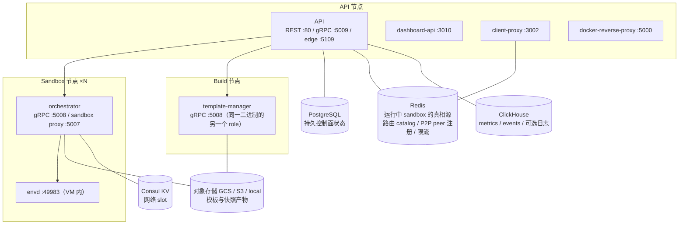
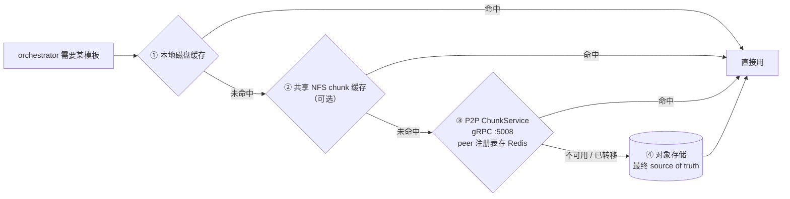

# e2b 模板系统调研

调研对象是 **e2b 这个产品自己的实现**。为避免混淆，先说明一件事：CubeSandbox 的 `CubeAPI/src/routes.rs` 里有 `build_e2b_router` / `build_e2b_snapshot_long_router`，那是我们自己实现的**兼容 e2b 协议的 API 层**，跟本文讨论的 e2b 内部实现是两回事，不要互相引用。

## 资料来源

| 标记 | 来源 | 链接 |
|---|---|---|
| **[产品]** | e2b 官方产品文档 | <https://e2b.dev/docs> |
| | 模板快速上手 | <https://e2b.dev/docs/template> |
| | 构建缓存 | <https://e2b.dev/docs/template/caching> |
| | 基础镜像 | <https://e2b.dev/docs/template/base-image> |
| | 套餐限制 | <https://e2b.dev/docs/billing#plans> |
| | 文档全量索引 | <https://e2b.dev/llms.txt> |
| **[架构]** | 基础设施仓库自维护的架构文档（仓库规定代码变更影响该文档时须同 PR 更新，可信度最高） | <https://github.com/e2b-dev/infra/blob/main/docs/ARCHITECTURE.md> |
| | 基础设施仓库 | <https://github.com/e2b-dev/infra> |
| **[Wiki]** | DeepWiki 自动索引（最后索引 commit `cf8f15bd`，2026-07-06），准确度次于前两者 | <https://deepwiki.com/e2b-dev/infra> |
| | 模板系统 | <https://deepwiki.com/e2b-dev/infra/4-template-system> |
| | 模板创建与构建 | <https://deepwiki.com/e2b-dev/infra/4.1-template-creation-and-building> |
| | 模板存储与缓存 | <https://deepwiki.com/e2b-dev/infra/4.2-template-storage-and-caching> |
| **[未查]** | 文档提及但本次未取回的页面 | <https://e2b.dev/docs/template/how-it-works> |

正文里每个结论都会标来源。标 **[未证实]** 的表示上述资料都没覆盖，需要读源码才能确认——不做假设性补全。

CubeSandbox 侧的对比数据都已核对代码，标了文件和行号。

## 目录

1. [模板是什么](#1-模板是什么)
2. [构建：分层与层缓存](#2-构建分层与层缓存)
3. [模板与快照：产物同构，但产品上推荐用模板](#3-模板与快照产物同构但产品上推荐用模板)
4. [组件架构](#4-组件架构)
5. [多节点同步：拉取模型 + 四层缓存](#5-多节点同步拉取模型--四层缓存)
6. [运行时懒加载：缺页取内存 + NBD 挂 rootfs](#6-运行时懒加载缺页取内存--nbd-挂-rootfs)
7. [增量存储](#7-增量存储)
8. [并发控制](#8-并发控制)
9. [缓存一致性与异常处理](#9-缓存一致性与异常处理)
10. [降级与容错](#10-降级与容错)
11. [多架构](#11-多架构)
12. [回收与生命周期](#12-回收与生命周期)
13. [命名与版本](#13-命名与版本)
14. [与 CubeSandbox 对比](#14-与-cubesandbox-对比)
15. [哪些值得借鉴](#15-哪些值得借鉴)

---

## 1. 模板是什么

来源：[产品] <https://e2b.dev/docs/template>、[架构] <https://github.com/e2b-dev/infra/blob/main/docs/ARCHITECTURE.md>

产品层面，模板是一份**声明式的沙箱定义**，用链式 SDK 写（要求 SDK ≥ 2.3.0）：

```ts
export const template = Template()
  .fromBaseImage()
  .setEnvs({ HELLO: 'Hello, World!' })
  .copy('./customers/acme', '/app/config')
  .setStartCmd('echo $HELLO', waitForTimeout(5_000))
```

底层实现上，模板是**预启动的 Firecracker VM 快照**（内存 + 磁盘 + VM 状态），存在对象存储里。沙箱 = 恢复这个快照。

有个产品设计值得注意：**`setStartCmd` 是在构建阶段就执行的，并且被写进快照**。所以从这个模板创建沙箱时，进程已经在跑了，用户拿到手就是完全配置好的环境，零等待。[架构] 文档里对应的说法是"全新创建本质上是对模板 base snapshot 的 resume，冷启动只发生在 filesystem-only 模板和构建过程中"。

构建通过 `Template.build()` 触发，资源规格是构建参数：

```ts
await Template.build(template, 'template-tag-dev', {
  cpuCount: 1,
  memoryMB: 1024,
  onBuildLogs: defaultBuildLogger(),
})
```

构建环境本身就是一个完整的沙箱——运行中沙箱里能做的事构建期都能做，**包括在构建过程中跑 Docker 容器**。

构建限制（[产品] <https://e2b.dev/docs/billing#plans>）：单次构建最长 1 小时超时终止；Hobby 档最大 8 vCPU / 8 GB 内存 / 10 GB 磁盘 / 20 个并发构建。

---

## 2. 构建：分层与层缓存

### 2.1 阶段划分

来源：[架构] <https://github.com/e2b-dev/infra/blob/main/docs/ARCHITECTURE.md>

代码在 `pkg/template/build/phases/`，顺序是：

```
base → user → 每个 recipe step 一层 → resize disk → finalize → optimize
```

几个细节：

- `resize disk` 在**宿主机**上对静止的 rootfs 扩容，不在 VM 里做
- 除了缓存命中的阶段和 resize，其余阶段都在**真实 Firecracker VM 内执行**，该阶段的 pause-diff 就是这一层的产物
- `optimize` 阶段会记录"一次新鲜 resume 会触碰哪些内存页"，产出 **prefetch hints**，用来加速将来的启动

构建状态回写路径是 API 轮询 `TemplateBuildStatus`，写 Postgres 的 `env_builds` 表标记 ready。

### 2.2 层缓存的规则

来源：[产品] <https://e2b.dev/docs/template/caching>

官方说法是"概念上类似 Docker 的层缓存"。每个 layer 命令（`.copy()`、`.runCmd()`、`.setEnvs()` 等）在已有层上叠一层，**按命令本身加它的输入做缓存键**（拷了哪些文件、执行了什么命令、设了什么环境变量）。命令没变、输入也没变，就直接复用缓存层。

有个跟 Docker 不一样的点：**缓存作用域是 project 级的**，所以同一个 project 下的多个模板只要层内容相同就能共享缓存。

失效有两种粒度：

```ts
// 部分失效：从下一条指令开始强制重建
Template().fromBaseImage().skipCache().runCmd("echo 'Hello, World!'")

// 整模板失效
Template.build(template, 'my-template', { skipCache: true })
```

### 2.3 文件缓存单独一层

来源：[产品] <https://e2b.dev/docs/template/caching>

`.copy()` 的文件**按内容单独缓存**，这块 e2b 明确说了跟 Docker 的区别：因为构建是在 e2b 自己的基础设施上跑的，所以文件级缓存做得更细——**即使 `.copy()` 之前的层被失效了（比如改了环境变量），文件本身仍然从 files cache 复用，不需要从用户机器重新上传**。`copy()` 命令会重新执行，但文件不用重传。

要连文件缓存一起失效得用 `forceUpload`：

```ts
Template().fromBaseImage().copy('config.json', '/app/config.json', { forceUpload: true })
```

### 2.4 官方给的两个用法

来源：[产品] <https://e2b.dev/docs/template/caching>、<https://e2b.dev/docs/template>

**多变体复用公共层**：想做不同 CPU/内存规格的同一环境，模板定义完全不改，只改构建时的模板名（`my-template-2cpu-2gb`、`my-template-1cpu-4gb`），构建过程会复用缓存层。

**从已有模板出发**：`fromTemplate('my-base-template')` 让一批相似模板（比如每客户一个）共享同一个基础环境的缓存层，不用每次从零建。

**优化建议**：频繁变动的命令（比如拷源码）放在模板定义靠后的位置，这样前面的层能更多地被复用。

> 这套分层缓存是 e2b 在"模板迭代开发"体验上明显领先的地方。CubeSandbox 现在是按 `template_spec_fingerprint`（对模板 spec 算的 sha256）整份复用，spec 里任何一个字段变了就整份重建，没有中间层复用。但代价是要维护一整套分层存储格式（第 7 节），不建议照搬。

---

## 3. 模板与快照：产物同构，但产品上推荐用模板

来源：[架构] <https://github.com/e2b-dev/infra/blob/main/docs/ARCHITECTURE.md>、[产品] <https://e2b.dev/docs/template>

产物以 `buildID` 为 key：

```
{buildID}/memfile         # 内存快照（diff）
{buildID}/rootfs.ext4     # 文件系统快照（diff）
{buildID}/snapfile        # Firecracker microVM 状态
{buildID}/metadata.json   # 模板配置（CPU/内存/特性开关）
{buildID}/*.header        # diff 链索引
```

关键的一点：**模板和"暂停沙箱的快照"产物形状完全相同**。快照只是一个新的 build，它的 memfile 和 rootfs 以相对来源模板的 diff 存储，diff 链靠 `.header` 解析。

但产品文档里 e2b 明确建议**优先用模板而不是快照**，给的三个理由是：启动更快、占用资源更少；在捕获长时运行进程之前会重启 guest OS；预取效率显著更高。对"按客户 / 按项目拉起环境"这类场景，官方推荐走模板。

模板数量目前没有上限，文档提示未来可能按模板总存储量计费。

> 这条对 CubeSandbox 有参考价值。e2b 在存储上把模板和快照彻底统一成一种对象（都是 build），所以不存在"模板中心 vs 快照归属"的边界问题；产品层面则通过引导用户用模板来降低快照的使用比例。
>
> CubeSandbox 目前是数据模型统一（同一张 `t_cube_template_definition` 用 `kind` 分行）但代码路径分叉——实测快照专属 3107 行、模板专属 2086 行、两边共用 4319 行。所以"只迁模板"的切分成本主要落在那 4319 行共用代码上，不是简单搬包。长期方向上，e2b 的统一模型提示我们应该往收敛走，而不是把模板/快照的二分固化下来。

---

## 4. 组件架构

来源：[架构] <https://github.com/e2b-dev/infra/blob/main/docs/ARCHITECTURE.md>

核心分工是：**控制面决定"在哪跑"，数据面决定"怎么跑"。**

> 这张图的 draw.io 版本在 [`assets/e2b-component-architecture.drawio`](./assets/e2b-component-architecture.drawio)，可直接在 <https://app.diagrams.net> 打开编辑。



几个值得注意的点：

`template-manager` 不是独立二进制，是 **orchestrator 同一个二进制的一个 role**（都监听 5008）。这对 CubeSandbox 有参考意义：**"独立组件"不必等于"独立代码库"**，可以是同一份代码以不同角色启动。

**Redis 是运行中 sandbox 的 source of truth**，不是 Postgres；Postgres 只存持久的控制面状态。

节点发现支持 Nomad / Kubernetes / 静态列表三种来源。网络 slot（netns + veth + tap + 唯一宿主 IP + NAT + per-slot nftables 出口防火墙）是池化复用的，分配走 Consul KV，可以跨重启存活。

orchestrator 代码"几乎全部仅限 Linux"，以 Nomad system job + `raw_exec` 用 root 跑（需要 Firecracker、namespace、NBD、cgroup 权限）。

---

## 5. 多节点同步：拉取模型 + 四层缓存

来源：[架构] <https://github.com/e2b-dev/infra/blob/main/docs/ARCHITECTURE.md>

这一节容易被误读，先把结论摆清楚：**e2b 节点之间不存在模板的主动推送或复制同步机制。** 主模型是按需拉取（lazy pull），P2P 只是四层缓存里的第三层，不是主机制。

### 5.1 按需拉取

架构文档在创建流程里把这一步直接写成：

```
O->>O: fetch template (local cache / NFS / object storage)
```

分工是：控制面（API）只决定沙箱在哪个节点跑、并记下它在跑（Postgres / Redis）；数据面（每节点一个 orchestrator）决定怎么跑，**并且自己负责把模板拉下来**。

### 5.2 四层缓存

模板缓存代码在 `packages/orchestrator/pkg/sandbox/template/`：



| 层 | 说明 |
|---|---|
| ① 本地磁盘缓存 | 每个沙箱节点本地。Nomad client 节点配了 hugepages 加本地模板缓存 |
| ② 共享 NFS chunk 缓存 | 可选，跨节点共享的分块缓存 |
| ③ P2P 节点间拉取 | 通过 ChunkService（gRPC 5008）从其他已持有该模板的节点直接取 chunk，**peer 注册表放在 Redis**。主要用在**上传还没完成**的窗口 |
| ④ 远端对象存储 | GCS / S3 / local，最终 source of truth |

### 5.3 P2P 的真实定位

来源：[Wiki] <https://deepwiki.com/e2b-dev/infra/4.2-template-storage-and-caching>

P2P 的价值窗口很窄：**新构建的产物还没传完到云端**的这段时间。机制上，`peerSeekable` 实现 `storage.Seekable` 接口，优先走 P2P，失败或不可用就回退云存储；每个 chunk 消息带对端可用性标志，客户端据此决定继续 P2P 还是切云；源节点完成云端上传后会主动发 `PeerTransitionedError` 通知请求方"切到权威云存储模式"，避免继续依赖源节点的临时数据。

### 5.4 恢复优先原节点

来源：[架构] <https://github.com/e2b-dev/infra/blob/main/docs/ARCHITECTURE.md>

resume 优先在原节点（origin node）做。如果快照还在原节点本地缓存里，resume **完全不读对象存储**。否则回落 NFS / P2P / 对象存储，并按 `.header` 解析 diff 链。

### 5.5 跟 CubeSandbox 的模型差异

| | e2b | CubeSandbox |
|---|---|---|
| 同步方向 | **拉**：节点按需取 | **推**：构建完成后中心主动推 |
| 触发时机 | 首次需要该模板时 | 构建完成时立即推 |
| 目标节点 | 没有"目标集合"概念，谁用谁拉 | `resolveTemplateNodes(instanceType, scope)`，scope 为空则推给全部健康节点（`store.go:453`） |
| 兜底 | 云存储是唯一权威源 | Cubelet 的 `EnsurePmemFile` → `tryDownloadPmemFile` 按需下载 |
| 失败修复 | 下次需要时重新拉 | `RedoTemplateFromImage`（`FailedOnly` + `DistributionScope` 求交集），无后台自动收敛 |

因为 CubeSandbox 是推模型，**根本不存在"产物已建好但还没上传完"这个窗口**，所以 P2P 在我们的架构下不是"暂时不做"，而是不适用。

---

## 6. 运行时懒加载：缺页取内存 + NBD 挂 rootfs

来源：[架构] <https://github.com/e2b-dev/infra/blob/main/docs/ARCHITECTURE.md>、[Wiki] <https://deepwiki.com/e2b-dev/infra/4.2-template-storage-and-caching>

即使模板已经拉到本地，**也不会整份读进来**。这是 e2b 冷启动快的真正原因，也是 CubeSandbox 完全没有的机制。

| 资源 | 机制 |
|---|---|
| 内存 | `uffd/`：Firecracker 恢复 VM 时不加载内存，userfaultfd handler 在 page fault 时**直接从模板 memfile 服务缺页**，只读被触碰到的页。可选的 prefetcher 会预热已知热页，热页清单来自构建的 `optimize` 阶段 |
| rootfs | `rootfs/`、`nbd/`、`block/`：模板 rootfs 保持只读，写入进 per-sandbox 的 COW cache，通过**进程内的用户态 NBD server** 暴露给 Firecracker |

chunk 粒度默认 `MemoryChunkSize = 4MB`。`cachedSeekable.OpenRangeReader` 先开本地 chunk 文件，没命中就从远端拉对应 range，拉到的数据通过 detached goroutine 异步写回本地缓存，不阻塞读取。

> CubeSandbox 走 pmem + 完整 ext4 文件，`EnsurePmemFile` 要求文件**完整存在**才能启动，所以必须等整份 rootfs 落盘。这是"新节点首次创建沙箱慢"的根因，靠调度优化绕不过去。这属于架构级差异，要改就得重写 Cubelet 的存储路径，不在可借鉴范围。

---

## 7. 增量存储

来源：[Wiki] <https://deepwiki.com/e2b-dev/infra/4.2-template-storage-and-caching>

只存变化的数据块，用"层"组织，每层是相对基础模板的一次增量变更。

| 结构 | 作用 |
|---|---|
| `header.Metadata` | 版本号、块大小（如 4KiB）、总大小、build 血缘关系 |
| `header.BuildMap` | 核心映射：逻辑块 `Offset+Length` → `BuildID` + 该 build 存储文件内的 `BuildStorageOffset` |
| `header.Header` | 运行时顶层对象，含 `Builds` map（每个 build 的大小、校验和、`FrameData` 压缩查找表） |

脏块和空块用 `roaring.Bitmap` 追踪，**全零块不做物理存储**，读的时候直接零填充，对稀疏文件场景省不少空间。

两个映射维护操作：`MergeMappings` 把新 diff 叠到 base mapping 上，重叠区按左右片段拆开、中间嵌入新数据；`NormalizeMappings` 合并相邻且属于同一个 `BuildId`、存储偏移连续的条目，防止 header 因为频繁小块 diff 无限膨胀。

跟多节点分发的协同是这样：

```
Build A（rootfs 全量层）
   └─ Diff Layer B（相对 A 的脏块）
        └─ Diff Layer C（相对 B 的脏块）

节点2 需要这个模板，本地已有 A、B → 只拉缺的 C
```

`ReadAt` 通过 header 解析请求的数据属于哪个 build 层，**只拉那一层**。这才是 diff 存储加 P2P 组合起来真正降低分发数据量的关键——单独看 P2P 意义不大。

header 格式演进过：V4 是二进制布局 `[Metadata][flags][uncompressedSize][LZ4 压缩的 Builds+映射]`，带分帧和可选 Zstd 压缩（走 LaunchDarkly feature flag 动态解析）；V5 改成列式加 varint 编码，对"页粒度内存去重"产生的碎片化映射压缩率更好。两个版本都为每个 build 存一张 FrameTable，支持对压缩对象做随机访问读取，不用解压整个对象。

---

## 8. 并发控制

来源：[Wiki] <https://deepwiki.com/e2b-dev/infra/4.1-template-creation-and-building>

**e2b 没用传统分布式锁**（Redis / etcd / ZooKeeper），走的是数据库事务加应用层配额，三层：

1. 团队级并发配额：`RegisterBuild` 校验 `BuildConcurrency` 限额，这是应用层配额不是锁
2. 数据库事务原子性：同一个事务里"创建/更新 template 记录 + 把被取代的旧构建标记为 failed"，靠 Postgres 的事务隔离性避免并发写冲突
3. 状态轮询而不是事件驱动：`BuildsStatusPeriodicalSync` 周期轮询，`PollBuildStatus.poll` 用 ticker 一直查到终态

本质是基于数据库的乐观并发控制。

**[未证实]**：build 节点分配环节有没有额外机制避免"同一个 build 被多个节点同时执行"。[架构] 文档只说了 placement 是 best-of-K 采样打分，没提 build 任务本身的去重。

> CubeSandbox 这边有两组进程内锁：`artifactBuildLocks`（`sync.Map[artifactID]*sync.Mutex`，`artifact_build.go:51`）和 `templateRequestLockGroup`（`sync.Map[templateID]*sync.RWMutex`，`cache.go:40-90`）。DB 层还有 `claimRootfsArtifactForBuild` 用 `FOR UPDATE` 做短事务声明，但不覆盖 `image.BuildExt4` 的文件构建窗口。
>
> 另外 CubeSandbox 已经有一个通用的命名会话锁原语 `trySessionLock(sess, name)`（`artifact_gc.go:42`，MySQL 用 `GET_LOCK(name,0)`、PG 用 `pg_try_advisory_lock(hashtext(name))`），配套 `discardPinnedSession` 防脏连接回池。将来要给构建加跨实例互斥可以直接复用，不用引入新组件——这跟 e2b"优先用数据库原生能力而不是额外锁服务"的思路是一致的。

---

## 9. 缓存一致性与异常处理

### 9.1 正常失效路径

来源：[Wiki] <https://deepwiki.com/e2b-dev/infra/4.2-template-storage-and-caching>

靠明确的失效触发点，而不是纯 TTL 轮询：

| 触发事件 | 动作 |
|---|---|
| 构建完成 | `TemplateManager` 调 `InvalidateAllTags`，全局失效该 template ID 在 Redis 缓存里的所有 tag |
| 模板删除 | `DeleteTemplatesTemplateID` 同时失效关联的所有 tag 和 alias |
| 沙箱销毁 | `sandbox_kill` 触发对应快照的缓存失效 |
| 周期兜底 | API 端的 `TemplateCache` **每 1 分钟**主动刷新，覆盖漏掉主动失效的场景 |

监控用 OpenTelemetry，指标包括 `template.build.duration`、`template.build.phase.duration`、`template.build.cache.result`、压缩前后字节数和压缩比。

### 9.2 不一致窗口怎么处理

来源：[架构] <https://github.com/e2b-dev/infra/blob/main/docs/ARCHITECTURE.md>

四层缓存加 diff 链会带来若干不一致窗口，架构文档给了处理方式：

| 场景 | 处理 |
|---|---|
| 产物已建好但云端上传没完成，别的节点要用 | 走 P2P 从持有节点拉 chunk；源节点上传完后发 `PeerTransitionedError` 通知切云。**用显式的状态转移信号代替"等一致"** |
| 开了 `deferred-rootfs-export` 时本地 rootfs diff 还没 seal | 明确规定异步上传，且**任何要读 rootfs diff 的原节点 resume / prefetch 都要等 seal 完成**。不是"读到旧数据"，而是**阻塞到一致** |
| seal 失败 | **seal 失败是永久性的，不会重跑**，所以上传是**快速失败而不是重试**。用快速失败避免在系统里留下永远不一致的产物 |
| 预取污染缓存 | `WithSkipCacheWriteback`：prefetcher 只加载到内存，**不写共享 NFS 缓存**，防止预取的冷数据挤掉热数据 |
| 老模板碰上新行为 | `packages/envd/pkg/version.go` 每次行为变更必须 bump；API 和 orchestrator 按**每个 template build 记录的 envd 版本**做特性门控，**老模板自动走旧行为**，而不是报错或者行为漂移 |
| 日志存储迁移期读写不一致 | 写路径用 flag 路由，**legacy collector 仍然是 fallback 主目标**，可配置 shadow destinations 在迁移期镜像写入但不改变沙箱行为；读路径默认 Loki，`logs-read-config` 开关可切 ClickHouse（前提是 `sandbox_logs` 已填充） |

从这些能提炼出三条原则：

1. **显式状态转移信号优于等待收敛**。`PeerTransitionedError` 让请求方明确知道该换源了，不靠超时和重试去猜。
2. **宁可阻塞到一致，不可读到半成品**。deferred seal 的场景选择让 resume 等 seal，而不是读一个还没物化的 rootfs。
3. **不可恢复的错误要快速失败**。seal 失败不重试，避免留下永久不一致的产物。

### 9.3 CubeSandbox 对照

| 维度 | CubeSandbox 现状 | 位置 |
|---|---|---|
| 缓存层数 | 1 层（进程内 go-cache），没有 NFS / P2P 层 | `cache.go:20-54` |
| TTL | 三份缓存都是 **360 分钟** | `cache.go:21-22` |
| 缓存对象 | `templateDefinitionCache` / `templateLocalityReadyCache` / `templateKindCache` | `cache.go:45-51` |
| 防击穿 | 自己实现的 singleflight `templateFetchGroup` | `cache.go:92-110` |
| 失效 | 写路径主动 `invalidateTemplateCaches`（删三份 + `localcache.InvalidateImageState`）；另有 `evictReplicaFromLocalityCache` 按节点细粒度摘除 | `cache.go:171-201` |
| 周期兜底 | **没有**，只有启动时 `warmReadyTemplateLocality` | `store.go:270` |
| 不一致窗口处理 | **没有显式机制**，分发中途失败就停在 Failed 等外部 redo | `distribution.go` |

单层缓存加主动失效，在单副本下一致性是够的（没有跨进程窗口）。缺的是周期兜底——某条写路径漏了调失效，缓存会脏到 TTL 到期（最长 6 小时）。以及第 3 条原则那个"永久失败"的语义，目前分发失败会静默停留，没法区分可重试和不可恢复。

---

## 10. 降级与容错

来源：[架构] <https://github.com/e2b-dev/infra/blob/main/docs/ARCHITECTURE.md>

这是官方文档里罕见地系统列出的部分，信息密度最高。

### 10.1 八条策略

**`deferred-rootfs-export` 开关**（`packages/shared/pkg/featureflags`）——pause 关键路径上不做 rootfs diff，直接弹出可写的 COW cache 就返回，后台再 seal（reflink）成 rootfs diff。好处是把 rootfs-diff 从 pause 路径上移走了；代价是 seal 完成前本地快照的 rootfs body 没有物化，所以要异步上传，且原节点的 resume / prefetch 要等 seal。seal 失败是永久的，因此上传快速失败不重试。

**`envd-upgrade-target`**（resume 时热升级 envd）——尽力而为：`exec` 之前投递失败就让旧 envd 继续服务；`exec` 之后如果出现不可恢复的失败（新 envd 永远不会初始化了），**宁可让 resume 失败**，也不返回一个永久不可用的沙箱。交接做得很细：`syscall.Exec` 保持同一个 PID，通过 tmpfs handover blob 传递 stdio/PTY 的 fd、进程表、近期保留的退出码、文件系统 watcher；工作负载的 cgroup 保持 frozen 直到升级后的 `/init` 恢复 access token（避免重新接管的进程在没有认证的情况下运行）；交接结果通过 `/init` 的 `X-Envd-Handover` 头回传。

**放置回退**——best-of-K：采样 K 个 ready 节点，按 CPU commitment / usage 打分取最低；节点耗尽就重试；参数可以由 LaunchDarkly feature flag 实时调整。

**流量层自动唤醒**——client-proxy 在 Redis catalog 里查不到（说明已 pause），就调 API 的 `ResumeSandbox` gRPC 并重试，被 pause 的沙箱对流量是透明唤醒的。

**创建路径的强一致就绪**——orchestrator 对 envd 的 `/init` 持续重试直到 ready；API 阻塞在 gRPC `Create` 上，`Create` 阻塞在 `/init` 上，所以客户端拿到 201 的时候沙箱已经完全可用了。

**日志迁移期双写**——flag 路由 + legacy 作为 fallback 主目标 + shadow destinations 镜像写入但不改变行为。

**网络 slot 持久化**——slot 池化复用，分配走 Consul KV，可以跨重启存活。

**版本门控**——envd 版本每次行为变更必须 bump，按 build 记录的版本做特性门控，老模板自动走旧行为。

### 10.2 失败处理速查

| 场景 | 处理 |
|---|---|
| 快照上传失败 | 异步上传 + retry budget；如果是 deferred seal 失败则永久失败、快速失败不重试 |
| 节点容量耗尽 | placement 重试其他节点 |
| envd 未就绪 | `/init` 重试直到成功 |
| envd 热升级失败 | exec 前回退旧 envd；exec 后不可恢复则让 resume 失败 |
| 模板还没上传完 | 从持有该模板的对等节点 P2P 拉 chunk |
| 沙箱已 pause 但收到流量 | client-proxy → API `ResumeSandbox` → 重试转发 |
| 项目删除 | `DELETE /v1/management/projects/{teamID}` 明确返回 **501**。原因是 `envs`/`snapshots`/`volumes` 以 `ON DELETE NO ACTION` 引用 `teams`，而**模板只做软删**，所以建过模板的项目会 pin 住 team 行；而且释放资源需要 API service 的 orchestrator 连接，dashboard-api 没有。结论是**控制面目前不删除项目** |

### 10.3 CubeSandbox 能直接借的两条

**"不可恢复失败要快速失败，不留半成品"** —— 直接适用于分发失败处理。现在部分节点 Failed 之后停留等人工 redo，语义模糊。应该区分可重试失败和永久失败，后者立即置终态并告警。

**"按产物记录的组件版本做特性门控"** —— 这条 CubeSandbox 已经有，而且**比 e2b 公开描述的更完整**：`t_cube_template_replica` 记录了 `GuestImageVersion` / `AgentVersion` / `KernelVersion` 加上 `CompatStatus` / `CompatPolicy` / `CompatCheckedUnix`（`models/template.go:41-61`），配 `compat.go` 做兼容矩阵。不用借鉴，但迁移时要确保这套逻辑完整平移。

---

## 11. 多架构

来源：[架构] <https://github.com/e2b-dev/infra/blob/main/docs/ARCHITECTURE.md>

架构文档**完全没有提 CPU 架构**（x86_64 / arm64 / aarch64），也没有多架构镜像或多架构模板构建的内容。文档里跟"多平台"相关的只有云厂商层面：Terraform 部署目标是 GCP（`iac/provider-gcp/`）和 AWS beta（`iac/provider-aws/`）；对象存储抽象支持 GCS / S3 / local；节点发现支持 Nomad / Kubernetes / 静态列表。

**[未证实]**：e2b 是否支持多架构。要确认得去看仓库里的构建脚本、Makefile、Firecracker 版本配置，架构文档不足以支撑结论。合理推测其生产环境是单一架构，但本文不作为结论。

CubeSandbox 侧的多架构现状（三处证据、含一个待实测的风险点）写在 [`templatecenter-proposal.md`](./templatecenter-proposal.md) §8.3，要改的话涉及哪三处写在 [`templatecenter-design.md`](./templatecenter-design.md) §9.4，这里不重复。简单说两边都是隐式同构假设，没有可借鉴的现成做法；但 CubeSandbox 的组件多版本方案目录布局已经带了 `<arch>` 层级，产品方向上是要支持的。

---

## 12. 回收与生命周期

来源：[架构] <https://github.com/e2b-dev/infra/blob/main/docs/ARCHITECTURE.md>、[Wiki] <https://deepwiki.com/e2b-dev/infra/4.2-template-storage-and-caching>

架构文档透露的部分指向 e2b 这块其实比较弱：

- **模板只做软删（soft delete）**
- `envs` / `snapshots` / `volumes` 以 `ON DELETE NO ACTION` 引用 `teams`，所以建过模板的 team 行会被 pin 住
- `DELETE /v1/management/projects/{teamID}` 明确返回 501，**控制面目前不删除项目**
- 释放资源需要 API service 的 orchestrator 连接，dashboard-api 没有

**[未证实]** 的部分：缓存容量上限与淘汰算法（LRU/LFU）、定时清理任务、磁盘空间监控触发的清理、产物 TTL 字段、build 引用计数、**旧 build 数据什么时候被物理删除**。

可以间接推断的是：`BuildMap` 通过 `BuildId` 做块级去重，天然支持跨版本共享未变更的块——但这也意味着删除旧 build 需要判断它是否仍被新 build 的 mapping 引用，而这套引用判定文档没有描述。

> CubeSandbox 在这个维度明确领先，已核实的实现细节：
>
> - GC worker 间隔 10 分钟、单轮最多 100 个候选、5 个 worker 并发（`artifact_gc.go:23-31`）
> - 跨实例单例靠通用会话锁 `trySessionLock` / `releaseSessionLock`，锁名 `cubemaster_templatecenter_artifact_gc_v1`
> - 锁范围收得很准，注释明确说只覆盖候选选择、**不覆盖慢速的跨节点清理 RPC**，避免一个节点卡住把整个 GC 锁死
> - 锁状态未知时用 `discardPinnedSession` 丢弃物理连接，让数据库释放会话锁，不让脏连接回池
> - 三阶段 last-owner-cleanup `cleanupArtifactFully`；候选来自终态 status 或 `gc_deadline` 过期
>
> 这套不需要向 e2b 对齐，迁移时原样平移即可。

---

## 13. 命名与版本

来源：[产品] <https://e2b.dev/docs/template>、[Wiki] <https://deepwiki.com/e2b-dev/infra/4-template-system>

底层的命名体系是四层：

| 概念 | 说明 |
|---|---|
| Template ID | `id.Generate()` 生成的不可变唯一标识 |
| Alias | 人类可读名称，比如 `my-node-app` |
| Namespace | 通常是 `team_slug`，防跨团队命名冲突 |
| Tag | 版本标签，默认 `latest` / `default` |

完整引用格式 `[namespace/]alias[:tag]`，由 `id.ParseName` 解析。alias 解析有三级回退：先显式命名空间（`team/alias`），再回退到调用方团队自己的命名空间，最后尝试 `NULL` 命名空间（用于"提升"成公共模板的场景）。`AliasCache` 用 Redis 的 `notFoundTombstone` 做**负缓存**，防止对不存在的 alias 反复打数据库。

但产品文档层面给出的做法要朴素得多：**没有独立的版本号系统**。构建时第二个参数就是模板名/tag，环境隔离靠命名约定——官方示例直接拆成 `build.dev.ts` 和 `build.prod.ts` 两个脚本，分别构建 `template-tag-dev` 和 `template-tag`。文档原话是"模板名就是创建沙箱时的标识符"。更底层的机制指向 [未查] <https://e2b.dev/docs/template/how-it-works>。

> CubeSandbox 侧：alias 已经实现（[Issue #584](https://github.com/TencentCloud/CubeSandbox/issues/584)），值存在 `display_name` 列，唯一性靠 STORED 生成列 `alias_key` 加唯一索引，且生成列表达式把作用域限定在 `kind='template'`，所以快照的 `display_name` 不参与竞争。`claimTemplateAlias` 是"先从旧 owner 释放再认领"的单事务操作，alias 可以跨 rebuild 转移。
>
> 缺的是 **namespace 和 tag 两层**，不是 alias 本身。如果将来要补，e2b 的负缓存 tombstone 可以直接借鉴，防止查不存在的 alias 击穿数据库。

---

## 14. 与 CubeSandbox 对比

| 维度 | e2b | CubeSandbox |
|---|---|---|
| 多节点同步 | **拉取** + 四层缓存（本地 / NFS / P2P / 对象存储），无主动推送 | **推送**：构建完成后推给全部健康节点，Cubelet 按需下载兜底 |
| 运行时加载 | uffd 缺页取内存 + NBD 挂只读 rootfs + COW，只读被触碰的页 | 需要完整 ext4 落盘才能启动（pmem） |
| 构建复用 | 每个 step 一层、层按命令+输入哈希缓存，只重跑变化的 step；文件按内容单独缓存 | 按 `template_spec_fingerprint`（spec 的 sha256）整份复用，spec 任一字段变化即整份重建 |
| 构建互斥 | DB 事务 + 团队并发配额，无分布式锁 | 两组进程内锁 + DB 短事务声明；另有可复用的通用会话锁原语 |
| 元数据缓存 | Redis，1 分钟周期刷新，alias 带负缓存 | 单层进程内 go-cache，TTL 360 分钟，无周期兜底 |
| 缓存失效 | 事件驱动 `InvalidateAllTags` + 周期兜底 | 写路径主动失效 + 按节点细粒度摘除 |
| 不一致处理 | 显式状态转移 / 阻塞到一致 / 快速失败 | 无显式机制，分发失败停留待 redo |
| 降级策略 | 系统化 8 条，feature flag 驱动 | 有 compat 版本门控，无系统化降级开关 |
| 回收 | 仅软删，项目删除返回 501，物理回收未公开 | 三阶段 last-owner-cleanup + 会话锁选主 + `gc_deadline` TTL |
| 命名 | ID + Alias + Namespace + Tag 四层 + 三级回退 + 负缓存；产品层用命名约定做版本 | 已有 alias（生成列 + 唯一索引，可跨 rebuild 转移），缺 namespace 和 tag |
| 模板与快照 | 产物完全同构（快照就是一个新 build），产品上引导优先用模板 | 同表按 `kind` 分行，代码路径分叉（快照 3107 行 / 模板 2086 行 / 共用 4319 行） |
| 多架构 | 架构文档未涉及 | 隐式同构假设 |

---

## 15. 哪些值得借鉴

| 借鉴点 | 成本 | 判断 |
|---|---|---|
| 不可恢复失败快速失败（第 9.2 三条原则之三、第 10.1 seal 语义） | 低 | **建议做**。现状分发部分失败语义模糊，无法区分可重试和永久失败 |
| 缓存周期兜底刷新（第 9.1，e2b 是 1 分钟） | 低 | **建议做**。现状只有写路径主动失效，漏调就脏到 6 小时 TTL 到期 |
| 构建互斥用数据库原生能力而不是引入锁服务（第 8 节） | 低 | 相互印证。CubeSandbox 的 `trySessionLock` 原语已存在，将来要用直接复用 |
| 显式状态转移信号（`PeerTransitionedError` 思路） | 中 | 现在没有多源场景，等接了对象存储再看 |
| 预签名 URL 直连对象存储 | 中 | 对应"云存储是权威源"的思路。设计文档里 `ArtifactStore.Download` 的接口签名已经为此预留了返回值 |
| alias 负缓存 tombstone | 低 | 等补 namespace / tag 时一并做 |
| 分层构建缓存 + 文件内容级缓存（第 2 节） | 高 | 不做。要一整套分层存储格式支撑 |
| uffd / NBD 按需分页（第 6 节） | 高 | 不做。要重写 Cubelet 存储路径 |
| P2P chunk transfer（第 5.3 节） | 高 | 不做。价值窗口只有"上传未完成期间"，CubeSandbox 是推模型本来就没这个窗口 |
| 块级 diff 存储（第 7 节） | 高 | 不做。改造量堪比重写存储层 |
| 模板与快照收敛成同一种对象（第 3 节） | 高 | 不做，但作为长期方向记着，避免把现在的二分固化下来 |

三条最重要的认知：

**e2b 的核心不是 P2P，是"拉取模型 + 分层缓存 + 运行时按需分页"这一整套。** CubeSandbox 是推模型，两者在分发哲学上根本不同，不能把 P2P 单独摘出来借鉴——它只是拉取模型里的一个优化层，脱离 diff 存储和运行时懒加载就没什么意义。

**e2b 把模板和快照在存储上彻底统一成 build，产品上还主动引导用户优先用模板。** CubeSandbox 是数据模型统一但代码路径分叉，实测共用代码 4319 行。这既解释了"只迁模板"的切分成本从哪来，也提示长期方向应该是收敛而不是固化二分。

**CubeSandbox 在回收/生命周期和组件兼容性门控这两个维度明确领先 e2b 公开描述的水平，不该盲目对齐。** 真正该补的是自己的缺口：失败语义明确化、缓存周期兜底、多架构显式化。
