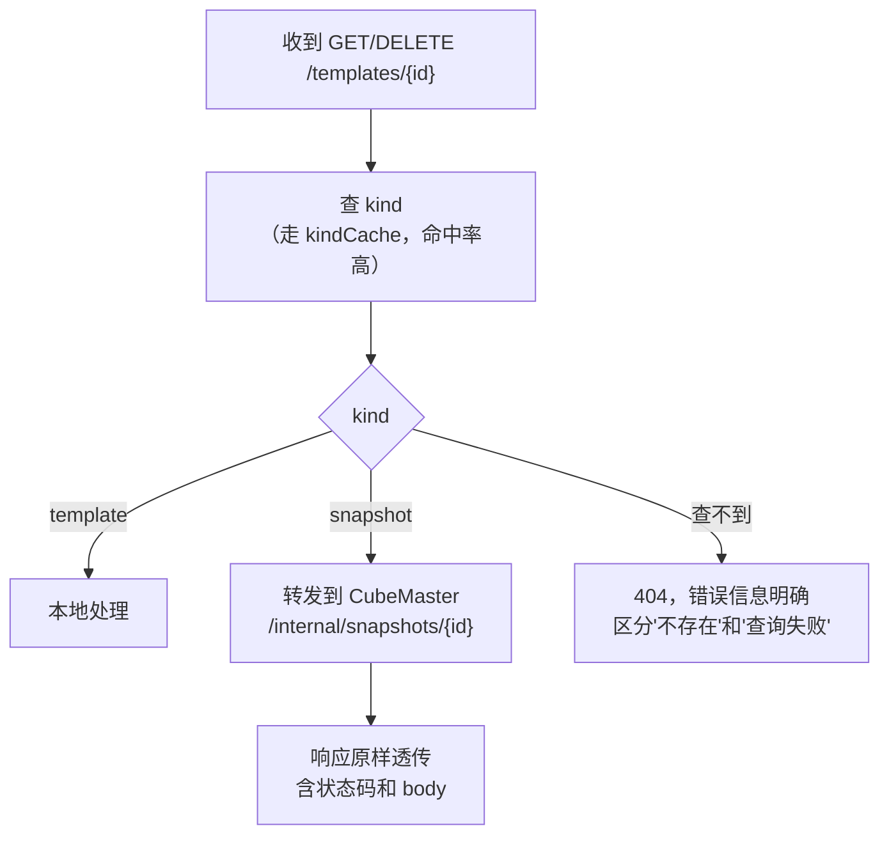
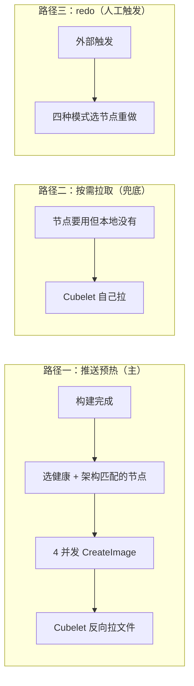

# 模板中心（Template Center）详细设计

| | |
|---|---|
| 状态 | 待评审 |
| 需求与影响面 | [`templatecenter-proposal.md`](./templatecenter-proposal.md) |
| 现状说明 | [`cubemaster-template-current-state.md`](./cubemaster-template-current-state.md) |
| 竞品调研 | [`e2b-template-architecture.md`](./e2b-template-architecture.md) |

这份文档回答**怎么实现**。为什么要做、影响谁、待决策项在提案文档里，这里不重复。

阅读顺序建议：先看提案的 §3 方案概要拿到全局，再回来看这份。

---

## 目录

1. [整体交互](#1-整体交互)
2. [服务形态与代码组织](#2-服务形态与代码组织)
3. [代码切分](#3-代码切分)
4. [HTTP 层设计](#4-http-层设计)
5. [产物存储抽象](#5-产物存储抽象)
6. [沙箱创建热路径](#6-沙箱创建热路径)
7. [删除模板与构建 reconcile](#7-删除模板与构建-reconcile)
8. [多节点同步与架构维度](#8-多节点同步与架构维度)
9. [多副本设计](#9-多副本设计)
10. [部署形态](#10-部署形态)
11. [后续扩展的改造点](#11-后续扩展的改造点)
12. [异常状态机与根因](#12-异常状态机与根因)

---

## 1. 整体交互

先用一组图把全局串起来，后面各节是细节展开。

### 1.1 组件全景

> 这张图的 draw.io 版本在 [`assets/templatecenter-design-component-overview.drawio`](./assets/templatecenter-design-component-overview.drawio)，可直接在 <https://app.diagrams.net> 打开编辑。

三条容易看错的地方：

**`TemplateCenter` 是独立服务，单独 deploy，不是 master 内部组件。** master 通过 gRPC + HTTP API 调 TC；TC 暴露 12 个模板端点。两进程边界清晰——各自的锁、各自的缓存、各自的进程。但 master 内部闭环（所有入口经 master），所以对外调用方感知不到这次转发。

**产物字节的传输方向是反的。** `template center → Cubelet` 是 gRPC 通知（"有个产物，地址/token/sha256/大小在这"），真正的文件传输是 **Cubelet 主动去拉**那条虚线。

**双方都有缓存。** Master 端有 `imageCache + nodeCache + templateCache`（TC 故障不影响读——proposal 第 1 条原则核心）；TC 端有自己的 `buildCache + templateCache + fingerprintCache`（加速重复构建）。两侧缓存各管各的。

**心跳只打 CubeMaster，TC 收不到。** TC 节点视图经 **master API 拉**（不是 DB 30s 重载）——这是 5 点原则架构下"TC 是独立服务"的自然推论。

**沙箱创建**走 CMS + imageCache，**不调 TC API**。这是 proposal 第 1 条原则"避免镜像中心故障后影响 CubeMaster 可用"的具体落地——imageCache 命中，TC 挂不挂都无关。

### 1.2 创建模板：从请求到节点可用

时序图见 [`assets/templatecenter-sequence-create-template.drawio`](./assets/templatecenter-sequence-create-template.drawio)
（在 <https://app.diagrams.net> 打开编辑）。

**关键步骤**：客户端 `POST /templates` → CubeAPI 转发 → master 路由分流 → **master 经 gRPC 调 TC API**（独立服务）→ TC 算 fingerprint、查 TC buildCache、claim job（经 master API 写 job 行）、mkfs、写 Redis 进度（经 master）、写 ext4 → master 进程内 imageCache 写 → master 经 cubeletclient gRPC 通知 Cubelet 拉取（字节反向） → Cubelet 写 pmem + register LocalTemplate → 心跳上报 → master 写终态。

**注意**：跨进程调用是 gRPC + HTTP API；DB 写入经 master 的 DB 模块（master API 暴露给 TC）；跨 TC 副本的锁用 DB 互斥锁（GET_LOCK / pg_try_advisory_lock）。

### 1.3 查询构建进度：任意 CubeMaster 副本都能应答

时序图见 [`assets/templatecenter-sequence-query-progress.drawio`](./assets/templatecenter-sequence-query-progress.drawio)
（在 <https://app.diagrams.net> 打开编辑）。

**关键步骤**：客户端 `GET /templates/{id}/builds/{bid}/status` → CubeAPI 转发到任意 **CubeMaster** 副本 → 查 job 行（终态）+ Redis（实时进度）→ 合并返回。

状态在 job 表、实时进度在 Redis，**所以不需要请求亲和性**（§9.4）。可选：调 TC API 拿 buildCache 内的实时细节，但默认走 master 自己的 Redis 够用。

### 1.4 用模板创建沙箱：完全不调 TC API

时序图见 [`assets/templatecenter-sequence-sandbox-create.drawio`](./assets/templatecenter-sequence-sandbox-create.drawio)
（在 <https://app.diagrams.net> 打开编辑）。

**关键步骤**：客户端 → CubeMaster（**完全不经 TC API**）→ 5 个读调用（别名解析 / 查 kind / 查 imageCache / 查副本行 / 用 nodemeta 现算版本兼容）→ 调度到就绪节点。

五个读调用全在 CubeMaster 进程内完成（§6），这是 proposal 第 1 条原则"避免镜像中心故障后影响 CubeMaster 可用"的具体落地——imageCache 命中模板，TC 即使挂掉也不影响沙箱创建。

### 1.5 删除模板：产物可能被共享


清理走三阶段，详见 [§7.1 删除模板的清理时序](#71-删除模板的清理时序)。

---

## 2. 服务形态与代码组织

### 2.1 目录结构

按 5 点原则，**TemplateCenter 是独立服务，单独 deploy**。`templatecenter/` 包还在 `CubeMaster/pkg/` 下（共享代码），但运行上是**独立进程**——`cmd/templatecenter/main.go` 起一个单独的进程。

```
CubeMaster/                              # master 进程 (无状态多副本)
├── pkg/
│   ├── templatebase/                   # 共享库 (master 和 TC 都 import)
│   │   ├── store/                      #   数据访问层 (Store 结构体)
│   │   ├── cache/                      #   进程内缓存基类
│   │   ├── distribution/               #   产物下发
│   │   ├── artifact/                   #   产物生命周期
│   │   └── artifactstore/              #   产物存储抽象
│   ├── templatecenter/                 # 镜像中心代码 (snapshot_ops 等保留)
│   ├── localcache/                     # master 本地缓存 (imageCache 等)
│   ├── nodemeta/                       # 心跳只打 master
│   └── tcclient/                       # master 端 TC 客户端 (gRPC + HTTP)
└── cmd/cubemastercli/                  # 模板子命令全部走 master

TemplateCenter/                         # 独立进程, 单独 deploy
├── cmd/templatecenter/                # main
├── pkg/
│   ├── config/                        # 配置
│   ├── httpservice/                   # TC 自己的 API 层 (12 个端点)
│   ├── template/                      # 模板业务 (拉 layer / 解压 / mkfs / 写产物 / 通知)
│   ├── image/                         # 平移: 拉镜像 + mkfs
│   ├── cubeletclient/                 # Cubelet gRPC 客户端
│   └── tccache/                       # TC 自身缓存 (buildCache / templateCache)
└── deploy/                            # chart + systemd unit
```

**关键点**：
- 共享库在 `CubeMaster/pkg/templatebase/`，master 和 TC 都 import
- TC 是独立 deploy，**跟 master 进程解耦**——可以独立扩缩容、独立升级
- 跨进程调用是 gRPC + HTTP API（`tcclient` ↔ `httpservice`）
- 双缓存：master 端 `localcache`（兜底）+ TC 端 `tccache`（加速）
- 跨 TC 副本的锁走 DB 互斥（GET_LOCK / pg_try_advisory_lock），进程内锁只解决单 TC 副本内的并发

### 2.2 启动顺序

**CubeMaster 启动**：

```
1. 加载配置
2. 初始化数据库连接，构造 Store (master 的 DB 模块, 注入 db + 三份 cache)
3. 初始化 Redis 连接 (拉取进度实时快照用, §9.4)
4. 初始化 ArtifactStore (本地实现: 确认 RootDir 存在可写; 对象存储实现: 探活 bucket)
5. 初始化进程内锁
6. 初始化 templatecenter 在 master 端的部分 (compat hooks + sandboxspec + warmReadyTemplateLocality)
7. 起后台任务 worker (BUILDING reconcile, 经 TC API 调)
8. 注册 HTTP routes (12 个模板端点 + 沙箱 + 快照)
9. 起 HTTP server, 健康检查置 ready
```

**TemplateCenter 启动**（独立进程，单独 deploy）：

```
1. 加载配置
2. 初始化数据库连接 (经 master API 写库, 5 点原则第 1 条)
3. 初始化 Redis 连接 (进度快照)
4. 初始化 ArtifactStore (与 master 共享)
5. 初始化进程内锁
6. 启动 templatecenter 业务:
   ├─ 拉 layer / 解压 / mkfs
   ├─ 写产物
   ├─ 通知 Cubelet 拉取 (gRPC)
7. 从 master API 拉节点视图 (经 GET /v1/nodes, 替代原 30s DB 重载)
8. 注册 HTTP + gRPC server, 健康检查置 ready
9. 起后台任务 worker (BUILDING reconcile, 进程内)
```

**关键差异**（vs 内部组件方案）：
- TC 独立进程启动，**跟 master 不在同一进程**
- 节点视图从 master API 拉（不是 DB 重载）
- TC 跨副本锁走 DB（进程内锁只解决单副本内并发）

### 2.3 共享代码怎么拆

`templatebase/` 共享库：

```261:277:CubeMaster/pkg/templatecenter/store.go
		store.db = db.Init(config.GetInstanceConfig())
		store.dbAddr = config.GetInstanceConfig().Addr
		if initErr = sandboxspec.Init(store.db); initErr != nil {
			return
		}
		configureSnapshotRuntimeRefHooks()
		configureSandboxSpecHooks()
		configureCompatHooks()
		if warmErr := warmReadyTemplateLocality(ctx); warmErr != nil {
```

迁移到 5 点原则架构：

| 项 | 归属 | 理由 |
|---|---|---|
| `sandboxspec.Init` + `configureSandboxSpecHooks` | **CubeMaster 启动** | 注册 `AfterCreateSandbox` 钩子，写沙箱 spec。包服务快照，跟模板无关 |
| `configureSnapshotRuntimeRefHooks` | **CubeMaster 启动** | 快照运行时引用计数 |
| `warmReadyTemplateLocality` | **CubeMaster 启动** | 启动时把所有 Ready 副本填进 `localcache` 的 imageCache，是**调度器的缓存**。master 重启后调度器需要这个 |
| `configureCompatHooks` | **共享库 templatebase/** | 模板兼容性判定——master 和 TC 都要用 |
| `Store` (data access) | **共享库 templatebase/store/** | DB 抽象——master 和 TC 都经此写库 |
| `ArtifactStore` | **共享库 templatebase/artifactstore/** | 产物存储抽象——master 和 TC 共享 |
| `image build / mkfs / 拉 layer` | **TemplateCenter** | 纯制作步骤，master 不做 |
| `ConfigureCompatibility` | **共享库** | 兼容判定算法 |
| `tccache` | **TemplateCenter** | TC 自身缓存 |
| `localcache` | **CubeMaster** | master 自身缓存 |

CubeMaster 侧需要新建一个 `initSnapshotAndSpec()` 之类的入口显式注册前三项，不再依赖 `templatecenter.Init` 的副作用。

---

## 3. 代码切分

### 3.1 三类代码的归属

| 类别 | 去哪 | 内容 |
|---|---|---|
| 快照专属 | 留在 CubeMaster | `snapshot_ops.go`、`snapshot_runtime_ref.go`、`snapshot_reconciler.go`、`snapshot_view.go`、`snapshot_storage_view.go`、`snapshot_metrics.go` |
| 模板专属 | 迁到 template center | `template_commit.go`、`template_image.go`、`template_request.go`、`redo.go`、`compat.go`、`image_job_runner.go` 等 |
| 工具子包 | 迁到 template center | `image/`（拉镜像 + mkfs）、`cube_egress_ca/`（CA 烘焙） |
| **两边都用** | **提成共享库** | `store.go`、`cache.go`、`distribution.go`、`delete.go`、`fingerprint.go`、`artifact_build.go`、`artifact_lifecycle.go`、`artifact_gc.go`、`artifact_cleanup.go`、`artifact_placement.go`、`job_repo.go`、`job_dto.go`、`job_constants.go`、`job_pull_progress.go`、`request_validation.go` |

共用那一类是整个包的地基，所以"把模板搬走"必须先把地基提出来。

### 3.2 前置改造：去掉包级全局单例

现在这个包用的是包级变量，两个进程各自初始化时用不了：

```go
// store.go
store.db = db.Init(config.GetInstanceConfig())

// cache.go
templateDefinitionCache    = cache.New(templateDefinitionCacheTTL, templateDefinitionCacheTTL)
templateLocalityReadyCache = cache.New(templateLocalityCacheTTL, templateLocalityCacheTTL)
templateKindCache          = cache.New(templateDefinitionCacheTTL, templateDefinitionCacheTTL)
```

改成一个 `Store` 结构体持有 `db` 和三份 cache，方法挂在它上面：

```go
type Store struct {
    db     *gorm.DB
    dbAddr string

    definitionCache    *cache.Cache
    localityReadyCache *cache.Cache
    kindCache          *cache.Cache

    // per-template 写锁，防止同一模板的并发更新互相覆盖
    templateLocks sync.Map
}

func NewStore(db *gorm.DB, opts ...Option) *Store
```

**函数签名尽量不动**，只把 `store.xxx` 换成 `s.xxx`。这样调用方改动最小、回归面可控。

三份缓存的 TTL 保持现状（360 分钟），并且**继续只在启动时预热一次、没有周期性兜底刷新**——这是现状行为，本次不改，是否补 reconcile 见提案 D9。

### 3.3 切分的执行顺序

这块改动最大，建议分 PR 提交，每个 PR 独立可回归：

| 顺序 | PR 内容 | 回归重点 |
|---|---|---|
| 1 | `Store` 结构体化，包内改调用，**不移动文件** | 模板 + 快照全量回归 |
| 2 | 三份 cache 收进 `Store`，同样不移动文件 | 同上，重点验缓存命中率无变化 |
| 3 | 把共用文件物理移到 `pkg/templatebase`，两边 import | 编译通过 + 全量回归 |
| 4 | 摘 wiring（2.3） | 快照钩子、启动预热 |
| 5 | 新建 template center 服务骨架，平移模板专属代码 | template center 单独功能测试 |
| 6 | 删除 CubeMaster 侧已迁走的模板代码 | 确认无残留引用 |

**前 4 个 PR 都是纯重构，不改行为，可以先合入主干**，这样风险分散、每一步都能回滚。第 5、6 个才是真正的拆分动作。

---

## 4. HTTP 层设计

### 4.1 端点归属

对外 API 清单和归属见提案 6，这里只写实现要点。

### 4.2 双语义端点的转发

`GET/DELETE /templates/{id}` 可能是模板也可能是快照（SDK 的 `deleteSnapshot(id)` 打的就是 `DELETE /templates/{id}`）。template center 的处理流程：



**超时取值必须按端点所在的档设**，不能统一：

| 端点 | CubeAPI 超时档 | template center 转发超时 | 重试 |
|---|---|---|---|
| `DELETE /templates/{id}` | 240s | **210–230s**（留网关余量） | **不重试**。删除不幂等，重试可能重复删除 |
| `GET /templates/{id}` | 30s | 5s | 重试 1 次 |

240 秒这个档是因为删除要同步通知所有节点清理产物，本来就慢。**如果转发超时按默认的 5 秒设，正常删除会被误判成超时**。

`kind` 查询走 `kindCache`，命中率很高（同一个 ID 通常连续操作），所以转发判断本身不会成为瓶颈。

### 4.3 内部端点

| 端点 | 提供方 | 说明 |
|---|---|---|
| `GET / DELETE /internal/snapshots/{id}` | CubeMaster | 双语义转发目标。只做快照的查询和删除，不做鉴权（内网 + Service 隔离），但要校验 `kind=snapshot` 防止被误用来删模板 |
| `GET /health` | template center | 探针。ready 条件包含"节点视图已加载" |

**新增的内部端点很少，因为热路径不走 HTTP**（6）。

### 4.4 产物下载端点

`GET/HEAD /cube/template/artifact/download` 是**数据面入口**，Cubelet 靠它拉几个 G 的 ext4。template center 必须原样提供，包括：

- `DownloadToken` 鉴权（token 在分发注解里下发，一产物一 token）
- `HEAD` 支持，让 Cubelet 先探大小
- 流式读，不要把整个文件读进内存

这个端点的实现要走 `ArtifactStore.Download`（5），这样将来换对象存储时能直接返回重定向或预签名 URL。

---

## 5. 产物存储抽象

### 5.1 接口

```go
// pkg/templatebase/artifactstore/store.go
type ArtifactStore interface {
    // Upload 保存产物，返回内部引用（本地是文件路径，对象存储是 object key）
    Upload(ctx context.Context, artifactID string, r io.Reader) (ref string, err error)

    // Download 返回可访问的方式。
    // LocalStore 返回 (localPath, "", nil)
    // 对象存储实现返回 ("", presignedURL, nil)
    Download(ctx context.Context, ref string) (localPath string, presignedURL string, err error)

    Delete(ctx context.Context, ref string) error
    Stat(ctx context.Context, ref string) (size int64, exists bool, err error)
}

type LocalStore struct{ RootDir string }
```

`Download` 的双返回值是刻意留的：调用方按哪个非空决定行为，这样加对象存储实现时**不用改调用方签名**。

命名上不用 `StorageBackend`，因为数据库已经有一个 `storage_backend` 列（取值 `cubecow`），容易混。

### 5.2 产物下载地址的 Pod 漂移问题

产物下载 URL 由 `buildDownloadURL(artifact.MasterNodeIP, ...)` 拼成并落库，绑的是构建机 IP。template center 独立部署后 Pod IP 会漂移，存量 URL 就失效了。

**不需要迁移数据库存量数据**，因为 Cubelet 侧本来就会用本地配置覆盖 URL 的 host：

```150:158:Cubelet/internal/cube/server/images/ext4image/utils.go
func rewriteDownloadHost(rawURL string) string {
	cfg := config.GetConfig()
	...
	endpoint := strings.TrimSpace(cfg.MetaServerConfig.MetaServerEndpoint)
```

所以部署时把 Cubelet 的 `MetaServerEndpoint` 指向 template center 的 Service 地址就行。数据库里的 `master_node_ip` 退化成"拼 URL 的原料"，实际访问哪台由 Cubelet 配置决定。

**这个机制在接对象存储时会变成障碍**（无条件覆盖 host 会破坏预签名 URL 的签名），处理方式见 11.1。

### 5.3 落地位置

本次仍是本地磁盘，template center 挂一块 RWO PVC。目录布局沿用现状（`CUBEMASTER_ROOTFS_ARTIFACT_STORE_DIR` 对应的三处读取点跟着 `image/` 子包一起迁到 template center）。

配置项改名成 template center 自己的前缀，但**旧环境变量名要保留兼容一段时间**，避免部署脚本没同步导致 template center 起来后写错目录。

---

### 5.4 数据库与 Redis 的分工

template center 用两套存储：MySQL/PG 是事实来源，Redis 只装一类数据。

| 数据 | 落点 | 落 Redis 的原因 |
|---|---|---|
| 模板/快照/副本/节点视图/节点心跳、job 终态、产物 sha256/size/token、模板别名、引用计数 | MySQL | 强一致、强事务、跨副本权威 |
| 跨实例互斥锁 | MySQL（`GET_LOCK` / `pg_try_advisory_lock`）| 锁随连接生命周期自动释放，比租约更可靠（7.2）|
| **构建/拉取实时进度** | **Redis**（TTL 30 分钟自动清）| 高频写，每秒若干次，不能打 MySQL |

**Redis 不在跨实例互斥的信任边界上**——7.2 的锁用 MySQL。所以 Redis 挂掉只影响「查询进度接口的实时部分」（9.4），不影响构建/删除/分发；template center 仍能正常服务，只是实时进度接口读不到。

**多副本下 Redis 的 HA 策略**：用 Sentinel 或 Cluster 都行，把 Redis 当无主从概念的服务读。但**不要**指望 Redis 持久化——进度数据丢了不影响正确性，最多查询拿到旧值。

**template center 部署时 Redis 是必选项吗**：是。拉取进度走 Redis（9.4），不写 Redis 等于回退到「每副本只看到自己推送的进度」。

---

## 6. 沙箱创建热路径

### 6.1 五个调用全是读

沙箱创建需要读模板数据，一共五个调用：

| 调用 | 作用 | 有持久化写吗 |
|---|---|---|
| `ResolveTemplateIdentifier` | 别名解析成 templateID | 无 |
| `GetTemplateKind` | 判断模板还是快照 | 无 |
| `GetTemplateRequest` | 取模板的完整 create request | 无 |
| `EnsureTemplateLocalityReady` | 就绪判定（三层查询） | 无，只写进程内缓存 |
| `ResolveTemplateReadyReplica` | 选一个就绪副本 | 无 |

**方案是全部通过共享库在 CubeMaster 进程内执行，直接查数据库，不走 HTTP。**

### 6.2 为什么不能挪到 template center

不只是延迟考虑。`EnsureTemplateLocalityReady` **本来就该在 CubeMaster 里跑**——它依赖三样 CubeMaster 侧的数据：

- `localcache` 的健康节点集合
- `localcache` 的 imageCache（节点上有哪些模板，心跳同步来的）
- `nodemeta` 的节点组件版本（算兼容性用）

挪到 template center 意味着 template center 要自己维护一份节点健康和组件版本，那就是**把 nodemeta 复制一遍**。

另外这个函数名有误导性：`Ensure` 只是"确认"不是"确保"，它**不会去补推产物**，模板没就绪就直接返回错误。所以它是纯读操作，没有写副作用。

### 6.3 就绪判定的三层降级

这块逻辑随共享库留在 CubeMaster 执行，行为不变：

| 层 | 查什么 | 命中后还做什么 |
|---|---|---|
| 一 | `localcache` 的 imageCache（心跳同步来的节点-模板索引） | **仍然查一次数据库**确认副本是 Ready，再用 nodemeta 现算一次版本兼容性 |
| 二 | 进程内 locality 缓存 | 同上，并回填第一层 |
| 三 | 直接查数据库副本表 | 筛出可用的，回填前两层 |

**第一层命中也一定会查数据库**，这个设计让内存索引里的脏数据不会造成错误调度——最多多一次数据库往返然后把脏条目摘掉。这一点在拆分后变得更重要（8.4）。

### 6.4 代价与收益

**代价**：模板表的读逻辑跑在两个进程里。可以接受——读逻辑收敛在共享库里只有一份实现，而且**写入方仍然只有 template center 一个**。

**收益**：template center 挂掉不影响沙箱创建。这是提案 G6，也是这个设计选择的主要目的。

---

## 7. 删除模板与构建 reconcile

> 本次不做自动 GC——产物清理由**用户/外部**按 7.1 的清理时序自行触发。
> template center 只负责"删除模板"和"构建 reconcile"两件事。

### 7.1 删除模板的清理时序

清理时序见 [`assets/templatecenter-sequence-lifecycle.drawio`](./assets/templatecenter-sequence-lifecycle.drawio) 的「删除模板」页签
（在 <https://app.diagrams.net> 打开编辑，文件含创建 + 删除两段）。

阶段二刻意不持锁：跨节点 RPC 慢，持锁会把其他操作全堵住。代价是这期间产物可能被重新引用，所以阶段三要复查。

节点返回 `Conflict` 表示有运行中的沙箱还在用，**这是保护不是失败**——产物保留，客户端需要稍后重试（外部用户 GC 就是这个语义）。

`DeleteImage` 必须填 `storage_media=ext4` 和 instance-type 注解，Cubelet 才会走同步 pmem 删除路径。不填的话对 ext4 产物是 **no-op**（因为它不是 containerd 镜像）。

### 7.2 跨实例互斥（多副本的基础设施）

template center 多个副本同时操作数据库时需要一把"跨实例互斥锁"防止重复操作。代表场景：构建互斥（9.2）、reconcile 互斥（7.3）。`artifact_gc.go` 里的 `trySessionLock` 是这个原语的实现：

```38:42:CubeMaster/pkg/templatecenter/artifact_gc.go
// trySessionLock attempts to acquire a cross-instance session lock with 0
// timeout (immediate return). MySQL: GET_LOCK(name, 0); PG: pg_try_advisory_lock(hashtext(name)).
// Caller must pass a *gorm.DB that is pinned to one connection so acquire and
// release share the same session.
func trySessionLock(sess *gorm.DB, name string) (bool, error) {
```

**这是一个通用命名锁原语。** 它接受任意锁名，配套还有 `discardPinnedSession`——锁状态不确定时（SQL 出错，不知道锁还在不在）直接丢弃数据库连接让数据库自己释放锁，避免脏连接回池。

这个原语是**多副本方案的地基**：构建互斥、reconcile 互斥都复用它（9.3），不需要引入 etcd 或额外的选主组件。

它有一个天然优势：**锁随数据库会话生命周期自动释放**。副本进程被杀、网络断开导致连接断掉，数据库会立即释放锁，不需要等租约超时。这比自己实现的租约机制更可靠。

锁的范围是刻意收窄的——只覆盖候选选择，**不覆盖后面慢速的跨节点 RPC**，避免一个节点卡住把整个互斥锁死。

### 7.3 BUILDING 脏行 reconcile（多副本下是必须项）

产物置为 `BUILDING` 后开始建 ext4，这期间进程被杀（升级、OOM、节点故障）会让行停在 `BUILDING`，对应的 job 行停在 `RUNNING`。

**单副本下这是个可以拖的问题**，多副本下是必须做的——滚动升级时被终止的副本上正在构建的产物都会变成脏行，而且这种情况会在每次发版时发生。

reconcile 的做法：

```
每轮（10 分钟节奏，抢会话锁 7.2）
  ├─ 扫 t_cube_rootfs_artifact 里 status=BUILDING 且 updated_at 超过阈值的行
  │    阈值取 2 倍最长构建时长，可配置，默认 2 小时
  ├─ 扫 t_cube_template_image_job 里 status=RUNNING 且 updated_at 超过同一阈值的行
  ├─ 产物行重置为可重建（置 FAILED 让下次请求重建）
  └─ job 行置 FAILED，error_message 写明"构建被中断，实例可能已重启"
```

**为什么用"更新时间超时"而不是"owner 心跳"**：job 表没有 owner 字段（9.4），加字段要动 schema。而 `updated_at` 本来就在，构建过程中会因为进度上报被频繁刷新，所以"很久没更新"是一个足够可靠的信号。

阈值不能太小——正在拉一个很大的镜像时进度上报可能有间隔。取 2 倍最长构建时长是保守值，宁可晚一点清理也不要误杀正在跑的构建。

## 8. 多节点同步与架构维度

这是模板中心最核心的功能——**一份产物怎么可靠地铺到所有该有的计算节点上**。本节讲全链路、架构维度的约束、以及"哪些节点能同步、哪些不能"。

| 小节 | 内容 |
|---|---|
| 8.1 | 上行：节点信息怎么到控制面 |
| 8.2 | 下行：产物怎么到节点（三条路径 + 一条不存在的） |
| **8.3** | **架构维度：x86 / arm 要不要分别制作模板** |
| **8.4** | **能同步 / 不能同步的判定规则** |
| 8.5 | sha256 一致性与漂移风险 |
| **8.6** | **要不要给 SDK 暴露分发状态 API** |
| 8.7 | 拆分带来的一致性影响 |

### 8.1 上行：节点信息怎么到控制面

清理时序见 [`assets/templatecenter-sequence-lifecycle.drawio`](./assets/templatecenter-sequence-lifecycle.drawio) 的「删除模板」页签
（在 <https://app.diagrams.net> 打开编辑，文件含创建 + 删除两段）。
本节节点上行流程（心跳→master imageCache→TC 经 `/internal/nodes` 拉）本期不画独立时序图，参考 §2.2 启动序列及本节下方表格。

心跳带四类信息，都和模板分发相关：

| 上报内容 | 落到哪 | 模板侧怎么用 |
|---|---|---|
| `LocalTemplates`（本地有哪些模板/快照） | `node_status` → imageCache | 就绪判定第一层快路径 |
| **节点标签**（含 `kubernetes.io/arch`） | `registration.labels_json` → `node.NodeLabels` | **架构过滤的数据来源**（§8.3） |
| 组件版本（guestimage / agent / kernel） | `node_component_version` | 兼容性判定 |
| 心跳时间戳 + 资源量 | `node_status` | 健康判定（超时 40 秒）、选点 |

**心跳只打 CubeMaster，template center 收不到。** 所以 template center 的节点视图只能靠数据库重载，这是拆分后第一个要验证的点（§2.2）。

CubeMaster 多副本时心跳只落到其中一个，其他副本靠重载才知道节点存在。这里踩过一个坑：

```955:961:CubeMaster/pkg/nodemeta/service.go
// Why node health must be re-synced here: a replica that only learned a node via
// DB reload (it registered/heartbeated on another replica) otherwise kept an
// empty healthy-node set for it. EnsureTemplateLocalityReady matches a DB-Ready
// template replica against localcache's healthy nodes, so with the node absent
// it could not match and sandbox creation failed with "template has no ready
// replica" (130400). Pushing node health here lets that DB fallback match and
// self-heal template locality on demand.
```

还有一条原则要守：**重载故意不写 imageCache**，因为它的权威 owner 是模板代码，两个写入方会 race。拆分后更要紧——template center 和 CubeMaster 各有一份 localcache，**imageCache 的写权只在 CubeMaster**。

### 8.2 下行：产物怎么到节点



**路径一细节**：4 并发（`defaultDistributionWorkers`），逐节点发 `CreateImage` 带 8 个注解。**template center 只发通知，文件由 Cubelet 主动 HTTP 拉**，边下边算 sha256，临时文件 + rename 原子落盘。每节点写一条副本记录，成功再写一条放置记录（后者供外部清理枚举目标）。

**判定保持现状**：`expected > 0 && ready == 0` 才算失败。所以**部分节点成功仍然建出模板**，状态是 `PARTIALLY_READY`。

**第四条路径不存在：自动收敛。** 没有任何后台任务比对"数据库说该有的"和"节点实际有的"然后补齐。导致：

- 新扩容节点不会自动获得存量模板（靠按需拉取兜底，代价是首次创建慢）
- 分发失败的节点不会自动重试
- 没有区分"网络抖动可重试"和"磁盘满了重试也没用"的终态语义

是否本次补见提案 D9。

### 8.3 架构维度：x86 / arm 要不要分别制作模板

**结论先说：必须分别制作，一个 artifact 不可能跨架构复用。** 但现在的实现**没有强制这一点**，这是个待修的正确性缺口。

#### 为什么必须分别制作

rootfs 里装的是**二进制**。x86_64 编译的 `/usr/bin/python3` 在 arm64 机器上根本执行不了（`Exec format error`）。所以 x86 模板和 arm 模板在物理上就是两份不同的 ext4 文件，**不存在"同一份产物两种架构都能用"**。

这跟容器镜像的多架构 manifest list 不是一回事——manifest list 是"一个名字下挂多份不同架构的镜像"，底层仍然是每架构一份。我们的模板同理：**一个逻辑模板名下，每个架构一份 artifact**。

#### 现状：架构是隐式的，且有串用风险

三处证据：

**① 构建架构由构建机自己决定，请求方指定不了：**

```323:325:CubeMaster/pkg/templatecenter/image/native.go
func defaultPlatform() v1.Platform {
	return v1.Platform{OS: "linux", Architecture: runtime.GOARCH}
}
```

**② 产物 ID 的哈希输入里没有 arch 字段**，架构只能通过源镜像 digest 间接体现，而这取决于导出路径：

| 导出路径 | Digest 来源 | 架构是否进哈希 |
|---|---|---|
| native | `remote.Image(ref, WithPlatform(...))` 后取平台特定的 manifest digest | 隐式进入，安全 |
| dockerless / skopeo | `skopeo inspect` 的 `Digest`，未加 `--override-arch` | 待验证 |
| docker | `firstNonEmptyDigest` 取 `RepoDigests[0]` | **存疑**：Docker 对多架构镜像通常记录 index digest（跟架构无关）→ **不同架构算出相同 `artifact_id`** |

**③ 分发选点不按架构过滤，只看 `instanceType`：**

```453:460:CubeMaster/pkg/templatecenter/store.go
func healthyTemplateNodes(instanceType string) []*node.Node {
	nodes := localcache.GetHealthyNodesByInstanceType(-1, instanceType)
	out := make([]*node.Node, 0, nodes.Len())
	for i := range nodes {
		out = append(out, nodes[i])
	}
	return out
}
```

**三者叠加的后果**：混合架构集群里，一个在 x86 机器上构建的 artifact 会被推给 arm 节点，arm 节点拉下来能落盘（sha256 是对的），但**沙箱起来后里面的程序全跑不了**。而且如果走 docker 导出路径，两个架构的构建还会撞同一个 `artifact_id`，互相覆盖 DB 记录。

#### 好消息：架构信息已经端到端存在

这轮核实发现改造成本比预想的低——**不需要新增上报链路**。

Cubelet 已经上报架构：

```156:162:Cubelet/pkg/cubelet/node_status.go
			Labels: map[string]string{
				corev1.LabelHostname:   string(kl.nodeName),
				corev1.LabelOSStable:   goruntime.GOOS,
				corev1.LabelArchStable: goruntime.GOARCH,
				kubeletapis.LabelOS:    goruntime.GOOS,
				kubeletapis.LabelArch:  goruntime.GOARCH,
			},
```

而且 `NodeInfo.Architecture` 也有（`nodestatus/setters.go` 的 `GoRuntime()`）。这些标签经 nodemeta 落到 `registration.labels_json`，再到 `node.Node.NodeLabels`，通过 `Labels()` 可读。

所以 `healthyTemplateNodes` 加架构过滤只是**读一个已有字段**：

```go
func healthyTemplateNodes(instanceType, arch string) []*node.Node {
    nodes := localcache.GetHealthyNodesByInstanceType(-1, instanceType)
    out := make([]*node.Node, 0, nodes.Len())
    for i := range nodes {
        if arch != "" && nodes[i].Labels()[corev1.LabelArchStable] != arch {
            continue   // 架构不匹配，不是分发目标
        }
        out = append(out, nodes[i])
    }
    return out
}
```

#### 完整改造方案

| # | 改什么 | 说明 |
|---|---|---|
| 1 | 请求可显式指定 `arch` | 不指定时默认构建机架构（保持向后兼容） |
| 2 | **`arch` 进 fingerprint payload** | 这样不同架构天然是不同 `artifact_id`，根治串用。**代价：会触发一次全量重建**，要评估 |
| 3 | 分发选点加架构过滤 | 如上，读已有标签 |
| 4 | 就绪判定加架构过滤 | 否则调度可能选到架构不匹配的节点 |
| 5 | 构建前校验 | 请求 arm 但当前 template center 副本是 x86 → 明确拒绝，而不是默默构建出错的产物 |
| 6 | 副本表加 `arch` 列（可选） | 便于运维查"这个模板在哪些架构上有" |

**第 2 项是关键但也最重。** 加了 arch 字段后所有存量 `artifact_id` 都会变，等于全量重建一次。折中方案是**只在 `arch != 默认架构` 时把 arch 加进 payload**，这样存量 x86 模板的 ID 不变，只有新的 arm 模板产生新 ID。这个技巧值得考虑，但要写清楚"默认架构"是部署期固定的常量而不是运行时变量，否则同一份 spec 在不同机器上会算出不同 ID。

#### 本次的处理

本次**不做完整多架构支持**（提案非目标），但要做两件事守住底线：

**部署约束**：所有 template center 副本用 nodeSelector 固定同一架构。多副本下这条尤其重要——否则同一个模板两次构建可能落到不同架构的副本上（§9.8 提到的风险）。

**优先实测 docker 导出路径**：确认 `RepoDigests[0]` 到底是 index digest 还是平台 digest。如果是前者，那即使单架构集群也要留意（用户拉多架构镜像时），属于正确性缺陷而不是优化项。

### 8.4 能同步 / 不能同步的判定规则

把"哪些节点会收到产物"这件事完整列出来。判定分两个阶段。

#### 阶段一：分发时选目标节点

现在只有两个条件，加上架构过滤后是三个：

| 条件 | 现状 | 不满足的后果 |
|---|---|---|
| 节点健康（心跳未超时，40 秒） | ✅ 已有 | 不在分发列表；节点恢复后靠按需拉取 |
| `instanceType` 匹配 | ✅ 已有 | 不在分发列表 |
| **架构匹配** | ❌ **缺失**（§8.3） | **产物被推到不能用的节点** |
| `DistributionScope` 指定（可选） | ✅ 已有 | 非空时只推指定节点 |

#### 阶段二：调度时判断"这个节点能不能用这个模板"

| 条件 | 判定位置 | 不满足的后果 |
|---|---|---|
| 副本行状态是 Ready | 数据库 | 该节点不可调度 |
| 节点在 imageCache 里有这个模板 | 进程内缓存（第一层快路径） | 降级到数据库兜底，不影响正确性 |
| 组件版本兼容（guestimage / agent） | nodemeta 现算 | 返回 `STALE`，**该节点不可调度**，提示需要 redo |
| 节点健康 | localcache | 不可调度 |
| **架构匹配** | ❌ **缺失** | **可能调度到跑不起来的节点** |

兼容性判定有四个取值，注意 `UNKNOWN` 是**可调度**的，只有 `STALE` 才拦。另外 kernel 版本虽然记录了但**不参与判定**（`evaluateCompat` 第三个参数是 `_`，测试用例 "kernel mismatch does not require redo" 固化了这个行为）。

#### 典型场景速查

| 场景 | 能同步吗 | 说明 |
|---|---|---|
| 同架构、同 instanceType、健康节点 | ✅ | 主路径 |
| 同架构、**不同 instanceType** | ❌ | `instanceType` 决定存储路径和规格，不能混用 |
| **不同架构** | ❌ **物理上不可能** | 二进制不兼容。当前代码没拦住，是缺口 |
| 分发时不健康、之后恢复 | ⚠️ 不自动补 | 靠按需拉取兜底或人工 redo |
| 分发后新加入的节点 | ⚠️ 不自动补 | 同上。首次创建沙箱会慢（要拉整个 ext4） |
| 节点组件版本升级后 | ⚠️ 产物还在，但判定 `STALE` | 需要 redo 重建产物 |
| 节点磁盘被外部清理 | ⚠️ 副本行仍是 Ready | 心跳会摘掉 imageCache 条目但不改副本状态，靠按需拉取兜底 |
| 有运行沙箱引用时删模板 | ⚠️ 产物保留 | 节点返回 `Conflict`，等用户重试 |

### 8.5 sha256 一致性

正常路径**不会有差异**，因为不存在"每个节点各自构建"——是中心构建一次、下发同一份字节流、节点强校验：

```107:117:Cubelet/internal/cube/server/images/ext4image/utils.go
	hasher := sha256.New()
	if _, err := io.Copy(io.MultiWriter(f, hasher), resp.Body); err != nil {
		return err
	}
	if expectedSHA != "" {
		gotSHA := hex.EncodeToString(hasher.Sum(nil))
		if !strings.EqualFold(gotSHA, expectedSHA) {
			return fmt.Errorf("artifact sha256 mismatch, got %s want %s", gotSHA, expectedSHA)
		}
	}
	if err := os.Rename(tmpPath, imagePath); err != nil {
```

**两个哈希不要混**：

| | 作用 | 计算对象 |
|---|---|---|
| `template_spec_fingerprint` | **内容身份**：判定"两次请求是不是同一个模板"，决定是否复用；`artifact_id` 取它前 24 位 | 对模板 spec 的 JSON |
| `ext4_sha256` | **传输校验**：判定"节点收到的字节是否完整" | 对构建产物文件 |

**风险在于同一个 `artifact_id` 被构建两次。** 建 ext4 不保证 bit-for-bit 可复现，而 Cubelet 判断"本地有没有"只看文件存在且大于 1KB、**不比对 sha256**：

```38:47:Cubelet/pkg/utils/dentry.go
func FileExistAndValid(path string) (bool, error) {
	info, err := os.Stat(path)
	if err == nil {
		if info.IsDir() {
			return false, fmt.Errorf("%s is a directory", path)
		}
		if info.Size() > 1024 {
			return true, nil
		}
```

所以老节点持有旧字节且**永不自愈**、新节点拿到新字节、数据库记的是新 sha256，三方不一致。

**多副本下这个风险从"偶发"变成"常态"**，因为两个副本可能同时收到同一份 spec 的构建请求。所以构建互斥必须换成跨实例锁，这是多副本**优先级最高的一项**（§9.2）。

除了并发构建，还有两个场景会触发重复构建，单副本时也存在：产物被外部清理后又有新模板用同样的 spec、手工删除产物后 redo。跨实例锁解决不了这两个（它们本来就是串行的），但影响面小。

**根治要靠 Cubelet 侧校验本地文件**，但每次启动读几个 G 算哈希不划算。折中是落一个 sidecar 元数据文件记 sha256，比对**记录值**而不是重算内容。可选优化，不阻塞本次。

### 8.6 要不要给 SDK 暴露分发状态 API

**建议：暴露，但只读、且放在现有端点里扩字段，不新增端点。**

#### 为什么值得暴露

用户现在遇到的问题是**信息不透明**：

- 模板状态是 `PARTIALLY_READY` 时，用户不知道"哪些节点没有"，也不知道要不要管
- 用模板创建沙箱偶发很慢（命中没有产物的节点，走按需拉取拉几个 G），用户看到的只是"创建慢"，无法自查
- 报 `130400 template has no ready replica` 时，用户不知道是"完全没建好"还是"建好了但组件版本过期需要 redo"

这些信息控制面全都有（副本表 + 兼容性判定），只是没往外暴露。

#### 建议的暴露方式

**扩 `GET /templates/{id}` 的响应**，加一个分发摘要：

```json
{
  "templateID": "tpl-xxx",
  "status": "PARTIALLY_READY",
  "distribution": {
    "arch": "amd64",
    "expectedNodes": 10,
    "readyNodes": 8,
    "failedNodes": 2,
    "staleNodes": 0,
    "lastError": "node-7: pull timeout"
  }
}
```

**不建议暴露节点 ID 列表给最终用户** —— 那是内部拓扑，泄漏基础设施细节，而且用户拿到也做不了什么。运维要看明细走 cubemastercli 或内部接口。

**兼容性状态也值得暴露一个聚合值**，因为它直接对应用户能做的动作（redo）：

| 暴露字段 | 用户能做什么 |
|---|---|
| `readyNodes` / `expectedNodes` | 判断是否"完全就绪"，决定要不要重试分发 |
| `needsRedo: true` | 明确知道要调 redo，而不是猜 |
| `arch` | 知道这个模板是哪个架构的（多架构后必需） |

#### 要不要暴露写操作（redo）

**建议不暴露给 SDK。** redo 会触发跨节点分发，是运维动作不是应用动作，暴露出去容易被误用成"创建失败就 redo 一下"，放大集群压力。保持在 cubemastercli 和 CubeOps 里。

如果确实需要，那应该做成**幂等 + 限流**的形式，而不是简单转发。

#### 多架构后 SDK 侧的接口变化

如果做了 §8.3 的完整方案，SDK 侧至少要能：

| 能力 | 接口形态 |
|---|---|
| 创建模板时指定架构 | `POST /templates` 请求体加 `arch` 字段，不传按默认 |
| 查模板是哪个架构 | `GET /templates/{id}` 响应加 `arch` |
| 列表按架构筛 | `GET /templates?arch=arm64` |
| **一个模板名对应多架构** | 这是更大的设计问题，见下 |

最后一条要提前想清楚：**是"一个模板 ID 对应一个架构"，还是"一个模板 ID 下挂多个架构的 artifact"？**

| 方案 | 用户体验 | 实现代价 |
|---|---|---|
| A. 一 ID 一架构 | 用户要自己管两个 ID（或用别名区分 `myapp-x86` / `myapp-arm`） | 小，现有模型不用改 |
| B. 一 ID 多架构 | 用户只记一个名字，调度时按节点架构自动选 artifact | 大：定义表要支持一对多 artifact，就绪判定和分发都要按架构分组 |

**建议先做 A**（配合别名足够好用），B 留到真有多架构需求时再说。这个选择要在多架构排期时定，不是本次范围。

### 8.7 拆分带来的一致性影响

| 影响 | 严重性 | 处理 |
|---|---|---|
| template center 清缓存清不到 CubeMaster 的 imageCache | **低**，有自愈 | 就绪判定命中缓存后仍查数据库副本行并现算兼容性，脏条目会被摘掉。代价是多一次数据库查询和一个短暂的错误选点窗口 |
| template center 的节点视图靠数据库重载，比 CubeMaster 的心跳视图滞后 | **中** | 最坏情况是分发时漏掉刚加入的节点，靠按需拉取兜底。重载间隔和心跳同步间隔保持一致（30 秒） |
| 副本 Ready 但节点实际已无文件 | **低**，现状已存在 | 心跳会摘掉 imageCache 条目，但**不改副本状态**，数据库兜底仍认为该节点有。调度过去靠按需拉取兜底 |

---

## 9. 多副本设计

template center 按**无状态多副本**设计，任意副本处理任意请求，不做主从。整体交互见 §1，这一节讲多副本下各个一致性机制怎么保证。

本节导航：

| 小节 | 内容 |
|---|---|
| 9.1 | 副本间不通信的原则与分工 |
| 9.2 | 构建互斥：现有两层保护，要换哪一层 |
| 9.3 | 后台任务：谁抢到谁跑，不选主 |
| 9.4 | 构建状态与日志：本来就在数据库/Redis |
| 9.5 | 副本视角的节点视图（节点同步全貌见 §8） |
| 9.6 | 缓存：各副本独立，不广播失效 |
| 9.7 | 产物存储：多副本的硬前提 |
| **9.8** | **异常 case 处理**（副本 / 数据库 / 分发 / 转发 / 迁移五类） |
| **9.9** | **为什么不用主从**（逐维度对比） |
| **9.10** | **一致性保证总览**（一张表看全） |
| 9.11 | 请求路由：无需亲和性 |
| 9.12 | 验收要点 |

### 9.1 副本间不通信

设计原则：**副本之间不建立任何直接通信，一致性全部通过数据库达成。**

不引入 etcd、不引入副本间 gossip、不做成员发现。理由是模板操作本来就是低频的（构建按分钟计、reconcile 按 10 分钟计），数据库完全撑得住做协调载体；而引入一套成员协议会带来脑裂、成员变更、网络分区一整套新问题，收益不成比例。

具体分工：

| 一致性需求 | 靠什么 |
|---|---|
| 同一产物不被并发构建 | 数据库会话锁（9.2） |
| 后台任务不重复跑 | 数据库会话锁（9.2） |
| 构建进度对所有副本可见 | job 表 + Redis 实时快照（9.4） |
| 节点视图各副本一致 | 数据库定期全量重载（9.5） |
| 缓存不冲突 | 各副本独立缓存 + 命中后必查库（9.6） |

### 9.2 构建互斥：从进程内锁换成会话锁

这是多副本**优先级最高的改动**。先说清楚现状——**已经有两层保护，缺的只是其中一层的跨进程版本**。

**第一层（已跨进程有效）：数据库行锁 claim。** `claimRootfsArtifactForBuild` 在 `FOR UPDATE` 事务里把产物行置为 `BUILDING`，而且和删除路径做过配合：

```132:139:CubeMaster/pkg/templatecenter/artifact_build.go
// claimRootfsArtifactForBuild atomically ensures the artifact row exists and is
// marked BUILDING while holding its FOR UPDATE lock. It resurrects a
// soft-deleted or CLEANUP_PENDING row (raced with a concurrent
// last-owner-cleanup) instead of letting the build proceed against a row that
// is about to vanish. Because the deleter takes the same row lock in both its
// decision (TX1) and finalisation (TX2) phases, after this commit the deleter's
// phase-3 re-check observes a live BUILDING row plus the active build job and
// backs off without deleting or overwriting the in-flight build status.
```

这层是数据库行锁，**多副本下天然有效**，不用改。它保证了"构建 vs 删除"的竞态是安全的。

**第二层（跨进程失效）：进程内 `sync.Map`，保护的是文件系统。** 注释明确写了行锁覆盖不到的部分：

```35:39:CubeMaster/pkg/templatecenter/artifact_build.go
// The lock is keyed by artifactID (deterministic from image+spec fingerprint)
// so only racing submits for the same image spec are serialized; different
// images build in parallel as before. DB claimRootfsArtifactForBuild only
// covers a short FOR UPDATE transaction and does not protect the filesystem
// build in image.BuildExt4.
```

关键是最后一句：**行锁只覆盖一个短事务，保护不了 `image.BuildExt4` 期间的文件系统操作。** 两个构建者共享同一个 `workDir`/`storeDir`/`ext4Path`，输家的 defer 清理会把赢家正在用的 ext4 文件删掉——赢家带着半成品记录（`ext4_size_bytes=0`、`download_token=""`）走到分发，cubelet 报 "invalid size:0"，模板 FAILED。

所以**要换的只有第二层**：把 `sync.Map` 换成同名的数据库会话锁。

**注意现在的语义是阻塞等待，不是快速失败：**

```56:59:CubeMaster/pkg/templatecenter/artifact_build.go
	muV, _ := artifactBuildLocks.LoadOrStore(artifactID, &sync.Mutex{})
	mu := muV.(*sync.Mutex)
	mu.Lock()
	defer mu.Unlock()
```

`mu.Lock()` 会一直等到前一个构建完成，然后**后来者会命中 `findReusableRootfsArtifact` 直接复用结果**（锁在复用检查之前拿的，这个顺序是刻意的）。所以两个并发的相同请求都会成功，一个建、一个复用。

**换成会话锁后必须保持这个语义**，而 `trySessionLock` 是 0 超时立即返回的，所以要在外面套一层等待：

```go
// 锁名按产物粒度，不同产物可并行构建
func (b *Builder) withBuildLock(ctx context.Context, artifactID string, fn func() error) error {
    lockName := "tc_build_" + artifactID
    sess := b.db.Session(&gorm.Session{})   // 必须 pin 到单连接
    ok, err := trySessionLock(sess, lockName)
    if err != nil {
        discardPinnedSession(sess)          // 锁状态不确定，丢连接让 DB 释放
        return err
    }
    if !ok {
        return ErrBuildInProgress            // 另一个副本正在建，见下
    }
    defer releaseSessionLock(sess, lockName)
    return fn()
}
```

三个设计要点：

**锁粒度是产物级不是全局。** 锁名带 `artifact_id`，所以不同产物可以在不同副本上并行构建——这正是多副本要的水平扩展能力。

**锁必须覆盖整个构建窗口**，从 claim 产物行到写完 sha256 落库。互斥原语（7.2）只锁挑候选阶段，构建锁覆盖整个窗口，因为构建期间产物文件处于半成品状态，别的副本进来会互相踩。构建可能跑几十分钟，所以要确认数据库的连接超时配置足够长，或者给这个连接单独设 `wait_timeout`。

**抢不到锁不是错误。** 另一个副本正在建同一个产物，正确行为是**等它建完然后复用结果**，而不是报错。所以 `ErrBuildInProgress` 要在上层转成"轮询等待"：

```
抢不到锁
  → 每 5 秒查一次产物行状态
  → 变成 READY 就直接复用，进分发阶段
  → 变成 FAILED 就返回失败
  → 超过最长构建时长仍是 BUILDING，返回超时错误（不强行接管，交给 7.3 的 reconcile）
```

这样从客户端看来，两个并发的相同请求都会成功，只是其中一个等得久一点——和单副本时进程内锁的行为一致。

时序如下：

时序图见 [`assets/templatecenter-sequence-build-mutex.drawio`](./assets/templatecenter-sequence-build-mutex.drawio)
（在 <https://app.diagrams.net> 打开编辑）。

**关键步骤**：副本 A 和 B 同时 `trySessionLock(tc_build_X)` → A 拿到、B 未拿到 → A 构建 ext4（几十分钟）→ B 每 5 秒轮询产物行状态（A 在期间高频率写 Redis 进度）→ A 置 READY 释放锁 → B 查到 READY → B 直接复用进分发。

两个请求都成功，集群里只有一份产物字节——和单副本进程内锁的行为一致。

### 9.3 后台任务：谁抢到谁跑

template center 有三类后台任务，都靠会话锁做互斥，**不需要选主**：

| 任务 | 锁名 | 抢不到时的行为 |
|---|---|---|
| BUILDING 脏行 reconcile | `tc_reconcile_building` | 同上 |
| 分发失败重试（如果做，提案 D9） | `tc_reconcile_distribution` | 同上 |

**为什么不选主**：这三个任务都是幂等的周期任务，"每轮至少有一个副本执行"就够了，不需要"始终是同一个副本执行"。省掉选主也就省掉了租约续期、脑裂处理、主切换时的任务中断这些复杂度。

会话锁在这里比自研租约可靠：**副本挂掉时数据库连接断开，锁立即释放**，下一轮别的副本就能接手，不用等租约过期。

如果将来出现"必须由同一副本连续执行"的任务，再引入 `isLeader()` 封装（抢一个长期持有的 `tc_leader` 锁），但目前没有这种需求。

### 9.4 构建状态与日志：本来就在数据库里

这是多副本能成立的一个关键前提，核实结果比预期好。

**构建状态**存在 `t_cube_template_image_job` 表，客户端轮询 `/templates/{id}/builds/{buildID}/status` 时任意副本都能查到，**不依赖"落到构建它的那个副本"**。

**构建日志**这个端点其实转调了状态查询：

```240:245:CubeAPI/src/services/templates.rs
    pub async fn get_template_build_logs(&self, build_id: &str) -> AppResult<serde_json::Value> {
        let resp = self
            .cubemaster
            .get_template_build_status(build_id)
            .await
            .map_err(map_err)?;
```

所以也没有进程内日志缓冲的问题。真正做流式日志时要注意别引入进程内状态，得走数据库或对象存储。

**拉取进度**走 Redis 实时快照、数据库存终态：

```27:30:CubeMaster/pkg/templatecenter/job_pull_progress.go
// jobPullProgressSink turns the high-frequency pull-progress callbacks emitted
// by the image package into Redis live snapshots, leaving MySQL for durable
// terminal snapshots. It also derives a smoothed download speed from successive
// snapshots.
```

高频进度回调写 Redis（避免打爆数据库），构建结束时把终态刷进数据库并删掉 Redis 快照。**这个设计天然支持多副本**——A 副本在构建、写 Redis，客户端的轮询打到 B 副本，B 从同一个 Redis 读到实时进度。

> 这里修正一处之前的表述：模板子系统**不是完全没有 Redis 依赖**，拉取进度这条路径用了 Redis。跨实例互斥锁用的是数据库不是 Redis，两件事不要混。template center 独立部署时要配 Redis 连接。

**job 表没有 owner 字段**，所以"这个 job 是哪个副本在跑"是不可知的。这带来一个约束：中断的 job 只能靠"更新时间超时"判定，不能靠 owner 心跳（7.6）。本次不加 owner 字段——加了要动 schema，而超时判定已经够用。

### 9.5 副本视角的节点视图

节点同步的完整链路在 §8，这里只讲**多副本引入的差异**。

**每个副本独立从数据库重载节点视图**（每 30 秒，§2.2 第 5 步），副本之间不同步。

**分发由发起构建的那个副本执行完**，不会中途换副本。因为分发是构建流程的一部分（同一个 goroutine 里），副本挂了整个 job 失败，靠 reconcile 兜底而不是任务转移。

**各副本看到的健康节点集合可能差一个重载周期**：

| 场景 | 后果 | 兜底 |
|---|---|---|
| 新节点刚加入，构建的副本还没重载到 | 分发漏掉这个节点 | 按需拉取（节点真要用时自己拉） |
| 节点刚失联，构建的副本还认为它健康 | 分发到该节点失败，副本记 FAILED | 模板仍是 `PARTIALLY_READY`，可 redo |

**这两个在单副本时也存在**（单副本同样有 30 秒重载间隔），多副本不引入新问题，只是把窗口从"一份视图滞后"变成"N 份视图各自滞后"。

**一个多副本特有的风险**：如果副本被调度到不同架构的机器上，同一份 spec 两次构建会产出不同架构的产物（§8.3）。所以部署时必须用 nodeSelector 固定所有 template center 副本同架构。

### 9.6 缓存：各副本独立，不做失效广播

三份进程内缓存（definition / locality / kind）**各副本独立持有，不同步、不广播失效**。

一个副本更新了模板，其他副本的缓存在 TTL 内仍是旧值。这个不一致是可接受的，理由：

**读路径有兜底校验。** 就绪判定命中缓存后**仍然查数据库副本行**并现算兼容性（6.3），所以脏缓存不会造成错误调度，最多多一次数据库往返然后自愈。

**写路径不读缓存。** 构建、删除这些写操作都直接查库并在事务内加行锁，不依赖缓存。

**TTL 是 360 分钟，偏长。** 单副本时"启动预热一次、之后不刷"没问题，因为写入方就是自己、能同步失效。多副本下建议把 TTL 调短，或者补一个低频 reconcile（比如每 5 分钟增量拉变更的模板行）。这一条建议纳入本次范围。

绝对不要做的：**副本间缓存失效广播**。那需要副本发现和消息通道，把"副本间不通信"的原则破掉了，而收益只是省几次数据库查询。

### 9.7 产物存储：多副本的硬前提

**多副本要求产物存储对所有副本可见。** 本地 RWO PVC 做不到——它只能挂在一个 Pod 上。

所以存储方案必须是二者之一：

| 方案 | 说明 | 适用 |
|---|---|---|
| **对象存储**（推荐） | 走 `ArtifactStore` 的对象存储实现，产物存云端 | 生产环境 |
| **RWX 共享存储**（NFS / CFS） | 多个 Pod 挂同一块盘，`ArtifactStore` 仍用本地实现 | 没有对象存储的环境 |

**这是多副本方案里唯一的基础设施依赖，也是必须先解决的前置条件。** 如果环境上既没有对象存储也没有 RWX，那 template center 只能跑单副本——此时上面 9.2 到 9.6 的机制仍然都是对的，只是退化成"永远只有一个副本在抢锁"，代码不用改。

**这个退化路径要在部署配置里明确支持**：`replicas` 就是个配置值，代码不假设它是 1 还是 N。这样单机部署和生产多副本共用同一份代码。

RWX 方案有个坑要注意：NFS 的文件锁和 `rename` 原子性不如本地文件系统。产物落盘是"写临时文件 + rename"，在 NFS 上 rename 仍是原子的（同目录内），但要确认挂载参数没开 `nolock`，且不要依赖 `flock`。

### 9.8 异常 case 处理

按"故障发生在哪"分类，每一条都写清楚**是否有数据一致性风险**和**怎么恢复**。

#### template center 副本故障

| # | 异常 | 影响 | 一致性风险 | 恢复方式 |
|---|---|---|---|---|
| A1 | 构建中副本被杀（升级 / OOM / 宿主故障） | 该 job 中断 | **有**：产物行停在 `BUILDING`，job 停在 `RUNNING`；产物文件是半成品 | 会话锁随连接断开**立即释放**；reconcile 扫超时行置 FAILED（7.6）；客户端重新提交即可 |
| A2 | 分发中副本被杀 | 部分节点已收到产物 | 低：产物本身完整，只是副本记录不全 | 已成功的节点有副本记录；job 置 FAILED 后可 redo 补齐失败节点 |
| A3 | 副本 A 建完但还没写 sha256 就挂了 | 产物文件存在但数据库无 sha256 | **有**：文件是孤儿 | 产物行是 `BUILDING`，被 reconcile 清理；文件由用户按 `ORPHANED` 清理 |
| A4 | 全部副本同时挂 | 模板 CRUD 全部不可用 | 无 | **沙箱创建不受影响**（走共享库直查库，6）；副本恢复后 reconcile 清理中断的 job |
| A5 | 副本卡死但进程没退（死锁 / 磁盘 hang） | 会话锁**不会释放**（连接还在） | 无（锁仍有效，只是没人干活） | 探针失败 → K8s 重启 Pod → 连接断开 → 锁释放。**所以探针必须能检测到卡死**，不能只探 HTTP 端口 |

A5 是最需要注意的一条：会话锁的自动释放依赖**连接断开**，而进程卡死时连接还在。所以健康检查要有实际语义（比如查一次数据库），不能只返回 200。

#### 数据库 / Redis 故障

| # | 异常 | 影响 | 一致性风险 | 恢复方式 |
|---|---|---|---|---|
| B1 | 数据库不可用 | template center 完全不可用；CubeMaster 沙箱创建也受影响 | 无 | 数据库恢复即恢复。所有状态都在库里，没有需要重建的内存态 |
| B2 | 会话锁 SQL 报错，锁状态未知 | 不确定锁是否还持有 | 无 | `discardPinnedSession` 直接丢弃连接让数据库释放锁，避免脏连接回池（7.2） |
| B3 | Redis 不可用 | 拉取进度查不到实时值 | 无 | **构建不受影响**——进度是旁路。客户端看到的进度会停在上一次刷库的终态。要确认写 Redis 失败不阻塞构建主流程 |
| B4 | 数据库主从切换，连接全断 | 正在构建的会话锁全部释放 | **有**：锁释放了但构建还在跑 | 两个副本可能同时构建同一产物。这是会话锁的固有弱点，靠 A1 的 reconcile 兜底；概率低，可接受 |

B4 值得说明：这是"锁随连接释放"这个优点的反面。数据库连接闪断会让锁提前释放，而构建进程还在跑。缓解办法是构建前后各查一次产物行状态，发现被别人改过就放弃自己的结果。这是可选加固，不阻塞多副本。

#### 分发与节点侧

| # | 异常 | 影响 | 一致性风险 | 恢复方式 |
|---|---|---|---|---|
| C1 | 部分节点分发失败 | 模板 `PARTIALLY_READY` | 无 | 判定是 `expected > 0 && ready == 0` 才算失败，所以**部分成功仍建出模板**；失败节点靠按需拉取或 redo |
| C2 | 全部节点分发失败 | job FAILED | 无 | 如果是新建的产物会被清理（`cleanupFailedRootfsArtifact`），避免留下没人用的文件 |
| C3 | 节点 sha256 校验不匹配 | 该节点拉取失败 | 无（**这是保护**） | 临时文件不 rename，本地不会出现坏文件；副本记 FAILED |
| C4 | 删除时节点返回 `Conflict`（有沙箱在用） | 该节点产物保留 | 无（**这是保护**） | 产物停在 `CLEANUP_PENDING`，等用户重试直到沙箱销毁 |
| C5 | 节点磁盘被外部清理 | 本地文件没了但副本行还是 Ready | 低 | 心跳差分会摘掉 imageCache 条目，但副本行不改；调度过去靠按需拉取兜底（9.5） |
| C6 | 同一 `artifact_id` 两份不同字节 | 老节点永不更新 | **有，且不自愈** | 靠 9.2 的锁预防；已发生的只能手工删除节点文件 |

#### 双语义转发

| # | 异常 | 影响 | 恢复方式 |
|---|---|---|---|
| D1 | template center 判定是快照，转发时 CubeMaster 正在滚动升级 | 转发可能打到正在退出的 Pod | 删除**不重试**（不幂等），返回失败让客户端重试。错误信息要能区分"不存在"和"转发失败"（4.2） |
| D2 | 转发超时 | 客户端收到超时 | 转发超时设 210–230 秒（`DELETE` 在 240 秒档），比网关短以便返回明确错误而不是被网关掐断 |
| D3 | `kind` 查不到（ID 不存在） | 404 | 直接返回，不转发 |

#### 迁移与上线期

| # | 异常 | 影响 | 恢复方式 |
|---|---|---|---|
| E1 | 产物文件复制后 sha256 校验失败 | 迁移中断 | **不切路由**，停在这一步排查；旧路径仍全走 CubeMaster |
| E2 | 切路由后发现 template center 有问题 | 模板功能异常 | 网关路由切回 CubeMaster，秒级生效 |
| E3 | Cubelet 配置已指向 template center 但 template center 不可用 | 节点拉不到产物 | 已有产物的节点不受影响（本地有文件就不拉）；改回配置即可 |
| E4 | 老版本 cubemastercli 打旧路径 | 命令失败 | CubeMaster 侧保留 `/cube/template*` 薄代理转发到 template center（提案 8.3） |

### 9.9 为什么不用主从

主从（Leader-Standby）是多副本之外的另一个选项，这里把两者摊开对比，说明为什么选无状态多副本。

| 维度 | 主从（Leader-Standby） | 无状态多副本（本方案） |
|---|---|---|
| 写请求处理 | 只有 Leader，Standby 转发或拒绝 | 任意副本 |
| 构建互斥 | 天然互斥（只有一个在建） | 会话锁按产物粒度 |
| 构建能否并行 | **否**，全部串在 Leader 上 | **是**，不同产物在不同副本 |
| 后台任务 | 只有 Leader 跑 | 谁抢到锁谁跑 |
| 故障切换 | 需要**选主 + 租约 + 续期 + 脑裂处理** | 无需切换，其他副本本来就在服务 |
| RTO | 租约过期时间（通常 10–30 秒） | 近似 0 |
| Standby 资源 | **闲置**，只等着接管 | 全部在干活 |
| 实现复杂度 | 高：选主状态机、租约续期、脑裂检测、切换时的任务处置 | 低：一个 `trySessionLock` 加轮询等待 |
| 新增组件 | 通常要 etcd 或类似 | **无**，复用数据库 |

**决定性的三条：**

**模板操作本来就能做成幂等的，不需要"单一写入者"。** 主从的价值在于"必须有唯一权威写入者"的场景（比如维护内存中的权威状态机）。而 template center 的所有状态都在数据库里，写操作靠行锁和会话锁就能安全并发。硬造一个 Leader 是给自己加约束。

**主从会把构建变成串行瓶颈。** 构建是这个服务最重的活，全部压在 Leader 上意味着加副本不提升构建吞吐——那多副本的意义就没了一半。而按产物粒度加锁天然就能并行。

**会话锁比自研租约可靠。** 主从的租约要自己处理续期失败、时钟漂移、网络分区导致的双主。而数据库会话锁的释放由数据库保证——**连接断开锁就没了**，不需要判断"对方是真挂了还是网络慢"。唯一的弱点是连接闪断会提前释放（9.8 的 B4），但那只导致重复构建（有 reconcile 兜底），不会导致双写冲突。

**唯一需要主从的假想场景**是"某个任务必须由同一实例连续执行"，目前没有这种任务。真出现了也不用改成主从，抢一个长期持有的 `tc_leader` 会话锁就够（9.3）。

### 9.10 一致性保证总览

把所有一致性需求和对应机制列在一起，便于评审时逐条确认：

| 需要保证什么 | 机制 | 强度 | 失效后果 |
|---|---|---|---|
| 同一产物不被并发构建（文件系统层） | 会话锁 `tc_build_<artifact_id>` + 轮询等待 | 强（连接级） | 同 ID 不同字节，不自愈（8.3） |
| 构建 vs 删除不冲突 | 数据库行锁 `FOR UPDATE`，双方在决策和终结阶段都取同一把锁 | **强（已实现）** | 构建到一半产物被删 |
| 产物引用计数准确 | 事务内数三处（副本 / 进行中 job / 定义），kind-agnostic | 强 | 误删在用产物，或孤儿泄漏 |
| 后台任务不重复执行 | 会话锁，抢不到就跳过本轮 | 强 | GC 已不在 TC 跑；reconcile 重复重置（幂等，无害）；reconcile 重复重置（幂等） |
| 构建进度跨副本可见 | job 表（终态）+ Redis（实时） | 最终一致 | 进度显示滞后，不影响构建 |
| 节点视图跨副本一致 | 数据库为真相源 + 30 秒全量重载 | 最终一致（≤30 秒） | 分发漏节点，按需拉取兜底 |
| 模板元数据缓存一致 | 各副本独立缓存 + **命中后必查库校验** | 最终一致 | 无正确性影响，多一次数据库往返 |
| 节点本地文件与数据库一致 | 分发时 sha256 强校验 + 原子 rename | 写入时强，**之后不再校验** | 见 8.3 的漂移风险 |
| 别名唯一 | 数据库生成列 + unique 索引 | **强（数据库层）** | 与副本数无关，天然安全 |

**一眼看重点**：真正的强一致只在数据库能保证的地方（行锁、会话锁、unique 约束），其余全部是最终一致，且都有兜底或自愈。唯一没有自愈能力的是 8.3 那条 sha256 漂移，所以 9.2 的锁是必须做的。

### 9.11 请求路由：无需亲和性

任意副本能处理任意请求，所以：

- Service 用普通的负载均衡，**不需要 session affinity**
- 客户端轮询构建状态时可以打到任意副本（9.4）
- Cubelet 拉产物时打到任意副本都能拿到文件（前提是 9.7 的共享存储）

**一个例外要注意**：`GET/HEAD /cube/template/artifact/download` 是数据面，几个 G 的传输。多副本下这个流量会分散到各副本，好处是带宽压力分摊，但要确认每个副本的网络配额够。如果用对象存储 + 预签名 URL，这个端点会退化成一次重定向，流量完全不经过 template center，那就更好。

### 9.12 多副本的验收要点

| 场景 | 期望 |
|---|---|
| 两个副本同时收到相同 spec 的构建请求 | 只有一个真正构建，另一个等待并复用结果；两个请求都返回成功；集群里只有一份产物字节 |
| 构建期间杀掉正在构建的副本 | 会话锁立即释放；job 在阈值内被 reconcile 置 FAILED；产物脏行被清理；重新提交能正常构建 |
| **副本进程卡死但不退出** | 探针能检测到并触发重启，锁随连接断开释放（9.8 的 A5） |
| 客户端轮询构建状态时请求打到不同副本 | 返回一致的状态和进度（验证 Redis 实时快照跨副本可见） |
| **Redis 不可用时提交构建** | 构建正常完成，只是实时进度查不到（验证进度是旁路，不阻塞主流程） |
| 滚动升级期间提交构建 | 请求不失败（打到未被终止的副本）；被终止副本上的构建按上一条处理 |
| 三个副本同时到 reconcile 轮次 | 只有一个真正执行扫描；另两个跳过；日志能看出锁竞争 |
| 新节点加入集群 | 各副本在 30 秒内都能看到；分发能选中它 |
| 某副本的缓存是旧值 | 就绪判定仍返回正确结果（命中后查库校验生效） |
| **不同产物并发构建** | 落到不同副本的不同产物能真正并行（验证锁粒度是产物级不是全局） |

---

## 10. 部署形态

详见 [`templatecenter-deploy.md`](./templatecenter-deploy.md)（副本数、探针、优雅退出、配置项、单机一体化）。

---

## 11. 后续扩展的改造点

详见 [`templatecenter-roadmap.md`](./templatecenter-roadmap.md)（接对象存储、合并快照、多架构）。

---

## 12. 异常状态机与根因

本章覆盖"制作模板"（Create / Commit / Redo）路径上的所有已知异常 case 及根因分类。状态机图已拆为 4 个独立文件：

- [`assets/templatecenter-state-image-create.drawio`](./assets/templatecenter-state-image-create.drawio) — Page 1: Image 模板 Create 状态机
- [`assets/templatecenter-state-snapshot-commit.drawio`](./assets/templatecenter-state-snapshot-commit.drawio) — Page 2: Snapshot Commit + R3 #1105
- [`assets/templatecenter-state-redo-ha.drawio`](./assets/templatecenter-state-redo-ha.drawio) — Page 3: Redo + R2 #1005/#852
- [`assets/templatecenter-state-rootsum.drawio`](./assets/templatecenter-state-rootsum.drawio) — Page 4: 5 大根因 + R6 映射

> 配套：`assets/templatecenter-sequence-distribution-pull.drawio` 是 build 完成后"下发 → 拉取 → 上报"端到端流程图，R6 审计的视觉化。R6 根因分析见 [`templatecenter-api-surface-audit.md`](./templatecenter-api-surface-audit.md)。

### 12.1 异常 case 总览

来源 issue 列表见 [#1280](https://github.com/TencentCloud/CubeSandbox/issues/1280)，共 13 个子 issue / 5 大类：

| 大类 | issue | 一句话 | 根因 |
|---|---|---|---|
| 构建生命周期可操作性 | [#66](https://github.com/TencentCloud/CubeSandbox/issues/66) | PENDING / BUILDING 状态无法删除 | **R1** |
| 分发 / 预热 / 多节点 | [#182](https://github.com/TencentCloud/CubeSandbox/issues/182) | 新节点加入后模板需手动预热 | **R4** |
|  | [#499](https://github.com/TencentCloud/CubeSandbox/issues/499) | `tpl commit` 模板只在源 sandbox 节点有副本 | **R4** |
|  | [#578](https://github.com/TencentCloud/CubeSandbox/issues/578) | 新节点可能错过历史模板分发事件 | **R4** |
| 产物 / 快照 / 恢复 | [#852](https://github.com/TencentCloud/CubeSandbox/issues/852) | Pod 重启后本地工件文件丢失，元数据仍 READY | **R2** |
|  | [#1005](https://github.com/TencentCloud/CubeSandbox/issues/1005) | cluster HA 下 `template redo` 后 pmem SHA256 mismatch | **R2** |
|  | [#1105](https://github.com/TencentCloud/CubeSandbox/issues/1105) | snapshot create 重试 fingerprint 永远不匹配 | **R3** |
|  | [#1159](https://github.com/TencentCloud/CubeSandbox/issues/1159) | snapshot 模板 redo 失败：`source_image_ref is required` | **R3** |
| 兼容性与升级 | [#989](https://github.com/TencentCloud/CubeSandbox/issues/989) | guest image 升级后模板 / 暂停 sandbox 可能无法用 | **R4** |
|  | [#1203](https://github.com/TencentCloud/CubeSandbox/issues/1203) | 宿主机组件升级后旧 snapshot 无法恢复 | **R4** |
| 镜像导入与运行时 | [#870](https://github.com/TencentCloud/CubeSandbox/issues/870) | Native image export 只支持 HTTPS 私有仓库 | **R5** |
|  | [#1227](https://github.com/TencentCloud/CubeSandbox/issues/1227) | sandbox 依赖 E2B 上游 `envd` | **R5** |
|  | [#1233](https://github.com/TencentCloud/CubeSandbox/issues/1233) | `envs` 可见性不一致（`commands.run` vs `cubecli exec`） | **R5** |

### 12.2 根因分类

13 个 issue 归并成 5 大根因（R1-R5）：

| 根因 | 涉及 issues | 本质 | 频次 |
|---|---|---|---|
| **R1 状态机不完整** | #66 | 缺 `CANCELLING` / `CANCELLED` 中间态，用户无法主动放弃卡住请求 | 高（用户视角） |
| **R2 元数据 / 物理不一致** | #852, #1005 | DB 与 filesystem 跨 master 不同步；Pod 重启后 metadata 超前文件 | 中（HA / 故障场景） |
| **R3 指纹 / Schema 不纯** | #1105, #1159 | fingerprint 包含客户端无法预先知道的字段；snapshot schema 缺字段 | 高（replay 必踩） |
| **R4 分发 / 升级不闭环** | #182, #499, #578, #989, #1203 | 节点事件、组件版本、template 分发三者无联动 | 中（新节点 / 升级场景） |
| **R5 外部依赖不稳** | #870, #1227, #1233 | 第三方依赖（registry / envd）边界 + 内部 env 规范缺失 | 中（部署环境相关） |

### 12.3 制作模板状态机

drawio 4 页（每页 ~15-48 cell）：

| Page | 内容 | 涉及根因 |
|---|---|---|
| **Page 1: Image 模板 Create 状态机** | 8 phase 主链路 + 8 条 phase 级 fail 路径 + Job 层 + Definition 层（4 status） + **R1 #66 修复后的 CANCELLING 路径** | R1 |
| **Page 2: Snapshot 模板 Commit 状态机** | 4 阶段主链路 + 失败路径（5 步 cleanup） + **R3 #1105 fingerprint 根因**（Layer 1 + Layer 2 + 修复方案） | R3 |
| **Page 3: Redo 流程 + R2 DB/FS 一致性** | Redo 5 步链路 + **R2 #1005 HA 跨 master 数据流图** + **修复方案 C（self-heal SHA）** + 同源问题 #852 标注 | R2 |
| **Page 4: 根因映射总览** | 5 大根因 R1-R5 → 13 issue 落点 + 本期 / 下期 / 远期标注 | 全 |

### 12.4 详细根因分析

#### 12.4.1 R1：状态机不完整（#66）

**症状**：template 进入 PENDING / BUILDING 状态后，用户**无法取消**，只能等它自然结束或失败。

**根因**：当前 job status 集合（`PENDING` / `RUNNING` / `READY` / `FAILED`）无 `CANCELLING` 中间态。`cancel` 语义没有状态机位承接，只能在最后写入 `FAILED`，无法表达"用户在主动放弃"这个语义。

**修复**：
- 加 `CANCELLING` / `CANCELLED` 2 个 status 值
- `image_job_runner.go` 在每个 phase 入口检查 `cancel` 信号，命中后跳到 `CANCELLED`
- `definition.status` 在 PENDING → CANCELLING 转换时同步设 `CANCELLED`（不经过 FAILED）
- API: `POST /template/{id}/cancel`（仅 kind=template 允许；snapshot 不可取消，需走 delete）

**本期可修**：仅 job/artifact 状态机 + API，单文件改动。

#### 12.4.2 R2：元数据 / 物理不一致（#852, #1005 同源）

**症状**：
- **#1005**：cluster HA 模式（2 master + 3 compute），`cubemastercli template redo` 后 compute node 拉文件报 `got 6024f9... want 189ef95...` SHA mismatch
- **#852**：CubeMaster Pod 重启后本地工件文件丢失，但 DB 元数据仍 `READY`

**根因**：**artifact 表的 DB 不跨 master 同步，但 filesystem 通过 DRBD/GlusterFS 同步**。redo 在 master A 上跑 → master A 的 DB 更新 `ext4_sha256 = 新值`；文件通过 FS 同步到 master B；master B 的 DB 仍 `ext4_sha256 = 旧值`。compute node 经 LB 连到 master B → master B 拿旧 SHA 拼 annotation → 实际拉 DRBD 同步来的新文件 → SHA 校验失败。

**修复方案 C（self-heal）**：
```
OpenRootfsArtifact(artifactID):
  1. 查 DB 拿 artifact 记录（含 ext4_sha256）
  2. 算本地 ext4 文件 sha256sum
  3. if sha 不一致:
     a. 拿 artifact_id 维度全局锁
     b. 再算一次（防 TOCTOU）
     c. 仍不一致 → 异步 updateRootfsArtifact(artifact_id, ext4_sha256=actual)
     d. 写 self-healing 审计日志
  4. 返回文件
```

**同时解决**：#1005 + #852（同源问题）。

**修复方案对比**：

| 方案 | 工作量 | 风险 | 推荐度 |
|---|---|---|---|
| A. redo 走 leader-only | 中 | 引入 leader 选举 + fanout | ⭐⭐⭐ |
| B. 集中式 MySQL | 大 | 单点 / 主从延迟 | ⭐⭐ |
| **C. self-heal SHA** | **小** | **要加全局锁** | ⭐⭐⭐⭐ |
| D. 对象存储 | 大 | 涉及签名 URL 改造（roadmap §11.1） | ⭐⭐⭐ |

#### 12.4.3 R3：指纹 / Schema 不纯（#1105, #1159）

##### #1105 snapshot retry fingerprint 不一致

**症状**：snapshot create 用同 `request_id` 重试永远 fail `ErrTemplateAttemptInProgress("payload does not match")`，走不到 reuse 分支。

**两层根因**：

**Layer 1**（`snapshot_ops.go:165-168`）：
```go
snapshotID := generateSnapshotID()                                     // 服务端随机生成
storedReq.Annotations[CubeAnnotationAppSnapshotTemplateID] = snapshotID
fingerprint := buildCommitTemplateSpecFingerprint(storedReq)          // ← hash 包含 snapshotID
```

`generateSnapshotID()` 是服务端逻辑，客户端 retry 时**根本不知道**这个值。fingerprint hash 包含这个客户端无法预先提供的字段 → retry 必然 hash 不一致。

**Layer 2**（`snapshot_ops.go:835` + `store.go:329-341`）：
```go
// snapshot_ops.go:835 - retry 路径
createReq, storedReq, _ := buildSnapshotRequests(originReq, "")   // snapshotID 传空
// createReq.Annotations[AppSnapshotTemplateID] = ""  (覆盖)
// store.go:329-341 - NormalizeRequest 看到空 annotation 又随机生成 tpl- id
```

两次 `buildSnapshotRequests(originReq, "")` 调用的 hash 必然不同。

**修复（issue 自报 + PR #1253 跟进）**：

存储侧（`snapshot_ops.go:168`）和匹配侧（`snapshot_ops.go:1403`）都把 `CubeAnnotationAppSnapshotTemplateID` 从 hash 中**临时剥掉**：

```go
// 存储侧
tmp := storedReq.Annotations[CubeAnnotationAppSnapshotTemplateID]
delete(storedReq.Annotations, CubeAnnotationAppSnapshotTemplateID)
fingerprint := buildCommitTemplateSpecFingerprint(storedReq)
storedReq.Annotations[CubeAnnotationAppSnapshotTemplateID] = tmp

// 匹配侧 - 同样剥掉
```

**为什么修正确**：
- `CubeAnnotationAppSnapshotTemplateID` 是**服务端**给的值，不在 client input payload
- 剥掉后 hash 只覆盖 client 真正传的字段 → retry 时 client 传的字段完全一致 → hash 一致 → reuse 命中

**向后兼容**：legacy row `SpecFingerprint == ""` 走 fallback escape，无需 migration。

**作用域**：只有 `SNAPSHOT_CREATE` 受影响。Rollback / delete 走 plain field 比较（无 fingerprint）不受影响。

##### #1159 snapshot 模板 schema 缺 `source_image_ref`

**症状**：snapshot 模板 redo 失败报 `source_image_ref is required`。

**根因**：snapshot 类型模板的 record 表缺 `source_image_ref` 字段，redo 链路需要这个字段但 schema 没存。

**修复**：DB migration 加 `source_image_ref VARCHAR(255) NULL`；redo 入口补空值校验。

**下期处理**（与 #1105 本期修复同步发，但 #1159 需要 schema 改动，要走 migration）。

### 12.5 修复方案与本期 / 下期路线

| 根因 | issue | 本期（v0.x） | 下期（v1.0） | 远期（v2.x） |
|---|---|---|---|---|
| R1 | #66 | **做**：加 CANCELLING 状态 + cancel API | | |
| R2 | #852, #1005 | | **做**：self-heal SHA 方案 C；同 [#957](https://github.com/TencentCloud/CubeSandbox/issues/957) 一起 | |
| R3 | #1105 | **做**：剥 annotation 改 hash | | |
| R3 | #1159 | | **做**：DB migration + schema 补字段 | |
| R4 | #182, #499, #578 | | **做**：prewarm 机制 + distribute 闭环 | |
| R4 | #989, #1203 | | | **做**：component versioning 体系 |
| R5 | #870 | | | **做**：insecure registry 配置 |
| R5 | #1227 | | | **做**：自维护 `cube-envd` |
| R5 | #1233 | | | **做**：env 合并规范 |

**本期 PR 候选**（按工作量从轻到重）：

1. **R3 #1105 修复**：snapshot_ops.go 2 处 hash 剥 annotation + 单测。**~80 行**。最大杠杆（解决 retry 必踩的 bug）
2. **R1 #66 cancel 状态机**：job_constants.go 加 2 个常量 + image_job_runner.go 各 phase 入口加 cancel 检查 + API handler。**~200 行**

**下期 PR 候选**：

1. **R2 self-heal SHA**（方案 C）：artifact_lifecycle.go 入口 + 全局锁 + 审计日志。**~300 行**
2. **R3 #1159 schema 修复**：DB migration + redo 入口校验。**~150 行**
3. **R4 prewarm + distribute 闭环**：prewarm 触发器 + tpl commit 后强制 distribute + 新节点 join backfill。**~800 行**

### 12.6 与提案 #957 的关系

[#957](https://github.com/TencentCloud/CubeSandbox/issues/957) 提案"Extract Template Building into a Standalone TemplateCenter Service"——**正是本节异常的根治路径**。独立 TC 服务后：

| 根因 | 独立 TC 能根治吗？ |
|---|---|
| R1 状态机不完整 | ✅ 状态机重构无外部依赖 |
| R2 元数据 / 物理不一致 | ✅ 独立 TC 的存储 / 元数据边界对齐 |
| R3 指纹 / Schema 不纯 | ✅ 独立 TC 改 schema 外部用户无感知 |
| R4 分发 / 升级不闭环 | ⚠️ 局部解（prewarm 改 TC 内部解决）；distribute 跨 TC↔Master 仍要协调 |
| R5 外部依赖 | ❌ 独立 TC 不解决（registry 协议、envd 上游、env 规范是另一层） |

**结论**：本期做 R1 + R3 #1105（最小修复）；下期与 #957 独立化一起做 R2 + R3 #1159 + R4 prewarm；远期做 R4 升级兼容 + R5 外部依赖（独立提案）。
