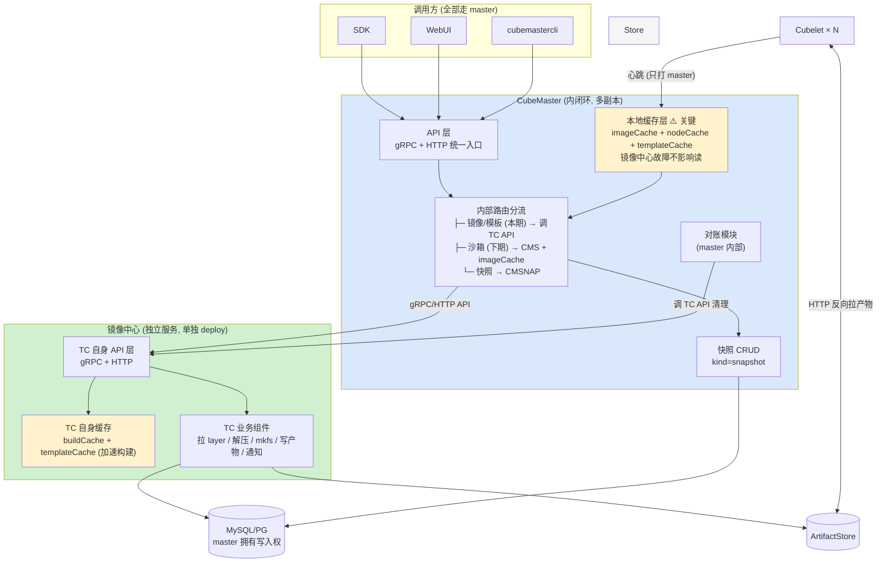

# 提案：模板中心（TemplateCenter）独立化

| | |
|---|---|
| 状态 | 待评审 |
| 关联 Issue | [#957](https://github.com/TencentCloud/CubeSandbox/issues/957)、[#1204](https://github.com/TencentCloud/CubeSandbox/issues/1204) |
| 详细设计 | [`templatecenter-design.md`](./templatecenter-design.md) |
| 现状说明 | [`cubemaster-template-current-state.md`](./cubemaster-template-current-state.md) |
| 竞品调研 | [`e2b-template-architecture.md`](./e2b-template-architecture.md) |

这份文档回答三个问题：**为什么要做、做完之后影响谁、有哪些事需要拍板**。具体怎么实现在详细设计文档里，这里不展开代码。

---

## 摘要

模板构建目前长在 CubeMaster 进程里。它是 CPU/IO 密集型的重活，却和延迟敏感的沙箱调度共用一个进程；更要紧的是它需要一块本地磁盘存产物，这块 ReadWriteOnce 的 PVC 把整个 CubeMaster 锁死在单副本、只能用 Recreate 策略升级。

本提案把模板相关能力（`kind='template'`）剥离成独立服务 TemplateCenter（下称 TC），快照留在 CubeMaster。TC 按**无状态多副本**设计，副本间不通信、一致性全部通过数据库达成。

直接收益有两个：**CubeMaster 卸掉唯一的有状态依赖后可以多副本 + 滚动升级**；模板构建本身也不再是单点，且能水平扩展。控制面从"整个 CubeMaster 是单点"变成"两侧都可多副本"。

对外接口和 SDK 不变。需要改动的组件只有五个，其中 Cubelet 只改配置、CubeDB / SDK / WebUI 完全不动。

---

## 目录

1. [背景与问题](#1-背景与问题)
2. [目标与非目标](#2-目标与非目标)
3. [方案概要](#3-方案概要)
4. [受影响的组件](#4-受影响的组件)
5. [API 清单与归属](#5-api-清单与归属)
6. [依赖关系变化](#6-依赖关系变化)
7. [迁移与回滚](#7-迁移与回滚)
8. [风险与已知问题](#8-风险与已知问题)
9. [待决策项](#9-待决策项)
10. [后续演进](#10-后续演进)
11. [验收标准](#11-验收标准)

> 多副本的具体实现机制（构建互斥、后台任务互斥、缓存与节点视图一致性）在详细设计 [§8 多副本设计](./templatecenter-design.md)，本文只讲影响和前提。

---

## 1. 背景与问题

### 1.1 重活和延迟敏感路径抢同一个进程

构建一个模板要拉镜像、解压层、mkfs、写几个 G 的 ext4 文件。沙箱创建则是延迟敏感路径。两者在同一个进程里，后果是：

- 构建高峰会拖累沙箱创建的 P99
- 无法分别扩缩容——想给构建加资源只能整个 CubeMaster 一起加
- 改模板逻辑要重启整个 CubeMaster，影响面覆盖所有沙箱调度

### 1.2 模板产物的本地磁盘把整个控制面锁死在单副本

这是最实质的问题。CubeMaster 的 chart 写得很直白：

```218:223:deploy/kubernetes/chart/values.yaml
    replicas: 1
    # Default PVC is ReadWriteOnce: RollingUpdate with maxSurge would start a
    # second Pod before the old one releases the volume and hang on multi-attach.
    # Recreate deletes the old Pod first so the PVC can remount cleanly.
    deploymentStrategy:
      type: Recreate
```

这块 RWO PVC 挂在 `/data/CubeMaster/storage`。核实结果是它**只被模板代码使用**——全仓只有三处读 `CUBEMASTER_ROOTFS_ARTIFACT_STORE_DIR`（`image/paths.go`、`image/ext4.go`、`artifact_cleanup.go`），模块外零引用。

所以模板产物存储是 CubeMaster 唯一的有状态依赖，它带来两个连带后果：

- CubeMaster 只能单副本，任何故障都是控制面整体不可用
- 升级只能用 `Recreate`（先删旧 Pod 再起新 Pod），升级期间有真空期，沙箱创建全部失败

**换个角度看，这一条就足以支撑拆分**：把模板搬走之后，CubeMaster 变成无状态服务，PVC 和 `Recreate` 的枷锁一起消失。单点不是变多了，而是从"整个控制面"收缩到"模板构建"这一条非关键路径上。

### 1.3 存储介质写死在本地盘

产物只能落本地文件，下载 URL 用构建那台机器的 IP 拼出来。想换对象存储要改一片调用点，因为存取逻辑散在构建、分发、GC、清理四条路径里，没有统一抽象。

### 1.4 现有代码不是"搬走就行"

`pkg/templatecenter` 内部模板和快照高度共用：数据库访问层、缓存、分发、产物生命周期与 GC 是两边共同的地基，占了整个包的三分之一多。

这决定了**"把模板代码搬走"不是一个可执行的动作**——地基没法搬走一半。所以本提案的核心工作之一是先做代码切分（把地基提成共享库），这也是最大的一块改动。切分方案见详细设计 §2。

---

## 2. 目标与非目标

### 2.1 目标

| # | 目标 | 验证方式 |
|---|---|---|
| G1 | 模板的创建、查询、构建、重建、删除、构建状态与日志、兼容性矩阵由独立服务承载 | 功能与改造前一致 |
| G2 | CubeMaster 卸掉 artifact PVC，可多副本 + 滚动升级 | `replicas=2` + `RollingUpdate`，升级期间沙箱创建不中断 |
| G3 | 对外接口零变更，SDK / WebUI 不改代码 | SDK 全量回归通过 |
| G4 | 产物存取走统一接口，换存储介质不碰业务代码 | 接口落地，本地实现通过 |
| G5 | 快照留在 CubeMaster，但边界划清，后续要合并时不用推翻设计 | 快照侧零回归 |
| G6 | TC 故障不影响沙箱创建 | 故障注入下用已就绪模板创建沙箱仍成功 |
| G7 | **TC 支持多副本**，任意副本处理任意请求，滚动升级不中断模板操作 | `replicas=2` 下并发构建同一模板只建一次；滚动升级期间提交构建不失败 |

### 2.2 非目标

明确不做，避免评审时反复讨论：

| 不做 | 理由 |
|---|---|
| P2P 分发 | e2b 的做法，但它的价值窗口只在"产物已建好、云端上传未完成"这段时间；我们是推送模型，本来没这个窗口（[调研第 5 节](./e2b-template-architecture.md)） |
| 块级增量存储 | 改造量堪比重写存储层 |
| 分层构建缓存 | 需要一整套分层存储格式支撑 |
| 改 GC 算法 | 现有三阶段 last-owner-cleanup 已经能用，且比 e2b 公开描述的更完整 |
| 改现有数据库字段语义 | 只加不改 |
| 混合架构集群支持 | 现在就不支持（隐式假设单一架构），本次不引入也不修复，但要写清约束（§8.4）。**多副本部署时要用 nodeSelector 固定所有副本同架构** |

---

## 3. 方案概要

### 3.1 拆分边界

按 `kind` 字段切：**TC 只读写 `kind='template'`，CubeMaster 只读写 `kind='snapshot'`。**

这个边界之所以稳定，有两个支撑：

**`kind` 创建时定下来就不变**，没有"模板转快照"这种操作。

**别名的唯一性约束已经天然限定在模板范围内。** 别名靠一个 STORED 生成列加唯一索引保证唯一，而生成列的表达式把作用域限定在 `kind='template'`，快照的 `display_name` 恒映射为 NULL（唯一约束豁免 NULL）：

```43:49:CubeDB/migrate/migrations/mysql/20260704120000_template_alias_unique.sql
-- Generated column: non-NULL only for kind='template' with non-empty
-- display_name. NULL everywhere else → exempt from the unique constraint.
CALL cubemaster_add_column_if_missing(
  't_cube_template_definition',
  'alias_key',
  'varchar(256) GENERATED ALWAYS AS (CASE WHEN `kind` = ''template'' AND `display_name` <> '''' THEN `display_name` ELSE NULL END) STORED'
);
```

所以两边不会在别名命名空间上打架。**不拆库**，继续共用同一个数据库实例。

### 3.2 架构

**核心原则**：**镜像中心（TC）单独拆一个独立服务，以 API 方式与 CubeMaster 交互**。CubeMaster 内部闭环——所有入口经 master；master 通过 API 调 TC；**双方都有缓存**——master 的本地缓存做隔离（TC 故障不影响 master 可用），TC 也有自己的缓存（加速构建）；TC 单纯做"制作步骤"；DB 由 master 实施；删除对账由 master 发起；本期只做镜像转换组件测试。

> 这张图的 drawio 版： [`assets/templatecenter-proposal-architecture.drawio`](./assets/templatecenter-proposal-architecture.drawio)



**关键点（5 条原则的落地）**：

1. **TC 单独拆一个独立服务**：镜像中心有独立 deploy / 独立进程 / 独立扩缩容——不是 master 内部组件。
2. **以 API 方式交互**：master 通过 gRPC + HTTP API 调 TC，TC 也暴露自己的 API——两进程边界清晰。
3. **双方都有缓存**：master 端有 `imageCache + nodeCache + templateCache`（做隔离，TC 挂了缓存命中）；TC 端也有自己的 `buildCache + templateCache`（加速重复构建）。两侧缓存各管各的，互不依赖。
4. **入口统一**：SDK / WebUI / cubemastercli **全部走 CubeMaster**——没有直连 TC 的入口。
5. **DB 由 master 实施**：TC 通过 API 间接触发 master 写 DB，TC **没有独立写库路径**。
6. **删除对账由 CubeMaster 发起**：用户 `DELETE /template/{id}` → master API → master 内部对账 → 调 TC API 清理 → master 写终态。
7. **本期范围**：只做**镜像转换组件**（image-template 制作步骤），测试为主。**下期**再做完整 sandbox-template 交互。

**TC 缓存 vs Master 缓存的分工**：

| 缓存层 | 位置 | 内容 | 故障隔离 |
|---|---|---|---|
| **Master 本地缓存** | CubeMaster 进程内 | `imageCache` (节点→templateIDs 视图) + `nodeCache` (节点健康) + `templateCache` (模板元数据) | **TC 挂了缓存依然命中**——这就是 5 点原则第 1 条"避免镜像中心故障后影响 CubeMaster 可用" |
| **TC 自身缓存** | 镜像中心进程内 | `buildCache` (构建中间产物) + `templateCache` (模板构建状态) + `fingerprintCache` (幂等去重) | **加速重复构建**——同 artifact 二次提交秒级命中 |

**故障域**：

- **TC 挂了**：master 本地缓存兜底，沙箱创建不受影响；新建模板暂时不可用（直至 TC 恢复）。
- **Master 挂了**：入口全挂；TC 也不可被调用（但 TC 自身状态完整，恢复后继续）。

**产物存储**：因为 TC 是独立服务，产物存储**必须对所有 TC 副本可见**——对象存储或 RWX 共享存储，不能是本地 RWO PVC（否则 TC 多副本扩展受限于 PV）。

**副本间没有连线**——TC 多副本间通过 DB（构建互斥、后台任务互斥）和 Redis（进度可见性）协调；master 多副本同理。

### 3.3 三个决定形态的选择

其余设计决策在详细设计文档里，这里只列影响架构形态的三个。

| 选择 | 决定 | 不选什么，为什么 |
|---|---|---|
| **共用代码怎么处理** | 抽共享库（BASE），master 和 TC 都 import | 不选"复制两份"：会分叉。不选"TC 硬嵌入 master"：5 点原则明确"单独拆一个组件"——TC 独立 deploy |
| **沙箱创建怎么读模板** | 走 master 本地缓存（imageCache），不调 TC API | 不选"调 TC API"：这五个调用全是读，且要结合节点健康/调度缓存/组件版本——全是 master 本地数据。这条与 5 点原则第 1 条一致 |
| **TC 部署形态** | **独立 deploy（gRPC + HTTP API），可独立扩缩容** | 不选"TC 嵌入 master 进程"：5 点原则第 1 条明确"镜像中心提供 API"。不选"leader-standby"：构建操作本来都幂等，备副本白占资源 |

**多副本基础设施前提**：
- **TC 多副本**：产物存储必须对所有副本可见（对象存储 / RWX），不能用本地 RWO PVC。
- **Master 多副本**：跟现在一样，缓存做数据同步（Redis tick + 进程内 view）。
- **本期**为了"镜像转换组件测试"，可以接受 TC 单副本 + master 单副本（本期不强调扩展性）。

---

## 4. 受影响的组件

### 4.1 汇总

| 组件 | 要不要改 | 改什么 |
|---|---|---|
| **CubeMaster** | 改代码 | 抽共享库、删除已迁走的模板代码、摘几处 wiring、加一个内部端点、去掉 PVC |
| **TemplateCenter** | 新建 | 新服务：HTTP 层 + 构建 + 分发 + GC + 产物存储 |
| **CubeAPI** | 改路由 | 模板路由的上游从 CubeMaster 换成 TC |
| **cubemastercli** | 改路径 + 加配置 | 模板子命令指向 TC，新增 TC 地址配置项 |
| **部署（Helm / systemd）** | 加组件 | TC 的 chart 和 unit；各组件的 TC 地址配置；CubeMaster 去 PVC |
| **Cubelet** | **只改配置** | `MetaServerEndpoint` 指向 TC |
| **CubeDB** | 不改 | 无 schema 变更 |
| **SDK（Python / Node / Go）** | 不改 | 对外契约不变 |
| **WebUI** | 不改 | 同上 |

### 4.2 CubeMaster

| 动作 | 说明 |
|---|---|
| 抽共享库 | 模板快照共用的数据访问层、缓存、分发、产物生命周期与 GC 提出去，两边 import。前置改造是把包级全局单例改成可注入 |
| 删除模板专属代码 | 已迁到 TC 的模板专属文件，以及 `image/`、`cube_egress_ca/` 两个工具子包 |
| 保留快照专属代码 | `snapshot_*.go` 全部留下 |
| 摘 wiring | `templatecenter.Init` 现在顺手做了三件跟模板无关的事，要拿出来由 CubeMaster 自己注册（见下） |
| 热路径改走共享库 | 沙箱创建的五个模板读调用 |
| 加一个内部端点 | 供 TC 转发双语义请求 |
| 部署 | 移除 artifact PVC，`Recreate` 改 `RollingUpdate`，放开副本数 |

**三件必须留在 CubeMaster 的东西**，容易漏：

| 要留下的 | 为什么 |
|---|---|
| `sandboxspec.Init` + `configureSandboxSpecHooks` | 注册的是 `AfterCreateSandbox` 钩子，往 `sandboxspec` 写沙箱创建时的规范 spec。这个包服务快照，跟模板无关 |
| `configureSnapshotRuntimeRefHooks` | 快照运行时引用计数，服务快照 |
| `warmReadyTemplateLocality` | 启动时把所有 Ready 副本填进调度缓存，而那是 **CubeMaster 调度器的缓存**。不留下的话 CubeMaster 重启后调度器不知道任何模板在哪个节点 |

`configureCompatHooks` 是模板兼容性的，跟 TC 走。

### 4.3 TemplateCenter（新建）

| 内容 |
|---|
| 服务骨架：main / 配置 / HTTP server / 健康检查 |
| 12 个模板端点的 handler + 双语义转发分支 |
| 产物存储接口 + 本地实现 |
| Cubelet gRPC 客户端 |
| 平移过来的模板专属代码与工具子包 |

### 4.4 cubemastercli（容易被漏掉的一个）

它**绕过 CubeAPI 直连 CubeMaster**，而且是从配置的 server 列表里随机选一台：

```421:423:CubeMaster/cmd/cubemastercli/commands/cubebox/template.go
		port = c.GlobalString("port")
		host := serverList[rand.Int()%len(serverList)]
		url := fmt.Sprintf("http://%s/cube/template", net.JoinHostPort(host, port))
```

`template` 命令组 12 个子命令中，除了 `commit`（打 `/cube/sandbox/commit`）之外都打 `/cube/template*`。

**改动**：模板相关的路径指向 TC。需要新增一个 TC 地址配置项——不能复用 `serverList`，因为那是 CubeMaster 列表。

这是唯一需要客户端升级的地方，过渡方案见 §7.3。

### 4.5 CubeAPI

只改路由表：模板路由指向 TC，快照路由不变。新增 TC 上游配置。**注意保持两个超时档不变**（§5.1）。

### 4.6 Cubelet

**无代码改动**，只改配置：`MetaServerConfig.MetaServerEndpoint` 指向 TC 的 Service 地址。

反向依赖需要保证：Cubelet 要能访问 TC 的产物下载端点。

### 4.7 CubeDB / SDK / WebUI

**CubeDB 无 schema 改动**，不加列不改列。只有一次性数据迁移 Job 复制产物文件，不动表。

**SDK 和 WebUI 零改动**，三个 SDK 都只配一个 `apiUrl` 指向 CubeAPI，对外契约不变。

---

## 5. API 清单与归属

### 5.1 对外 API（CubeAPI 层）

**只列模板端点。** 快照端点（`GET /snapshots`、`POST /sandboxes/{id}/snapshots`、`POST /sandboxes/{id}/rollback`）不在本次范围，全部留在 CubeMaster 不动，所以不占篇幅。

按资源分组列，这样同一路径上挂多个方法的情况看得更清楚：

**资源 `/templates`（集合）**

| 方法 | 超时档 | 动作 |
|---|---|---|
| GET | 30s | 列表 |
| POST | 30s | 创建新模板（分配新 ID） |

**资源 `/templates/{id}`（单个模板）—— 四个方法**

| 方法 | 超时档 | 动作 | 备注 |
|---|---|---|---|
| GET | 30s | 查详情 | **按 kind 可能转发** |
| POST | 30s | rebuild：给这个已有模板建新构建，ID 和别名不变 | |
| PATCH | 30s | 改元数据 | **当前 NotImplemented，只搬路由** |
| DELETE | **240s** | 删除 | **按 kind 可能转发** |

**子资源 `/templates/{id}/builds/{buildID}`（一次构建）**

| 方法 | 路径 | 超时档 | 动作 |
|---|---|---|---|
| POST | `.../builds/{buildID}` | 30s | 触发构建（**`buildID` 实际被忽略**） |
| GET | `.../builds/{buildID}/status` | 30s | 查状态与进度 |
| GET | `.../builds/{buildID}/logs` | 30s | 查日志（**实际转调 status**） |

**其他模板端点**

| 方法 | 路径 | 超时档 | 动作 |
|---|---|---|---|
| GET | `/templates/compat` | 30s | 兼容性矩阵 |
| POST | `/templates/compat/{id}/adopt-baseline` | 30s | 采纳当前版本为基线 |
| GET | `/templates/aliases/{alias}` | 30s | 按别名反查 |

以上 12 个端点**全部指向 TC**。路由定义在 `CubeAPI/src/routes.rs:132-169`，可以直接对照。

> 两个双语义端点（`GET`/`DELETE /templates/{id}`）会因为 SDK 的 `deleteSnapshot(id)` 打进来，所以 TC 要按 `kind` 转发给 CubeMaster。这是模板侧唯一和快照的耦合点，见下。

**为什么模板有这么多端点，还有同路径不同方法的**——这是评审时一定会问的，答案分两层。

**第一层：这套 API 不是我们设计的，是 e2b 协议的兼容实现。**

CubeAPI 对外提供的是 e2b 兼容接口，SDK 直接就是 e2b 的 SDK。所以路径、方法、状态码都由 e2b 的契约定死，**我们没有裁剪的自由**——砍掉一个端点就意味着某个 SDK 调用会 404。

这也解释了同路径不同方法的现象。REST 里同一个 URI 配不同方法是标准做法（方法表示动作，URI 表示资源），`/templates/{id}` 上挂四个方法就是四个动作：

| 方法 | 语义 | 我们的实现 |
|---|---|---|
| `GET` | 读这个模板 | 查详情，**兼查快照** |
| `POST` | 对这个已有模板发起一次新构建（rebuild） | 建新 job，模板 ID 和别名不变 |
| `PATCH` | 改元数据 | **NotImplemented**，只有路由 |
| `DELETE` | 删这个模板 | 删定义 + 数引用 + 清节点，**兼删快照** |

`POST /templates`（建新模板）和 `POST /templates/{id}`（给已有模板建新构建）也是这个逻辑：**前者分配新 ID，后者复用已有 ID**。后者是模板版本管理的入口——线上 `Sandbox.create('my-template')` 的代码不用改就能拿到新版本。

**第二层：抛开兼容性，这些端点本身也各有来源。**

| 组 | 端点数 | 为什么必须有 |
|---|---|---|
| 基础 CRUD | 6 | 标准资源操作。`PATCH` 目前是 NotImplemented，只是路由占位 |
| **异步构建的进度查询** | 3 | 构建可能跑几十分钟，HTTP 不可能同步等，必须有独立的 build 子资源供轮询状态、拉日志 |
| **别名解析** | 1 | 别名能跨 rebuild 转移，客户端不能缓存映射，得有个反查入口 |
| **组件兼容性** | 2 | 产物绑定了构建时的 guest 版本，节点升级后可能失效。需要矩阵视图 + "采纳当前版本为基线"的动作 |

**三个端点在我们的实现里是退化的**，这一点迁移时要注意，因为它降低了工作量：

| 端点 | 退化情况 |
|---|---|
| `PATCH /templates/{id}` | 直接返回 NotImplemented。**只搬路由，没有逻辑要迁** |
| `POST /templates/{id}/builds/{buildID}` | `buildID` 被丢弃：`Path((template_id, _build_id))`。e2b 的两段式协议里这一步是"镜像已上传完，开始构建"的信号，而我们是 `POST /templates` 就直接开始建了，所以这个端点退化成"再触发一次构建" |
| `GET .../builds/{buildID}/logs` | 转调了状态查询（`get_template_build_status`），没有独立的日志存储。**这对多副本是好事**——没有进程内日志缓冲要处理（详细设计 §8.4） |

所以 12 个端点里，真正有独立业务逻辑要迁的是 9 个。

**真正需要特殊处理的只有一个**：`GET/DELETE /templates/{id}` 是**双语义端点**——三个 SDK 的 `deleteSnapshot(id)` 打的就是 `DELETE /templates/{id}`，网关拿到 ID 分不出是模板还是快照。归属方案是先给 TC，TC 查 `kind` 后自己处理或转发，响应原样透传，网关和 SDK 都不感知。转发的超时取值和重试策略见详细设计 §3.2。

> 顺带澄清一个容易混的点：CubeAPI 里的 `build_e2b_router` 是**我们自己实现的 e2b 兼容层**，跟 e2b 内部的真实实现是两回事，不要互相引用（[调研文档开头](./e2b-template-architecture.md)有说明）。

**两个超时档必须保持**：`DELETE /templates/{id}` 在 240 秒档（删除要同步通知所有节点清理产物），其余在 30 秒档。

```26:32:CubeAPI/src/routes.rs
const DEFAULT_ROUTE_TIMEOUT: Duration = Duration::from_secs(30);

/// Timeout budget for routes that front a *synchronous* CubeMaster operation
/// which can legitimately take well beyond the default 30 s — currently
/// snapshot create (`POST /sandboxes/:id/snapshots`) and snapshot/template
/// delete (`DELETE /templates/:id`).
const SNAPSHOT_LONG_ROUTE_TIMEOUT: Duration = Duration::from_secs(240);
```

### 5.2 内部 HTTP API（`/cube/*`）

这些是 CubeMaster 现在暴露的内部端点，也是 cubemastercli 直连的目标。

**随模板迁到 TC：**

| 方法 | 路径 | 说明 |
|---|---|---|
| POST | `/cube/template` | 创建 |
| GET | `/cube/template` | 列表 / 详情（带 `template_id` query） |
| DELETE | `/cube/template` | 删除 |
| GET | `/cube/template/compat` | 兼容性矩阵 |
| POST | `/cube/template/compat` | 采纳基线 |
| POST | `/cube/template/redo` | 重做分发 |
| GET | `/cube/template/build/{build_id}/status` | 构建状态 |
| GET / POST | `/cube/template/from-image` | 从镜像建模板 / 查 job |
| **GET / HEAD** | **`/cube/template/artifact/download`** | **Cubelet 拉产物的目标端点**，带 token 鉴权，HEAD 用于探大小 |
| GET | `/cube/rootfs-artifact` | 产物查询 |

其中 `/cube/template/artifact/download` 最关键——它是数据面入口，Cubelet 靠它拉几个 G 的 ext4 文件。TC 必须原样提供这个端点。

**留在 CubeMaster：**

| 方法 | 路径 |
|---|---|
| POST / GET / DELETE | `/cube/snapshot`、`/cube/snapshot/{snapshot_id}` |
| GET | `/cube/snapshot/storage` |
| GET | `/cube/operation/{operation_id}` |
| POST | `/cube/sandbox/commit` |
| POST | `/cube/sandbox/rollback` |
| GET / HEAD | `/cube/ca/{filename}`（CubeEgress CA 下载） |

### 5.3 新增的内部端点

**很少，因为热路径不走 HTTP。**

| 端点 | 提供方 | 用途 |
|---|---|---|
| `GET / DELETE /internal/snapshots/{id}` | CubeMaster | TC 双语义转发的目标 |
| `GET /health` | TC | 探针 |

### 5.4 Cubelet gRPC

模板子系统一共用到 Cubelet 8 个 RPC，拆分后调用方发生变化：

| RPC | 用途 | 拆分后由谁调 |
|---|---|---|
| `CreateImage` | 下发产物到节点 | **TC** |
| `DeleteImage` | 清理节点上的产物 | **TC** |
| `CleanupTemplate` | 清理节点上的模板副本 | **TC** |
| `CommitSandbox` | 沙箱转模板 | **TC** |
| `AppSnapshot` | 创建快照 | CubeMaster |
| `RollbackSandbox` | 回滚沙箱到快照 | CubeMaster |
| `GetLocalSnapshot` | 查节点本地快照 | CubeMaster |
| `GetStorageMetrics` | 快照存储视图 | CubeMaster |

**反向依赖**：Cubelet 需要访问 TC 的 `GET/HEAD /cube/template/artifact/download` 拉产物文件。地址由 Cubelet 侧的 `MetaServerEndpoint` 配置决定，所以这是配置改动而不是代码改动。

---

## 6. 依赖关系变化

### 6.1 数据库

**表结构零变更**，只是读写方发生变化。

| 表 | 拆分后谁写 | 拆分后谁读 |
|---|---|---|
| `t_cube_template_definition` | TC 写 `kind=template` 行<br/>CubeMaster 写 `kind=snapshot` 行 | 两边都读 |
| `t_cube_rootfs_artifact` | **只有 TC** | 两边都读 |
| `t_cube_template_replica` | **只有 TC** | 两边都读（CubeMaster 读用于就绪判定） |
| `t_cube_template_image_job` | TC 写模板 job<br/>CubeMaster 写快照 job | 各读各的 |
| `t_cube_artifact_node_placement` | **只有 TC** | 只有 TC |
| `t_cube_snapshot_runtime_ref` / `_active` | 只有 CubeMaster | 只有 CubeMaster |
| `t_cube_sandbox_spec` | 只有 CubeMaster | 只有 CubeMaster |
| `t_cube_node_status` / `_registration` / `_component_version` | 只有 CubeMaster（nodemeta 写） | 两边都读 |

**要注意的一条**：产物相关的三张表写入方收敛到 TC 一个，这是刻意的——避免两个进程并发改产物状态。但**读**是两边都有的，因为沙箱创建的就绪判定要读副本表。

**数据库还兼任分布式锁载体**：TC 多副本的构建互斥和后台任务互斥都靠 MySQL `GET_LOCK` / PG `pg_try_advisory_lock`，**不引入 etcd**。

### 6.2 Redis

模板子系统**有 Redis 依赖**，用在构建的拉取进度实时快照上——高频进度回调写 Redis 避免打爆数据库，构建结束把终态刷进数据库。

这对多副本是利好：A 副本在构建、写 Redis，客户端轮询打到 B 副本，B 从同一个 Redis 读到实时进度，**不需要请求亲和性**。

TC 独立部署时要配 Redis 连接。注意跟上面的锁区分开——锁走数据库不走 Redis。

### 6.3 节点信息依赖

模板子系统对"集群里有哪些节点、状态如何"的依赖有四类，拆分后来源发生变化：

| 依赖什么 | 现在从哪来 | 拆分后 TC 怎么拿 |
|---|---|---|
| 健康节点集合（按 instanceType） | 心跳实时更新 + 定期数据库重载 | **只能靠数据库重载**（TC 没有 nodemeta），这是第一个要验证的点，见 §8.4 |
| 节点本地有哪些模板 | Cubelet 心跳上报 → 调度缓存 | TC 不需要（只有 CubeMaster 调度用） |
| 节点组件版本 | Cubelet 上报 → 数据库 | 直接查库 |
| 节点地址 | 节点表 | 直接查库 |

**心跳仍然打到 CubeMaster**，TC 不接心跳。这是刻意的——让 TC 保持无节点状态，只从数据库读一份视图，这样多个 TC 副本天然看到同一份数据（最多差一个重载周期）。

### 6.4 组件间调用关系

| 调用 | 现在 | 拆分后 |
|---|---|---|
| CubeAPI → 模板能力 | HTTP → CubeMaster | HTTP → **TC Service**（负载均衡到任意副本） |
| CubeAPI → 快照能力 | HTTP → CubeMaster | 不变 |
| cubemastercli → 模板能力 | HTTP 直连 CubeMaster（随机选一台） | HTTP → **TC** |
| 沙箱创建 → 模板读 | 进程内函数调用 | **进程内函数调用**（走共享库，不变） |
| 模板构建 → Cubelet | gRPC | **TC 任一副本** → gRPC |
| Cubelet → 拉产物 | HTTP → CubeMaster | HTTP → **TC Service**（改配置） |
| Cubelet → 心跳 | gRPC → CubeMaster | 不变 |
| TC → 快照能力 | — | **新增**：HTTP 转发到 CubeMaster（仅双语义端点） |

**唯一新增的跨进程强依赖是 TC → CubeMaster 的双语义转发**，而且只在"用 `DELETE /templates/{id}` 删快照"这一条路径上。反方向（CubeMaster → TC）**没有**同步依赖，这是 G6 成立的关键。

**TC 多副本对上游是透明的**：CubeAPI 和 Cubelet 都配 Service 名而不是 Pod IP，请求打到哪个副本无所谓（详细设计 §8.8）。

---

## 7. 迁移与回滚

### 7.1 上线步骤

产物不换存储介质，只是"同一份磁盘数据换个进程持有"，所以可以不停机。

| 步骤 | 动作 | 可回滚 |
|---|---|---|
| 1 | 准备共享存储（对象存储 bucket 或 RWX PVC），**多副本的前提**（§8.2） | 是 |
| 2 | 部署 TC，先跑 1 个副本，不接流量 | 是 |
| 3 | 一次性 Job 把 CubeMaster artifact 目录中 `kind='template'` 的文件复制到共享存储 | 是 |
| 4 | 逐个校验 sha256。**失败就停在这里，不切路由** | 是 |
| 5 | Cubelet 的 `MetaServerEndpoint` 指向 TC 的 Service | 是（改回配置） |
| 6 | CubeAPI 切模板路由到 TC，观察 | 是（切回） |
| 7 | **TC 副本数升到 2，跑 §11.3 的多副本验证** | 是（降回 1） |
| 8 | cubemastercli 发新版本 | 是（旧版在过渡期内仍可用） |
| 9 | 稳定后清理 CubeMaster 侧模板 artifact，**旧文件保留 7 天** | 7 天内可回滚 |
| 10 | 移除 CubeMaster artifact PVC，改 `RollingUpdate`，放开副本数 | 需重新挂 PVC |

**第 7 步单独拆出来**是刻意的：先用单副本把功能跑通、把路由切完，确认没问题之后再放开副本数。这样多副本相关的问题（并发构建、锁竞争）不会和拆分本身的问题混在一起排查。

回滚的主路径是网关路由切回全走 CubeMaster，秒级生效。步骤 9 之前 CubeMaster 侧的代码和数据都还在，回滚代价很低。

### 7.2 兼容性保证

| 对象 | 兼容性 |
|---|---|
| SDK（Python / Node / Go） | 完全兼容，不用升级 |
| WebUI | 完全兼容 |
| CubeAPI 对外的 `/templates*` | 路径和响应格式不变 |
| 数据库 schema | 无变更 |
| 已有产物文件 | 直接复用，校验 sha256 后使用 |
| 已有别名 | 直接可用（唯一性约束在数据库层，跟进程无关） |
| 存量产物的下载 URL | 无需迁移数据库里的 `master_node_ip`，靠 Cubelet 侧 host 重写解决（详细设计 §4.2） |

### 7.3 cubemastercli 的过渡期

老版本 cubemastercli 会继续打 CubeMaster 的 `/cube/template*`。

建议在 CubeMaster 侧保留这些路径一段时间，作为**转发到 TC 的薄代理**，给运维留出升级 CLI 的窗口，过渡期结束后删掉。这个决策见 §9 的 D3。

---

## 8. 风险与已知问题

### 8.1 构建互斥必须换成跨实例锁

这是多副本里**优先级最高的一项**，做不到会有数据一致性问题。

产物 ID 是从模板 spec 的 sha256 截取来的，只覆盖 spec 字段，不含时间戳或随机数——所以同一份 spec 永远算出同一个产物 ID。但**建 ext4 不保证 bit-for-bit 可复现**（filesystem UUID、文件 mtime、inode 分配顺序都可能变）。

两者结合的后果：同一个产物 ID 被构建两次，文件的 sha256 会不一样。而 Cubelet 判断"本地有没有这个产物"只看文件存在且大于 1KB，**不比对 sha256**。所以：

- 已经拉过旧字节的节点**永远不会更新**
- 新节点拿到新字节
- 数据库记的是新 sha256

三方不一致，而且没有自愈机制。

现在的互斥是进程内 `sync.Map`，**跨副本失效**。所以多副本方案必须把它换成数据库会话锁（`tc_build_<artifactID>`），锁覆盖整个构建窗口。抢不到锁的副本不报错，而是轮询等待并复用结果——从客户端看两个并发的相同请求都成功，行为跟单副本一致。实现见详细设计 §8.2。

还有两个场景会触发重复构建，**跨实例锁解决不了**（它们本来就是串行的）：产物被 GC 回收后又有新模板用同样的 spec、手工删除产物后 redo。这两个影响面小——只在产物已被回收时发生，此时集群里通常也没有节点还持有旧字节。根治要靠 Cubelet 侧校验本地文件，代价不划算，属于可选优化。

### 8.2 多副本要求共享存储，这是硬前提

本地 RWO PVC 只能挂一个 Pod，**多副本必须用对象存储或 RWX 共享存储**（NFS / CFS）。

如果环境上暂时没有，**代码不用改**，退化成单副本运行（会话锁永远抢得到、缓存不一致不存在）。但这时就拿不到 G7，模板构建仍然是单点。

**这一条要在评审时确认清楚基础设施现状**（决策 D7）——它决定了 G7 能不能在本次达成。

### 8.3 抽共享库可能波及快照

数据访问层、缓存、分发这几块是模板快照共用的，改造它们会同时影响两边。

缓解措施：保持函数签名不变，只改依赖注入方式；快照侧全量回归；分小 PR 提交而不是一个大 PR。

### 8.4 混合架构集群会串用产物

现在就不支持混合架构，本次不引入也不修复，但要写清约束——**这一条是正确性缺口，不只是"功能缺失"**。

**为什么 x86 和 arm 必须是两份独立的模板**：rootfs 里装的是二进制，x86_64 编译的程序在 arm64 上根本执行不了。所以不存在"一份产物两种架构都能用"，**一个逻辑模板在每个架构下都得有自己的 artifact**。

三处证据说明现在没强制这一点：

构建平台隐式取构建机自己的架构，请求方指定不了：

```323:325:CubeMaster/pkg/templatecenter/image/native.go
func defaultPlatform() v1.Platform {
	return v1.Platform{OS: "linux", Architecture: runtime.GOARCH}
}
```

产物 ID 的哈希输入里没有 arch 字段，架构只能通过源镜像 digest 间接体现，而这取决于导出路径：

| 导出路径 | Digest 来源 | 架构是否进哈希 |
|---|---|---|
| native | 平台特定的 manifest digest | 隐式进入，安全 |
| dockerless / skopeo | `skopeo inspect` 的 `Digest`，未加 `--override-arch` | 待验证 |
| docker | 取 `RepoDigests[0]` | **存疑**。Docker 对多架构镜像通常记录 index digest，跟架构无关 → 不同架构算出相同 ID |

分发选点只按 `instanceType` 过滤，**不看架构**（`healthyTemplateNodes`）。

**后果**：混合架构集群里，x86 上建的 artifact 会被推给 arm 节点。arm 节点能落盘（sha256 是对的），但沙箱起来后里面的程序全跑不了。

**好消息是改造成本比预想的低。** 这轮核实发现架构信息**已经端到端存在**，不需要新增上报链路——Cubelet 已经上报 `kubernetes.io/arch` 标签：

```156:162:Cubelet/pkg/cubelet/node_status.go
			Labels: map[string]string{
				corev1.LabelHostname:   string(kl.nodeName),
				corev1.LabelOSStable:   goruntime.GOOS,
				corev1.LabelArchStable: goruntime.GOARCH,
				kubeletapis.LabelOS:    goruntime.GOOS,
				kubeletapis.LabelArch:  goruntime.GOARCH,
			},
```

这些标签经 nodemeta 落到 `labels_json`，再到 `node.Node.NodeLabels`，通过 `Labels()` 可读。所以分发选点加架构过滤只是**读一个已有字段**，完整改造方案见详细设计 §8.3。

**本次要做的两件事**（守住底线，不做完整支持）：

1. **部署约束**：所有 TC 副本用 nodeSelector 固定同架构。多副本下尤其重要——否则同一模板两次构建可能落到不同架构的副本
2. **优先实测 docker 导出路径**：确认 `RepoDigests[0]` 是 index digest 还是平台 digest。如果是前者，即使单架构集群也要留意（用户拉多架构镜像时）

e2b 的官方架构文档完全没提 CPU 架构，这块没有现成做法可参考。但组件多版本方案的目录布局已经带了 `<arch>` 层级，产品方向上是要支持多架构的。

### 8.5 TC 进程里的节点缓存是空的

分发要选目标节点，靠的是调度缓存里的健康节点集合。这份缓存的数据来自两处：nodemeta 的心跳同步，以及定期从数据库全量重载。

TC 进程里**没有 nodemeta**（心跳打到 CubeMaster），所以只能靠数据库重载填充。这条路径是存在的——节点健康判定用的是心跳时间戳加超时，数据库里有这个字段，TC 能独立算出健康状态。

但这是**拆分后第一个要验证的功能点**。如果这条路径有问题，TC 选不出分发目标，分发直接失败。建议做成启动自检：TC 启动后打印一次健康节点数，为 0 就告警。

多副本下各副本独立重载、互不同步，所以新节点加入后各副本最多晚一个重载周期（30 秒）才知道。后果是分发可能漏掉刚加入的节点，靠按需拉取兜底，可接受。

### 8.6 TC 的缓存失效到不了 CubeMaster 的调度缓存

模板变更时会清一次调度缓存，而那是 CubeMaster 调度器的缓存。拆分后这个动作在 TC 进程里执行，清的是 TC 自己那份没人读的缓存。

**正确性是保住的**，因为就绪判定命中缓存之后还会查一次数据库的副本行并现算兼容性。副本行没了或状态不对，判定失败，然后把脏条目摘掉，自愈。

代价是每次命中多一次数据库查询，以及一个短暂窗口内调度器会先选中一个已失效的节点再退回去。可以接受。

**多副本下 TC 自己那几份缓存也互不同步**，同样靠"命中后必查库"兜底。但缓存 TTL 现在是 6 小时且没有周期性刷新，多副本下建议调短或补一个低频 reconcile（决策 D9）。

明确不做的：**副本间缓存失效广播**。那需要副本发现和消息通道，收益只是省几次数据库查询，不值得。

### 8.7 构建中途进程退出会留下脏行

产物被置为 `BUILDING` 之后开始建 ext4，这期间进程被杀（升级、OOM、节点故障）会让行停在 `BUILDING`，对应的 job 行停在 `RUNNING`。

**单副本下这是个可以拖的问题，多副本下是必须做的**——滚动升级时被终止的副本上正在构建的产物都会变成脏行，而且这会在每次发版时发生。

所以 reconcile 要纳入本次范围：扫超时的 `BUILDING` / `RUNNING` 行重置为可重建，超时阈值取 2 倍最长构建时长。实现见详细设计 §6.6。

顺带说明一个约束：job 表**没有 owner 字段**，所以"这个 job 是哪个副本在跑"不可知，只能靠"更新时间超时"判定，不能靠 owner 心跳。本次不加这个字段——加了要动 schema，而超时判定够用。

### 8.8 双语义转发的边界情况

TC 收到 `DELETE /templates/{id}`，查 `kind` 发现是快照，转发给 CubeMaster。如果这中间 CubeMaster 正在滚动升级（拆分后它是多副本），转发可能打到正在退出的 Pod。

删除不重试（不幂等），所以会返回失败让客户端重试。这是正确的选择，但要保证错误信息能区分"模板不存在"和"转发失败"，否则用户不知道该不该重试。

### 8.9 其他

| 风险 | 处理 |
|---|---|
| 数据迁移搬错或丢文件 | 逐个校验 sha256，失败不切路由，旧文件保留 7 天 |
| `kind` 字段有历史脏数据 | 迁移前全表扫一遍，确认只有 `template` 和 `snapshot` 两种取值 |
| 移除 CubeMaster PVC 后发现还有别的写入方 | 已核实只有三处引用；移除前再扫一次；保留 7 天 |
| 老版本 cubemastercli 打旧路径 | §7.3 的过渡期薄代理 |
| `PATCH /templates/{id}` 迁移后仍是 NotImplemented | 与现状一致，明确不在范围内 |
| 分发部分节点失败后停在 Failed 不自动收敛 | 现状已如此，靠按需拉取兜底；是否本次补终态语义见 D9 |

---

## 9. 待决策项

| # | 决策点 | 建议 | 定不下来的影响 |
|---|---|---|---|
| **D1** | TC 是独立组件，还是并入某个现有服务 | **独立组件**。并入别的服务只是把耦合对象换了个名字，构建重活照样跟别人抢资源，没解决 #957 的诉求。代码独立不代表部署必须独立，单机场景可以同机部署。另一个可选变体是同一个 module 编译出不同 role——e2b 的 `template-manager` 和 `orchestrator` 就是同一个二进制的两个 role | §4 的组件清单和部署方案全部待定 |
| **D2** | 沙箱创建热路径走共享库直查数据库，是否接受 | **接受**。五个调用全是读，而且就绪判定本来就依赖 CubeMaster 侧数据 | 若不接受，改成 HTTP 加降级缓存，CubeMaster 侧改动明显增加，且 TC 变成沙箱创建的强依赖，G6 达不成 |
| **D3** | CubeMaster 侧是否保留 `/cube/template*` 作为过渡期薄代理 | **保留**，给运维留 cubemastercli 升级窗口，过渡期后删除 | 影响 cubemastercli 的发布节奏 |
| **D4** | 是否现在就为将来的 HA 预留锁封装 | **预留**，把构建互斥和后台任务的入口封成函数，实现体先用最简版本。将来升 HA 时换实现而不改调用点 | 不做则将来升 HA 要改一片调用点 |
| **D5** | `/templates/compat` 系列是否随模板迁 TC | **随迁**。数据源是副本表的组件版本字段，属于模板范畴 | 若不迁，兼容矩阵要跨进程查副本表 |
| **D6** | 双语义转发的超时与重试策略 | 删除走长超时档且不重试；查询走短超时档可重试一次 | 取值不当会导致正常删除被误判超时 |
| **D7** | **TC 用什么产物存储** | 有对象存储就用对象存储；没有就用 **RWX 共享存储**（NFS / CFS）。两者都没有则 TC 只能单副本，G7 达不成 | **这是多副本的硬前提**，评审时必须确认基础设施现状 |
| **D8** | CubeMaster 是否同期移除 PVC 并放开副本数 | **同期做**，这是本提案最大的收益（G2）。担心风险可以拆成紧接的独立 PR | 不做则 G2 无法达成，等于只把耦合换了个地方 |
| **D9** | 多架构约束怎么处理 | 本次：**nodeSelector 固定 TC 副本同架构** + 优先实测 docker 导出路径的 digest 行为（§8.4）。完整支持另行排期，方案见详细设计 §8.3 | 不处理则混合架构集群会把产物推到跑不起来的节点 |
| **D10** | 是否给 SDK 暴露分发状态 | **建议暴露只读摘要**：在 `GET /templates/{id}` 响应里加 `distribution`（expected/ready/failed 节点数、`needsRedo`、`arch`），**不新增端点、不暴露节点 ID 列表、不暴露 redo 写操作**。理由见详细设计 §8.6 | 不做则用户遇到 `PARTIALLY_READY` 或创建慢时无法自查 |
| **D11** | 是否纳入三个小修复 | **`BUILDING` 脏行 reconcile 必须纳入**（多副本下每次发版都会产生脏行，§8.7）；缓存 TTL 调短或补低频 reconcile 建议纳入；分发失败终态语义可选 | 前两个不做会在多副本下暴露问题 |
| **D12** | 旧存储数据保留期 | 7 天 | — |

建议评审时**先定 D1、D2、D7、D8**。其中 **D7 决定 G7（TC 多副本）能不能在本次达成**——如果基础设施暂时只有本地盘，代码仍按多副本写（不用改），但部署上先跑单副本。

**D9 和 D10 建议一起看**：如果将来要做多架构，SDK 侧就得能指定和查询架构，那 D10 的 `distribution.arch` 字段现在加上正好铺路。另外多架构还有个模型选择要提前想（一个模板 ID 对应一个架构，还是一个 ID 下挂多架构 artifact），详细设计 §8.6 末尾有对比，**建议选前者**（配合别名足够好用）。

---

## 10. 后续演进

改造细节在详细设计 §10。

### 10.1 接对象存储（S3 / COS）

产物存储接口就是为此设计的，加一个实现类加改配置即可，业务代码不动。

**注意它和多副本的关系**：如果本次就要多副本，对象存储（或 RWX）不是"后续"而是**前置条件**（§8.2、决策 D7）。这里说的"后续"是指从 RWX 升级到对象存储这一步。

对象存储相比 RWX 的额外收益：**产物字节完全不经过 TC**。多副本下产物下载流量本来要分摊到各副本，换成预签名 URL 之后这个端点退化成一次重定向。

**三个坑必须处理**（详见详细设计 §10.1）：Cubelet 的 host 重写会破坏预签名 URL 且该改动必须先于存储切换发布、预签名 URL 过期时间要匹配大文件下载耗时、ak/sk 必须走环境变量或 Secret 注入。

### 10.2 构建能力的水平扩展

多副本已经让不同产物能在不同副本上并行构建（锁粒度是产物级）。再往上还有两件事可以做，但都不在本次范围：

**按 instanceType 或 arch 分组的构建池** —— 让特定规格的构建固定落到特定副本组，避免跨架构问题（§8.4），也便于给不同规格配不同资源。

**构建队列与优先级** —— 现在是来一个建一个，没有排队和限流。构建高峰时多个副本同时满负荷可能打满镜像仓库带宽。做法是加一个数据库队列表 + 按副本容量取任务，但这会把"提交即开始构建"的语义改成"提交入队"，客户端体验有变化，要单独设计。

### 10.3 合并快照（可选，不承诺）

数据层面已经隔离好了，共享库的设计也是为这个铺的。真正的难点只有一个：快照的运行时引用计数事件现在是进程内钩子，迁到 TC 后变成跨进程事件，**丢事件会导致引用计数偏高（存储泄漏）或偏低（在用快照被误删）**。解法见详细设计 §10.2。

顺便一个参考：e2b 把模板和快照做成**完全同构的产物**（快照就是一个新 build，内容存成相对来源模板的 diff），产品文档里还明确建议用户优先用模板而不是快照，理由是启动更快、资源更少、预取效率高得多（[调研第 3 节](./e2b-template-architecture.md)，原文 <https://e2b.dev/docs/template>）。长期看让两者收敛成一种对象可能比维持现在的二分更好。

---

## 11. 验收标准

### 11.1 功能

| 场景 | 期望 |
|---|---|
| 模板增删查改、构建、重建 | 全部走 TC，功能与改造前一致 |
| 构建状态与日志查询 | 分页语义一致 |
| 快照增删查、rollback | 全部走 CubeMaster，零回归 |
| 别名全链路 | 用别名创建沙箱、别名跨 rebuild 转移、别名唯一冲突处理，均与改造前一致 |
| 兼容矩阵 | 矩阵视图、rescan、adopt-baseline 功能一致 |
| `deleteSnapshot(id)` | 命中 `DELETE /templates/{id}`，TC 判 `kind=snapshot` 转发 CubeMaster，长超时档内完成 |
| 产物分发 | 新建模板正确推到所有健康节点；节点侧 sha256 校验通过；失败节点可通过 redo 补齐 |
| 产物清理 | 删模板时各节点产物被清理；有运行沙箱引用时返回 Conflict 并保留产物交给 GC |
| GC | 迁移后正常回收；**只被快照引用的孤儿产物也能被回收** |
| 沙箱创建（模板） | 五个模板读能力都可用，延迟不劣于改造前 |
| 就绪判定三层 | 调度缓存命中、进程内缓存命中、数据库兜底三条路径都能正确返回；Stale 副本正确返回 needs-redo 并带节点列表 |

### 11.2 拆分特有的验证点

这几条是本次改造特有的，容易漏：

| 场景 | 期望 |
|---|---|
| **TC 启动自检** | 能从数据库加载出健康节点，数量与 CubeMaster 侧一致（§8.5） |
| **TC 故障注入** | 用已就绪模板创建沙箱仍成功；模板 CRUD 返回明确错误（G6） |
| **`sandboxspec` wiring** | 摘出后 `AfterCreateSandbox` 正常写入、`AfterDestroy` 正常删除 |
| **`warmReadyTemplateLocality`** | 留在 CubeMaster，重启后调度器能立即找到已有模板的位置 |
| **产物下载端点** | Cubelet 能从 TC 拉产物，HEAD 探大小正常 |
| **cubemastercli** | 12 个 `template` 子命令功能正常；老版本在过渡期内仍可用 |
| **CubeMaster 多副本** | 移除 PVC 后 `replicas=2` + `RollingUpdate`，滚动升级期间沙箱创建不中断；两个副本都能正确判定模板就绪 |

### 11.3 TC 多副本验证（G7）

这一组是多副本特有的，必须在 `replicas>=2` 下测：

| 场景 | 期望 |
|---|---|
| **并发构建同一模板** | 两个副本同时收到相同 spec 的请求，只有一个真正构建，另一个等待并复用结果；两个请求都返回成功；**集群里只有一份产物字节**（比对各节点文件 sha256 一致） |
| **并发构建不同模板** | 落到不同副本的不同产物能真正并行构建（验证锁粒度是产物级不是全局） |
| **杀掉正在构建的副本** | job 在阈值时间内被 reconcile 置 FAILED；产物脏行被清理；重新提交能正常构建 |
| **轮询打到不同副本** | 构建状态和拉取进度返回一致（验证 job 表 + Redis 快照跨副本可见，无需请求亲和性） |
| **滚动升级期间提交构建** | 请求不失败；被终止副本上的构建按上一条处理 |
| **多副本同时到 GC 轮次** | 只有一个真正扫描，其余跳过；日志能看出锁竞争 |
| **新节点加入** | 各副本在一个重载周期（30 秒）内都能看到；分发能选中它 |
| **副本缓存不一致** | 一个副本更新模板后，另一个副本的旧缓存不会导致错误调度（验证命中后必查库） |
| **共享存储** | 任意副本都能读到其他副本构建的产物；Cubelet 从任意副本都能拉到文件 |
| **副本同架构约束** | 部署配置里有 nodeSelector 或 nodeAffinity 固定架构（§8.4） |

### 11.4 迁移

| 场景 | 期望 |
|---|---|
| 数据迁移 | 逐个校验 sha256，失败不切路由，旧文件保留 7 天 |
| 路由回滚 | 网关秒级切回全走 CubeMaster，功能立即恢复 |
| 存量产物 | 迁移后 Cubelet 能正常拉取（验证 host 重写生效，无需改数据库 IP） |
| 存量别名 | 全部可用 |
