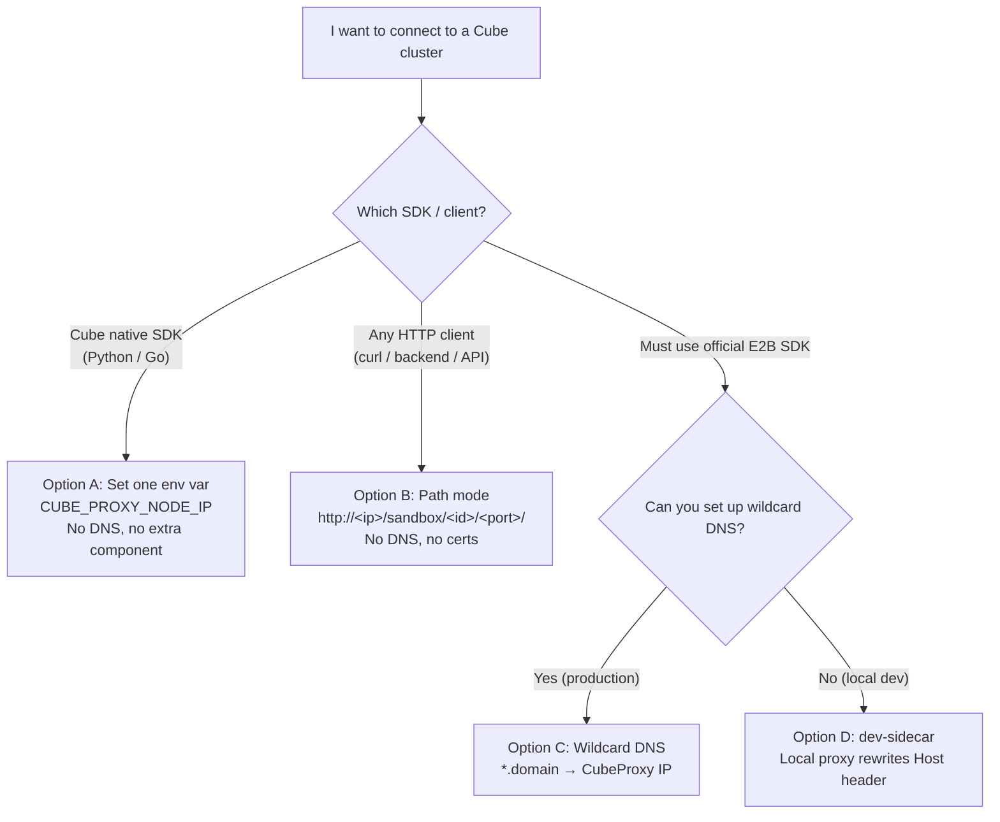

# Connect to an Existing Cube Cluster

Connecting to an existing cluster is often assumed to be complex — you have to set up wildcard DNS, then deal with certificates. In reality, **most scenarios need none of that**.

This page helps you pick the **least painful** way to connect, based on your scenario.

## Pick the Right Approach First



Quick summary:

| Option | Client | Wildcard DNS | Extra component | Complexity |
|--------|--------|:---:|:---:|:---:|
| **A. Cube SDK + `CUBE_PROXY_NODE_IP`** | Cube Python / Go SDK | No | No | Lowest |
| **B. Path mode** | Any HTTP client | No | No | Low (not for SPA) |
| **C. Wildcard DNS** | E2B SDK / Cube SDK | Yes | No | Production standard |
| **D. dev-sidecar** | Official E2B SDK | No | Yes (local proxy) | Medium |

---

## Option A: Cube Native SDK (Recommended, Simplest)

If you use the Cube native Python / Go SDK, you need **no wildcard DNS and no extra component**. The SDK has built-in IP-direct dialing (equivalent to `curl --resolve`): the TCP connection goes straight to the CubeProxy IP you specify, while the HTTP `Host` header keeps the virtual domain so CubeProxy can still route to the correct sandbox.

You only need a few environment variables:

```bash
export CUBE_API_URL="http://<node-ip>:3000"   # Control plane: CubeAPI endpoint
export CUBE_PROXY_NODE_IP="<node-ip>"          # Data plane: dial CubeProxy directly (bypass DNS)
export CUBE_PROXY_PORT_HTTP=80                 # CubeProxy HTTP port, default 80
export CUBE_TEMPLATE_ID="<your-template-id>"   # Template ID used to create sandboxes
```

Then just use the SDK normally. Key points:

- Once `CUBE_PROXY_NODE_IP` is set, all data-plane requests dial this IP directly and **never hit DNS**.
- No need to add any `*.cube.app` record in `/etc/hosts` or DNS.

This is the easiest way to connect to an existing cluster — prefer it.

---

## Option B: Path Mode (Works With Any HTTP Client)

If you are not using an SDK and just want to reach a sandbox service with `curl`, a backend service, or any HTTP client, **path mode** is the most direct — all you need is the CubeProxy IP and port:

```
http://<cube-proxy-host>:<http-port>/sandbox/<sandbox-id>/<container-port>/<rest-of-path>
```

For example, sandbox `abc123` exposes port `49999`, and CubeProxy is at `10.0.0.5:80`:

```bash
curl http://10.0.0.5/sandbox/abc123/49999/
curl http://10.0.0.5/sandbox/abc123/49999/health
```

Characteristics:

- **No DNS, no certificate setup** — works over plain HTTP.
- WebSocket upgrades are supported.
- CubeProxy automatically strips the prefix, rewrites root-absolute `Location` headers, and scopes Set-Cookie `Path`.
- **Not suitable for SPAs**: if the page loads static assets via root-absolute paths (e.g. `/static/app.js`), the prefix will not match. Use Option C (Host mode) for those cases.

See [HTTPS Certificates and Domain Resolution](./https-and-domain.md) for more detail.

---

## Option C: Wildcard DNS (Production / Frontend SPA)

If you must use Host mode (typically a frontend SPA accessed from a browser), or you are doing a production deployment, you need a wildcard DNS record pointing `*.<domain>` to the IP of the node running CubeProxy.

The sandbox domain format is `<port>-<sandboxId>.<domain>`. Since `sandboxId` differs per sandbox, you must use **wildcard** resolution rather than single hosts entries.

Below are several setups, ordered by recommendation:

### C-1: Public cloud DNS (production recommended)

Add a wildcard A record in your DNS provider console:

```
*.cube.yourdomain.com  →  <public IP of the CubeProxy node>
```

Specify that domain when starting CubeAPI:

```bash
./cube-api --sandbox-domain cube.yourdomain.com
# or: export CUBE_API_SANDBOX_DOMAIN=cube.yourdomain.com
```

### C-2: Built-in CoreDNS from one-click deploy (dev / single machine)

Cube one-click deploy **ships with CoreDNS** that automatically resolves `*.cube.app` to the CubeProxy node IP, which is why everything just works on the host right after install — no manual DNS needed. The core of its `Corefile` template:

```text
.:53 {
    bind __COREDNS_BIND_ADDR__
    template IN A cube.app {
        answer "{{ .Name }} 60 IN A __CUBE_PROXY_DNS_ANSWER_IP__"
        fallthrough
    }
    template IN A (.*)\.cube\.app {
        answer "{{ .Name }} 60 IN A __CUBE_PROXY_DNS_ANSWER_IP__"
        fallthrough
    }
    forward . /etc/resolv.conf
}
```

> Built-in CoreDNS is for local / quick experience only, not for production or multi-machine sharing.

### C-3: Manual dnsmasq (shared across an intranet)

Configure dnsmasq on an intranet machine:

```bash
# /etc/dnsmasq.d/cube.conf
address=/cube.app/<CubeProxy node IP>
```

Point client machines' `/etc/resolv.conf` at this dnsmasq:

```text
nameserver <dnsmasq-ip>
```

### About /etc/hosts

`/etc/hosts` **does not support wildcards**, so it cannot do wildcard resolution — you can only add an entry per known sandbox ID, which is impractical. Use one of the three approaches above when you need wildcard resolution.

See [HTTPS Certificates and Domain Resolution](./https-and-domain.md) for more on domains and certificates.

---

## Option D: dev-sidecar (Only When You Must Use the Official E2B SDK Without DNS)

You only need dev-sidecar in this specific case: **you must use the official E2B SDK** (not the Cube native SDK), but you **cannot set up wildcard DNS** locally.

The official E2B SDK hardcodes its DNS resolution flow internally and exposes no hook like `CUBE_PROXY_NODE_IP`. `dev-sidecar` works around this by running a lightweight local proxy that intercepts data-plane requests and rewrites the `Host` header; it also skips server certificate verification by default, so you avoid self-signed certificate trust issues.

> If you can switch to Option A (Cube SDK) or Option B (path mode), you do not need dev-sidecar. It is the fallback for compatibility with the official E2B SDK.

### Quick Start

Example: [examples/e2b-dev-sidecar](https://github.com/tencentcloud/CubeSandbox/tree/master/examples/e2b-dev-sidecar) (with [English README](https://github.com/tencentcloud/CubeSandbox/tree/master/examples/e2b-dev-sidecar/README.md))

```bash
cd examples/e2b-dev-sidecar
pip install -r requirements.txt
cp env.example .env
```

#### Case 1: Cube started locally with `dev-env`

If you followed [Development Environment (QEMU VM)](./dev-environment.md), the defaults in `env.example` are made for this case. You usually only need to fill in the template ID:

```bash
E2B_API_URL="http://127.0.0.1:13000"      # CubeAPI exposed by dev-env
CUBE_REMOTE_PROXY_BASE="https://127.0.0.1:11443"  # CubeProxy exposed by dev-env
E2B_API_KEY="e2b_000000"
CUBE_TEMPLATE_ID="<your-template-id>"
```

#### Case 2: Connect to a cluster on another machine

Same example, just replace the addresses with the remote cluster endpoints:

```bash
E2B_API_URL="http://<node-ip>:3000"
CUBE_REMOTE_PROXY_BASE="https://<node-ip>:443"
E2B_API_KEY="e2b_000000"
CUBE_TEMPLATE_ID="<your-template-id>"
```

Run for both cases:

```bash
python demo.py
```

### Four Key Variables

- `E2B_API_URL`: control-plane endpoint. Default in `dev-env`: `http://127.0.0.1:13000`.
- `CUBE_REMOTE_PROXY_BASE`: data-plane endpoint. Default in `dev-env`: `https://127.0.0.1:11443`.
- `E2B_API_KEY`: must be non-empty. Use the real key if auth is enabled, otherwise `e2b_000000`.
- `CUBE_TEMPLATE_ID`: template ID used when creating the sandbox.

### Common Mistakes

- Running local `dev-env` but configuring in-VM addresses instead of the host-exposed `13000/11443` ports
- Pointing `CUBE_REMOTE_PROXY_BASE` at the sidecar's own listening address instead of CubeProxy
- Forgetting to set `CUBE_TEMPLATE_ID`
- Auth is enabled on the cluster, but `E2B_API_KEY` is still `e2b_000000`

### Further Reading

When you are ready to wire the sidecar into your own code, look at `demo.py` and `dev_sidecar.py` in the example.
