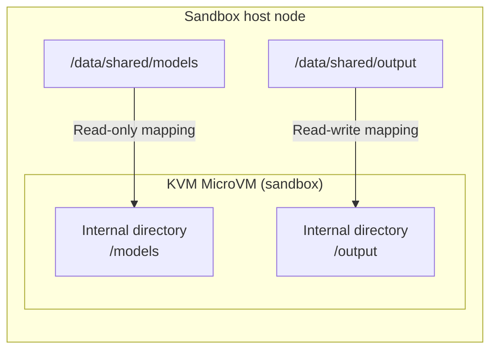

# Persistent Storage (Host Mount)

Cube Sandbox runs inside lightweight MicroVMs — by default, all data written inside a sandbox is **ephemeral** and disappears when the sandbox is killed. **Host mount** is a Cube-specific extension that bind-mounts directories from the sandbox host node into the sandbox, enabling persistent, shared storage without copying files.

## Concept



A host mount maps an **absolute path on the sandbox host node** to a **path inside the sandbox VM**. Changes to a read-write mount are visible on both sides immediately — no sync, no upload, no delay.

## Use Cases

Host Mount is suitable when a sandbox needs direct access to existing data on its host node or needs to preserve generated data on that node. Common use cases include:

- **Shared datasets and model weights**: mount large data directories read-only so multiple sandboxes on the same node can reuse them without copying.
- **Persistent task output**: mount an output directory read-write so logs, build artifacts, and computation results remain after sandbox teardown.
- **Reusable source workspaces**: mount a code repository for development, build, test, or code-analysis tasks.
- **Shared dependencies and caches**: reuse packages, toolchains, or build caches from the host to reduce repeated downloads and initialization.

> Host Mount is best for quickly sharing directories that already exist on a node. For cloud storage managed across sandbox lifecycles, consider **user-scoped persistent volumes** backed by COS, NFS, or another backend; see the [Volume Plugin Development guide](./volume-plugin.md).

## Quick Start

Prepare the host directories on the sandbox host node:

```bash
sudo mkdir -p /data/shared/rw /data/shared/ro
echo "hello from host" | sudo tee /data/shared/ro/greeting.txt
sudo chown -R 1000:1000 /data/shared/rw
```

### Create a Sandbox with Host Mounts

Specify Host Mount through the `host-mount` key in the `metadata` argument to `Sandbox.create()`. Its value is a **JSON-encoded array** in which each item is a mount descriptor, so one sandbox can request multiple mounts.

Every descriptor requires three fields: `hostPath` is an absolute path on the sandbox host node and must be under an allowed directory prefix; `mountPath` is the target path inside the sandbox VM; and `readOnly` selects the access mode, where `true` means read-only and `false` means read-write.

```python
import json
import os
from cubesandbox import Sandbox

with Sandbox.create(
    template=os.environ["CUBE_TEMPLATE_ID"],
    metadata={
        "host-mount": json.dumps([
            {
                "hostPath":  "/data/shared/rw",
                "mountPath": "/mnt/rw",
                "readOnly":  False,
            },
            {
                "hostPath":  "/data/shared/ro",
                "mountPath": "/mnt/ro",
                "readOnly":  True,
            },
        ])
    },
) as sandbox:
    result = sandbox.commands.run("ls /mnt/rw /mnt/ro")
    print("mount contents:", result.stdout.strip())
```

Expected output:

```
mount contents: /mnt/ro:
greeting.txt
/mnt/rw:
```

### Write Data That Survives Sandbox Teardown

```python
import json
import os
from cubesandbox import Sandbox

mounts = json.dumps([
    {"hostPath": "/data/shared/rw", "mountPath": "/mnt/rw", "readOnly": False},
])

with Sandbox.create(
    template=os.environ["CUBE_TEMPLATE_ID"],
    metadata={"host-mount": mounts},
) as sandbox:
    sandbox.commands.run("echo 'persist data' > /mnt/rw/output.txt")
```

```bash
# The sandbox is gone, but the file persists on the host:
$ cat /data/shared/rw/output.txt
persist data
```

## Snapshots of Host Mount Sandboxes

A host mount is an **external reference** to a directory on the host. When Cube creates a snapshot, it saves the VM's memory, root filesystem state, and mount configuration, but it does not copy files from `hostPath` into the snapshot. The host directory remains independent and follows these semantics:

- **Pause / Resume and FromSnap**: restore reuses the original mount configuration and remounts the same `hostPath` on the origin node. A sandbox with a host mount is pinned to its origin node and cannot restore across nodes; restore fails if the origin node is unavailable or the host directory no longer exists.
- **Rollback**: VM memory and root-filesystem state outside host-mounted paths return to the state at snapshot creation, but host-mounted data does not roll back. Files added, modified, or deleted in the host directory after the snapshot retain their latest state.
- **Clone**: each clone has independent VM state but references the same host directories. Changes to a read-write mount are accessible to the source sandbox and other clones through the shared directory, subject to the backing filesystem's consistency semantics; read-only mounts remain read-only in every clone.
- **Deleting a sandbox or snapshot**: does not delete the host directory or its files.

::: warning Concurrent writes
FromSnap or Clone can leave multiple running sandboxes accessing the same writable `hostPath`. Host Mount does not automatically provide locking, versioning, or write-conflict coordination; applications must coordinate concurrent access themselves and may use locking supported by the backing filesystem.
:::

## Path Restriction

For security, `hostPath` is restricted to a set of **allowed directory prefixes**. By default, only paths under `/data/shared/` are permitted. Attempts to mount paths outside the allowed prefixes will be **rejected at sandbox creation time**.

::: warning
`hostPath` refers to the filesystem of the **sandbox host node** running the sandbox, not the machine where your SDK script executes. If you call the API from a remote machine, make sure the path exists on the sandbox host node, not on your local computer.
:::

### Default Behavior

Out of the box, only the following paths are valid:

```python
# ✅ Allowed
{"hostPath": "/data/shared/models", "mountPath": "/models", "readOnly": True}
{"hostPath": "/data/shared/team-a/output", "mountPath": "/output", "readOnly": False}

# ❌ Rejected
{"hostPath": "/etc/passwd", "mountPath": "/mnt/x", "readOnly": True}
{"hostPath": "/tmp/data", "mountPath": "/mnt/data", "readOnly": False}
{"hostPath": "/data/shared/../etc", "mountPath": "/mnt/x", "readOnly": True}  # traversal blocked
```

### Error Response

If a disallowed path is specified, the SDK raises an `ApiError`:

```python
from cubesandbox import Sandbox
from cubesandbox import ApiError
import os
import json

try:
    sandbox = Sandbox.create(
        template=os.environ["CUBE_TEMPLATE_ID"],
        metadata={"host-mount": json.dumps([
            {"hostPath": "/etc/passwd", "mountPath": "/mnt/x", "readOnly": True}
        ])}
    )
except ApiError as e:
    print(e.status_code)  # 400
    print(str(e))
    # CubeMaster returned error code 130400: "host-mount" entry[0]: hostPath "/etc/passwd" is not within an allowed mount prefix
```

### Custom Allowed Prefixes

Cluster administrators can configure additional allowed prefixes in CubeMaster's config file:

```yaml
extra_conf:
  allowed_host_mount_prefixes:
    - "/data/shared/"
    - "/data/team-assets/"
    - "/mnt/nfs/datasets/"
```

When the list is empty or omitted, the default `["/data/shared/"]` applies. The root path `/` is explicitly forbidden — CubeMaster will refuse to start if it appears in the list.

> CubeMaster first normalizes `hostPath` with `filepath.Clean` to remove components such as `..`, then matches it against directory prefixes with a trailing `/`. This prevents a path such as `/data/shared_evil` from masquerading as a child of `/data/shared/`. At startup, CubeMaster also rejects `/` as an allowed prefix to prevent accidental exposure of the entire host filesystem.
>
> The same path validation applies whether the mount request comes from an annotation forwarded by CubeAPI or from a directly specified volume path, preventing bypass through a different entry point.

## Permissions

Host mounts preserve the original ownership and permission bits of the host directory. The `readOnly` flag only controls whether Cube mounts the path read-only or read-write — it does **not** override Linux file permissions.

If the sandbox user's UID does not match the host directory owner, writes will fail with `Permission denied`. Quick fix:

```bash
# Align directory owner to the sandbox user
sudo chown 1000:1000 /data/shared/rw
```

For other solutions (read-only mounts, POSIX ACLs, running as root, etc.), see [Host Mount Permissions Troubleshooting](./troubleshooting/host-mount-permissions.md).

## Multi-Node Cluster: Shared Storage

Host mounts are **node-local**. In a multi-node cluster, the `hostPath` must exist on whichever sandbox host node schedules the sandbox. The recommended approach is to use shared storage so the same filesystem is mounted at a uniform path on all nodes.

### NFS Example

Mount NFS on every sandbox host node:

```bash
# Add to /etc/fstab:
nfs-server:/export/shared  /data/shared  nfs  defaults,hard,intr  0 0
```

```bash
sudo mount -a
ls /data/shared   # All nodes see the same content
```

Sandboxes can then use any path under `/data/shared/` regardless of which node they are scheduled on.

### Object Storage (S3/COS) Example

Use a FUSE tool (e.g. `s3fs`, `cosfs`) to mount an object storage bucket as a local directory:

```bash
# Install cosfs (Tencent Cloud COS)
sudo apt-get install cosfs

# Configure credentials
echo "my-bucket:AKIDxxxx:xxxxxx" > /etc/passwd-cosfs
chmod 600 /etc/passwd-cosfs

# Mount to /data/shared
cosfs my-bucket /data/shared -ourl=https://cos.ap-guangzhou.myqcloud.com \
  -oallow_other -ouid=1000 -ogid=1000
```

```bash
# AWS S3 using s3fs
s3fs my-bucket /data/shared \
  -o iam_role=auto \
  -o url=https://s3.amazonaws.com \
  -o allow_other -o uid=1000 -o gid=1000
```

::: tip
Object storage mounts work best for read-only scenarios (model weights, datasets). Write performance and POSIX compatibility are inferior to NFS; for frequent small-file writes, prefer NFS or block storage.
:::

## Multi-Tenant Isolation

In multi-tenant environments, each tenant's sandbox should only access its own data directory, with no visibility into other tenants' files. The recommended approach combines directory structure with application-layer enforcement.

### Directory Layout

Partition by tenant ID:

```
/data/shared/
├── tenant-a/
│   ├── datasets/
│   └── output/
├── tenant-b/
│   ├── datasets/
│   └── output/
└── tenant-c/
    └── ...
```

Each tenant's sandbox only mounts its own subdirectory:

```python
import json
import os
from cubesandbox import Sandbox

tenant_id = "tenant-a"

mounts = json.dumps([
    {
        "hostPath": f"/data/shared/{tenant_id}/datasets",
        "mountPath": "/datasets",
        "readOnly": True,
    },
    {
        "hostPath": f"/data/shared/{tenant_id}/output",
        "mountPath": "/output",
        "readOnly": False,
    },
])

with Sandbox.create(
    template=os.environ["CUBE_TEMPLATE_ID"],
    metadata={"host-mount": mounts},
) as sandbox:
    sandbox.commands.run("ls /datasets /output")
```

Tenant A's sandbox can only see `/data/shared/tenant-a/` — it cannot access `tenant-b` or `tenant-c` directories.

### Application-Layer Enforcement

In the code that calls `Sandbox.create()`, construct `hostPath` from the authenticated user's tenant ID. **Never allow users to pass arbitrary paths:**

```python
def create_tenant_sandbox(tenant_id: str, template_id: str):
    """Platform controls mount paths; tenants cannot specify arbitrary hostPaths."""
    base = f"/data/shared/{tenant_id}"
    mounts = json.dumps([
        {"hostPath": f"{base}/input",  "mountPath": "/input",  "readOnly": True},
        {"hostPath": f"{base}/output", "mountPath": "/output", "readOnly": False},
    ])
    return Sandbox.create(
        template=template_id,
        metadata={"host-mount": mounts},
    )
```

### Filesystem Permission Hardening (Optional)

Combine with Linux permissions as a defense-in-depth layer — even if a path is somehow bypassed, the OS rejects cross-tenant access:

```bash
# Create isolated directories with distinct UIDs/GIDs per tenant
sudo mkdir -p /data/shared/tenant-a /data/shared/tenant-b
sudo chown 1001:1001 /data/shared/tenant-a
sudo chown 1002:1002 /data/shared/tenant-b
sudo chmod 0700 /data/shared/tenant-a
sudo chmod 0700 /data/shared/tenant-b
```

Even if a sandbox attempts to access another tenant's path (e.g. via traversal), it is blocked by both CubeMaster's path validation and OS-level permissions.

### Isolation Layers Summary

| Layer | Mechanism | Purpose |
|-------|-----------|---------|
| Directory layout | Isolated subdirectory per tenant; each sandbox only mounts its own path | Structural data isolation; tenants cannot see each other |
| Application | Platform code constructs paths; user input is not trusted | Tenant isolation under normal operation |
| OS | Directory owner/mode permissions | Last-resort protection against any bypass |

## Nested Mounts: Shared Read, Writer-Scoped

A nested mount is a pair of mounts where one `mountPath` is below another. This is useful when a group shares one workspace but each sandbox should only write to its own subdirectory. The group can represent an Agent Team, project, department, or tenant; Cube Sandbox does not manage that membership.

For example, an Agent Team can use this host layout:

```text
/data/shared/tenant-a/team-blue/
├── shared-input.txt
└── members/
    ├── agent-a/
    └── agent-b/
```

Agent A receives the shared workspace as read-only, then its own directory as a nested read-write mount:

```python
import json

mounts = json.dumps([
    {
        "hostPath": "/data/shared/tenant-a/team-blue",
        "mountPath": "/workspace",
        "readOnly": True,
    },
    {
        "hostPath": "/data/shared/tenant-a/team-blue/members/agent-a",
        "mountPath": "/workspace/members/agent-a",
        "readOnly": False,
    },
])
```

Agent B uses the same read-only parent and mounts only `members/agent-b` as read-write. Agents can use different sandbox templates; the storage layout and access modes remain the same.

| Path visible to Agent A | Read | Write | Why |
|-------------------------|------|-------|-----|
| `/workspace/shared-input.txt` | Yes | No | Provided by the shared read-only parent |
| `/workspace/members/agent-a/` | Yes | Yes | Replaced at that path by Agent A's read-write child mount |
| `/workspace/members/agent-b/` | Yes | No | Still provided by the shared read-only parent |
| Another tenant's workspace | No | No | Its host path is not mounted into this sandbox |

This is a **shared-readable, writer-scoped** model. “Writer-scoped” means only the selected sandbox receives a writable mount for that directory; it does not make the directory unreadable to peers when the read-only parent exposes it.

### Mount Semantics and Constraints

- During AppSnapshot restore, Cubelet applies parent destinations before nested destinations, regardless of the descriptor order. This prevents a later parent mount from hiding an already-mounted child. Unrelated paths have a deterministic order but no parent-child meaning.
- A child mount shadows the parent at that exact subtree; the two directory views are not merged. Files from the parent at the child destination are hidden while the child mount is active.
- `readOnly` applies to each mount independently, but normal Linux UID, GID, mode, and ACL checks still apply. A read-write child can still return `Permission denied` if its host permissions reject the sandbox user.
- Prefer one read-only parent and explicit read-write children. Avoid duplicate destinations and overlapping writable mounts, because ownership and the visible result become difficult to reason about.
- Use canonical absolute `mountPath` values without `.` or `..` segments. Do not rely on input order to resolve overlapping destinations.
- Host mounts are node-local and remain outside the sandbox snapshot. Snapshot FromSnap and Pause/Resume with a raw host mount are pinned to the origin node; an identical path on another node is not treated as the same storage. For portable cross-node snapshot restore, use a plugin Volume backed by storage that every eligible node can attach.

::: warning Authorization boundary
The platform calling `Sandbox.create()` must derive `hostPath` from the authenticated sandbox owner and the applicable group boundary, such as a tenant, team, or project. Do not accept an arbitrary host path from the user, and do not mount a global root such as `/data/shared/tenants/` into a tenant sandbox: a read-only mount prevents writes but does not prevent the sandbox from reading other tenants' data.
:::

## Best Practices

- **Prefer read-only mounts** for input data (datasets, models, configs). This prevents accidental writes from the sandbox and is the safest default.
- **Use dedicated directories** for read-write mounts. Avoid mounting broad paths like `/` or `/home`. Create a purpose-specific directory (e.g. `/data/shared/output`) and scope the mount to it.
- **Check permissions early.** Run `id` and `stat` inside the sandbox to verify the effective UID matches the host directory owner before relying on writes.
- **Clean up output directories** periodically. Host-mounted output directories accumulate files across sandbox sessions — unlike the sandbox itself, they are not cleaned up on teardown.
- **Keep allowed prefixes narrow.** Only add specific trusted paths to `allowed_host_mount_prefixes`. Never add root-level paths like `/data/` — prefer deeper paths like `/data/shared/`.

## Troubleshooting

| Symptom | Likely Cause | Fix |
|---------|-------------|-----|
| `hostPath "..." is not within an allowed mount prefix` | Path is outside allowed prefixes | Move data under `/data/shared/` or update `allowed_host_mount_prefixes` in CubeMaster config |
| `No such file or directory` inside sandbox | `hostPath` does not exist on the sandbox host node | Create the directory on the node before running |
| `Read-only file system` on write | Mounted with `readOnly: true` | Use `readOnly: false` |
| `Permission denied` on write | Host directory ownership mismatch | See [Permissions](#permissions) section above |
| `Template not found` | Wrong template ID | Run `cubemastercli tpl list` |
| `Connection refused` | CubeAPI not reachable | Check `E2B_API_URL` and that port 3000 is open |

## Reference

- Example code: [`examples/host-mount/`](https://github.com/TencentCloud/CubeSandbox/tree/master/examples/host-mount)
- Related issue: [#239](https://github.com/TencentCloud/CubeSandbox/issues/239)
