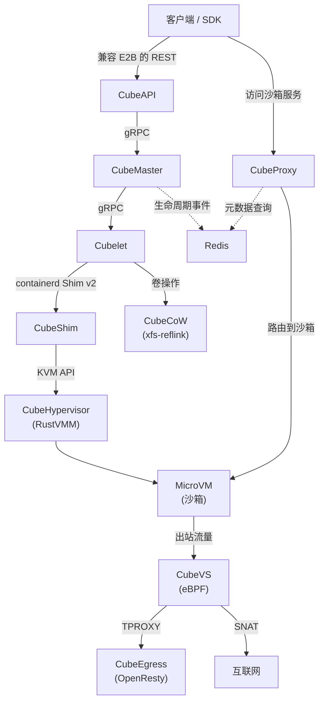
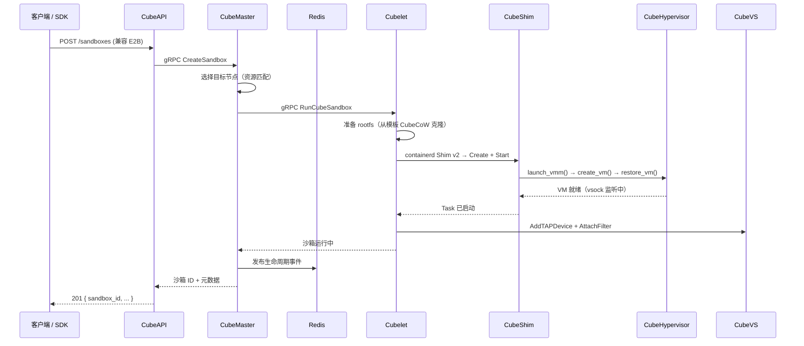

# 架构概览

Cube Sandbox 是一套**面向 AI Agent 场景专门构建的基础设施**，可在数十毫秒内启动具备硬件隔离的 MicroVM。本页介绍系统的整体架构、核心组件及其交互方式。

## 设计原则

| 原则 | 具体体现 |
|------|---------|
| **Agent 优先** | 不局限于经典的"LLM 调用工具 → 沙箱执行 → 返回结果"闭环；生命周期语义、SDK 形态、自动暂停/恢复以及极速克隆/回滚等特性，同样支持在沙箱内直接托管长时运行的 Agent 与有状态服务（如常驻开发环境、Web 服务、数据库等）。 |
| **硬件隔离** | 每个沙箱在 KVM MicroVM 中运行独立的 Linux 内核，不存在共享内核的逃逸面。 |
| **毫秒级启动** | 预快照模板 + RustVMM 恢复路径，实现 100ms 以内的冷启动。 |
| **零信任出网** | 所有出站流量都经过 CubeEgress（L7 MITM 代理），域名必须显式放行。 |
| **无状态控制面** | CubeAPI 与 CubeMaster 不保存本地状态，所有协调通过 Redis 完成，可轻松横向扩容。 |
| **高效存储** | CubeCoW 借助内核 `FICLONE` ioctl 实现 O(1) 快照与克隆，零数据拷贝。 |

## 整体架构




## 控制面 vs 数据面

| 层 | 组件 | 职责 |
|----|------|------|
| **控制面** | CubeAPI、CubeMaster、WebUI、Redis | API 网关、调度、状态协调、运维控制台 |
| **数据面** | Cubelet、CubeShim、CubeHypervisor、CubeCoW、CubeVS、CubeEgress、CubeProxy | VM 生命周期、存储、网络、安全策略执行、请求路由 |

控制面是**无状态**的——Redis 是沙箱元数据与生命周期事件的唯一可信源，任意 CubeAPI 或 CubeMaster 实例都可处理任意请求。

数据面是**节点本地**的——每个计算节点运行 Cubelet、CubeShim、CubeHypervisor、CubeVS、CubeEgress，管理驻留在该主机上的沙箱。

## 核心组件

### CubeAPI

基于 **Rust**（Axum）实现的兼容 E2B 的 REST API 网关。将 E2B SDK 调用转换为内部 gRPC，处理鉴权回调并转发至 CubeMaster。只需替换 API URL 等环境变量，即可从 E2B 云无缝切换到 Cube Sandbox。

### CubeMaster

基于 **Go** 实现的集群级编排调度器。接收沙箱创建/销毁/暂停/恢复请求，依据资源可用性选择目标节点，将工作分发给 Cubelet，并将生命周期事件发布到 Redis。

### CubeProxy

基于 **OpenResty**（nginx + Lua）实现的反向代理与请求路由组件。支持两种路由模式，共享同一份 Redis 沙箱元数据：

- **Host 模式**：解析 `Host` 头中的 `<port>-<sandbox_id>.<domain>`。
- **路径模式**：解析 URL 中的 `/sandbox/<sandbox_id>/<port>/...`（在不便配置泛解析 DNS 与 TLS 时尤其方便，详见 [HTTPS 与域名指南](../guide/https-and-domain.md)）。

它配套独立部署的 **cube-lifecycle-manager** 服务（基于 **Go** 实现），负责监听生命周期事件、透明地暂停空闲沙箱、并在请求到达时恢复已暂停的沙箱。cube-lifecycle-manager 通过 Redis 上的注册表实时发现所有在线的 CubeProxy 副本，因此 CubeProxy 可多副本扩展，不需要任何静态配置。

### Cubelet

基于 **Go** 实现的节点本地调度组件。管理单节点上所有沙箱实例的完整生命周期（创建 → 运行 → 暂停 → 恢复 → 快照 → 销毁）。与 containerd 集成完成镜像拉取，与 CubeCoW 集成完成卷管理。

### CubeShim

基于 **Rust** 实现 **containerd Shim v2** 接口，作为容器运行时抽象与实际 MicroVM 之间的桥梁。负责沙箱资源准备（rootfs、内存文件、内核）、VM 启动/恢复、vsock 通信，以及用于自动暂停的原地快照。

### CubeHypervisor

基于 **RustVMM** + **KVM** 构建的轻量级 VMM（虚拟机监视器）。管理 MicroVM 生命周期：vCPU 配置、内存区域、virtio 设备（block、net/vsock、fs）、启动、暂停、快照与恢复。经过 seccomp 加固，系统调用面最小化。

### CubeVS（网络虚拟化）

基于 eBPF 的内核态网络数据面。三个挂载在关键位置的 BPF 程序提供：

- **按沙箱粒度的 SNAT/DNAT**，无 iptables 规则膨胀。
- **有状态连接追踪**，支持协议感知的超时（TCP 11 状态机、UDP、ICMP）。
- **LPM-trie 网络策略**，线速执行。
- **ARP 代理**，用于点对点 TAP 链路。

详见 [网络架构](./network.md)。

### CubeCoW（存储引擎）

基于 **Rust** 实现的精简配置卷管理库，通过内核 `FICLONE` ioctl 在 XFS (reflink) 上实现 O(1) 快照与克隆。核心特性：

- 快照仅为元数据操作（共享 extent，零字节拷贝）。
- 扁平快照模型——删除任一快照不影响其他快照。
- **增量脏页追踪**：快照仅持久化自上次快照以来发生变更的匿名（脏）内存页，未变更页通过 reflink 继续共享，从而最小化写放大和快照体积。
- Cubelet 通过 CubeCoW 完成所有 rootfs 与内存卷操作（创建、克隆、快照、删除）。

### CubeEgress（安全代理）

部署在每台主机上的透明 **L7 出网代理**（OpenResty + Lua），通过 TPROXY 拦截每一个出站 HTTP/HTTPS 请求：

- **域名过滤**——按 SNI、host、method、scheme 或 path 放行/拒绝。
- **凭据注入**——追加 `Authorization` 头，使密钥永不进入沙箱。
- **访问审计**——每次决策都记录到按主机划分的 JSONL 审计日志。

沙箱信任由 CubeEgress 签发的根 CA（已预置于模板中），从而实现透明 TLS 检查。

### WebUI

基于浏览器的管理控制台（`:12088`）。无需 CLI 即可完成沙箱、模板、节点及版本矩阵管理。详见 [WebUI 指南](../guide/webui.md)。

## 请求生命周期

一次典型的 `Sandbox.create()` 调用在系统中的流转如下：



## 存储层

```
模板（只读基础）
  └── FICLONE ──→ 沙箱 rootfs 卷 (CoW)
                      ├── FICLONE ──→ 快照 A
                      └── FICLONE ──→ 克隆 1、克隆 2、...
```

- **模板创建**：OCI 镜像 → Buildkit → rootfs + 冷启动 → 内存快照 → 注册为模板。
- **沙箱启动**：Cubelet 通过 CubeCoW 克隆模板的 rootfs 与内存卷（O(1)，零数据拷贝），随后 CubeShim 从内存快照恢复 VM。
- **增量快照**：仅写入匿名（脏）页，基础页通过 reflink 与上一次快照共享。

## 网络层

每个沙箱分配一个独立的 TAP 设备。CubeVS 的三个 eBPF 程序在内核态处理全部数据面转发：

| 程序 | 挂载点 | 方向 | 职责 |
|------|--------|------|------|
| `from_cube` | TAP 的 TC ingress | 沙箱 → 主机 | SNAT、策略、ARP 代理 |
| `from_world` | 主机网卡的 TC ingress | 外部 → 主机 | 反向 NAT、端口映射 |
| `from_envoy` | cube-dev 的 TC egress | 代理 → 沙箱 | DNAT、透明代理支持 |

无 iptables 规则、无 Linux Bridge、无 OVS——每个边界均为纯 eBPF。

## 安全层

安全在多个层面得到强制：

1. **硬件隔离**——每个沙箱拥有独立内核的 KVM MicroVM。
2. **网络隔离**——CubeVS 默认拒绝私网/链路本地地址段，支持按沙箱粒度的放行/拒绝策略。
3. **出网控制**——CubeEgress L7 代理 + 域名白名单。
4. **凭据保险库**——通过改写请求头注入密钥，绝不暴露给沙箱或模型上下文。
5. **Seccomp**——CubeHypervisor 以最小系统调用白名单运行。
6. **鉴权**——CubeAPI 支持可插拔的鉴权回调。

## 支撑设施

| 组件 | 职责 |
|------|------|
| **Redis** | 沙箱元数据、生命周期事件流、CubeProxy 路由表，以及自动暂停/恢复协调所需的分布式锁等共享状态。 |
| **containerd** | 各节点上的镜像拉取、存储与 CRI 集成。CubeShim 注册为 Shim v2 运行时。 |
| **Buildkit** | 模板构建引擎——将 OCI 镜像转换为 Cube Sandbox 可用的 rootfs + 快照包。 |

## 下一步

- [网络架构](./network.md) —— 深入了解 CubeVS、流量路径、会话追踪与策略引擎。
- [沙箱生命周期](../guide/lifecycle.md) —— 状态模型、自动暂停与自动恢复。
- [快照、回滚与克隆](../guide/snapshot-rollback-clone.md) —— 基于 CubeCoW 的高级 API。
- [安全代理](../guide/security-proxy.md) —— CubeEgress 域名过滤与凭据注入。
- [性能基准](../guide/performance-benchmark.md) —— 冷启动、快照与密度数据。
- [模板概览](../guide/templates.md) —— 三步式模板生命周期。
