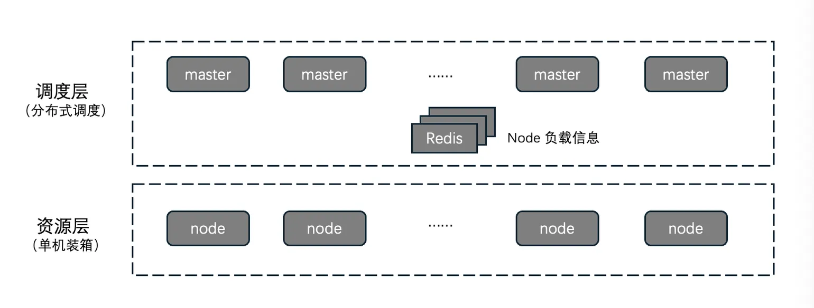
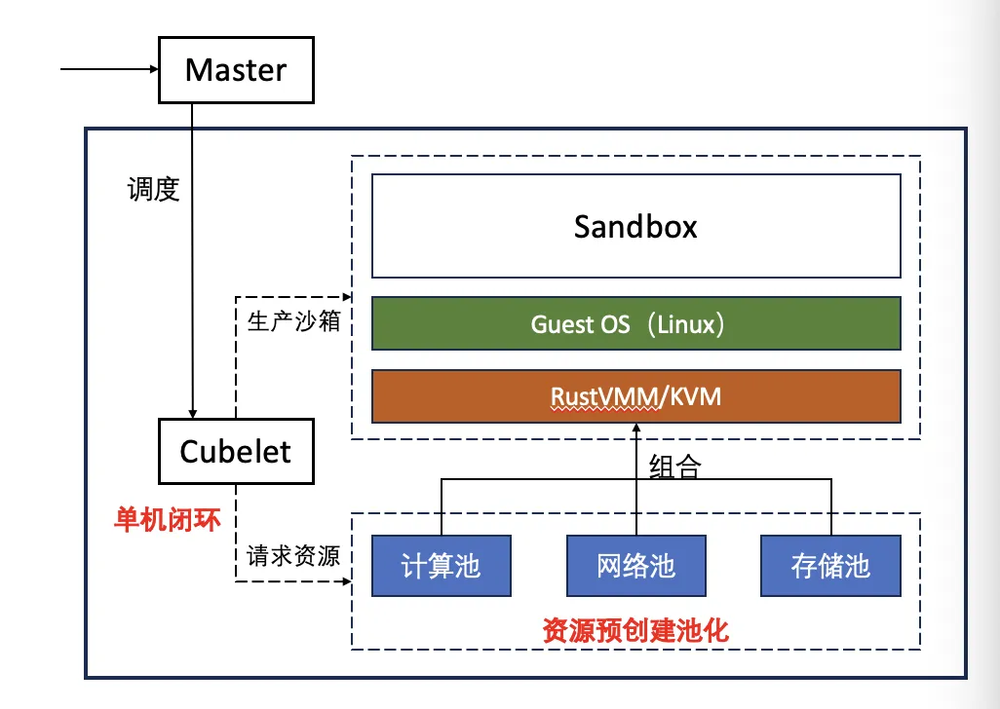
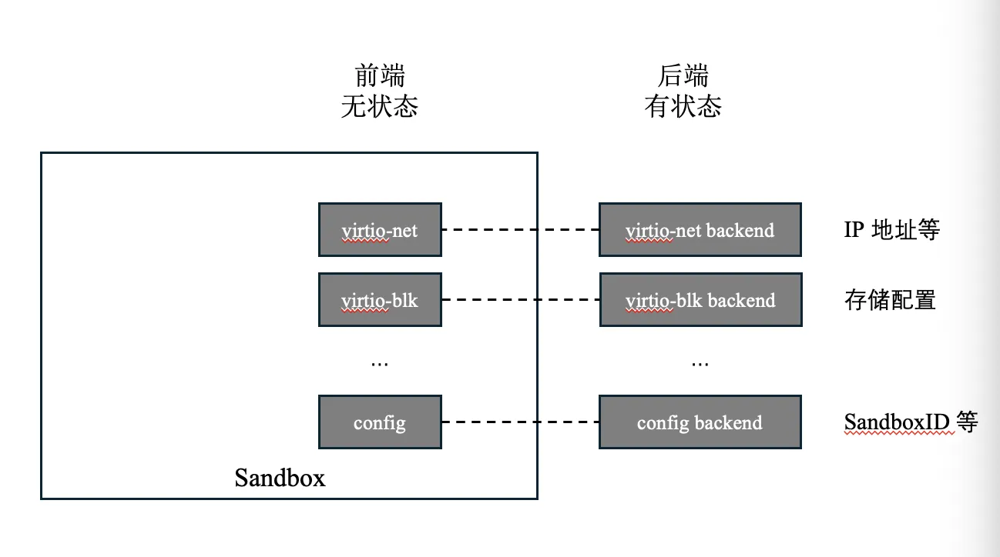
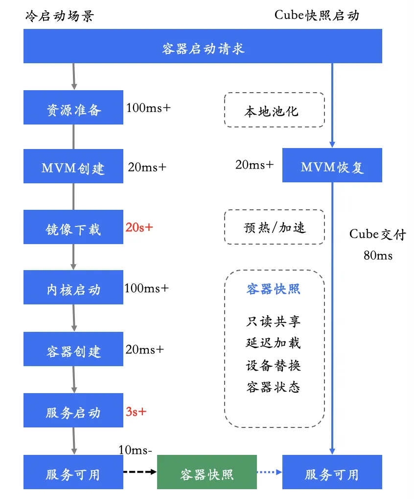
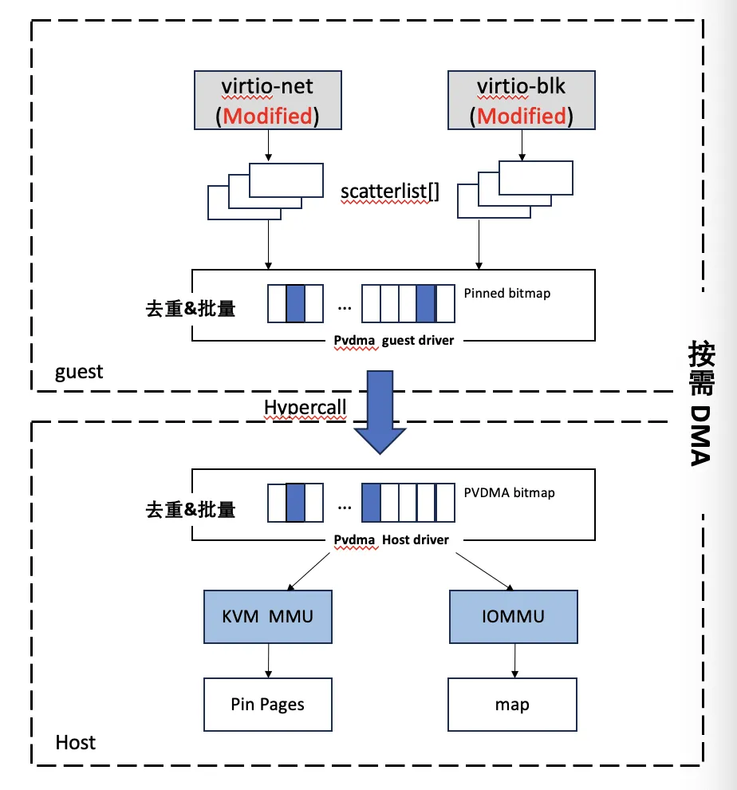
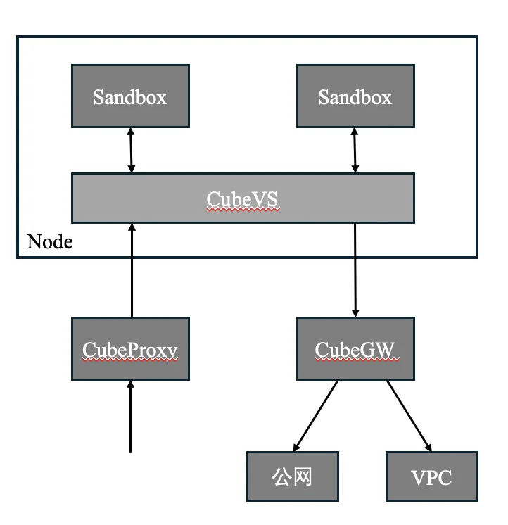
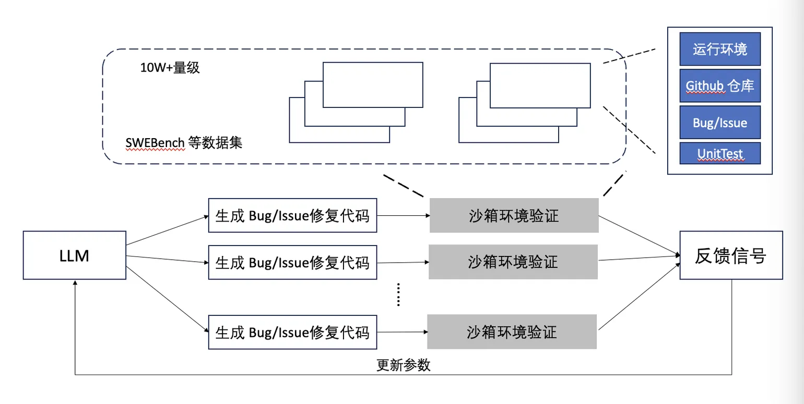
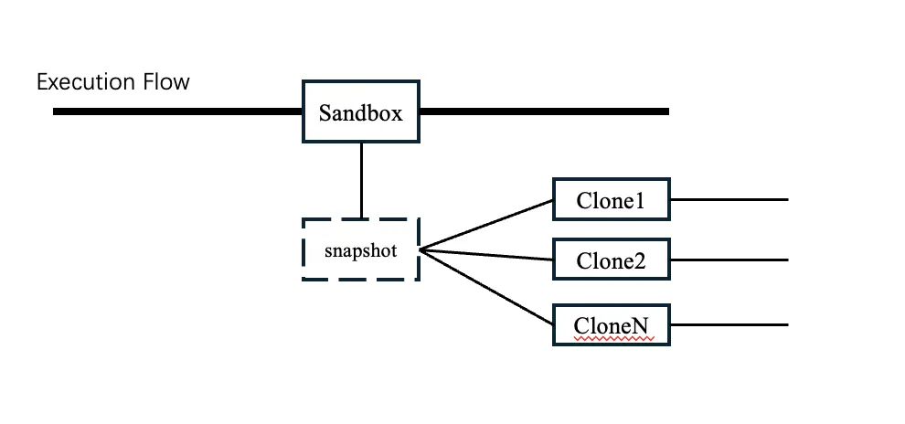
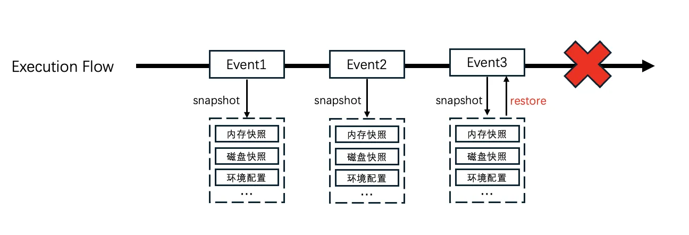

# 从 Serverless 到 Agent：Cube 系统的一些设计思考

## 一、背景

2019 年，Berkerley 发表了一篇关于 Serverless 的文章："Cloud Programming Simplified: A Berkeley View on Serverless Computing"，将 Serverless 带入大家的视野。Serverless 带来了几大核心挑战：

1. **资源粒度小**：不同于传统虚拟机提供了一个机器的资源抽象，Serverless 提供了一个应用乃至一个函数的资源抽象。
2. **极速冷启动**：Serverless 提供了资源按需申请、按量付费的模式，需要按需申请、及时响应。
3. **海量并发**：按需申请、用完即毁的模式意味着每次请求对应后台一次真实的资源创建，并发量是传统虚拟机的千倍以上。

传统的云计算 IaaS 为虚拟机负载而设计，无论是资源的粒度、冷启动速度还是并发能力都远远低于 Serverless 的要求。早期腾讯云的做法是在传统虚拟机之上建设一个预创池，用成本换体验，但带来了成本过高（0.1C128M 的资源需求实际占用 1C1G 的虚拟机资源；大量闲置的预创资源）和体验不佳（预创池打穿回归虚拟机体验）等问题。

建设一个原生解决 Serverless 挑战的系统，成为 Cube 系统的设计初衷。

## 二、核心设计

### 2.1 分布式调度 + 单机装箱

调度由中心的分布式调度和每个节点的本地装箱两部分构成，两部分都可以线性平行扩展整个系统的并发能力。与其他系统的集中式调度不同，Cube 可以实现分布式调度依据于两个前提：

1. Cube 的资源层每个节点足够大（大配置裸金属或虚拟机），结合 Cube 本身的轻量化高密设计（单节点超过 1K 的沙箱密度），单节点有足够的 buffer 容纳轻微的调度偏差；
2. Serverless 负载的生命周期普遍不长，单节点上的 Sandbox 始终处于动态变化的状态。

同时，单机装箱如果实在无法满足，依然可以反馈到调度层重新调度兜底。

### 2.2 资源池化 + 单机闭环

单机装箱是节点内本地闭环的操作，所有沙箱需要的资源提前预准备池化，沙箱的生产就是从各种资源池中取出资源进行拼装的过程。这个设计加速了沙箱的启动速度，同时减少了节点内不同沙箱并发生产的路径碰撞，提高了单机的并发生产能力。

### 2.3 前后端解耦

沙箱内部系统完全无状态，所有的状态保存在虚拟化后端，大幅简化沙箱批量克隆的技术设计。

### 2.4 快照恢复 + lazy load

Cube 系统下所有的沙箱都是基于模板恢复的创建，沙箱内部系统的无状态大大简化了这里的工作。Cube 沙箱的生产过程中，沙箱自身的恢复和后端配置的刷新可以并发进行，百毫秒内就可以端到端完成一个可服务沙箱的交付。基于快照恢复的沙箱生产逻辑链路极短，减小了沙箱并发生产的资源抢占和逻辑碰撞，成为 Cube 单机并发能力提升的一个关键因素。

基于快照的启动还隐含了 EPT 页表的 lazy load 机制，所有快照没有 touch 的沙箱内存都是按需建立 EPT 映射——把所有该做的事情延迟到真正需要的时候再做，是保证启动速度的一项关键设计，这个思想也在 Cube 系统的多个设计中体现。

对于高 IO 性能的硬件直通场景，业界的做法是提前将沙箱的内存完全 PIN 住建立 DMA 映射关系，方便硬件访问，但这会大大影响沙箱的启动速度，且启动速度与沙箱内存大小强相关。Cube 自研了基于 virtio 的 PVDMA 技术，在硬件真正需要访问内存的时候才去建立 DMA 映射关系，将硬件直通沙箱的启动时延依然控制在百毫秒级别，且 IO 性能基本无影响。

### 2.5 资源复用 + 按需申请

**所有只读存储整节点只存储一份是 Cube 系统的设计目标**。通过沙箱内外打通的方式，沙箱内部的存储实际都是由外部统一提供，包括沙箱自身的 rootfs、kernel、容器镜像等。**对于大部分性能不敏感的场景，我们甚至让只读存储的 page cache 整节点也只有一份。**

基于同一个内存快照文件克隆的沙箱，采用 mmap 方式共享内存快照，天然会共享内存中未修改的部分——譬如内核的代码段启动完后基本就不会修改，整个节点可以共享一份内核的代码段，单沙箱因此至少可以节省 30M+ 的内存消耗。

基于同一个磁盘快照文件克隆的沙箱，会采用 reflink 的方式共享同一个磁盘文件，真正的磁盘块在真实写入发生的时候才会真实分配。

所有这些优化，从单个沙箱视角看，带来的资源节省可能非常有限，但是考虑到我们在打造一个高密系统，整个节点层面会节省 10% 以上的内存，而在实际业务场景中，存储空间消耗直接减少 90% 以上。

### 2.6 全栈锁优化

很多小细节的优化聚沙成塔，最终为 Cube 系统的单机超高并发以及高并发下的时延稳定性打下了很好的基石。

### 2.7 原生安全

沙箱内部是不可信任域，完全交给用户使用，所有和内部敏感系统的交互以及资源的准备都在沙箱外部完成，而内部和外部通过硬件虚拟化的方式进行隔离。Cube 基于 ivshmem 自研了高性能的内外通信通道，用于沙箱内外的协作。

沙箱的网络天然是受限的：所有沙箱的被动请求必须经过 CubeProxy，匹配到转发规则的才会转发到沙箱内；所有沙箱的主动外访必须经过 CubeGW；所有沙箱的网络 IO 都必须经过节点上的 CubeVS。沙箱无论是被动访问还是主动访问都有必然经过的网络节点，这也为后续的审计和网络策略控制等能力扩展留下了空间。

### 2.8 复用虚拟机资源

Cube 使用了 KVM 虚拟化技术来保证安全隔离能力，但嵌套虚拟化存在性能损耗过大的问题，所以行业类似的轻量虚拟化技术都运行在物理机上，这会大大减少 Cube 可以使用的资源。为了解决这个问题，Cube 基于社区的 PVM 方案进行了改良和优化——PVM 基于 PV 技术提供完整的 Linux 内核虚拟化方案，不依赖硬件虚拟化，相比嵌套虚拟化无需 L0 虚拟化辅助 L1 虚拟化，并提供更短的 EPT violation 虚拟化路径。

### 2.9 总结

基于以上的设计，我们最终打造了一个具备高密、高弹性、高并发能力的虚拟化系统：

- **高密**：单台 96 vCPU 物理机可以生产 2K 台以上 0.1vCPU、128MB 配置的 Sandbox；
- **高弹性**：镜像就绪的前提下 60ms 内可以从 0 生产出一台直接可服务的 Sandbox；
- **高并发**：单台 96vCPU 物理机空载情况下可以支撑 100 并发的长时间瞬时压力创建请求，且 P99 耗时小于 200ms。

## 三、从 Serverless 到 Agent

从去年开始，AI 应用逐步从"对话式"向"执行式"发展，作为执行大模型生成代码的代码沙箱，对于高弹性及高并发依然有着极高的要求；而执行环境的安全隔离能力，成为 Agent 沙箱最基本的要求。Cube 之前服务 Serverless 场景打磨的高并发、高弹性、强安全隔离能力，在 Agent 场景依然有用武之地。

### 3.1 极速的代码执行场景

Agent 代码执行场景，需要底层沙箱具备快速启动能力和高并发能力。元宝代码执行接入基于 Cube 沙箱打造的 AGS 产品后，体验大幅提升。

### 3.2 高并发的 Agentic RL 场景

Coding RL 场景需要同时拉起大量沙箱进行结果的验证，对大规模并发能力有很高要求。

搭配一个高吞吐的分布式存储，Cube 的高并发能力在 Agentic RL 场景具有非常明显的优势——某外部头部大模型客户使用基于 Cube 对应商业化版本，1 分钟可以拉起数十万实例，行业领先，大大提高了 RL 训练的效率。

### 3.3 块级去重 + 按需加载的镜像加速系统

使用共享的分布式存储很好地解决了 Agentic RL 场景海量镜像的问题，但同时带来了两个问题：

1. 镜像的大部分内容相同，浪费了大量的存储空间；
2. 单节点的高并发短生命周期沙箱创建，会对后端共享存储带来很大的 IO 吞吐冲击。

Cube 自研了镜像加速系统来解决这两个问题：

1. 镜像分块去重解决重复内容存储的问题，去重效率远远高于传统的 layer 级去重；
2. 块级的三级缓存按需加载机制，减少对后端存储的吞吐压力；
3. 大部分镜像用低成本 COS 存储，成本大幅下降。

### 3.4 基于快照的分支克隆

快照技术是 Cube 系统最关键的技术之一。在 Agent 场景，快照技术可以适用在更多的场景：譬如对一个运行中的沙箱打快照，并进行 1:N 的 Clone 进行分支探索任务；或者通过快照保存特定的任务状态，作为后续其他任务的一个状态起点。

### 3.5 面对 Agent 的安全与防御

当沙箱的使用者从人写的程序变为 Agent 之后，安全性和防御性便成为考虑的重点。Agent 行为具有概率属性，无法提前预测，不同于人写的程序可以通过大量的事前手段保证行为符合预期，Agent 只能通过事中或事后的手段来保证这点，这对 Infra 的安全能力和防御能力提出了更高的要求。

#### 3.5.1 安全扩展

Cube 系统具有原生的沙箱安全和网络安全能力，这两方面能力都可以进一步扩展：

- 沙箱内是完全硬件隔离的 OS 环境，Agent 任何行为的影响域局限在沙箱内部；沙箱内内核级的敏感行为采集配合高性能的沙箱内外通信通道，可以实现对 Agent 高危行为的审计，后续也可以进一步拓展为针对 Agent 高危行为的准入控制。
- 沙箱的被动访问路径必然经过 CubeProxy，这个点可以扩展准入安全策略的能力；沙箱的主动访问路径必然经过 CubeVS 和 CubeGW，这两个点都可以导出流量扩展准出安全策略、敏感信息注入等高阶安全能力。

#### 3.5.2 防御能力：事件级的无感快照和回滚（即将开源）

Agent 的不可预期行为可能造成严重的影响，对个人可能是文档资料的彻底删除，对企业可能是数据库内容的删除，即便辅以再严格的事中安全策略也难免——**系统的事件级快照和回滚能力成为面对 Agent 用户的关键设计**。

对于沙箱而言，我们需要具备事件级的环境快照能力（包括可写磁盘快照和内存快照）。

为了满足这种高频次、对用户基本无感知的快照能力诉求，Cube 设计实现了一套 CoW 存储——通过将块存储的索引和实际数据块分离，快照的过程仅仅只是复制一份数据块索引，实际的数据块只在真实写入的时候 CoW 真实分配，实现了百毫秒级的海量环境快照能力。这套机制为沙箱的事件级快照回滚提供了很好的基础。

这种事件级快照和回滚能力不应该仅仅局限在沙箱上，最终应该扩展到整个 Agent Infra，形成整个 Agent Infra 原生的事件级快照和回滚能力，为整个 Agent Infra 面对 Agent 的不可预测行为提供足够强的防御能力。

## 四、展望

系统上运行的逻辑由人类编写的程序变为 Agent 后，很多东西都改变了。最典型的改变是整个运行的基础由人类精确约束的逻辑机器变为了一个概率性的运行时，而与这个体系的交互从约定俗成的通信协议变成了自然语言。Agent 本身的能力也随着 LLM 能力的进化而变化，此消彼长。这是一个完全不一样的世界，而且飞速变化着。

但是目前承载这个飞速演进的应用形态的基础设施并没有特别大的变化。Anthropic 在 4.9 发布的 Managed Agent 或许可以认为是一个很好的起点——与完全由虚拟机/容器独立承载整个 Agent 不同，它将 Agent 解耦为：大脑（决策与执行循环）、双手（执行环境、工具等）和会话（不可变持久化数据、可重放），期望每一个独立的 Agent 请求都跑在完全独立的沙箱环境中。

Cube 正在打造的事件级快照回滚、分支探索、强安全控制等能力或许可以成为"大脑"的一个良好载体；Cube 多年打磨的"极快启动、超大并发、超高密度"等技术能力或许可以作为"双手"的一个最佳匹配。**我们也会将 Cube 系统完整地向行业开源，希望我们多年持续打磨和建设的能力能够为行业 Agent Infra 的发展贡献一份力量。**
