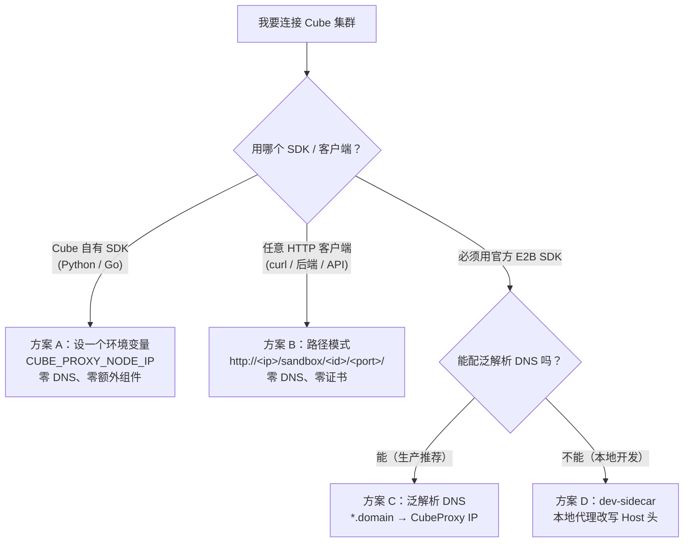

# 连接到已有 Cube 集群

很多人以为"连接到已有集群"是一件复杂的事，要先搞定泛解析 DNS、再处理证书。其实**大多数场景根本不需要这些**。

这篇文档帮你按场景挑出**最省事的接入方式**。

## 先选对方式



简单总结：

| 方案 | 适用客户端 | 需要泛解析 DNS | 需要额外组件 | 复杂度 |
|------|-----------|:---:|:---:|:---:|
| **A. Cube SDK + `CUBE_PROXY_NODE_IP`** | Cube Python / Go SDK | ❌ | ❌ | 最低 |
| **B. 路径模式** | 任意 HTTP 客户端 | ❌ | ❌ | 低（不适合前端 SPA） |
| **C. 泛解析 DNS** | E2B SDK / Cube SDK | ✅ | ❌ | 生产标准方案 |
| **D. dev-sidecar** | 官方 E2B SDK | ❌ | ✅（本地代理） | 中 |

---

## 方案 A：Cube 自有 SDK（推荐，最简单）

如果你用的是 Cube 自有的 Python / Go SDK，**不需要泛解析 DNS，也不需要任何额外组件**。SDK 内置了 IP 直连能力（等效于 `curl --resolve`）：TCP 连接直接打到你指定的 CubeProxy IP，HTTP `Host` 头仍保留虚拟域名，CubeProxy 据此路由到正确的沙箱。

你只需要设置几个环境变量：

```bash
export CUBE_API_URL="http://<node-ip>:3000"   # 控制面：CubeAPI 地址
export CUBE_PROXY_NODE_IP="<node-ip>"          # 数据面：直连 CubeProxy 的 IP（绕过 DNS）
export CUBE_PROXY_PORT_HTTP=80                 # CubeProxy 的 HTTP 端口，默认 80
export CUBE_TEMPLATE_ID="<your-template-id>"   # 创建沙箱用的模板 ID
```

然后正常使用 SDK 即可。关键点：

- `CUBE_PROXY_NODE_IP` 一旦设置，所有数据面请求都直连这个 IP，**完全不查 DNS**。
- 不需要在本机 `/etc/hosts` 或 DNS 里加任何 `*.cube.app` 记录。

这是接入已有集群最省事的方式，优先考虑它。

---

## 方案 B：路径模式（任意 HTTP 客户端通用）

如果你不用 SDK，只想用 `curl`、后端服务或任意 HTTP 客户端访问沙箱里的服务，用**路径模式**最直接——只要知道 CubeProxy 的 IP 和端口就行：

```
http://<cube-proxy-host>:<http-port>/sandbox/<sandbox-id>/<container-port>/<剩余路径>
```

例如沙箱 `abc123` 暴露了 `49999` 端口，CubeProxy 在 `10.0.0.5:80`：

```bash
curl http://10.0.0.5/sandbox/abc123/49999/
curl http://10.0.0.5/sandbox/abc123/49999/health
```

特点：

- **零 DNS、零证书配置**，HTTP 直接可用。
- 支持 WebSocket 升级。
- CubeProxy 会自动剥离前缀、改写根开头的 `Location` 头、限定 Set-Cookie 的 `Path`。
- **不适合前端 SPA**：如果页面用根绝对路径加载静态资源（如 `/static/app.js`），前缀会对不上。这类场景请用方案 C 的 Host 模式。

更多细节见 [HTTPS 证书与域名解析](./https-and-domain.md#路径式快速访问免-dns--免证书)。

---

## 方案 C：泛解析 DNS（生产推荐 / 前端 SPA）

如果你必须用 Host 模式（典型是前端 SPA + 浏览器访问），或者要做生产部署，就需要配一条泛解析 DNS 记录，把 `*.<domain>` 指向 CubeProxy 所在节点的 IP。

沙箱域名格式是 `<port>-<sandboxId>.<domain>`，`sandboxId` 每个沙箱都不同，所以必须用**泛解析**而不能用单条 hosts 记录。

下面几种配法，按推荐度排列：

### C-1：公有云 DNS（生产推荐）

在域名服务商控制台加一条泛解析 A 记录：

```
*.cube.yourdomain.com  →  <CubeProxy 节点的公网 IP>
```

启动 CubeAPI 时指定该域名：

```bash
./cube-api --sandbox-domain cube.yourdomain.com
# 或：export CUBE_API_SANDBOX_DOMAIN=cube.yourdomain.com
```

### C-2：一键部署内置 CoreDNS（开发 / 单机体验）

Cube 一键部署**已自带 CoreDNS**，会自动把 `*.cube.app` 解析到 CubeProxy 节点 IP，所以一键装完本机直接能用，无需手动配 DNS。其 `Corefile` 模板核心如下：

```text
.:53 {
    bind __COREDNS_BIND_ADDR__
    template IN A cube.app {
        answer "{{ .Name }} 60 IN A __CUBE_PROXY_DNS_ANSWER_IP__"
        fallthrough
    }
    template IN A (.*)\.cube\.app {
        answer "{{ .Name }} 60 IN A __CUBE_PROXY_DNS_ANSWER_IP__"
        fallthrough
    }
    forward . /etc/resolv.conf
}
```

> 内置 CoreDNS 仅供本机 / 快速体验，不适合生产或多机共享。

### C-3：手动 dnsmasq（内网多机共享）

在内网某台机器上配 dnsmasq：

```bash
# /etc/dnsmasq.d/cube.conf
address=/cube.app/<CubeProxy 节点 IP>
```

客户端机器的 `/etc/resolv.conf` 指向这台 dnsmasq：

```text
nameserver <dnsmasq-ip>
```

### 关于 /etc/hosts

`/etc/hosts` **不支持通配符**，无法做泛解析，只能为单个已知 sandbox ID 手动加记录，不实用。需要泛解析时请用上面三种方式之一。

更多域名与证书细节见 [HTTPS 证书与域名解析](./https-and-domain.md)。

---

## 方案 D：dev-sidecar（必须用官方 E2B SDK 且无 DNS 时）

只有在这种情况下才需要 dev-sidecar：**你必须使用官方 E2B SDK**（不是 Cube 自有 SDK），但本地又**无法配置泛解析 DNS**。

官方 E2B SDK 在内部硬编码了 DNS 解析流程，没有暴露类似 `CUBE_PROXY_NODE_IP` 的 hook。`dev-sidecar` 通过在本地启动一个轻量代理拦截数据面请求、改写 `Host` 头来绕过这一限制，同时默认不校验服务端证书，省去自签证书信任问题。

> 如果你能改用方案 A（Cube SDK）或方案 B（路径模式），就不需要 dev-sidecar。它是兼容官方 E2B SDK 的兜底方案。

### 快速上手

示例代码：[examples/e2b-dev-sidecar](https://github.com/tencentcloud/CubeSandbox/tree/master/examples/e2b-dev-sidecar)（含 [中文 README](https://github.com/tencentcloud/CubeSandbox/tree/master/examples/e2b-dev-sidecar/README_zh.md)）

```bash
cd examples/e2b-dev-sidecar
pip install -r requirements.txt
cp env.example .env
```

#### 场景一：本机用 `dev-env` 起的 Cube

如果你按 [开发环境（QEMU 虚机）](./dev-environment.md) 启动，`env.example` 的默认值就是为这个场景准备的，通常只需补上模板 ID：

```bash
E2B_API_URL="http://127.0.0.1:13000"      # dev-env 暴露的 CubeAPI
CUBE_REMOTE_PROXY_BASE="https://127.0.0.1:11443"  # dev-env 暴露的 CubeProxy
E2B_API_KEY="e2b_000000"
CUBE_TEMPLATE_ID="<your-template-id>"
```

#### 场景二：连接另一台机器上的集群

同一个示例，只把地址换成远端集群地址：

```bash
E2B_API_URL="http://<node-ip>:3000"
CUBE_REMOTE_PROXY_BASE="https://<node-ip>:443"
E2B_API_KEY="e2b_000000"
CUBE_TEMPLATE_ID="<your-template-id>"
```

两个场景都运行：

```bash
python demo.py
```

### 四个关键变量

- `E2B_API_URL`：控制面地址。`dev-env` 默认 `http://127.0.0.1:13000`。
- `CUBE_REMOTE_PROXY_BASE`：数据面地址。`dev-env` 默认 `https://127.0.0.1:11443`。
- `E2B_API_KEY`：SDK 要求非空；集群开启鉴权就填真实值，否则填 `e2b_000000`。
- `CUBE_TEMPLATE_ID`：创建沙箱用的模板 ID。

### 最容易踩的坑

- 本机跑的是 `dev-env`，却把地址写成虚机内地址，而不是宿主机暴露的 `13000/11443`
- 把 `CUBE_REMOTE_PROXY_BASE` 错写成 sidecar 自己的监听地址
- 忘了填 `CUBE_TEMPLATE_ID`
- 集群开启了鉴权，但 `E2B_API_KEY` 还在用 `e2b_000000`

### 进一步阅读

准备把 sidecar 接到自己的代码里时，再看示例里的 `demo.py` 和 `dev_sidecar.py`。
