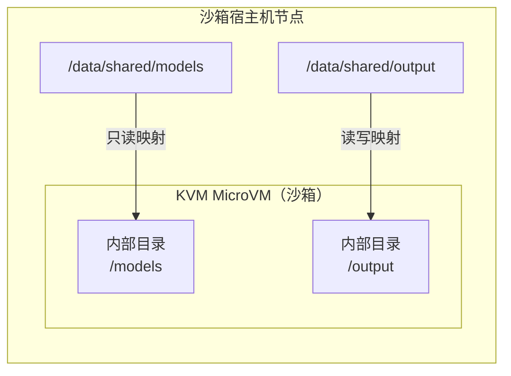

# 持久化存储（Host Mount）

Cube Sandbox 运行在轻量级 MicroVM 内，默认情况下沙箱内写入的所有数据都是**临时的**，沙箱销毁后即消失。**Host Mount（宿主机挂载）** 是 Cube 特有的扩展能力，它将沙箱宿主机节点上的目录绑定挂载到沙箱内部，无需复制文件即可实现持久化、共享的存储。

## 概念模型



Host Mount 将**沙箱宿主机节点上的绝对路径**映射到**沙箱 VM 内的路径**。读写挂载的变更在两侧立即可见——无需同步、无需上传、零延迟。

## 使用场景

Host Mount 适合让沙箱直接访问宿主机上的已有数据，或将沙箱产生的数据保留在宿主机上。典型场景包括：

- **共享数据集和模型权重**：以只读方式挂载大型数据目录，供同一节点上的多个沙箱复用，无需重复复制。
- **持久化任务输出**：以读写方式挂载输出目录，使日志、构建产物和计算结果在沙箱销毁后仍然保留。
- **复用源码工作区**：将代码仓库挂载到沙箱中，供开发、构建、测试或代码分析任务直接使用。
- **共享依赖与缓存**：复用宿主机上的依赖包、工具链或构建缓存，减少重复下载和初始化时间。

> Host Mount 适合节点上已有目录的快速共享，针对跨沙箱生命周期管理的云存储场景，可以考虑使用**用户级持久卷**并接入 COS/NFS 等后端，请参阅 [Volume 插件开发指南](./volume-plugin.md)。


## 快速开始

在沙箱宿主机节点上准备目录：

```bash
sudo mkdir -p /data/shared/rw /data/shared/ro
echo "hello from host" | sudo tee /data/shared/ro/greeting.txt
sudo chown -R 1000:1000 /data/shared/rw
```

### 创建带 Host Mount 的沙箱

Host Mount 通过 `Sandbox.create()` 的 `metadata` 字段中的 `host-mount` 键来指定。值为 **JSON 编码的数组**，每个元素是一个挂载描述符，支持同时指定多个挂载：

每个挂载描述符都必须包含三个字段：`hostPath` 是沙箱宿主机节点上的绝对路径，且必须位于允许的目录前缀下；`mountPath` 是沙箱 VM 内的目标路径；`readOnly` 用于设置访问模式，`true` 表示只读，`false` 表示读写。

```python
import json
import os
from cubesandbox import Sandbox

with Sandbox.create(
    template=os.environ["CUBE_TEMPLATE_ID"],
    metadata={
        "host-mount": json.dumps([
            {
                "hostPath":  "/data/shared/rw",
                "mountPath": "/mnt/rw",
                "readOnly":  False,
            },
            {
                "hostPath":  "/data/shared/ro",
                "mountPath": "/mnt/ro",
                "readOnly":  True,
            },
        ])
    },
) as sandbox:
    result = sandbox.commands.run("ls /mnt/rw /mnt/ro")
    print("mount contents:", result.stdout.strip())
```

预期输出：

```
mount contents: /mnt/ro:
greeting.txt
/mnt/rw:
```

### 写入沙箱销毁后仍保留的数据

```python
import json
from cubesandbox import Sandbox
import os

mounts = json.dumps([
    {"hostPath": "/data/shared/rw", "mountPath": "/mnt/rw", "readOnly": False},
])

with Sandbox.create(
    template=os.environ["CUBE_TEMPLATE_ID"],
    metadata={"host-mount": mounts},
) as sandbox:
    sandbox.commands.run("echo 'persist data' > /mnt/rw/output.txt")
```

```bash
# 沙箱已销毁，但文件保留在宿主机上：
$ cat /data/shared/rw/output.txt
persist data
```

## Host Mount 沙箱的快照

Host Mount 是对宿主机目录的**外部引用**。创建 Snapshot 时，Cube 只保存 VM 的内存、根文件系统状态和挂载配置，不会把 `hostPath` 中的文件复制进 Snapshot。因此，宿主目录中的数据始终保持独立，并遵循以下语义：

- **Pause / Resume 和 FromSnap**：恢复时会沿用原来的挂载配置，并在源节点重新挂载相同的 `hostPath`。带 Host Mount 的沙箱会固定在源节点，不会跨节点恢复；如果源节点不可用或宿主目录不存在，恢复将失败。
- **Rollback**：VM 内存以及 Host Mount 路径之外的根文件系统状态会回到 Snapshot 创建时的状态，但 Host Mount 中的数据不会回滚。Snapshot 创建后在宿主目录中新增、修改或删除的文件仍保持最新状态。
- **Clone**：每个克隆拥有独立的 VM 状态，但会引用相同的宿主目录。任一沙箱对读写挂载所做的修改都可通过共享目录被源沙箱和其他克隆访问，具体一致性遵循底层文件系统语义；只读挂载在克隆中仍保持只读。
- **销毁沙箱或删除 Snapshot**：不会删除 Host Mount 指向的宿主目录及其文件。

::: warning 并发写入
FromSnap 或 Clone 可能使多个运行中的沙箱同时访问同一个读写 `hostPath`。Host Mount 不会自动提供锁、版本控制或写入冲突协调；应用需要自行保证并发访问安全，也可以使用底层文件系统支持的锁机制。
:::

## 路径安全限制

出于安全考虑，`hostPath` 被限制在一组**允许的目录前缀**之内。默认情况下，只有 `/data/shared/` 下的路径被允许。尝试挂载该范围之外的路径会在**沙箱创建时被拒绝**。

::: warning
`hostPath` 指的是**运行沙箱的宿主机节点**的文件系统路径，而不是执行 SDK 脚本的机器。如果你从远程机器调用 API，请确保该路径存在于沙箱宿主机节点上，而不是你的本地电脑上。
:::


### 默认行为

开箱即用时，只有如下路径合法：

```python
# ✅ 允许
{"hostPath": "/data/shared/models", "mountPath": "/models", "readOnly": True}
{"hostPath": "/data/shared/team-a/output", "mountPath": "/output", "readOnly": False}

# ❌ 被拒绝
{"hostPath": "/etc/passwd", "mountPath": "/mnt/x", "readOnly": True}
{"hostPath": "/tmp/data", "mountPath": "/mnt/data", "readOnly": False}
{"hostPath": "/data/shared/../etc", "mountPath": "/mnt/x", "readOnly": True}  # 路径穿越被阻止
```

### 错误响应

如果指定了不允许的路径，SDK 会抛出 `ApiError` 异常：

```python
from cubesandbox import Sandbox
from cubesandbox import ApiError
import os
import json

try:
    sandbox = Sandbox.create(
        template=os.environ["CUBE_TEMPLATE_ID"],
        metadata={"host-mount": json.dumps([
            {"hostPath": "/etc/passwd", "mountPath": "/mnt/x", "readOnly": True}
        ])}
    )
except ApiError as e:
    print(e.status_code)  # 400
    print(str(e))
    # CubeMaster returned error code 130400: "host-mount" entry[0]: hostPath "/etc/passwd" is not within an allowed mount prefix
```

### 自定义允许的前缀

集群管理员可在 CubeMaster 配置文件中添加额外的允许前缀：

```yaml
extra_conf:
  allowed_host_mount_prefixes:
    - "/data/shared/"
    - "/data/team-assets/"
    - "/mnt/nfs/datasets/"
```

列表为空或未配置时，默认值为 `["/data/shared/"]`。根路径 `/` 被明确禁止——如果出现在列表中，CubeMaster 将拒绝启动。

> CubeMaster 会先通过 `filepath.Clean` 规范化 `hostPath`，消除 `..` 等路径成分，再使用带末尾 `/` 的目录前缀进行匹配，避免 `/data/shared_evil` 之类的路径伪装成 `/data/shared/` 的子目录。CubeMaster 启动时还会拒绝将根目录 `/` 配置为允许前缀，防止整个宿主机文件系统被意外暴露。
>
> 无论挂载请求来自 CubeAPI 传递的 annotation，还是直接指定的 volume 路径，都会执行相同的路径校验，避免通过不同入口绕过限制。

## 权限管理

Host Mount 保留宿主目录原始的所有者和权限位。`readOnly` 标志只控制 Cube 是否以只读模式挂载，**不会**覆盖 Linux 文件权限。

如果沙箱用户的 UID 与宿主目录 owner 不匹配，写入会报 `Permission denied`。快速解决：

```bash
# 将目录 owner 对齐为沙箱用户
sudo chown 1000:1000 /data/shared/rw
```

其他方案（只读挂载、POSIX ACL、root 执行等）详见 [Host Mount 权限排障](./troubleshooting/host-mount-permissions.md)。

## 多节点集群：共享存储

Host Mount 是**节点本地的**。在多节点集群中，`hostPath` 必须存在于调度沙箱的那台宿主机节点上。推荐的做法是使用共享存储，将相同的文件系统挂载到所有宿主机节点的统一路径下。

### NFS 示例

在每台沙箱宿主机节点上挂载 NFS：

```bash
# /etc/fstab 添加：
nfs-server:/export/shared  /data/shared  nfs  defaults,hard,intr  0 0
```

```bash
sudo mount -a
ls /data/shared   # 所有节点看到相同内容
```

之后沙箱可直接使用 `/data/shared/` 下的路径，无论调度到哪个节点都能访问到数据。

### 对象存储（S3/COS）示例

使用 FUSE 工具（如 `s3fs`、`cosfs`）将对象存储桶挂载为本地目录：

```bash
# 安装 cosfs（腾讯云 COS）
sudo apt-get install cosfs

# 配置凭证
echo "my-bucket:AKIDxxxx:xxxxxx" > /etc/passwd-cosfs
chmod 600 /etc/passwd-cosfs

# 挂载到 /data/shared
cosfs my-bucket /data/shared -ourl=https://cos.ap-guangzhou.myqcloud.com \
  -oallow_other -ouid=1000 -ogid=1000
```

```bash
# AWS S3 使用 s3fs
s3fs my-bucket /data/shared \
  -o iam_role=auto \
  -o url=https://s3.amazonaws.com \
  -o allow_other -o uid=1000 -o gid=1000
```

::: tip
对象存储挂载适合只读场景（模型权重、数据集）。写入性能和 POSIX 兼容性不如 NFS，频繁小文件写入建议使用 NFS 或块存储。
:::

## 多租户隔离

在多租户场景下，每个租户应只能访问自己的数据目录，不能看到或操作其他租户的文件。推荐的做法是利用目录结构 + 应用层控制实现租户间隔离。

### 目录规划

按租户 ID 划分子目录：

```
/data/shared/
├── tenant-a/
│   ├── datasets/
│   └── output/
├── tenant-b/
│   ├── datasets/
│   └── output/
└── tenant-c/
    └── ...
```

每个租户的沙箱只挂载属于自己的子目录：

```python
import json
import os
from cubesandbox import Sandbox

tenant_id = "tenant-a"

mounts = json.dumps([
    {
        "hostPath": f"/data/shared/{tenant_id}/datasets",
        "mountPath": "/datasets",
        "readOnly": True,
    },
    {
        "hostPath": f"/data/shared/{tenant_id}/output",
        "mountPath": "/output",
        "readOnly": False,
    },
])

with Sandbox.create(
    template=os.environ["CUBE_TEMPLATE_ID"],
    metadata={"host-mount": mounts},
) as sandbox:
    sandbox.commands.run("ls /datasets /output")
```

租户 A 的沙箱只能看到 `/data/shared/tenant-a/` 下的内容，无法访问 `tenant-b` 或 `tenant-c` 的目录。

### 应用层强制隔离

在调用 `Sandbox.create()` 的业务代码中，根据当前认证用户的租户信息拼接 `hostPath`，**禁止用户自行传入任意路径**：

```python
def create_tenant_sandbox(tenant_id: str, template_id: str):
    """由平台侧控制挂载路径，租户无法指定任意 hostPath。"""
    base = f"/data/shared/{tenant_id}"
    mounts = json.dumps([
        {"hostPath": f"{base}/input",  "mountPath": "/input",  "readOnly": True},
        {"hostPath": f"{base}/output", "mountPath": "/output", "readOnly": False},
    ])
    return Sandbox.create(
        template=template_id,
        metadata={"host-mount": mounts},
    )
```

### 文件系统权限加固（可选）

结合 Linux 权限进一步确保隔离性——即使路径被绕过，操作系统层面也拒绝越权访问：

```bash
# 为每个租户创建独立目录，使用不同的 UID 或 GID
sudo mkdir -p /data/shared/tenant-a /data/shared/tenant-b
sudo chown 1001:1001 /data/shared/tenant-a
sudo chown 1002:1002 /data/shared/tenant-b
sudo chmod 0700 /data/shared/tenant-a
sudo chmod 0700 /data/shared/tenant-b
```

这样即使某个沙箱尝试越权访问（通过路径穿越等方式），也会被 CubeMaster 的路径校验和操作系统权限双重拦截。

### 隔离层次总结

| 层次     | 机制                                               | 作用                           |
| -------- | -------------------------------------------------- | ------------------------------ |
| 目录规划 | 按租户 ID 划分独立子目录，每个沙箱只挂载本租户路径 | 结构上隔离数据，租户间互不可见 |
| 应用层   | 平台代码拼接路径，不信任用户输入                   | 正常场景下的租户隔离           |
| 操作系统 | 目录 owner/mode 权限                               | 兜底防护，防止任何绕过         |

## 嵌套挂载：共享可读、写入范围独立

当一个挂载的 `mountPath` 位于另一个挂载的子目录下时，这两个挂载构成嵌套挂载。它适用于一组沙箱共享同一个工作区、但每个沙箱只能写入自己子目录的场景。这里的“组”可以是 Agent Team、项目、部门或租户；Cube Sandbox 本身不负责管理这些成员关系。

例如，一个 Agent Team 可以使用下面的宿主机目录结构：

```text
/data/shared/tenant-a/team-blue/
├── shared-input.txt
└── members/
    ├── agent-a/
    └── agent-b/
```

Agent A 以只读方式挂载共享工作区，再把自己的目录嵌套挂载为读写：

```python
import json

mounts = json.dumps([
    {
        "hostPath": "/data/shared/tenant-a/team-blue",
        "mountPath": "/workspace",
        "readOnly": True,
    },
    {
        "hostPath": "/data/shared/tenant-a/team-blue/members/agent-a",
        "mountPath": "/workspace/members/agent-a",
        "readOnly": False,
    },
])
```

Agent B 使用相同的只读父挂载，只把 `members/agent-b` 挂载为读写。各 Agent 可以使用不同的沙箱模板，存储目录和访问模式不需要因此改变。

| Agent A 可见的路径            | 可读 | 可写 | 原因                              |
| ----------------------------- | ---- | ---- | --------------------------------- |
| `/workspace/shared-input.txt` | 是   | 否   | 来自共享的只读父挂载              |
| `/workspace/members/agent-a/` | 是   | 是   | 该位置被 Agent A 的读写子挂载替换 |
| `/workspace/members/agent-b/` | 是   | 否   | 仍然来自共享的只读父挂载          |
| 其他租户的工作区              | 否   | 否   | 对应宿主机路径没有挂载到当前沙箱  |

这是一种**共享可读、写入范围独立**的模型。“写入范围独立”表示只有指定沙箱会获得该目录的可写挂载；如果只读父挂载暴露了这个目录，并不代表其他成员无法读取它。

### 挂载语义和约束

- AppSnapshot 恢复时，无论描述符按什么顺序传入，Cubelet 都会先应用父目标路径，再应用嵌套的子目标路径，避免后挂载的父目录遮住已经挂载的子目录。无关路径也会使用确定的顺序，但这个顺序不表示它们存在父子关系。
- 子挂载会在对应子树位置遮住父挂载；两个目录视图不会合并。子挂载生效期间，父挂载在该位置原有的文件会被隐藏。
- `readOnly` 对每个挂载独立生效，但仍需满足 Linux 的 UID、GID、mode 和 ACL 权限。即使子挂载是读写模式，如果宿主机权限不允许沙箱用户写入，仍会返回 `Permission denied`。
- 推荐使用一个只读父挂载和明确的读写子挂载。避免重复目标路径或相互重叠的读写挂载，否则目录归属和最终可见结果会变得难以判断。
- `mountPath` 应使用不含 `.` 或 `..` 路径段的规范绝对路径。不要依赖输入顺序处理相互重叠的目标路径。
- Host Mount 是节点本地的，并且数据位于沙箱快照之外。带 raw host mount 的 Snapshot FromSnap 和 Pause/Resume 会固定在源节点；其他节点上的同名路径不会被视为同一份存储。如需可移植的跨机快照恢复，应使用由所有候选节点都能 Attach 的共享存储所支持的 Plugin Volume。

::: warning 鉴权边界
调用 `Sandbox.create()` 的平台必须根据已经认证的沙箱归属主体和适用的组边界（如租户、团队或项目）生成 `hostPath`。不要接受用户任意传入的宿主机路径，也不要把 `/data/shared/tenants/` 之类的全局根目录挂载到某个租户的沙箱中：只读挂载只能阻止写入，不能阻止该沙箱读取其他租户的数据。
:::

## 最佳实践

- **输入数据优先使用只读挂载**（数据集、模型、配置文件等）。这可以防止沙箱意外写入，是最安全的默认选项。
- **为读写挂载使用专用目录**。避免挂载 `/` 或 `/home` 等范围过大的路径，创建专用目录（如 `/data/shared/output`）并只挂载它。
- **尽早检查权限**。在沙箱内运行 `id` 和 `stat` 确认有效 UID 与宿主目录所有者一致，再依赖写入操作。
- **定期清理输出目录**。宿主机上的输出目录会跨沙箱会话累积文件——与沙箱不同，它们不会在沙箱销毁时自动清理。
- **保持允许前缀尽量窄**。只向 `allowed_host_mount_prefixes` 添加具体的受信路径。不要添加 `/data/` 这样的顶层路径，优先使用更深的路径如 `/data/shared/`。

## 故障排查

| 现象                                                   | 可能原因                           | 解决方法                                                                                |
| ------------------------------------------------------ | ---------------------------------- | --------------------------------------------------------------------------------------- |
| `hostPath "..." is not within an allowed mount prefix` | 路径不在允许的前缀范围内           | 将数据放到 `/data/shared/` 下，或在 CubeMaster 配置中更新 `allowed_host_mount_prefixes` |
| 沙箱内 `No such file or directory`                     | 沙箱宿主机节点上 `hostPath` 不存在 | 在运行前在节点上创建目录                                                                |
| 写入时 `Read-only file system`                         | 使用了 `readOnly: true` 挂载       | 改为 `readOnly: false`                                                                  |
| 写入时 `Permission denied`                             | 宿主目录所有者与沙箱用户不匹配     | 参见上方[权限管理](#权限管理)                                                           |
| `Template not found`                                   | 模板 ID 错误                       | 运行 `cubemastercli tpl list` 确认                                                      |
| `Connection refused`                                   | CubeAPI 不可达                     | 检查 `E2B_API_URL` 及端口 3000 是否开放                                                 |

## 参考

- 示例代码：[`examples/host-mount/`](https://github.com/TencentCloud/CubeSandbox/tree/master/examples/host-mount)
- 相关 issue：[#239](https://github.com/TencentCloud/CubeSandbox/issues/239)
