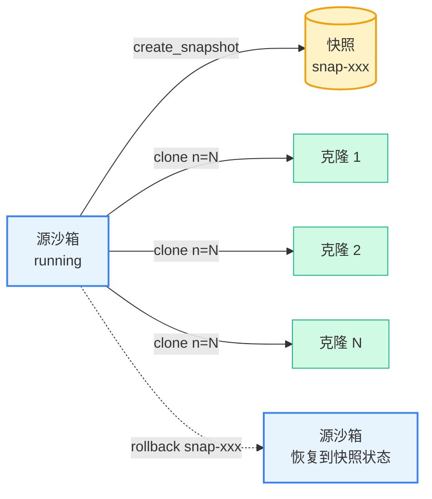

# 快照、回滚与克隆

本文介绍 Cube Sandbox Python SDK 提供的三组进阶接口：

- **快照（Snapshot）**：把一个运行中的沙箱的完整状态（内存 + 文件系统）持久化为一份镜像，后续可以反复用来创建新沙箱或执行回滚。
- **克隆（Clone）**：对一个正在运行的沙箱调用 `clone()`，可以立即派生出 N 个完全独立的副本，每个副本都从源沙箱的当前状态出发，互不干扰。
- **回滚（Rollback）**：把一个正在运行的沙箱原地恢复到先前某次快照的状态，沙箱 ID 不变，可以继续执行。

## 概念模型



| 接口 | 作用对象 | 沙箱 ID | 典型用途 |
|------|---------|--------|---------|
| `sb.create_snapshot()` | 源沙箱本身 | 不变 | 制作 checkpoint 或持久化状态 |
| `sb.clone(n=N)` | 从运行中的沙箱派生 N 个新沙箱 | 新建 N 个 | Agent 并行 rollout、可重复实验 |
| `sb.rollback(snap_id)` | 把当前沙箱原地恢复到快照状态 | **不变** | 撤回失败一步、回到分支点继续 |

## 安装

> **注意**：快照、克隆、回滚是 Cube Sandbox 特有的能力，e2b SDK 没有对应接口。[`cubesandbox`](https://pypi.org/project/cubesandbox/) SDK 兼容 e2b SDK，可以直接替换使用，同时获得以下进阶能力。

本文所有接口需要 [`cubesandbox`](https://pypi.org/project/cubesandbox/) **0.2.0 或更高版本**。

```bash
pip install "cubesandbox>=0.2.0"
```

环境变量约定：

```bash
export CUBE_API_URL=http://127.0.0.1:3000
export CUBE_TEMPLATE_ID=tpl-xxxxxxxxxxxxxxxxxxxxxxxx
```

## 快照（Snapshot）

`sb.create_snapshot()` 将沙箱的当前状态（文件系统 + 内存）持久化为一份快照，返回 `SnapshotInfo`，其中 `snapshot_id` 可以作为 `Sandbox.create(template=...)` 的入参。

```python
from cubesandbox import Sandbox

with Sandbox.create(template=TEMPLATE_ID) as sb:
    sb.run_code("open('/tmp/data.txt','w').write('hello')")
    snap = sb.create_snapshot()
    print(f"snapshot: {snap.snapshot_id}")
```

快照的生命周期独立于沙箱：源沙箱被 `kill()` 之后，快照仍然可用。不再需要时，调用 `Sandbox.delete_snapshot(snapshot_id)` 手动清理。

### 列举快照

```python
# 获取快照列表（第一页）
items, next_token = Sandbox.list_snapshots()

# 按 sandbox_id 过滤
items, _ = Sandbox.list_snapshots(sandbox_id=sb.sandbox_id)
```

`list_snapshots()` 返回 `(list[SnapshotInfo], next_token)`，将 `next_token` 传回可获取后续页；为 `None` 时表示没有更多页。

## 克隆（Clone）

对一个正在运行的沙箱调用 `sb.clone(n=N)`，可以立即派生出 N 个独立副本。每个副本都完整继承源沙箱在 clone 时刻的运行状态（内存 + 文件系统），但之后的写入互不影响，源沙箱也继续正常运行。

```python
src = Sandbox.create(template=TEMPLATE_ID)
src.run_code("open('/tmp/shared.txt','w').write('hello')")

clones = src.clone(n=3)
for sb in clones:
    # Each clone inherits the file written in src
    out = sb.run_code("print(open('/tmp/shared.txt').read())").logs.stdout[0]
    assert out.strip() == "hello"
```

### 并发克隆

默认串行创建，对于 fan-out 场景可以传 `concurrency=C` 并发执行：

```python
clones = src.clone(n=10, concurrency=5)
```

- 任一子任务失败时，已成功创建的克隆会被自动 `kill()`，调用方拿到的要么是 N 个沙箱，要么是异常，不会留下孤儿资源。

### 继承性与隔离性

`clone()` 返回的副本满足以下性质：

| 性质 | 含义 |
|------|------|
| **继承性** | 每个副本的初始状态与源沙箱在 clone 时刻完全一致 |
| **隔离性** | 副本之间的写入互不可见，与源沙箱也互相隔离 |
| **连续性** | 源沙箱在 `clone()` 返回后仍在运行，状态不受影响 |

## 回滚（Rollback）

`sb.rollback(snapshot_id)` 把当前沙箱**原地**恢复到指定快照的状态：文件系统完全还原，**沙箱 ID 不变**，`sb` 对象可以继续使用。

```python
sb = Sandbox.create(template=TEMPLATE_ID)
sb.run_code("open('/tmp/v.txt','w').write('v1')")
checkpoint = sb.create_snapshot()

sb.run_code("open('/tmp/v.txt','w').write('v2')")
sb.rollback(checkpoint.snapshot_id)

after = sb.run_code("print(open('/tmp/v.txt').read())").logs.stdout[0]
assert after.strip() == "v1"
```

回滚后沙箱仍然可写，可以继续执行并再次创建快照，非常适合 Agent 的回退-重试循环：

```python
# Continue on the rolled-back branch
sb.run_code("open('/tmp/v.txt','w').write('v3')")
new_snap = sb.create_snapshot()

with Sandbox.create(template=new_snap.snapshot_id) as forked:
    out = forked.run_code("print(open('/tmp/v.txt').read())").logs.stdout[0]
    assert out.strip() == "v3"
```

## 最佳实践

- **快照不是免费的**。每个快照对应底层的一份完整镜像，记得用完即删，或定期调用 `list_snapshots()` 清理。
- **`with` 语句不会自动删快照**。上下文管理器只负责 `kill` 沙箱，快照需要显式调用 `Sandbox.delete_snapshot()` 清理。
- **`clone()` 会自动清理内部快照**。临时派生几个副本时直接用 `clone()`，无需手动管理快照生命周期。
- **大批量并发派生**优先用 `clone(n=N, concurrency=C)`，SDK 内部统一处理失败回滚，不会留下孤儿资源。

## 参考

- 示例代码：[`examples/snapshot-rollback-clone/`](https://github.com/TencentCloud/CubeSandbox/tree/master/examples/snapshot-rollback-clone)
- SDK 源码：[`sdk/python/`](https://github.com/TencentCloud/CubeSandbox/tree/master/sdk/python)
